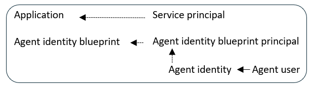
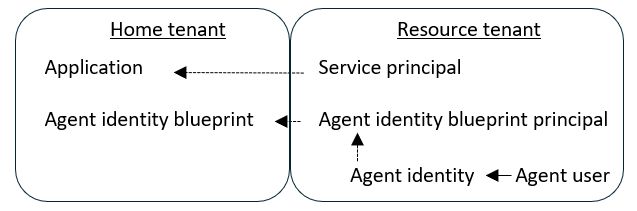

# Governing Agent Identities (Preview)

Microsoft Entra allows you to ensure that the right people have the right access to the right apps and services at the right time. With the addition of the Microsoft agent identity platform, managing agents in the same way is just as important in the governance lifecycle of your organization. The Microsoft agent identity platform introduces the concept of Agent Identities (IDs). Agent identities are accounts within Microsoft Entra ID that provide unique identification and authentication capabilities for AI agents.

This allows agent identities to be governed with Microsoft Entra features in the same style as you would govern human identities. With Agent identities, you can govern and manage the identity and access lifecycle of agents, ensuring the agents have a responsible person providing oversight throughout the agent lifecycle and agent's access does not persist longer than it is needed. This article provides an overview of how Microsoft Entra can be utilized to govern agent identities.

## License requirements

[!INCLUDE [entra-agent-id-license](../includes/entra-agent-id-license-note.md)]

## Agent identities basics

Historically, AI agents would rely upon tools to interact with various applications and systems, and each of those tools would have their own identities in those applications and systems. Some of those tools would use service principals to authenticate to Microsoft services via Microsoft Graph or Microsoft Azure APIs. [Microsoft Entra Agent ID](../agent-id/identity-platform/what-is-agent-id.md) introduces support for identities for the agents themselves, with four new types of object: agent identity blueprint, agent identity blueprint principal, agent identity, and agent user. Through the [agent identity blueprint](../agent-id/identity-platform/agent-blueprint.md), the agent can create one or more agent identities, and optionally an agent user for each agent identity. Each agent identity and agent user can have distinct access rights.

For a multi-tenant-capable agent, an agent identity blueprint principal can be brought into the tenant with resources so it can create agent identities in that tenant, similar to how a multi-tenant application can have a service principal in each tenant.

The agent identity and the agent user allow AI agents to take on digital identities within Microsoft Entra. Once agent identities are created, these agent identities are able to be governed using lifecycle and access features. Sponsors can be assigned to agent identities after creation. Sponsors of agent identities are human users accountable for making decisions about its lifecycle and access. For more information about the role of a sponsor of agent identities, see: [Administrative relationships for agent IDs](../agent-id/identity-platform/agent-owners-sponsors-managers.md).

### Agent identities in other Microsoft products and portals

* **Microsoft Foundry** automatically provisions and manages agent identities throughout the agent lifecycle. When the first agent in a Foundry project is created, Microsoft Foundry provisions a default agent identity blueprint and a default agent identity for the project, and agents in the project authenticate by using the shared project's agent identity. Publishing an agent automatically creates a dedicated agent identity blueprint and agent identity, and the agent will authenticate by using the unique agent identity. Foundry supports use of the agent identity for authentication in Model Context Protocol (MCP) and Agent-to-Agent (A2A) tools. For more information, see [Agent identity concepts in Microsoft Foundry](/azure/ai-foundry/agents/concepts/agent-identity).

* You can configure an **Azure App Service or Azure Functions app** to use the Microsoft Entra agent identity platform to securely connect to resources as an agent. For more information, see [How to use an agent identity in App Service and Azure Functions](/azure/app-service/overview-agent-identity).

* Agents created in **Microsoft Copilot Studio** can be configured to automatically be assigned to an agent identity. When an agent identity is first created in a Power Platform environment after enabling this setting, a Microsoft Copilot Studio agent identity blueprint, and an agent identity blueprint principal, are automatically created. For more information, see [Automatically create Entra agent identities for Copilot Studio agents (preview)](/microsoft-copilot-studio/admin-use-entra-agent-identities).

* For agents in the **Microsoft Teams** platform, a developer can create and manage agent identity blueprints in the Developer Portal for Teams. For more information, see [Manage your apps in Developer Portal](/microsoftteams/platform/concepts/build-and-test/manage-your-apps-in-developer-portal).

* **Microsoft Agent 365** gives each AI agent its own Microsoft Entra Agent ID, for identity, lifecycle, and access management. For more information, see [Agent identity platform capabilities for Agent 365](/microsoft-agent-365/admin/capabilities-entra).

## Assigning access to agent identities

When created, agent identities have limited permissions, such as OAuth 2 delegated permission scopes [inherited from their parent agent identity blueprint](../agent-id/identity-professional/configure-inheritable-permissions-blueprints.md). In addition, agent identities can have resource access assigned to them directly via access packages. Agents can request an access package for own agent IDs, or have their owner or sponsor request one on their behalf. With access packages, you're able to assign agent identities access to the following resources:

- Security Group memberships
- [Application roles and API permissions](../identity/enterprise-apps/assign-agent-identities-to-applications.md), including Graph application permissions
- [Microsoft Entra roles](../agent-id/identity-professional/authorization-agent-id.md#microsoft-entra-role-assignments-for-agent-identities)

To use access packages for agent identities, configure an access package with the required policy settings. When creating an access package assignment policy, in the **Who can get access** section, select **For users, service principals, and agent identities in your directory**, and then select the option of **All agents (preview)**.

> [!NOTE]
> If your agents aren't using Microsoft Entra agent IDs, then also create an access package assignment policy with the option **All Service principals (preview)** to allow service principals in your directory to be able to request this access package.

Agents can then be assigned access packages through three different request pathways.

- The agent identity itself can programmatically request an access package when needed for its operations, by creating an [accessPackageAssignmentRequest](/graph/api/entitlementmanagement-post-assignmentrequests?view=graph-rest-1.0&tabs=http).
- The agent's sponsor can request access on behalf of the agent ID, providing human oversight in the access request process. For more information, see [Request an access package on behalf of an agent identity (Preview)](entitlement-management-request-behalf.md#request-an-access-package-on-behalf-of-an-agent-identity-preview).
- An administrator can [directly assign the agent identity or agent user to the access package](entitlement-management-access-package-assignments.md#directly-assign-an-identity).

After submission, the access request is routed to designated approvers based on the access package configuration.

When the agent identity has received an access package assignment with an expiry date, and if a sponsor is set on the agent identity, as the expiry date approaches, the sponsor receives notifications about the pending expiration. The sponsor then has two options: they can request an extension of the access package (if permitted by policy), or they can allow the access package assignment to expire. If the sponsor requests an extension, this request can trigger a new approval cycle, where approvers again confirm whether continued access is appropriate. If the sponsor takes no action, the access package assignment automatically expires on its end date, and the agent identity loses access to the target resources.

For a guide on creating an access package, see: [Create an access package in entitlement management](entitlement-management-access-package-create.md). For a guide on assigning identities to an existing access package, see: [View, add, and remove assignments for an access package in entitlement management](entitlement-management-access-package-assignments.md).

## Management of agents

When agent identities are created, owners and sponsors of the agent can manually make decisions for the agent identity via both the My Account portal, and the My Access Portal.

From the [My Account portal](https://myaccount.microsoft.com/), Sponsors and Owners are able to manage the identity lifecycle of agents such as enabling and disabling the agent. You are also able to see information about its access, activity, and lifecycle. For more information about Managing agents, see: [Manage Agents in Microsoft Entra ID (Preview)](../agent-id/identity-platform/manage-agent.md).

From the [My Access portal](https://myaccess.microsoft.com/), Sponsors and Owners of agent identities are able to request access packages on behalf of their agent identities. For a guide on requesting access packages, see: [Request an access package on behalf of an agent identity (Preview)](entitlement-management-request-behalf.md#request-an-access-package-on-behalf-of-an-agent-identity-preview).

## Agent identities sponsor administration

One of the most important parts of governing agent identities is making sure that a delegated human user is always assigned to make sure the agent identity's access to resources are current. If the sponsor is leaving the organization, sponsorship of the agent identities is automatically transferred to their manager. With sponsorship transferred, there's always a human user accountable for managing the access and lifecycle of the agent identities. Microsoft Entra ID Governance features can help streamline this process within your organization. Lifecycle workflows include multiple tasks around notifying cosponsors, and managers of sponsors, of impending sponsorship changes. For a guide on setting up a workflow for agent identities sponsors, see: [Agent identity sponsor tasks in Lifecycle Workflows (Preview)](agent-sponsor-tasks.md).

## Related content

- [What is entitlement management?](entitlement-management-overview.md)
- [What is Microsoft Entra ID Governance?](identity-governance-overview.md)
