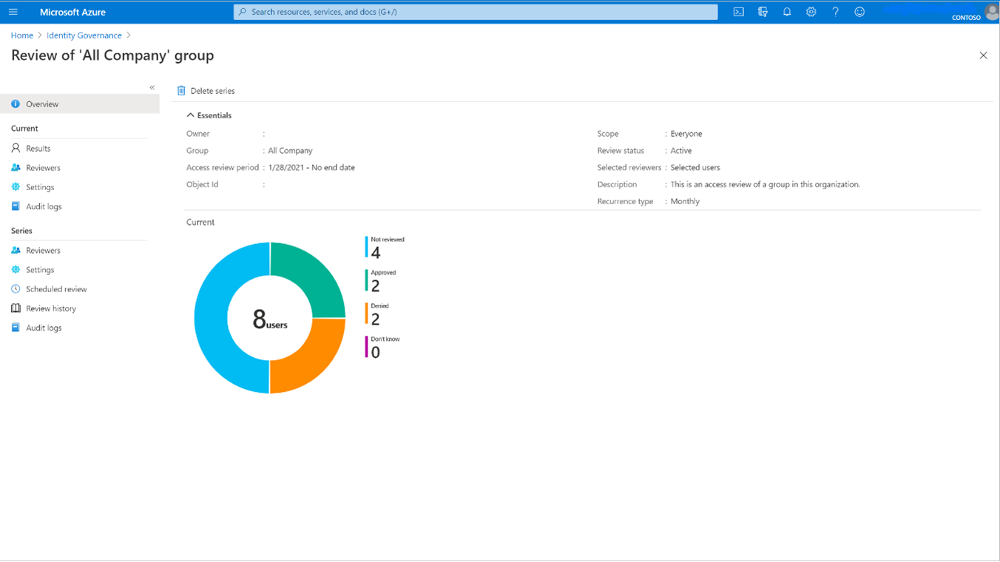
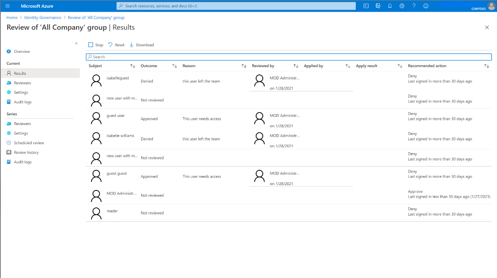
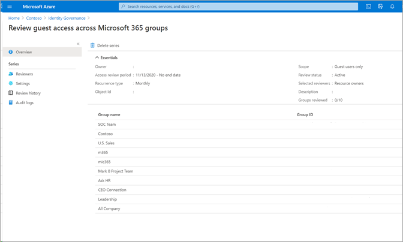
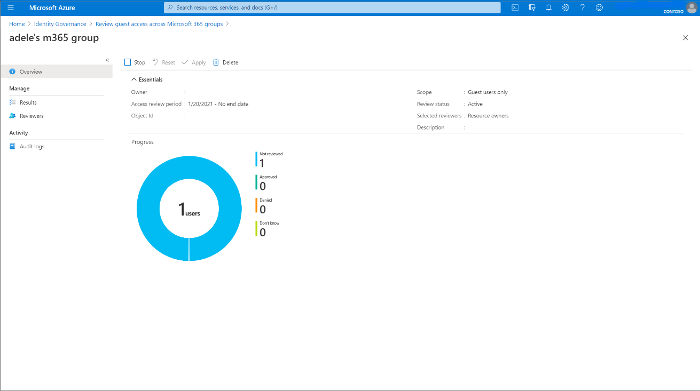
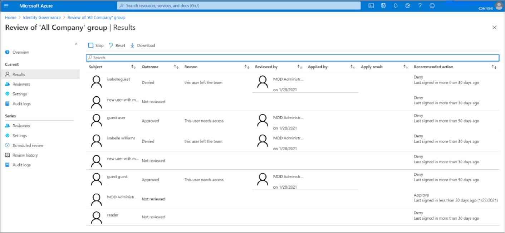
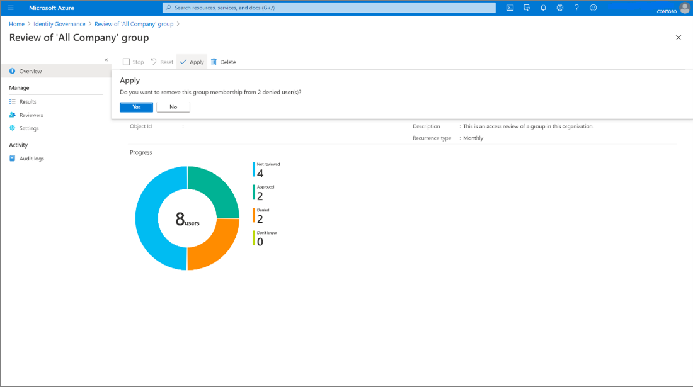

 
# Complete an access review of groups and applications in access reviews
 
As an administrator, you [create an access review of groups or applications](create-access-review.md) and reviewers [perform the access review](perform-access-review.md). This article describes how to see the results of the access review and apply them.
 
[!INCLUDE [GDPR-related guidance](~/includes/azure-docs-pr/gdpr-intro-sentence.md)]
 
## Prerequisites
 
- Microsoft Entra ID P2 or Microsoft Entra ID Governance
- Global Administrator, User Administrator, or Identity Governance Administrator to manage access of reviews on groups and applications. Users who have the Global Administrator role or the Privileged Role Administrator role can manage reviews of role-assignable groups, see: [Use Microsoft Entra groups to manage role assignments](../identity/role-based-access-control/groups-concept.md)
- Security readers have read access.
 
For more information, see: [License requirements](access-reviews-overview.md#license-requirements).

 
## View the status of an access review
 
[!INCLUDE [portal updates](../includes/portal-update.md)]

Do the following steps to track the progress of access reviews as they're completed.
 
1. Sign in to the [Microsoft Entra admin center](https://entra.microsoft.com) as at least an [Identity Governance Administrator](../identity/role-based-access-control/permissions-reference.md#identity-governance-administrator).

1. Browse to **Identity governance** > **Access Reviews**.
 
1. In the list, select an access review.
 
    On the **Overview** page, you can see the progress of the **Current** instance of the review. If there isn't an active instance open at the time, you see information on the previous instance. No access rights are changed in the directory until the review is completed.
 
     
 
    All blades under **Current** are only viewable during the duration of each review instance. 
    > [!NOTE]
    > While the **Current** access review only shows information about the active review instance, you can get information about reviews yet to take place in the **Series** under the **Scheduled review** section.
 
    The Results page provides more information on each user under review in the instance, including the ability to Stop, Reset, and Download results.
 
    
 
    If you're viewing an access review that reviews guest access across Microsoft 365 groups, the Overview pane lists each group in the review. 
   
    
 
    Select on a group to see the progress of the review on that group, also to Stop, Reset, Apply, and Delete.
 
   
 
1. If you want to stop an access review before it reaches the scheduled end date, select the **Stop** button.
 
    When you stop a review, reviewers will no longer be able to give responses. You can't restart a review after it's stopped.
 
1. If you're no longer interested in the access review, you can delete it by clicking the **Delete** button.
 
### View status of multi-stage review (preview)

To see the status and stage of a multi-stage access review:

1. Select the multi-stage review you want to check the status of or see what stage it's in.
 
1. Select **Results** on the left nav menu under **Current**.

1. Once you are on the results page, under **Status** it tells you which stage the multi-stage review is in. The next stage of the review won't become active until the duration specified during the access review setup passes. 

1. If a decision is made, but the review duration for this stage hasn't expired yet, you can select **Stop current stage** button on the results page. This will trigger the next stage of review.

## Retrieve the results
 
To view the results for a review, select the **Results** page. To view just a user's access, in the Search box, type the display name or user principal name of a user whose access was reviewed.
 
 
 
To view the results of a completed instance of an access review that is recurring, select **Review history**, then select the specific instance from the list of completed access review instances, based on the instance's start and end date. The results of this instance can be obtained from the **Results** page. Recurring access reviews allow you to have a constant picture of access to resources that might need to be updated more often than one-time access reviews.
 
To retrieve the results of an access review, both in-progress or completed, select the **Download** button. The resulting CSV file can be viewed in Excel or in other programs that open UTF-8 encoded CSV files.

### Retrieve the results programmatically

You can also retrieve the results of an access review using Microsoft Graph or PowerShell.

You'll first need to locate the [instance](/graph/api/resources/accessreviewinstance) of the access review. If the [accessReviewScheduleDefinition](/graph/api/resources/accessReviewScheduleDefinition) is a recurring access review, instances represent each recurrence. A review that doesn't recur has exactly one instance. Instances also represent each unique group being reviewed in the schedule definition. If a schedule definition reviews multiple groups, each group has a unique instance for each recurrence. Every instance contains a list of decisions that reviewers can take action on, with one decision per identity being reviewed.

 Once you identify the instance, to retrieve the decisions using Graph, call the Graph API to [list decisions from an instance](/graph/api/accessreviewinstance-list-decisions). If the instance is a multi-stage review, call the Graph API to [list decisions from a multi-stage access review](/graph/api/accessreviewstage-list-decisions). The caller must either be a user in an appropriate role with an application that has the delegated `AccessReview.Read.All` or `AccessReview.ReadWrite.All` permission, or an application with the `AccessReview.Read.All` or `AccessReview.ReadWrite.All` application permission. For more information, see the tutorial for how to [review a security group](/graph/tutorial-accessreviews-securitygroup).

You can also retrieve the decisions In PowerShell with the `Get-MgIdentityGovernanceAccessReviewDefinitionInstanceDecision` cmdlet from the [Microsoft Graph PowerShell cmdlets for Identity Governance](https://www.powershellgallery.com/packages/Microsoft.Graph.Identity.Governance/) module. The default page size of this API is 100 decision items.

## Apply the changes
 
If **Auto apply results to resource** was enabled based on your selections in **Upon completion settings**, autoapply executes once a review instance completes, or earlier if you manually stop the review.
 
If **Auto apply results to resource** wasn't enabled for the review, navigate to **Review History** under **Series** after the review duration ends or the review was stopped early, and select on the instance of the review you’d like to Apply.
 

 
Select **Apply** to manually apply the changes. If a user's access was denied in the review, when you select **Apply**, Microsoft Entra ID removes their membership or application assignment.
 

 
The status of the review changes from **Completed** through intermediate states such as **Applying** and finally to state **Result applied**. You should expect to see denied users, if any, being removed from the group membership or application assignment in a few minutes.
 
Manually or automatically applying results doesn't have an effect on a group that originates in an on-premises directory. If you want to change a group that originates on-premises, download the results and apply those changes to the representation of the group in that directory.

> [!NOTE]
> Some denied users are unable to have results applied to them. Scenarios where this could happen include:
> - Reviewing members of a synced on-premises Windows Server AD group: If the group is synced from on-premises Windows Server AD, the group cannot be managed in Microsoft Entra ID and therefore membership cannot be changed.
> - Reviewing a resource (role, group, application) with nested groups assigned: For users who have membership through a nested group, we will not remove their membership to the nested group and therefore they will retain access to the resource being reviewed.
> - User not found / other errors can also result in an apply result not being supported.
> - Reviewing the members of mail enabled group: The group cannot be managed in Microsoft Entra ID, so membership cannot be changed.
> - Reviewing an Application that uses group assignment will not remove the members of those groups, so they will retain the existing access from the group relationship for the application assignment
 
## Actions taken on denied guest users in an access review
 
On review creation, the creator can choose between two options for denied guest users in an access review. 
 - Denied guest users can have their access to the resource removed. This is the default.
 - The denied guest user can be blocked from signing in for 30 days, then deleted from the tenant. During the 30-day period the guest user is able to be restored access to the tenant by an administrator. After the 30-day period is completed, if the guest user hasn't had access to the resource granted to them again, they'll be removed from the tenant permanently. In addition, using the Microsoft Entra admin center, a Global Administrator can explicitly [permanently delete a recently deleted user](~/fundamentals/users-restore.yml) before that time period is reached. Once a user is permanently deleted, the data about that guest user is removed from active access reviews. Audit information about deleted users remains in the audit log.
 
### Actions taken on denied B2B direct connect users

Denied B2B direct connect users and teams lose access to all shared channels in the Team.

## Next steps
 
- [Manage access reviews](manage-access-review.md) 
- [Create an access review of groups or applications](create-access-review.md)
- [Create an access review of users in a Microsoft Entra administrative role](../id-governance/privileged-identity-management/pim-create-roles-and-resource-roles-review.md)
