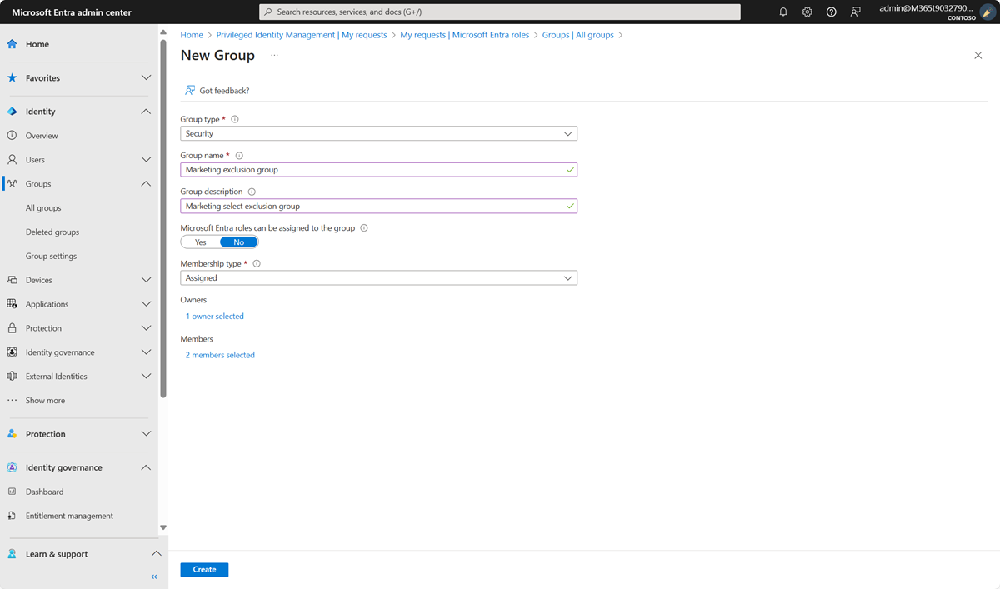
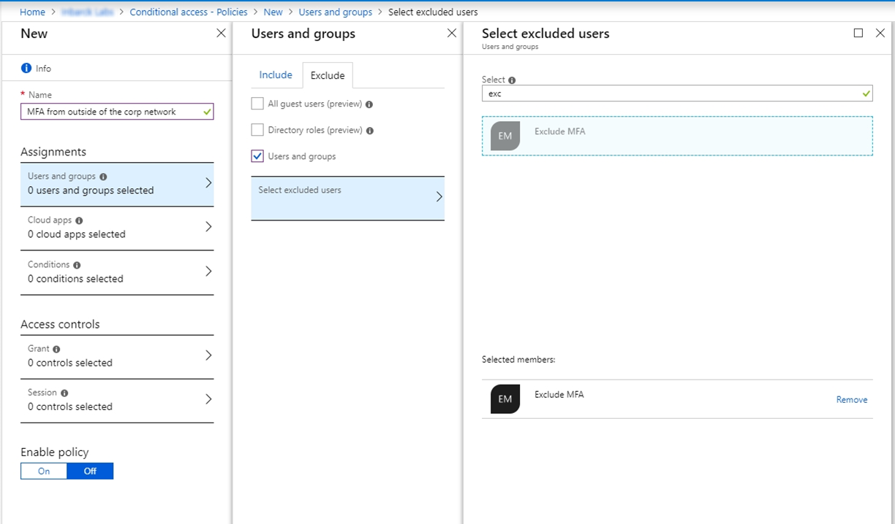
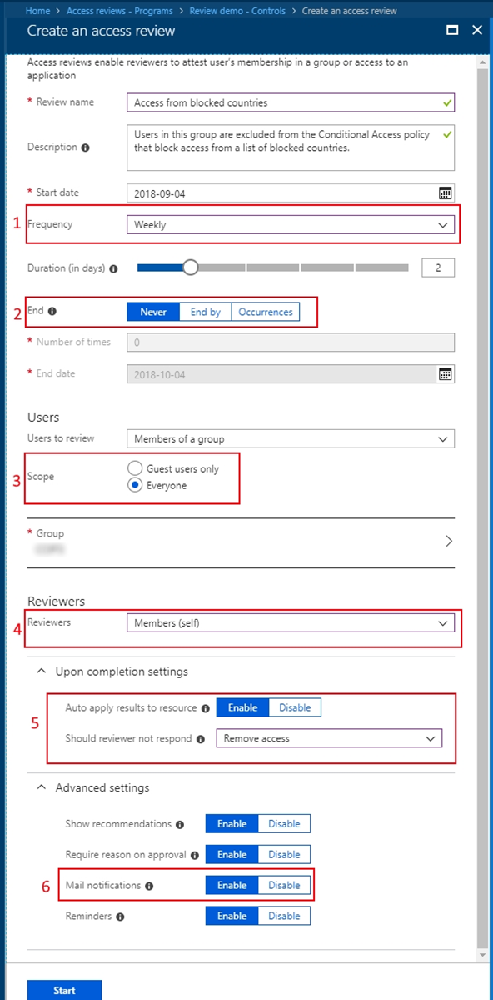
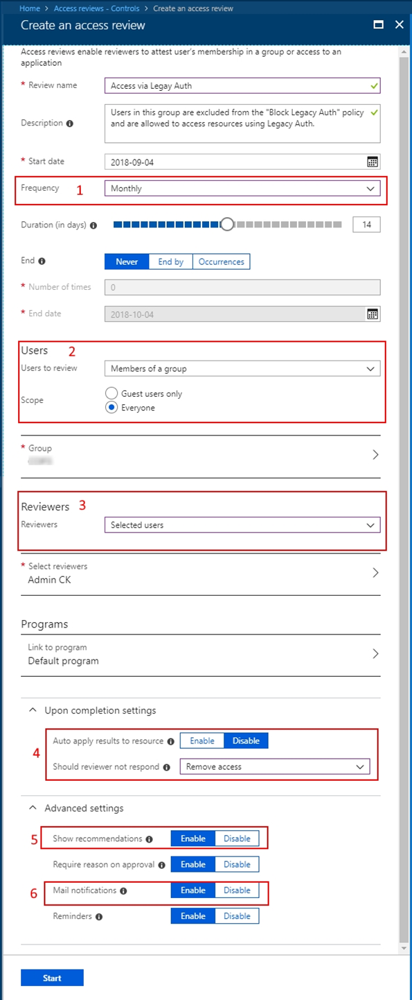
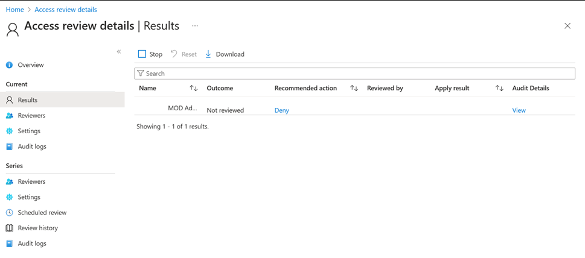

# Use access reviews to manage users excluded from Conditional Access policies

In an ideal world, all users follow the access policies to secure access to your organization's resources. However, sometimes there are business cases that require you to make exceptions. This article goes over some examples of situations where exclusions could be necessary. You, as the IT administrator, can manage this task, avoid oversight of policy exceptions, and provide auditors with proof that these exceptions are reviewed regularly using Microsoft Entra access reviews.

>[!NOTE]
> A valid Microsoft Entra ID P2 or Microsoft Entra ID Governance, Enterprise Mobility + Security E5 paid, or trial license is required to use Microsoft Entra access reviews. For more information, see [Microsoft Entra editions](../fundamentals/whatis.md).

## Why would you exclude users from policies?

Let's say that as the administrator, you decide to use [Microsoft Entra Conditional Access](../identity/conditional-access/concept-conditional-access-policy-common.md) to require multifactor authentication (MFA) and limit authentication requests to specific networks or devices. During deployment planning, you realize that not all users can meet these requirements. For example, you could have users who work from remote offices, not part of your internal network. You could also have to accommodate users connecting using unsupported devices while waiting for those devices to be replaced. In short, the business needs these users to sign in and do their job so you exclude them from Conditional Access policies.

As another example, you might be using [named locations](../identity/conditional-access/concept-assignment-network.md#countries) in Conditional Access to specify a set of countries and regions from which you don't want to allow users to access their tenant.

Unfortunately, some users might still have a valid reason to sign in from these blocked countries/regions. For example, users could be traveling for work and need to access corporate resources. In this case, the Conditional Access policy to block these countries/regions could use a cloud security group for the excluded users from the policy. Users who need access while traveling, can add themselves to the group using [Microsoft Entra self-service Group management](../identity/users/groups-self-service-management.md).

Another example might be that you have a Conditional Access policy [blocking legacy authentication for most of your users](../identity/conditional-access/policy-block-legacy-authentication.md). However, if you have some users that need to use legacy authentication methods to access specific resources, then you can exclude these users from the policy that blocks legacy authentication methods.

>[!NOTE]
>Microsoft strongly recommends that you block the use of legacy protocols in your tenant to improve your security posture.

## Why are exclusions challenging?

In Microsoft Entra ID, you can scope a Conditional Access policy to a set of users. You can also configure exclusions by selecting Microsoft Entra roles, individual users, or guests. You should keep in mind that when exclusions are configured, the policy intent can't be enforced on excluded users. If exclusions are configured using a list of users or using legacy on-premises security groups, you have limited visibility into the exclusions. As a result:

- Users might not know that they're excluded.

- Users can join the security group to bypass the policy.

- Excluded users could have qualified for the exclusion before but no longer qualify for it.

Frequently, when you first configure an exclusion, there's a shortlist of users who bypass the policy. Over time, more users get added to the exclusion, and the list grows. At some point, you need to review the list and confirm that each of these users is still eligible for exclusion. Managing the exclusion list, from a technical point of view, can be relatively easy, but who makes the business decisions, and how do you make sure it's all auditable? However, if you configure the exclusion using a Microsoft Entra group, you can use access reviews as a compensating control, to drive visibility, and reduce the number of excluded users.

## How to create an exclusion group in a Conditional Access policy

Follow these steps to create a new Microsoft Entra group and a Conditional Access policy that doesn't apply to that group.

### Create an exclusion group

1. Sign in to the [Microsoft Entra admin center](https://entra.microsoft.com) as at least a [User Administrator](../identity/role-based-access-control/permissions-reference.md#user-administrator).

1. Browse to **Entra ID** > **Groups** > **All groups**.

1. Select **New group**.

1. In the **Group type** list, select **Security**. Specify a name and description.

1. Make sure to set the **Membership** type to **Assigned**.

1. Select the users that should be part of this exclusion group and then select **Create**.

### Create a Conditional Access policy that excludes the group

Now you can create a Conditional Access policy that uses this exclusion group.

1. Sign in to the [Microsoft Entra admin center](https://entra.microsoft.com) as at least a [Conditional Access Administrator](../identity/role-based-access-control/permissions-reference.md#conditional-access-administrator).

1. Browse to **Entra ID** > **Conditional Access**.

1. Select **Create new policy**.

1. Give your policy a name. We recommend that organizations create a meaningful standard for the names of their policies.

1. Under Assignments select **Users and groups**.

1. On the **Include** tab, select **All Users**.

1. Under **Exclude**, select **Users and groups** and choose the exclusion group you created.

   > [!NOTE]
   > As a best practice, it is recommended to exclude at least one administrator account from the policy when testing to make sure you are not locked out of your tenant.

1. Continue with setting up the Conditional Access policy based on your organizational requirements.

  
Let's cover two examples where you can use access reviews to manage exclusions in Conditional Access policies.

## Example 1: Access review for users accessing from blocked countries/regions

Let's say you have a Conditional Access policy that blocks access from certain countries/regions. It includes a group that is excluded from the policy. Here's a recommended access review where members of the group are reviewed.

> [!NOTE] 
> At least the Identity Governance Administrator, or User Administrator role, is required to create access reviews. For a step by step guide on creating an access review, see: [Create an access review of groups and applications](create-access-review.md).

1. The review happens every week.

1. The review never ends in order to make sure you're keeping this exclusion group most up to date.

1. All members of this group are in scope for the review.

1. Each user needs to self-attest that they still need access from these blocked countries/regions, therefore they still need to be a member of the group.

1. If the user doesn't respond to the review request, they're automatically removed from the group, and no longer has access to the tenant while traveling to these countries/regions.

1. Enable email notifications to let users know about the start and completion of the access review.

## Example 2: Access review for users accessing with legacy authentication

Let's say you have a Conditional Access policy that blocks access for users using legacy authentication and older client versions and it includes a group that is excluded from the policy. Here's a recommended access review where members of the group are reviewed.

1. This review would need to be a recurring review.

1. Everyone in the group would need to be reviewed.

1. It could be configured to list the business unit owners as the selected reviewers.

1. Auto-apply the results and remove users that aren't approved to continue using legacy authentication methods.

1. It might be beneficial to enable recommendations so reviewers of large groups can easily make their decisions.

1. Enable mail notifications so users are notified about the start and completion of the access review.

>[!IMPORTANT] 
>If you have many exclusion groups and therefore need to create multiple access reviews, Microsoft Graph allows you to create and manage them programmatically. To get started, see the [access reviews API reference](/graph/api/resources/accessreviewsv2-overview) and [tutorial using the access reviews API in Microsoft Graph](/graph/tutorial-accessreviews-securitygroup).

## Access review results and audit logs

Now that you have everything in place, group, Conditional Access policy, and access reviews, it's time to monitor and track the results of these reviews.

1. Sign in to the [Microsoft Entra admin center](https://entra.microsoft.com) as at least an [Identity Governance Administrator](../identity/role-based-access-control/permissions-reference.md#identity-governance-administrator).

1. Browse to **ID Governance** > **Access reviews**.

1. Select the Access review you're using with the group you created an exclusion policy for.

1. Select **Results** to see who was approved to stay on the list and who was removed.

    

1. Select **Audit logs** to see the actions that were taken during this review.

As an IT administrator, you know that managing exclusion groups to your policies is sometimes inevitable. However, maintaining these groups, reviewing them regularly by the business owner or the users themselves, and auditing these changes can be made easier with access reviews.

## Next steps

- [Create an access review of groups or applications](create-access-review.md)
- [What is Conditional Access in Microsoft Entra ID?](../identity/conditional-access/overview.md)
