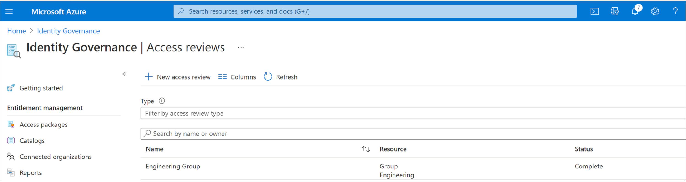
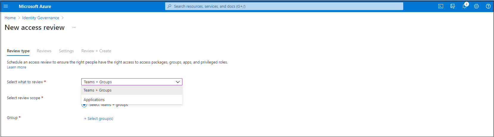
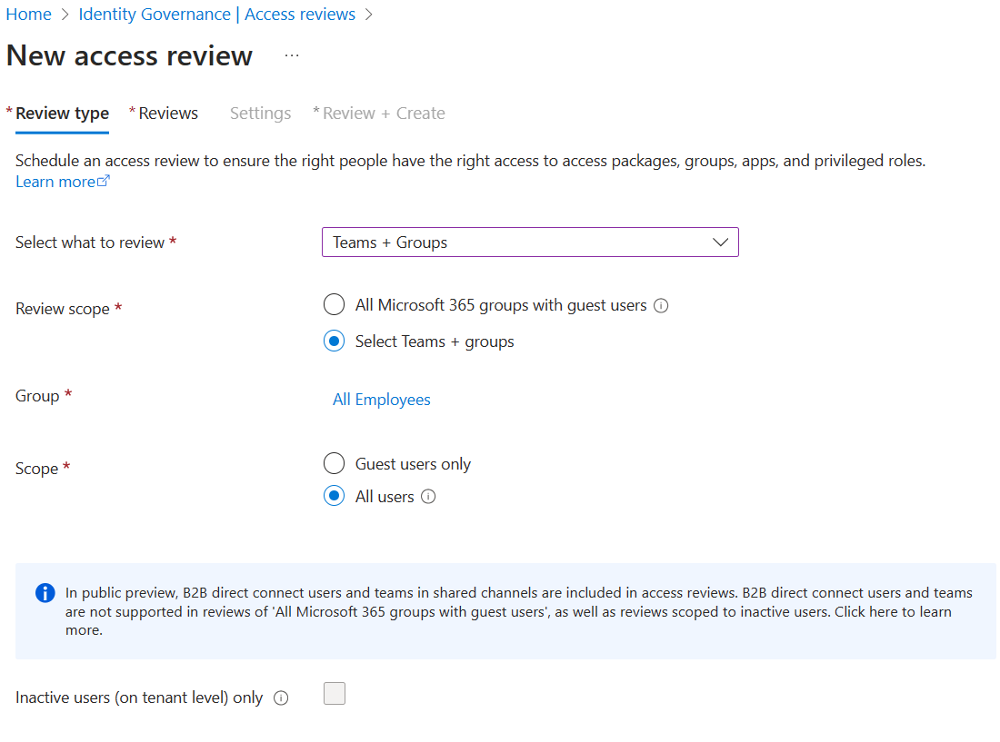

 
# Create an access review of PIM for Groups in Microsoft Entra ID (preview)

This article describes how to create one or more access reviews for PIM for Groups, which will include the active members of the group and the eligible members. Reviews can be performed on both active members of the group, who are active at the time the review is created, and the eligible members of the group.

## Prerequisites

[!INCLUDE [Microsoft Entra ID Governance license](../includes/entra-entra-governance-license.md)]

## Create a PIM for Groups access review

### Scope

1. Sign in to the [Microsoft Entra admin center](https://entra.microsoft.com) as at least an [Identity Governance Administrator](../identity/role-based-access-control/permissions-reference.md#identity-governance-administrator).

1. Browse to **ID Governance** > **Access Reviews** > **Review History**.

1. Select **New access review** to create a new access review.

    

1. In the **Select what to review** box, select **Teams + Groups**.

    

1. Select **Teams + Groups** and then select **Select Teams + groups** under **Review Scope**. A list of groups to choose from appears on the screen.

     

> [!NOTE]  
> When a PIM for Groups is selected, the users under review for the group includes all eligible users and active users in that group. 

6. Now you can select a scope for the review. Your options are:
    - **Guest users only**: This option limits the access review to only the Microsoft Entra B2B guest users in your directory.
    - **Everyone**: This option scopes the access review to all user objects associated with the resource.

7. If you're conducting group membership review, you can create access reviews for only the inactive users in the group. In the *Users scope* section, check the box next to **Inactive users (on tenant level)**. If you check the box, the scope of the review focuses on inactive users only, users who haven't signed in either interactively or non-interactively to the tenant. Then, specify **Days inactive**  with many days inactive up to 730 days (two years). Users in the group inactive for the specified number of days are the only users in the review.

> [!NOTE]
> Recently created users aren't affected when configuring the inactivity time. The Access Review checks if a user has been created in the time frame configured and disregard users who haven’t existed for at least that amount of time. For example, if you set the inactivity time as 90 days and a guest user was created or invited less than 90 days ago, the guest user won't be in scope of the Access Review. This ensures that a user can sign in at least once before being removed.

8. Select **Next: Reviews**.

After you reach this step, you can follow the instructions outlined under **Next: Reviews** in the [Create an access review of groups or applications](create-access-review.md#next-reviews) article to complete your access review.

> [!NOTE]
> For access reviews of PIM for Groups (preview), when selecting the group owner as the reviewer, it's mandatory to assign at least one fallback reviewer. The review will only assign active owner(s) as the reviewer(s). Eligible owners aren't included. If there are no active owners when the review begins, the fallback reviewer(s) will be assigned to the review.

## Next steps

- [Create an access review of groups or applications](create-access-review.md)
- [Approve activation requests for PIM for Groups members and owners (preview)](../id-governance/privileged-identity-management/groups-approval-workflow.md)
