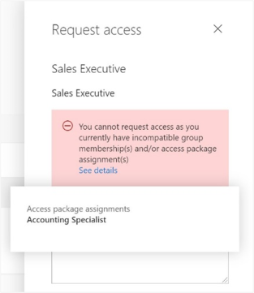
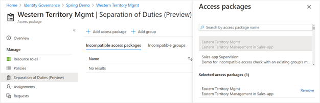
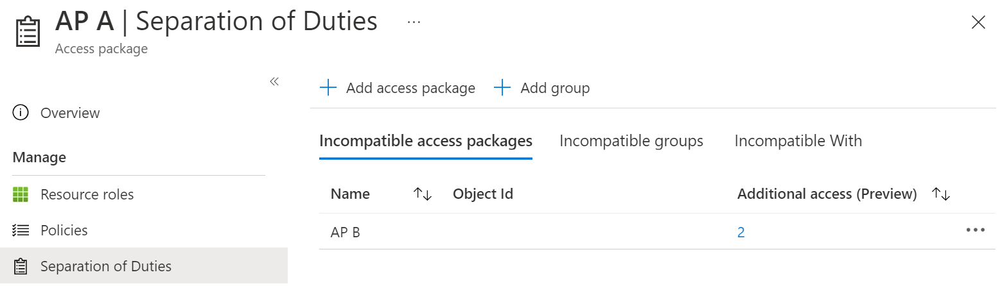
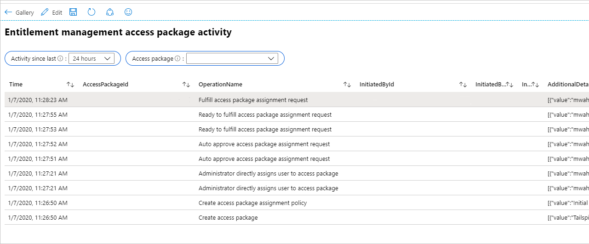

# Configure separation of duties checks for an access package in entitlement management

In entitlement management, you can configure multiple policies, with different settings for each user community that will need access through an access package. For example, employees might only need manager approval to get access to certain apps, but guests coming in from other organizations could require both a sponsor and a resource team departmental manager to approve. In a policy for users already in the directory, you can specify a particular group of users for who can request access. However, you can have a requirement to avoid a user obtaining excessive access. To meet this requirement, you want to further restrict who can request access, based on the access the requestor already has.

With the separation of duties settings on an access package, you can configure that a user who is a member of a security group or who already has an assignment to one access package can't request another access package.




## Scenarios for separation of duties checks

For example, you have an access package, *Marketing Campaign*, that people across your organization and other organizations can request access to, to work with your organization's marketing department while that campaign is going on. Since employees in the marketing department should already have access to that marketing campaign material, you don't want employees in the marketing department to request access to that access package. Or, you could already have a dynamic membership security group, *Marketing department employees*, with all of the marketing employees in it. You could indicate that the access package is incompatible with the dynamic membership group. Then, if a marketing department employee is looking for an access package to request, they couldn't request access to the *Marketing campaign* access package.

Similarly, you could have an application with two app roles - **Western Sales** and **Eastern Sales** - representing sales territories, and you want to ensure that a user can only have one sales territory at a time. If you have two access packages, one access package **Western Territory** giving the **Western Sales** role and the other access package **Eastern Territory** giving the **Eastern Sales** role, then you can configure:
 - the **Western Territory** access package has the **Eastern Territory** package as incompatible, and
 - the **Eastern Territory** access package has the **Western Territory** package as incompatible.

If you’ve been using Microsoft Identity Manager or other on-premises identity management systems for automating access for on-premises apps, then you can integrate these systems with entitlement management as well. If you're controlling access to Microsoft Entra integrated apps through entitlement management, and want to prevent users from having incompatible access, you can configure that an access package is incompatible with a security group. That could be an AD security group, which your on-premises identity management system sends into Microsoft Entra ID through Microsoft Entra Connect. This check ensures a user is unable to request an access package, if that access package would give access that's incompatible with access the user has in on-premises apps.

## Prerequisites

To use entitlement management and assign users to access packages, you must have one of the following licenses:

- Microsoft Entra ID P2 or Microsoft Entra ID Governance
- Enterprise Mobility + Security (EMS) E5 license

## Configure another access package or group membership as incompatible for requesting access to an access package


Follow these steps to change the list of incompatible groups or other access packages for an existing access package:

1. Sign in to the [Microsoft Entra admin center](https://entra.microsoft.com) as at least an [Identity Governance Administrator](../identity/role-based-access-control/permissions-reference.md#identity-governance-administrator).
    > [!TIP]
    > Other least privilege roles that can complete this task include the Catalog owner and the Access package manager.
1. Browse to **ID Governance** > **Entitlement management** > **Access package**.

1. On the **Access packages** page, open the access package which users request.

1. In the left menu, select **Separation of duties**.

1. The list on the **Incompatible access packages** tab is of other access packages. If a user already has an assignment to an access package on that list, they won't be allowed to request this access package.

1.  If you wish to prevent users who have another access package assignment already from requesting this access package, select on **Add access package** and select the access package that the user would already be assigned. That access package will then be added to the list of access packages on the **Incompatible access packages** tab.


    


1.  If you wish to prevent users who have an existing group membership from requesting this access package, then select on **Add group** and select the security-enabled group that the user would already be in. That group will then be added to the list of groups on the **Incompatible groups** tab.

1. If you want the users who are assigned to this access package to not be able to request that access package, as each incompatible access package relationship is unidirectional, then change to that access package, and add this access package as incompatible. For example, you want to have users with the **Western Territory** access package not to be able to request the **Eastern Territory** access package, and users with the **Eastern Territory** access package to not be able to request the **Western Territory** access package. If first on the **Western Territory** access package you added the **Eastern Territory** access package as incompatible, then next change to the **Eastern Territory** access package, and add the **Western Territory** access package as incompatible.

### Configure incompatible access packages programmatically through Graph

You can configure the groups and other access packages that are incompatible with an access package using Microsoft Graph. A user in an appropriate role with an application that has the delegated `EntitlementManagement.ReadWrite.All` permission, or an application with the `EntitlementManagement.ReadWrite.All` application permission, can call the API to add, remove, and list the incompatible groups and access packages [of an access package](/graph/api/resources/accesspackage).

### Configure incompatible access packages through Microsoft PowerShell

You can also configure the groups and other access packages that are incompatible with an access package in PowerShell with the cmdlets from the [Microsoft Graph PowerShell cmdlets for Identity Governance](https://www.powershellgallery.com/packages/Microsoft.Graph.Identity.Governance/) module version 1.16.0 or later.

This following script illustrates using the `v1.0` profile of Graph to create a relationship to indicate another access package as incompatible.

```powershell
Connect-MgGraph -Scopes "EntitlementManagement.ReadWrite.All"

$apid = "00001111-aaaa-2222-bbbb-3333cccc4444"
$otherapid = "11112222-bbbb-3333-cccc-4444dddd5555"

$params = @{
   "@odata.id" = "https://graph.microsoft.com/v1.0/identityGovernance/entitlementManagement/accessPackages/" + $otherapid
}
New-MgEntitlementManagementAccessPackageIncompatibleAccessPackageByRef -AccessPackageId $apid -BodyParameter $params
```

## View other access packages that are configured as incompatible with this one

Follow these steps to view the list of other access packages that have indicated that they're incompatible with an existing access package:

1. Sign in to the [Microsoft Entra admin center](https://entra.microsoft.com) as at least an [Identity Governance Administrator](../identity/role-based-access-control/permissions-reference.md#identity-governance-administrator).
    > [!TIP]
    > Other least privilege roles that can complete this task include the Catalog owner and the Access package manager.
1. Browse to **ID Governance** > **Entitlement management** > **Access package**.

1. On the Access packages page, open the access package.

1. In the left menu, select **Separation of duties**.

1. Select on **Incompatible With**.

## Identifying users who already have incompatible access to another access package

If you've configured incompatible access settings on an access package that already has users assigned to it, then you can download a list of those users who have that extra access. Those users who also have an assignment to the incompatible access package won't be able to re-request access.

Follow these steps to view the list of users who have assignments to two access packages.

1. Sign in to the [Microsoft Entra admin center](https://entra.microsoft.com) as at least an [Identity Governance Administrator](../identity/role-based-access-control/permissions-reference.md#identity-governance-administrator).
    > [!TIP]
    > Other least privilege roles that can complete this task include the Catalog owner and the Access package manager.
1. Browse to **ID Governance** > **Entitlement management** > **Access package**.

1. On the Access packages page, open the access package where you've configured another access package as incompatible.

1. In the left menu, select **Separation of duties**.

1.  In the table, if there's a non-zero value in the Additional access column for the second access package, then that indicates there are one or more users with assignments.

    

1.  Select that count to view the list of incompatible assignments.

1.  If you wish, you can select the **Download** button to save that list of assignments as a CSV file.

## Identifying users who will have incompatible access to another access package

If you're configuring incompatible access settings on an access package that already has users assigned to it, then any of those users who also have an assignment to the incompatible access package or groups won't be able to re-request access.

Follow these steps to view the list of users who have assignments to two access packages.

1. Sign in to the [Microsoft Entra admin center](https://entra.microsoft.com) as at least an [Identity Governance Administrator](../identity/role-based-access-control/permissions-reference.md#identity-governance-administrator).
    > [!TIP]
    > Other least privilege roles that can complete this task include the Catalog owner and the Access package manager.
1. Browse to **ID Governance** > **Entitlement management** > **Access package**.

1. Open the access package where you're configuring incompatible assignments.

1. In the left menu, select **Assignments**.

1. In the **Status** field, ensure that **Delivered** status is selected.

1. Select the **Download** button and save the resulting CSV file as the first file with a list of assignments.

1. In the navigation bar, select **ID Governance**.

1. In the left menu, select **Access packages** and then open the access package that you plan to indicate as incompatible.

1. In the left menu, select **Assignments**.

1. In the **Status** field, ensure that the **Delivered** status is selected.

1. Select the **Download** button and save the resulting CSV file as the second file with a list of assignments.

1. Use a spreadsheet program such as Excel to open the two files.

1. Users who are listed in both files have already-existing incompatible assignments.

### Identifying users who already have incompatible access programmatically

You can retrieve assignments to an access package using Microsoft Graph, that are scoped to just those users who also have an assignment to another access package. A user in an administrative role with an application that has the delegated `EntitlementManagement.Read.All` or `EntitlementManagement.ReadWrite.All` permission can call the API to [list additional access](/graph/api/accesspackageassignment-additionalaccess?view=graph-rest-1.0&preserve-view=true).

### Identifying users who already have incompatible access using PowerShell

You can also query the users who have assignments to an access package with the `Get-MgEntitlementManagementAssignment` cmdlet from the [Microsoft Graph PowerShell cmdlets for Identity Governance](https://www.powershellgallery.com/packages/Microsoft.Graph.Identity.Governance/) module version 2.1.0 or later.

For example, if you have two access packages, one with ID `00aa00aa-bb11-cc22-dd33-44ee44ee44ee` and the other with ID `11bb11bb-cc22-dd33-ee44-55ff55ff55ff`, then you could retrieve the users who have assignments to the first access package, and then compare them to the users who have assignments to the second access package. You can also report the users who have assignments delivered to both, using a PowerShell script similar to the following:

```powershell
$c = Connect-MgGraph -Scopes "EntitlementManagement.Read.All"

$ap_w_id = "00aa00aa-bb11-cc22-dd33-44ee44ee44ee"
$ap_e_id = "11bb11bb-cc22-dd33-ee44-55ff55ff55ff"
$apa_w_filter = "accessPackage/id eq '" + $ap_w_id + "' and state eq 'Delivered'"
$apa_e_filter = "accessPackage/id eq '" + $ap_e_id + "' and state eq 'Delivered'"
$apa_w = @(Get-MgEntitlementManagementAssignment -Filter $apa_w_filter -ExpandProperty target -All)
$apa_e = @(Get-MgEntitlementManagementAssignment -Filter $apa_e_filter -ExpandProperty target -All)
$htt = @{}; foreach ($e in $apa_e) { if ($null -ne $e.Target -and $null -ne $e.Target.Id) {$htt[$e.Target.Id] = $e} }
foreach ($w in $apa_w) { if ($null -ne $w.Target -and $null -ne $w.Target.Id -and $htt.ContainsKey($w.Target.Id)) { write-output $w.Target.Email } }
```

## Configuring multiple access packages for override scenarios

If an access package has been configured as incompatible, then a user who has an assignment to that incompatible access package can't request the access package, nor can an administrator make a new assignment that would be incompatible.

For example, if the **Production environment** access package has marked the **Development environment** package as incompatible, and a user has an assignment to the **Development environment** access package, then the access package manager for **Production environment** can't create an assignment for that user to the **Production environment**. In order to proceed with that assignment, the user's existing assignment to the **Development environment** access package must first be removed.

If there's an exceptional situation where separation of duties rules might need to be overridden, then configuring an additional access package to capture the users who have overlapping access rights make it clear to the approvers, reviewers, and auditors the exceptional nature of those assignments.

For example, if there was a scenario that some users would need to have access to both production and deployment environments at the same time, you could create a new access package **Production and development environments**. That access package could have as its resource roles some of the resource roles of the **Production environment** access package and some of the resource roles of the **Development environment** access package.  

If the motivation of the incompatible access is one resource's roles are problematic, then that resource could be omitted from the combined access package, and require explicit administrator assignment of a user to the resource's role. If that is a third party application or your own application, then you can ensure oversight by monitoring those role assignments using the  *Application role assignment activity* workbook described in the next section.

Depending on your governance processes, that combined access package could have as its policy either:

 - a **direct assignments policy**, so that only an access package manager would be interacting with the access package, or
 - a **users can request access policy**, so that a user can request, with potentially an additional approval stage

This policy could have as its lifecycle settings a shorter expiration number of days than a policy on other access packages, or require more frequent access reviews, with regular oversight so that users don't retain access longer than necessary.

## Monitor and report on access assignments

You can use Azure Monitor workbooks to get insights on how users have been receiving their access.

1. Configure Microsoft Entra ID to [send audit events to Azure Monitor](entitlement-management-logs-and-reporting.md).

1. The workbook named *Access Package Activity* displays each event related to a particular access package.

    

1. To see if there have been changes to application role assignments for an application that weren't created due to access package assignments, then you can select the workbook named *Application role assignment activity*. If you select to omit entitlement activity, then only changes to application roles that weren't made by entitlement management are shown. For example, you would see a row if a Global Administrator had directly assigned a user to an application role.

    


## Next steps

- [View, add, and remove assignments for an access package](entitlement-management-access-package-assignments.md)
- [View reports and logs](entitlement-management-reports.md)
