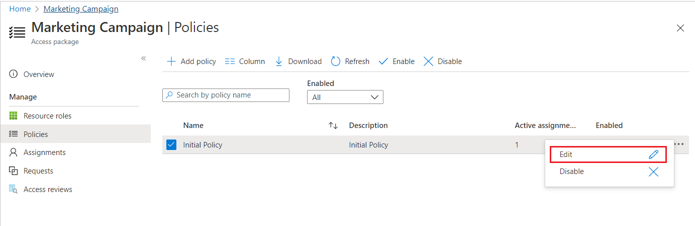
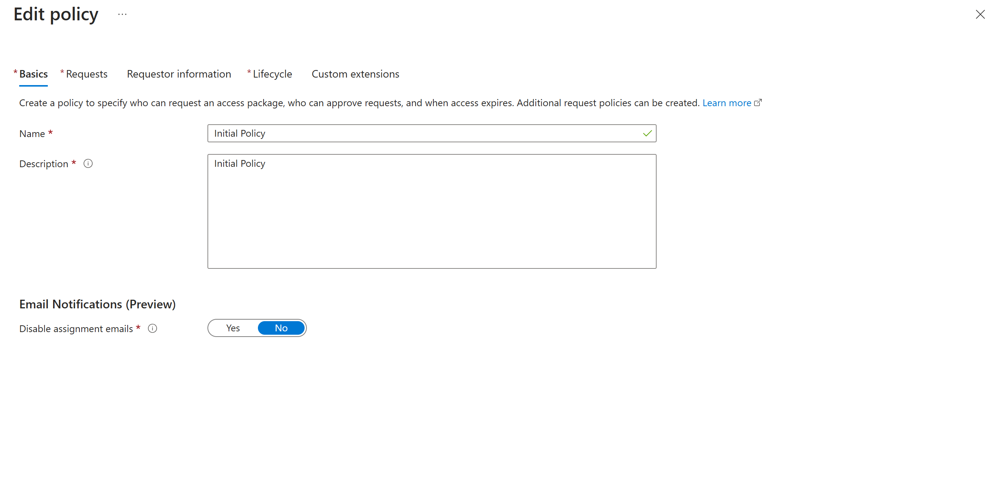

# Change lifecycle settings for an access package in entitlement management

As an access package manager, you can change the lifecycle settings for assignments in an access package at any time by editing an existing policy. If you change the expiration date for assignments on a policy, the expiration date for requests that are already in a pending approval or approved state won't change.

This article describes how to change the lifecycle settings for an existing access package assignment policy.

## Open requestor information
To ensure users have the right access to an access package, custom questions can be configured to ask users requesting access to certain access packages. Configuration options include: localization, required/optional, and text/multiple choice answer formats. Requestors  see the questions when they request the package and approvers see the answers to the questions to help them make their decision. Use the following steps to configure questions in an access package:

## Open lifecycle settings

[!INCLUDE [portal updates](../includes/portal-update.md)]

To change the lifecycle settings for an access package, you need to open the corresponding policy. Follow these steps to open the lifecycle settings for an access package.

1. Sign in to the [Microsoft Entra admin center](https://entra.microsoft.com) as at least an [Identity Governance Administrator](../identity/role-based-access-control/permissions-reference.md#identity-governance-administrator).
    > [!TIP]
    > Other least privilege roles that can complete this task include the Catalog owner and the Access package manager.
1. Browse to **Identity governance** > **Entitlement management** > **Access package**.

1. On the Access packages page, open the access package that you want to edit.

1. Select **Policies** and then select the policy that has the lifecycle settings you want to edit.

    The Policy details pane opens at the bottom of the page.

    

1. Select **Edit** to edit the policy.

    

1. Select the **Lifecycle** tab to open the lifecycle settings.

[!INCLUDE [Entitlement management lifecycle policy](../includes/entra-entitlement-management-lifecycle-policy.md)]

## Next steps

- [Change request and approval settings for an access package](entitlement-management-access-package-request-policy.md)
