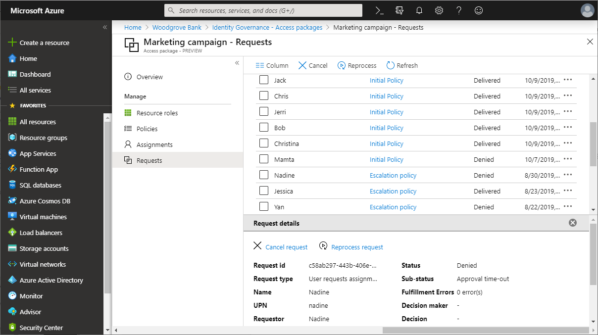

# View and remove requests for an access package in entitlement management

In entitlement management, you can see who has requested access packages, the policy for their request, and the status of their request. This article describes how to view requests for an access package, and remove requests that are no longer needed.

## View requests

1. Sign in to the [Microsoft Entra admin center](https://entra.microsoft.com) as at least an [Identity Governance Administrator](../identity/role-based-access-control/permissions-reference.md#identity-governance-administrator).
    > [!TIP]
    > Other least privilege roles that can complete this task include the Catalog owner, the Access package manager, and the Access package assignment manager.
1. Browse to **ID Governance** > **Entitlement management** > **Access package**.

1. On the Access packages page, open the access package you want to view requests of.

1. Select **Requests**.

1. Select a specific request to see more details.

    

1. You can select on **Request History details** to see who approved a request, what their approval justifications were, and when access was delivered.

If you have a set of users whose requests are in the "Partially Delivered" or "Failed" state, you can retry those requests by using the [reprocess functionality](entitlement-management-reprocess-access-package-requests.md).

### View requests with Microsoft Graph
You can also retrieve requests for an access package using Microsoft Graph. A user in an appropriate role with an application that has the delegated `EntitlementManagement.Read.All` or `EntitlementManagement.ReadWrite.All` permission can call the API to [list assignmentRequests](/graph/api/entitlementmanagement-list-assignmentrequests?view=graph-rest-1.0&preserve-view=true). While an Identity Governance Administrator can retrieve access package requests from multiple catalogs, if user or application service principal is assigned only to catalog-specific delegated administrative roles, the request must supply a filter to indicate a specific access package, such as: `$expand=accessPackage&$filter=accessPackage/id eq '00aa00aa-bb11-cc22-dd33-44ee44ee44ee'`. An application that has the application permission `EntitlementManagement.Read.All` or `EntitlementManagement.ReadWrite.All` permission can also use this API to retrieve requests across all catalogs.

Microsoft Graph will return the results in pages, and will continue to return a reference to the next page of results in the `@odata.nextLink` property with each response, until all pages of the results have been read. To read all results, you must continue to call Microsoft Graph with the `@odata.nextLink` property returned in each response until the `@odata.nextLink` property is no longer returned, as described in [paging Microsoft Graph data in your app](/graph/paging).

## Remove request (Preview)

You can also remove a completed request that is no longer needed. To remove a request:

1. Sign in to the [Microsoft Entra admin center](https://entra.microsoft.com) as at least an [Identity Governance Administrator](../identity/role-based-access-control/permissions-reference.md#identity-governance-administrator).

1. Browse to **ID Governance** > **Entitlement management** > **Access package**.

1. On the Access packages page, open the access package you want to remove requests for.

1. Select **Requests**.

1. Find the request you want to remove from the access package.

1. Select the Remove button.

> [!NOTE]
> If you remove a completed request from an access package, this doesn't remove the active assignment, only the data of the request. So the requestor will continue to have access. If you also need to remove an assignment and the resulting access from that access package, in the left menu, click **Assignments**, locate the assignment, and then [remove the assignment](entitlement-management-access-package-assignments.md).

### Remove a request with Microsoft Graph

You can also remove a request using Microsoft Graph. A user in an appropriate role with an application that has the delegated `EntitlementManagement.ReadWrite.All` permission, or an application with the `EntitlementManagement.ReadWrite.All` application permission, can call the API to [remove an accessPackageAssignmentRequest](/graph/api/accesspackageassignmentrequest-delete).

## Next steps

- [Reprocess requests for an access package](entitlement-management-reprocess-access-package-requests.md)
- [Change request and approval settings for an access package](entitlement-management-access-package-request-policy.md)
- [View, add, and remove assignments for an access package](entitlement-management-access-package-assignments.md)
- [Troubleshoot requests](entitlement-management-troubleshoot.md#requests)
