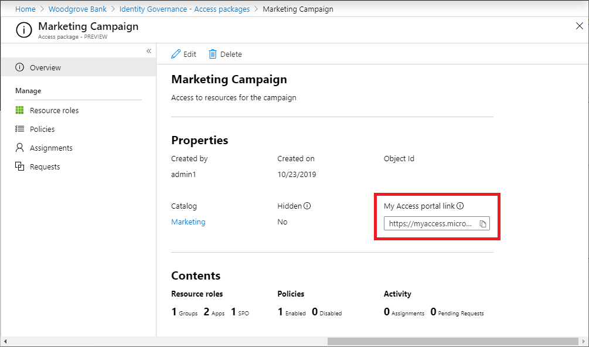

# Share link to request an access package in entitlement management

This article explains how to share a link for a specific access package that will direct a user straight into the access package request flow in the My Access portal, skipping the need for the user to locate and select the access package within the My Access portal.

When you create access packages, they're discoverable by default. This means that if a policy allows a user to request the access package, they'll automatically see the access package listed in their My Access portal. However, You can also change the Hidden setting so that the access package isn't listed in the user's My Access portal. Users can only view hidden access packages if they have the direct My Access portal link mentioned in this article. For more details please refer to, [hide or delete access package in entitlement management](entitlement-management-access-package-edit.md).

A user will only see the access packages from a given tenant in their My Access portal. The link outlined in this article includes a tenant hint which ensures the My Access portal loads for the correct tenant. If users are accessing the My Access portal without a tenant hint in their URL, they can also use the organization/tenant switcher which is located on the top right of the My Access portal.

For the external user from another tenant to use the My Access portal link to request the access package, the catalog for the access package must be [enabled for external users](entitlement-management-catalog-create.md) and there must be a [policy for the external user's directory](entitlement-management-access-package-request-policy.md) in the access package.

## Share link to request an access package

1. Sign in to the [Microsoft Entra admin center](https://entra.microsoft.com) as at least an [Identity Governance Administrator](../identity/role-based-access-control/permissions-reference.md#identity-governance-administrator).
    > [!TIP]
    > Other least privilege roles that can complete this task include the Catalog owner and the Access package manager.
1. Browse to **ID Governance** > **Entitlement management** > **Access package**.

1. On the **Access packages** page, open the access package you want to share a link to request an access package for.

1. On the Overview page, check the **Hidden** setting. If the **Hidden** setting is **Yes**, then even users who don't have the My Access portal link can browse and request the access package. If you don't wish to have them browse for the access package, then change the setting to **No**.

1. On the Overview page, copy the **My Access portal link**.

    

    It's important that you copy the entire My Access portal link when sending it to an internal business partner. This ensures that the partner gets access to your directory's portal to make their request. The link starts with `myaccess`, includes a directory hint, and ends with an access package ID. For US Government, the domain in the My Access portal link will be `myaccess.microsoft.us`.

    `https://myaccess.microsoft.com/@<directory_hint>#/access-packages/<access_package_id>`

1. Email or send the link to your external business partner. They can share the link with their users in their organization to request the access package.

## Next steps

- [Request access to an access package](entitlement-management-request-access.md)
- [Approve or deny access requests](entitlement-management-request-approve.md)
