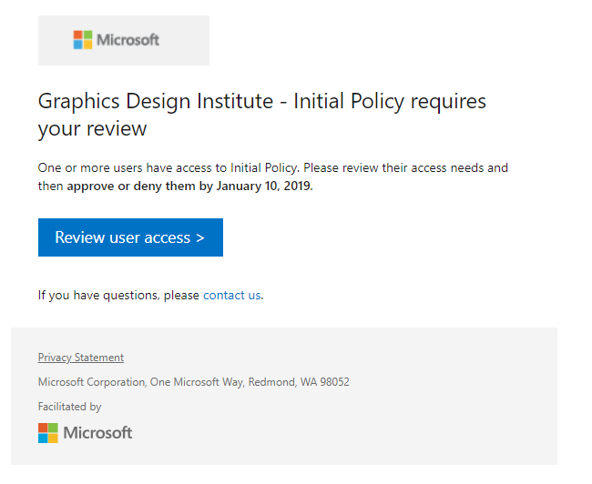
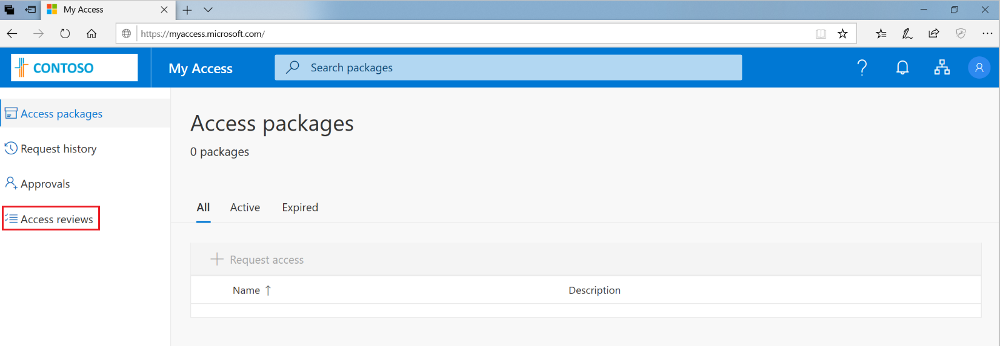
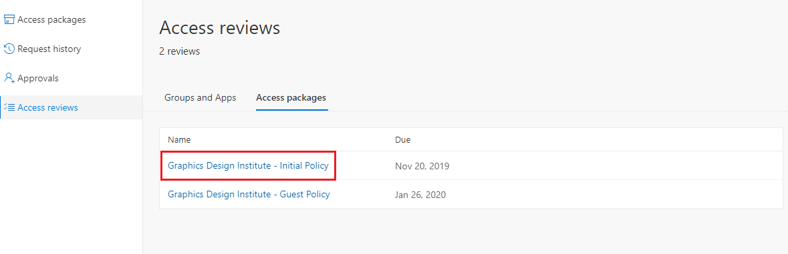
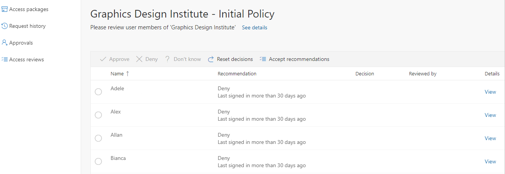
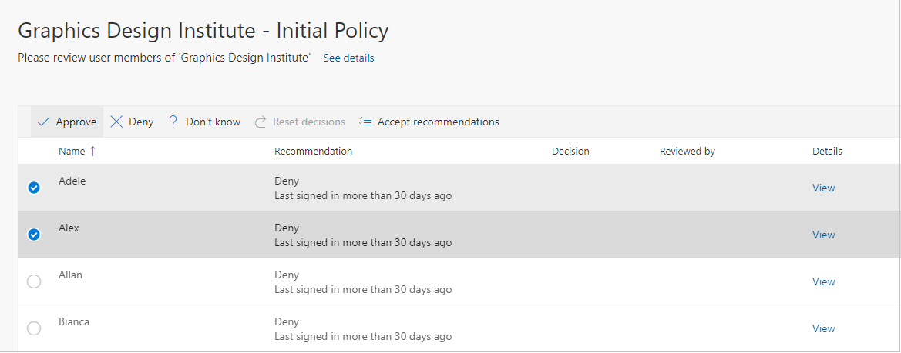
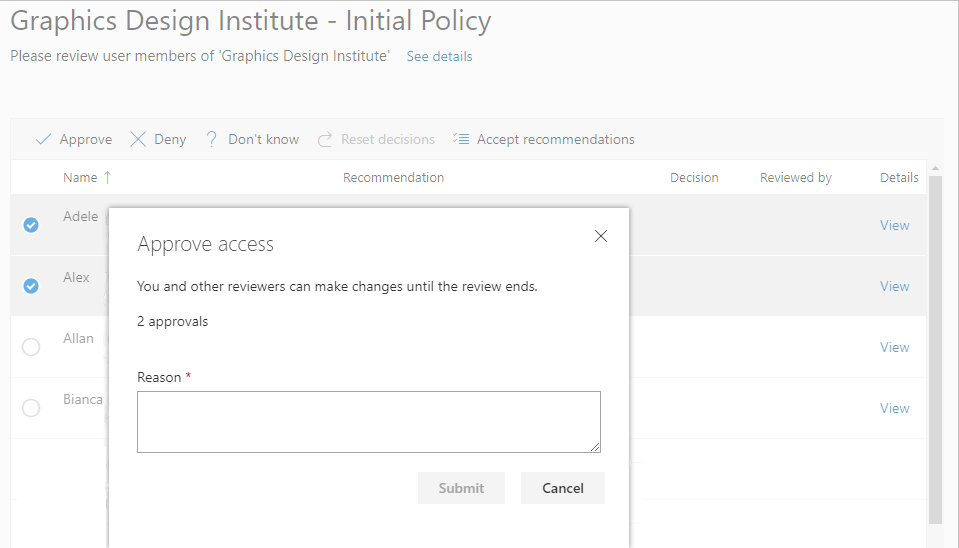
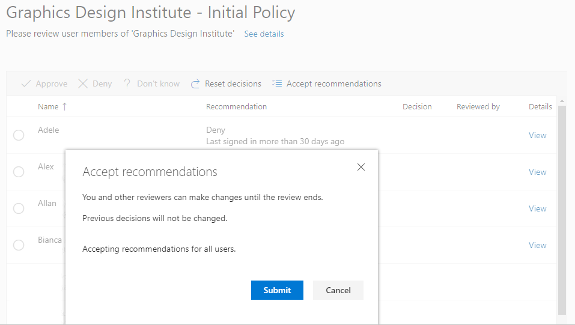

# Review access of an access package in entitlement management

Entitlement management simplifies how enterprises manage access to groups, applications, and SharePoint sites. This article describes how designated reviewers can review user assignments to access packages which grant the assigned users access.

You can review access package assignments via the [My Access portal](https://myaccess.microsoft.com/), or via chat with the [Access Review Agent (Preview)](https://teams.microsoft.com/l/app/b99caf01-1dd7-43cf-981a-0de444e783f3) in Microsoft Teams. The Access Review Agent is currently in preview and does not yet support all types of access package assignment reviews, if the agent cannot yet help you with your assigned reviews it will guide you to the My Access portal.

## Perform an access review using the Access Review Agent (Preview)
The Access Review Agent assists you in completing your pending access reviews by guiding you in Microsoft Teams with natural language, insights, and recommendations. To use the Access Review Agent to perform an access review, do the following:

### Go directly to the Access Review Agent
1. Select the [Access Review Agent](https://teams.microsoft.com/l/app/b99caf01-1dd7-43cf-981a-0de444e783f3) link to open the agent.
1. Select **Add** or **Open** to access the conversation with the Access Review Agent.
1. Prompt the agent with **Help me with my access reviews** and the agent will assist you in completing your pending access reviews.

### Use email to go to the Access Review Agent

>[!IMPORTANT]
> There could be delays in receiving email. In some cases, it could take up to 24 hours. Add MSSecurity-noreply@microsoft.com to your safe recipients list to make sure that you're receiving all emails.
1. Look for an email from Microsoft asking you to review access.
1. Select the **Review user access** link to open the [Access Review Agent](https://teams.microsoft.com/l/app/b99caf01-1dd7-43cf-981a-0de444e783f3). The **Start review** link will either open the Access Review Agent or the My Access portal based on your organizations policies. If the link opens the My Access portal the Access Review Agent has not been enabled for the specific review and must be completed via the My Access portal.
1. Select **Add** or **Open** to access the conversation with the Access Review Agent
1. Prompt the agent with **Help me with my access reviews** and the agent will assist you in completing your pending access reviews.

## Perform access review by using the My Access portal
The [My Access portal](https://myaccess.microsoft.com/) is a user-friendly portal for manually granting, approving, and reviewing access needs.

### Open the access review

Use the following steps to find and open the access review:

1. You could receive an email from Microsoft that asks you to review access. Locate the email to open the access review. Here's an example email to review access:
    
    

1. Select the **Review user access** link to open the access review. 

1. If you don’t have the email, you can find your pending access reviews by navigating directly to https://myaccess.microsoft.com. (For US Government, use `https://myaccess.microsoft.us` instead.)

1. Select **Access reviews** on the left navigation bar to see a list of pending access reviews assigned to you.
    
    

1. Select the review that you’d like to begin.
    
    

### Manually approve or deny access for one or more users using the My Access portal
1. Review the list of users and determine which users need to continue to have access.

    

1. To approve or deny access, select the radio button to the left of the user’s name.

1. Select **Approve** or **Deny** in the bar above the user names.

    

1. If you aren't sure, you can select the **Don’t know** button.

    If you make this selection, the user maintains access, and this selection goes in the audit logs. The log shows any other reviewers that you still completed the review.

1. You could be required to provide a reason for your decision. Type in a reason and select **Submit**.

    

1. You can change your decision at any time before the end of the review. To do so, select the user from the list and change the decision. For example, you can approve access for a user you previously denied.

If there are multiple reviewers, the last submitted response is recorded. Consider an example where an administrator designates two reviewers – Alice and Bob. Alice opens the review first and approves access. Before the review ends, Bob opens the review and denies access. In this case, the last deny access decision gets recorded.

>[!NOTE]
>If a user is denied access in the review, they aren't removed from the access package immediately. The user will be removed from the access package once the review results are applied after the review is closed. The review closes automatically at the end of the review duration or earlier if an administrator manually stops the review. 

### Approve or deny access using the system-generated recommendations

To review access for multiple users more quickly, you can use the system-generated recommendations, accepting the recommendations with a single select. The recommendations are generated based on the user's sign-in activity.

1. In the bar at the top of the page, select **Accept recommendations**.
    
    
    
    You see a summary of the recommended actions.

1. Select **Submit** to accept the recommendations.

## Next steps

- [Self-review of access packages](entitlement-management-access-reviews-self-review.md)
