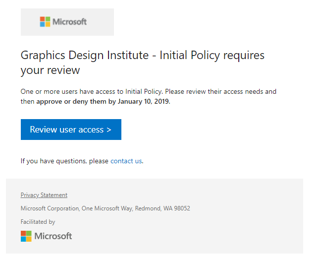
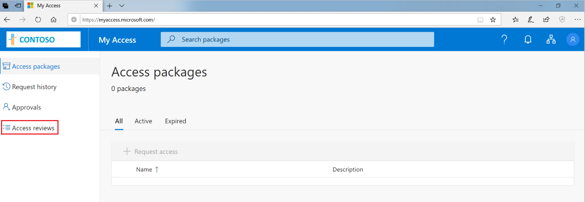
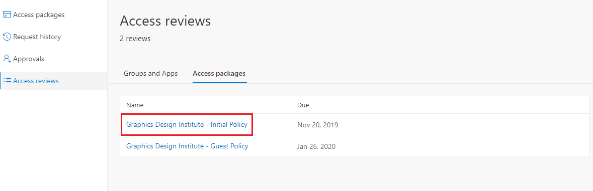
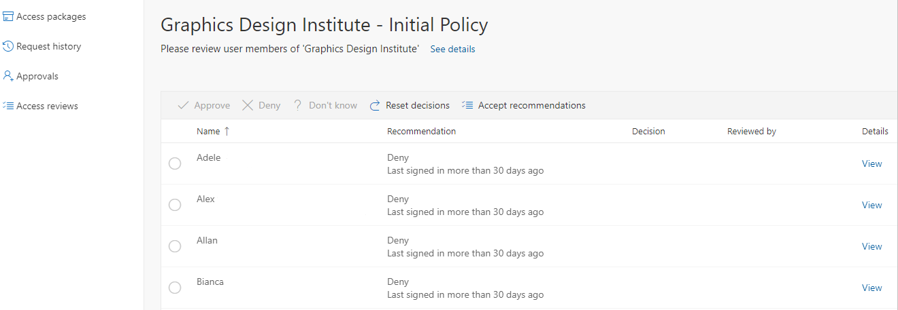
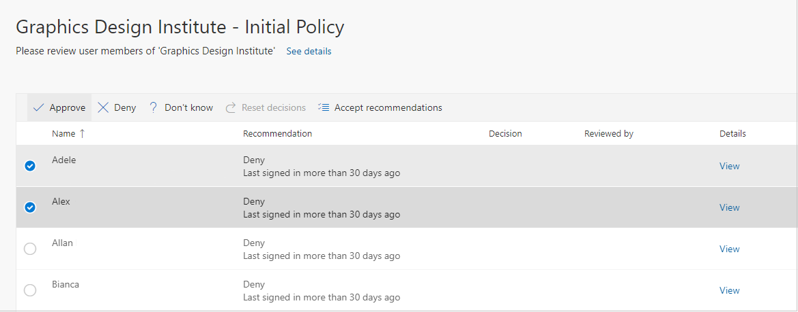
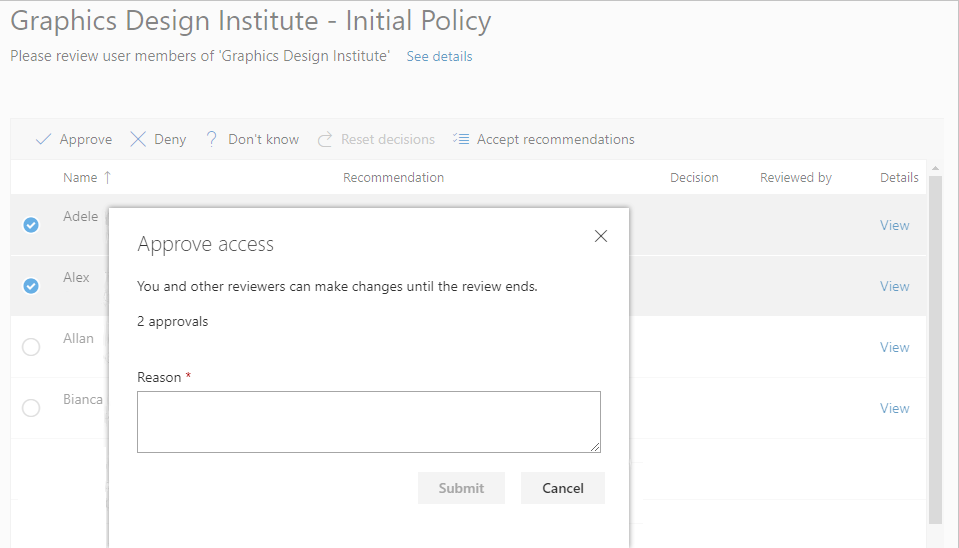
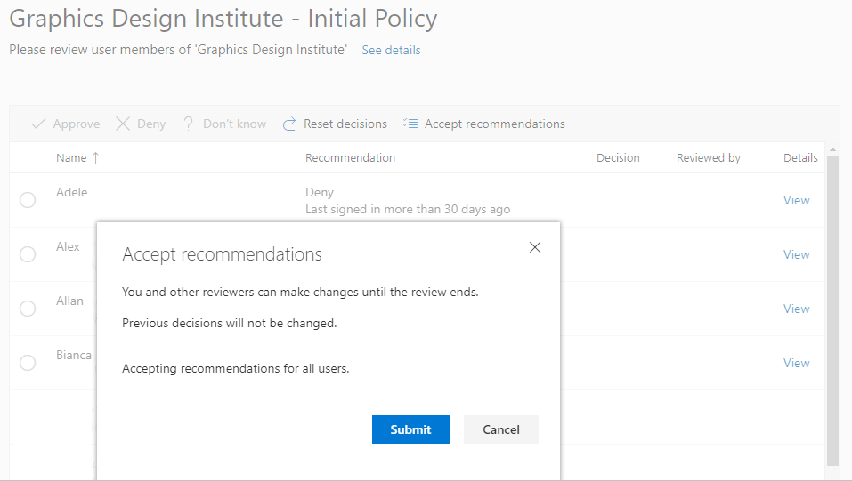

# Review access of an access package in entitlement management

Entitlement management simplifies how enterprises manage access to groups, applications, and SharePoint sites. This article describes how designated reviewers can review user assignments to access packages.

## Perform access review by using the My Access portal
The [My Access portal](https://myaccess.microsoft.com/) is a user-friendly portal for manually granting, approving, and reviewing access needs.

### Open the access review

Use the following steps to find and open the access review:

1. You might receive an email from Microsoft that asks you to review access. Locate the email to open the access review. Here's an example email to review access:
    
    

1. Select the **Review user access** link to open the access review. 

1. If you don’t have the email, you can find your pending access reviews by navigating directly to https://myaccess.microsoft.com. (For US Government, use `https://myaccess.microsoft.us` instead.)

1. Select **Access reviews** on the left navigation bar to see a list of pending access reviews assigned to you.
    
    

1. Select the review that you’d like to begin.
    
    

### Manually approve or deny access for one or more users using the My Access portal
1. Review the list of users and determine which users need to continue to have access.

    

1. To approve or deny access, select the radio button to the left of the user’s name.

1. Select **Approve** or **Deny** in the bar above the user names.

    

1. If you aren't sure, you can select the **Don’t know** button.

    If you make the **Don't know** selection, the user maintains access, and this selection goes in the audit logs. The log shows any other reviewers that you still completed the review.

1. You might be required to provide a reason for your decision. Type in a reason and select **Submit**.

    

1. You can change your decision at any time before the end of the review. To do so, select the user from the list and change the decision. For example, you can approve access for a user you previously denied.

If there are multiple reviewers, the last submitted response is recorded. Consider an example where an administrator designates two reviewers – Alice and Bob. Alice opens the review first and approves access. Before the review ends, Bob opens the review and denies access. In this case, the last deny access decision gets recorded.

>[!NOTE]
>If a user is denied access in the review, they aren't removed from the access package immediately. The user is removed from the access package when the review results are applied after the review is closed. The review closes automatically at the end of the review duration or earlier if an administrator manually stops the review. 

### Approve or deny access using the system-generated recommendations

To review access for multiple users more quickly, you can use the system-generated recommendations, accepting the recommendations with a single select. The recommendations are generated based on the user's sign-in activity.

1. In the bar at the top of the page, select **Accept recommendations**.
    
    
    
    You see a summary of the recommended actions.

1. Select **Submit** to accept the recommendations.

## Next steps

- [Self-review of access packages](entitlement-management-access-reviews-self-review.md)
