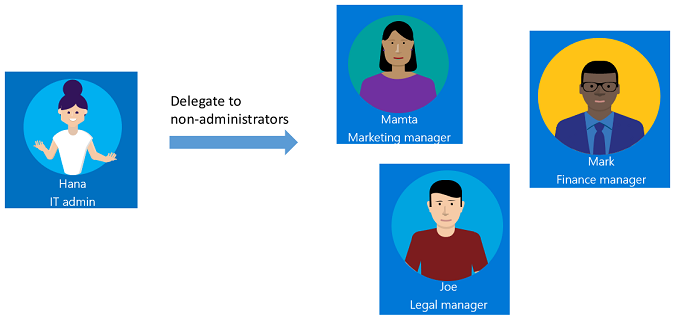
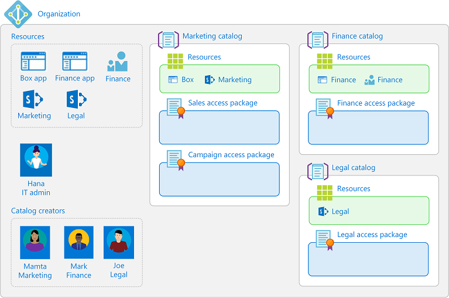

# Delegation and roles in entitlement management

In Microsoft Entra ID, you can use role models to manage access at scale through identity governance.

 * You can use access packages to represent [organizational roles](identity-governance-organizational-roles.md) in your organization, such as "sales representative". An access package representing that organizational role would include all the access rights that a sales representative might typically need, across multiple resources.
 * Applications [can define their own roles](~/identity-platform/howto-add-app-roles-in-apps.md). For example, if you had a sales application, and that application included the app role "salesperson" in its manifest, you could then [include that role from the app manifest in an access package](entitlement-management-access-package-resources.md). Applications can also use security groups in scenarios where a user could have multiple application-specific roles simultaneously.
 * You can use roles for delegating administrative access. If you have a catalog for all the access packages needed by sales, you could assign someone to be responsible for that catalog, by assigning them a catalog-specific role.

This article discusses how to use roles to manage aspects within Microsoft Entra entitlement management, for controlling access to the entitlement management resources.

By default, users in the Global Administrator role or the Identity Governance Administrator role can create and manage all aspects of entitlement management. However, the users in these roles might not know all the situations where access packages are required. Typically it's users within the respective departments, teams, or projects who know who they're collaborating with, using what resources, and for how long. Instead of granting unrestricted permissions to non-administrators, you can grant users the least permissions they need to do their job and avoid creating conflicting or inappropriate access rights.

This video provides an overview of how to delegate access governance from IT administrator to users who aren't administrators.

> [!VIDEO https://learn-video.azurefd.net/vod/player?id=0915072b-63ec-4c78-b2ca-aa5f54a54219]

## Delegate example

To understand how you might delegate access governance in entitlement management, it helps to consider an example. Suppose your organization has the following administrator and managers.



As the IT administrator, Hana has contacts in each department--Mamta in Marketing, Mark in Finance, and Joe in Legal who are responsible for their department's resources and business critical content.

With entitlement management, you can delegate access governance to these non-administrators because they're the ones who know which users need access, for how long, and to which resources. Delegating to non-administrators ensures the right people are managing access for their departments.

Here's one way that Hana could delegate access governance to the marketing, finance, and legal departments.

1. Hana creates a new Microsoft Entra security group, and adds Mamta, Mark, and Joe as members of the group.

1. Hana adds that group to the catalog creators role.

    Mamta, Mark, and Joe can now create catalogs for their departments, add resources that their departments need, and do further delegation within the catalog. They can't see each other's catalogs.

1. Mamta creates a **Marketing** catalog, which is a container of resources.

1. Mamta adds the resources that the marketing department owns to this catalog.

1. Mamta can add other people from that department as catalog owners for this catalog, which helps share the catalog management responsibilities.

1. Mamta can further delegate the creation and management of access packages in the Marketing catalog to project managers in the Marketing department. They can do this by assigning them to the access package manager role on a catalog. An access package manager can create and manage access packages, along with policies, requests and assignments in that catalog. If the catalog allows it, the access package manager can configure policies to bring in users from connected organizations.

The following diagram shows catalogs with resources for the marketing, finance, and legal departments. When using these catalogs, project managers can create access packages for their teams or projects.



After delegation, the marketing department might have roles similar to the following table.

| User | Organizational role | Microsoft Entra role | Entitlement management role |
| --- | --- | --- | --- |
| Hana | IT administrator | Global Administrator or Identity Governance Administrator  |  |
| Mamta | Marketing manager | User | Catalog creator and Catalog owner |
| Bob | Marketing lead | User | Catalog owner |
| Jessica | Marketing project manager | User | Access package manager |

## Entitlement management roles

Entitlement management has the following roles, with permissions for administering entitlement management itself, that applies across all catalogs.

| Entitlement management role | Role definition ID | Description |
| --- | --- | -- |
| Catalog creator | `ba92d953-d8e0-4e39-a797-0cbedb0a89e8` | Create and manage catalogs. Typically an IT administrator who isn't a Global Administrator, or a resource owner for a collection of resources. The person that creates a catalog automatically becomes the catalog's first catalog owner, and can add more catalog owners. A catalog creator can’t manage or see catalogs that they don’t own and can’t add resources they don’t own to a catalog. If the catalog creator needs to manage another catalog or add resources they don’t own, they can request to be a co-owner of that catalog or resource. |
| Connected Organization Administrator | `e65cf63f-9cc2-4b48-8871-cb667e9d90f` | Create and manage connected organizations. |

Entitlement management has the following roles that are defined for each particular catalog, for administering access packages and other configuration within a catalog. An administrator or a catalog owner can add users, groups of users, or service principals to these roles.

| Entitlement management role | Role definition ID | Description |
| --- | --- | -- |
| Catalog owner | `ae79f266-94d4-4dab-b730-feca7e132178` | Edit and manage access packages and other resources in a catalog. Typically an IT administrator or resource owners, or a user who the catalog owner chooses. |
| Catalog reader | `44272f93-9762-48e8-af59-1b5351b1d6b3` | View existing access packages within a catalog. |
| Access package manager | `7f480852-ebdc-47d4-87de-0d8498384a83` | Edit and manage all existing access packages within a catalog. |
| Access package assignment manager | `e2182095-804a-4656-ae11-64734e9b7ae5` | Edit and manage all existing access packages' assignments. |

Also, the chosen approver and a requestor of an access package have rights, although they're not roles.

| Right | Description |
| --- | --- |
| Approver | Authorized by a policy to approve or deny requests to access packages, though they can't change the access package definitions. |
| Requestor | Authorized by a policy of an access package to request that access package. |

The following table lists the tasks that the entitlement management roles can do within entitlement management.

| Task |  Identity Governance Administrator | Connected Organization Administrator | Catalog creator | Catalog owner | Access package manager | Access package assignment manager |
| --- | :---: | :---: | :---: | :---: | :---: | :---: |
| [Delegate to a catalog creator](entitlement-management-delegate-catalog.md) | :heavy_check_mark: |  |  |  |  |  |
| [Add a connected organization](entitlement-management-organization.md) | :heavy_check_mark: | :heavy_check_mark: |  |  |  |  |
| [Create a new catalog](entitlement-management-catalog-create.md) | :heavy_check_mark: |  | :heavy_check_mark: |  |  |  |
| [Add a resource to a catalog](entitlement-management-catalog-create.md#add-resources-to-a-catalog) | :heavy_check_mark: |  |  | :heavy_check_mark: |  |  |
| [Add a catalog owner](entitlement-management-catalog-create.md#add-more-catalog-owners) | :heavy_check_mark: |  |  | :heavy_check_mark: |  |  |
| [Edit a catalog](entitlement-management-catalog-create.md#edit-a-catalog) | :heavy_check_mark: |  |  | :heavy_check_mark: |  |  |
| [Delete a catalog](entitlement-management-catalog-create.md#delete-a-catalog) | :heavy_check_mark: |  |  | :heavy_check_mark: |  |  |
| [Delegate to an access package manager](entitlement-management-delegate-managers.md) | :heavy_check_mark: |  |  | :heavy_check_mark: |  |  |
| [Remove an access package manager](entitlement-management-delegate-managers.md#remove-an-access-package-manager) | :heavy_check_mark: |  |  | :heavy_check_mark: |  |  |
| [Create a new access package in a catalog](entitlement-management-access-package-create.md) | :heavy_check_mark: |  |  | :heavy_check_mark:  | :heavy_check_mark:  |  |
| [Change resource roles in an access package](entitlement-management-access-package-resources.md) | :heavy_check_mark: |  |  | :heavy_check_mark: | :heavy_check_mark: |  |
| [Create and edit policies, including policies for external collaboration](entitlement-management-access-package-request-policy.md) | :heavy_check_mark: |  |  | :heavy_check_mark: | :heavy_check_mark: |  |
| [Directly assign a user to an access package](entitlement-management-access-package-assignments.md#directly-assign-a-user) | :heavy_check_mark: |  |  | :heavy_check_mark: | :heavy_check_mark: |  :heavy_check_mark: |
| [Directly remove a user from an access package](entitlement-management-access-package-assignments.md#remove-an-assignment) | :heavy_check_mark:  |  |  | :heavy_check_mark: | :heavy_check_mark: | :heavy_check_mark: |
| [View who has an assignment to an access package](entitlement-management-access-package-assignments.md#view-who-has-an-assignment) | :heavy_check_mark: |  |  | :heavy_check_mark: | :heavy_check_mark: |  :heavy_check_mark: |
| [View an access package's requests](entitlement-management-access-package-requests.md#view-requests) | :heavy_check_mark: |  |  | :heavy_check_mark: | :heavy_check_mark: | :heavy_check_mark:  |
| [View a request's delivery errors](entitlement-management-troubleshoot.md#view-a-requests-delivery-errors) | :heavy_check_mark: |  |  | :heavy_check_mark: | :heavy_check_mark: |  :heavy_check_mark: |
| [Reprocess a request](entitlement-management-troubleshoot.md#reprocess-a-request) | :heavy_check_mark: |  |  | :heavy_check_mark: | :heavy_check_mark: | :heavy_check_mark:  |
| [Cancel a pending request](entitlement-management-troubleshoot.md#cancel-a-pending-request) | :heavy_check_mark: |  |  | :heavy_check_mark: | :heavy_check_mark: | :heavy_check_mark: |
| [Hide an access package](entitlement-management-access-package-edit.md#change-the-hidden-setting) | :heavy_check_mark: |  |  | :heavy_check_mark: | :heavy_check_mark: |  |
| [Delete an access package](entitlement-management-access-package-edit.md#delete-an-access-package) | :heavy_check_mark: |  |  | :heavy_check_mark: | :heavy_check_mark: |  |


To determine the least privileged role for a task, you can also reference [Least privileged roles by task in Microsoft Entra ID](../identity/role-based-access-control/delegate-by-task.md#entitlement-management-least-privileged-roles).

> [!NOTE]
> Users that have been assigned the Access package assignment manager role will no longer be able to bypass approval settings when directly assigning a user if the access package policy requires approval. If you have a scenario in which you need to bypass approval, we recommend creating a second policy on the access package that does not require approval and is scoped only to users who need access.

## Required roles to add resources to a catalog

A Global Administrator can add or remove any group (cloud-created security groups or cloud-created Microsoft 365 Groups), application, or SharePoint Online site in a catalog.

> [!NOTE]
> Users that have been assigned the User Administrator role will no longer be able to create catalogs or manage access packages in a catalog they do not own.  A User Administrator who is a catalog owner can add or remove any group or application in the catalog they own, except for a group configured as assignable to a directory role.  For more information on role-assignable groups, reference [Create a role-assignable group in Microsoft Entra ID](~/identity/role-based-access-control/groups-create-eligible.md). If users in your organization have been assigned the User Administrator role to configure catalogs, access packages, or policies in entitlement management, you should instead assign these users the **Identity Governance Administrator** role.

For a user who isn't a Global Administrator, to add groups, applications, or SharePoint Online sites to a catalog, that user must have *both* the ability to perform actions on that resource, and be a catalog owner role in entitlement management for the catalog. The most common way a user can have the ability to perform actions for a resource is by being in a Microsoft Entra directory role that allows them to administer the resource. Or for resources that have owners, the user can have the ability to perform actions by having been assigned as an owner of the resource.

The actions that entitlement management checks when a user adds a resource to a catalog are:

* To add a security group or Microsoft 365 group: the user must be permitted to perform the `microsoft.directory/groups/members/update` and `microsoft.directory/groups/owners/update` actions
* To add an application: the user must be permitted to perform the `microsoft.directory/servicePrincipals/appRoleAssignedTo/update` action
* To add a SharePoint Online site: the user must be a SharePoint Administrator or the user must be SharePoint site administrator of the site.

The following table lists some of the role combinations that include the actions that allow users in those role combinations to add resources to a catalog. To remove resources from a catalog, you must also have a role or ownership with those same actions.

| Microsoft Entra directory role | Entitlement management role | Can add security group | Can add Microsoft 365 Group | Can add app | Can add SharePoint Online site |
| --- | :---: | :---: | :---: | :---: | :---: |
| [Global Administrator](~/identity/role-based-access-control/permissions-reference.md#global-administrator) | n/a |  :heavy_check_mark: | :heavy_check_mark: | :heavy_check_mark: | :heavy_check_mark: |
| [Identity Governance Administrator](~/identity/role-based-access-control/permissions-reference.md#identity-governance-administrator) | n/a | | | :heavy_check_mark: |  |
| [Groups Administrator](~/identity/role-based-access-control/permissions-reference.md#groups-administrator) | Catalog owner | :heavy_check_mark: | :heavy_check_mark: |  |  |
| [Intune Administrator](~/identity/role-based-access-control/permissions-reference.md#intune-administrator) | Catalog owner | :heavy_check_mark: | :heavy_check_mark: |  |  |
| [Exchange Administrator](~/identity/role-based-access-control/permissions-reference.md#exchange-administrator) | Catalog owner |  | :heavy_check_mark: |  |  |
| [SharePoint Administrator](~/identity/role-based-access-control/permissions-reference.md#sharepoint-administrator) | Catalog owner |  | :heavy_check_mark: |  | :heavy_check_mark: |
| [Application Administrator](~/identity/role-based-access-control/permissions-reference.md#application-administrator) | Catalog owner |  |  | :heavy_check_mark: |  |
| [Cloud Application Administrator](~/identity/role-based-access-control/permissions-reference.md#cloud-application-administrator) | Catalog owner |  |  | :heavy_check_mark: |  |
| User | Catalog owner | Only if group owner | Only if group owner | Only if app owner |  |


## Delegated management of guest user lifecycle

Typically, a user in a role with Guest Inviter privileges can invite individual external users to an organization, and this setting can be changed using the [external collaboration settings](~/external-id/external-collaboration-settings-configure.md).

For managing external collaboration, where the individual external users for a collaboration project might not be known in advance, assigning users who are working with external organizations into  entitlement management roles can allow them to configure catalogs, access packages and policies for their external collaboration. These configurations allow the external users they're collaborating with to request and be added to your organization's directory and access packages.

* To allow users in external directories from connected organizations to be able to request access packages in a catalog, the catalog setting of **Enabled for external users** needs to be set to **Yes**. Changing this setting can be done by an administrator or a catalog owner of the catalog.
* The access package must also have a policy set [for users not in your directory](entitlement-management-access-package-request-policy.md#for-users-not-in-your-directory). This policy can be created by an administrator, catalog owner or access package manager of the catalog.
* An access package with that policy allows users in scope to be able to request access, including users not already in your directory. If their request is approved, or doesn't require approval, then the user is automatically added to your directory.
* If the policy setting was for **All users**, and the user wasn't part of an existing connected organization, then a new proposed connected organization is automatically created. You can [view the list of connected organizations](entitlement-management-organization.md#view-the-list-of-connected-organizations) and remove organizations that are no longer needed.

You can also configure what happens when an external user brought in by entitlement management loses their last assignment to any access packages. You can block them from signing in to this directory, or have their guest account removed, in the settings to [manage the lifecycle of external users](entitlement-management-external-users.md#manage-the-lifecycle-of-external-users).

### Restricting delegated administrators from configuring policies for users not in directory

You can prevent users who aren't in administrative roles from inviting individual guests, in the [external collaboration settings](~/external-id/external-collaboration-settings-configure.md), by changing the **Guest invite settings** setting to specific admin roles, and have **Enable guest self-service sign up** set to **No**.

To prevent delegated users from configuring entitlement management to let external users request for external collaboration, then be sure to communicate this constraint to all Global Administrators, Identity Governance Administrators, catalog creators, and catalog owners, as they're able to change catalogs, so that they don't inadvertently permit new collaboration in new or updated catalogs. They should ensure that catalogs are set with **Enabled for external users** to **No**, and don't have any access packages with policies for allowing a user not in the directory to request.

You can view the list of catalogs currently enabled for external users in the Microsoft Entra admin center.

1. Sign in to the [Microsoft Entra admin center](https://entra.microsoft.com) as at least an [Identity Governance Administrator](~/identity/role-based-access-control/permissions-reference.md#identity-governance-administrator).

1. Browse to **ID Governance** > **Entitlement management** > **Catalogs**.

1. Change the filter setting for **Enabled for external users** to **Yes**.

1. If any of those catalogs have a nonzero number of access packages, those access packages might have a policy for users not in directory.


## Manage role assignments to entitlement management roles programmatically

You can also view and update catalog creators and entitlement management catalog-specific role assignments using Microsoft Graph. A user in an appropriate role with an application that has the delegated `EntitlementManagement.ReadWrite.All` permission can call the Graph API to [list the role definitions](/graph/api/rbacapplication-list-roledefinitions) of entitlement management, and [list role assignments](/graph/api/rbacapplication-list-roleassignments) to those role definitions.

For example, to view the entitlement management-specific roles that a particular user or group is assigned to, use the Graph query to list role assignments, and provide the user or group's ID as the value of the `principalId` query filter, as in

```http
GET https://graph.microsoft.com/v1.0/roleManagement/entitlementManagement/roleAssignments?$filter=principalId eq 'aaaaaaaa-bbbb-cccc-1111-222222222222'&$expand=roleDefinition&$select=id,appScopeId,roleDefinition
```

For a role that is specific to a catalog, the `appScopeId` in the response indicates the catalog in which the user is assigned a role. This response only retrieves explicit assignments of that principal to role in entitlement management, it doesn't return results for a user who has access rights via a directory role, or through membership in a group assigned to a role.


## Next steps

- [Delegate access governance to catalog creators](entitlement-management-delegate-catalog.md)
- [Delegate access governance to access package managers](entitlement-management-delegate-managers.md)
- [Create and manage a catalog of resources](entitlement-management-catalog-create.md)
