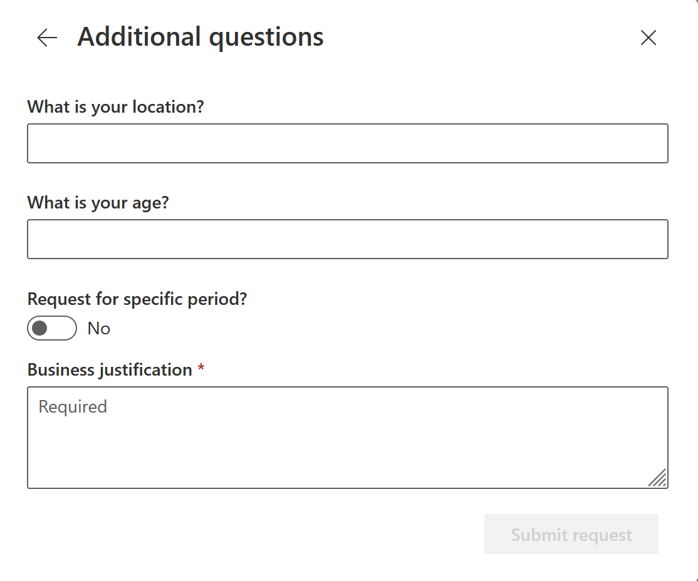
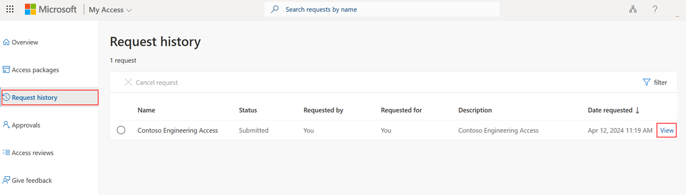
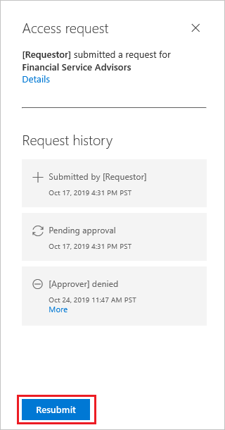
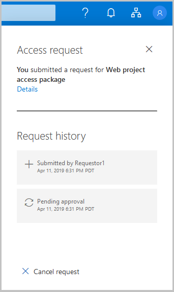

# Request access to an access package in entitlement management

With entitlement management, an access package enables a one-time setup of resources and policies that automatically administers access for the life of the access package. 

An access package manager can configure policies to require approval for users to have access to access packages. A user that needs access to an access package can submit a request to get access. This article describes how to submit an access request.

## Sign in to the My Access portal

The first step is to sign in to the My Access portal where you can request access to an access package.

**Prerequisite role:** Requestor

1. Look for an email or a message from the project or business manager you're working with. The email should include a link to the access package you need access to. The link starts with `myaccess`, includes a directory hint, and ends with an access package ID. For US Government, the domain might be `https://myaccess.microsoft.us` instead.
 
    `https://myaccess.microsoft.com/@<directory_hint>#/access-packages/<access_package_id>`
    > [!NOTE]
    > When signing into My Access via your directory hint link, you will be required to reauthenticate with your login credentials.

1. Open the link.

1. Sign in to the My Access portal.

    Be sure you use your organizational (work or school) account. If you're unsure, check with your project or business manager.

## Request an access package

Once you find the access package in the My Access portal, you can submit a request for either yourself, or a direct employee.

**Prerequisite role:** Requestor

1. Find the access package in the list. If necessary, you can search by typing a search string. You can search by name, description, or resources.
 
1. To request access, you can either select the row or select **Request**.

1. On the **Request details** pane select whether or not you are requesting the access package for yourself, or a direct employee.
    :::image type="content" source="media/entitlement-management-request-behalf/manager-request-package.png" alt-text="Screenshot of manager requesting package.":::
1. Review the details of the access package, then select **Continue**.

1. You might have to answer questions and provide business justification for your request. If there are questions that you need to answer, type in your responses in the fields.

1. If the **Business justification** box is displayed, type a justification for needing access.

1. Set the **Request for specific period?** toggle to request access to the access package for a set duration of time:

    1. If you don't need access for a specific period, set the **Request for specific period?** toggle to **No**.

    1. If you need access for a certain time period, set the **Request for specific period?** toggle to **Yes**. Then, specify the start date and end date for access.

        

1. When finished, select **Submit request** to submit your request.

1. Select **Request history** to see a list of your requests and the status.

    If the access package requires approval, the request is now in a pending approval state.

### Select a policy

If you request access to an access package that has multiple policies that apply, you might be asked to select a policy. For example, an access package manager might configure an access package with two policies for two groups of employees. The first policy might allow access for 60 days and require approval. The second policy might allow access for two days and not require approval. If you encounter this scenario, you must select the policy you want to use.

### Fill out requestor information

You can request access to an access package that requires business justification and extra requestor information before granting you access to the access package. Fill out all the requestor information required to access the access package.

If you are a manager requesting access on behalf of an employee, keep in mind that you'll be filling out the requestor information section on behalf of the employee, as well:

:::image type="content" source="media/entitlement-management-request-behalf/manager-request-questions.png" alt-text="Screenshot of manager requesting question.":::

For more information on this process, see: [Request access packages on-behalf-of other users  (Preview)](entitlement-management-request-behalf.md)

> [!NOTE]
> You might notice that some of the additional requestor information has pre-populated values. This generally occurs if your account already has attribute information set, either from a previous request or other process. These values can be editable or not depending on the settings of the policy selected.

## Resubmit a request

When you request access to an access package, your request might be denied or your request might expire if approvers don't respond in time. If you need access, you can try again and resubmit your request. The following procedure explains how to resubmit an access request:

**Prerequisite role:** Requestor

1. Sign in to the **My Access** portal.

1. Select **Request history** from the navigation menu to the left.

1. Find the access package for which you're resubmitting a request.

1. Select the check mark to select the access package.

1. Select the blue **View** link of the selected access package.
    
    

    A pane opens with the request history for the access package.
    
    

1. Select the **Resubmit** button at the bottom of the pane.

## Cancel a request

If you submit an access request and the request is still in the **pending approval** state, you can cancel the request.

**Prerequisite role:** Requestor

1. In the My Access portal, select **Request history** to see a list of your requests and the status.

1. Select the **View** link for the request you want to cancel.

1. If the request is still in the **pending approval** state, you can select **Cancel request** to cancel the request.

    

1. Select **Request history** to confirm the request was canceled.

## Next steps

- [Approve or deny access requests](entitlement-management-request-approve.md)
- [Request process and email notifications](entitlement-management-process.md)
