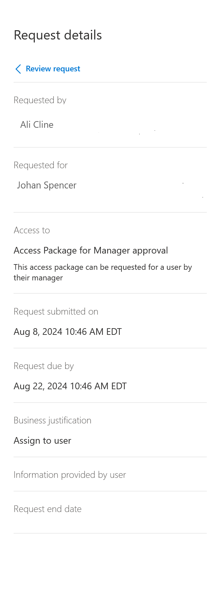

# Approve or deny access requests in entitlement management

With  entitlement management, you can configure policies to require approval for access packages, and choose one or more approvers. This article describes how designated approvers can approve or deny requests for access packages.

## Open request

The first step to approve or deny access requests is to find and open the access request pending approval. There are two ways to open the access request.

**Prerequisite role:** Approver

1. Look for an email from Microsoft Azure that asks you to approve or deny a request. Here's an example email:

    

1. Select the **Approve or deny request** link to open the access request.

1. Sign in to the My Access portal.

If you don't have the email, you can find the access requests pending your approval by following these steps.

1. Sign in to the My Access portal at [https://myaccess.microsoft.com](https://myaccess.microsoft.com). For US Government, the domain in the My Access portal link is `myaccess.microsoft.us`.

1. In the left menu, select **Approvals** to see a list of access requests pending approval.

1. On the **Pending** tab, find the request.

> [!NOTE]
> If you dont see an email to approve request, make sure that the access package does not have notifications disabled.

## View requestor's answers to questions

1. Navigate to the **Approvals** tab in My Access.

1. Go to the request you'd like to approve and select **details**. You can also select **Approve** or **Deny** if you're ready to make a decision.

1. Select **Request details**.

    

1. On the **Request details** page, basic information about the request are present such as who made the request, and whether it was for themselves or for someone else. See [Request access package on-behalf-of other users(Preview)](entitlement-management-request-behalf.md) for more details on requesting access for other users.

1. The information provided by the requestor is at the bottom of the panel.

    

1. Based on the information the requestor provided, you can then approve or deny the request. See the steps in Approve or deny request for guidance.

## Approve or deny request

After you open an access request pending approval, you can see details that will help you make an approve or deny decision.

**Prerequisite role:** Approver

1. Select the **View** link to open the Access request pane.

1. Select **Details** to see details about the access request.

    The details include the user's name, organization, access start and end date if provided, business justification, when the request was submitted, and when the request expires.

1. Select **Approve** or **Deny**.

1. If necessary, enter a reason.

    

1. Select **Submit** to submit your decision.

    If a policy is configured with multiple approvers in a stage, only one approver needs to make a decision about the pending approval. After an approver submits their decision to the access request, the request is completed and is no longer available for the other approvers to approve or deny the request. The other approvers can see the request decision and the decision maker in their My Access portal.

    If none of the configured approvers in a stage are able to approve or deny the access request, the request expires after the configured request duration. The user gets notified that their access request has expired, and that they need to resubmit the access request.

## Revoke a request (preview)

Users with Microsoft Entra ID Governance can undo their approval for an access request that they previously approved. This will revoke the approval and the requestor will no longer have access to the access package. 

**Prerequisite role:** Approver with Microsoft Entra ID Governance license

1. In My Access, select **Approvals** > **History**.

2. Select an approved request that you'd like to revoke the decision for.

3. Select **Remove** to remove the user's access to the access package. Include a reason for why you are revoking your decision.

4. Select **Remove** to submit your decision. 

## Next steps

- [Request access to an access package](entitlement-management-request-access.md)
- [Request process and email notifications](entitlement-management-process.md)
