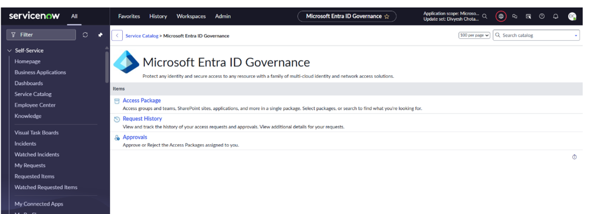
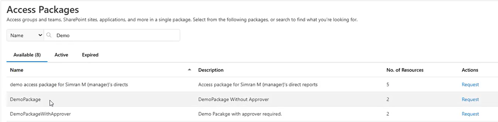
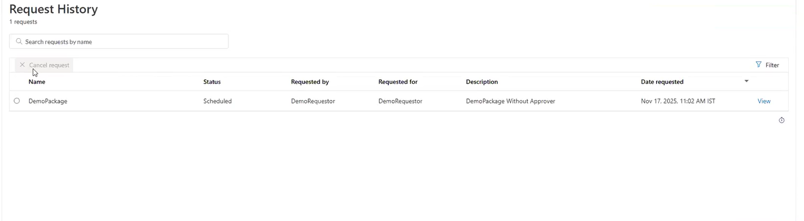
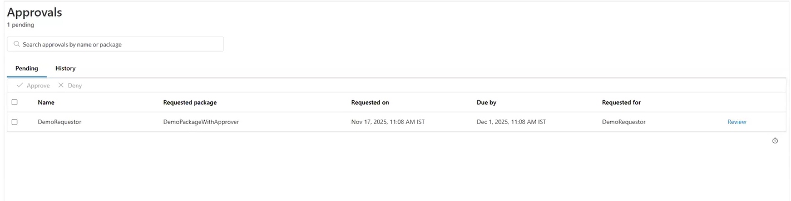

# Microsoft Entra ID Entitlement Management integration with ServiceNow

## Overview

Microsoft Entra ID Entitlement Management integrates with ServiceNow, providing an alternative portal where users can request access packages, view request history, and approve or deny requests when they're designated as approvers.

Microsoft Entra ID Entitlement Management remains the system of record. Administrators create and manage catalogs, access packages, assignment policies, requestor eligibility, approvers, and assignments in Microsoft Entra ID Entitlement Management. ServiceNow provides the end-user request and approval experience.

| **Activity** | **Where it's performed** |
| --- | --- |
| Create and manage access packages, policies, and approvers | Microsoft Entra ID Entitlement Management |
| Request an access package | ServiceNow |
| View request status and history | ServiceNow |
| Approve or deny a request | ServiceNow |

## Licensing requirements

A Microsoft Entra ID P2 or Microsoft Entra Suite license is required to use this integration.

> [!NOTE]
> Access packages and policies are created and managed in Microsoft Entra ID Entitlement Management, not in ServiceNow.

## Install and configure

Install the application from the [Microsoft Entra ID Governance - ServiceNow Store](https://store.servicenow.com/store/app/9c8ca6a087c80fd4a6c6fc48cebb3560).

For installation and configuration instructions, see the [Microsoft Entra ID Governance Integration with ServiceNow Installation Guide](https://store.servicenow.com/api/sn_store/v1/store/attachment/9837597d97428f503fa8b84bf253af41) under **Links and Documents** on the ServiceNow Store page.

## Available functionality in ServiceNow

In ServiceNow, open **Service Catalog** > **Microsoft Entra ID Governance**. The **Access Package** and **Request History** options are available to requestors, while **Approvals** is available to designated approvers.

*Figure 1. Microsoft Entra ID Governance application in ServiceNow.*

## Request an access package

Select **Access Package**, open the **Available** tab, choose an access package, provide the information required by its assignment policy, and submit the request. Use the **Active** and **Expired** tabs to view current and past access.

*Figure 2. Access Packages page in ServiceNow.*

## View access package request history

Select **Request History** to view submitted requests and their current status. Select **View** to open additional request details.

*Figure 3. Request History page in ServiceNow.*

## Approve or deny an access package request

Select **Approvals**, then select **Review** to open a request assigned to you. Review the details, and select **Approve** or **Deny**.

*Figure 4. Approvals page in ServiceNow.*
