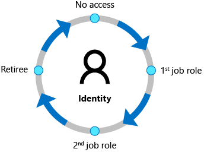

# What is Microsoft Entra ID Governance?

[Microsoft Entra ID Governance](https://www.microsoft.com/security/business/identity-access/microsoft-entra-id-governance) is an identity governance solution that enables organizations to improve productivity, strengthen security and more easily meet compliance and regulatory requirements. You can use Microsoft Entra ID Governance to automatically ensure that the right people have the right access to the right resources. This is achieved through identity and access process automation, delegation to business groups, and increased visibility. With features in Microsoft Entra ID Governance and related Microsoft products, you can mitigate identity and access risks by protecting, monitoring, and auditing access to critical assets.

Specifically, Microsoft Entra ID Governance helps organizations address these four key questions, for access across services and applications both on-premises and in clouds:

- Which users should have access to which resources?
- What are those users doing with that access?
- Are there organizational controls in place for managing access?
- Can auditors verify that the controls are working effectively?

With Microsoft Entra ID Governance you can implement the following scenarios for employees, business partners and vendors:

- Govern the identity lifecycle
- Govern the access lifecycle
- Secure privileged access for administration

## Identity lifecycle

Identity Governance helps organizations achieve a balance between *productivity* - How quickly can a person have access to the resources they need, such as when they join my organization? And *security* - How should their access change over time, such as due to changes to that person's employment status? Identity lifecycle management is the foundation for Identity Governance, and effective governance at scale requires modernizing the identity lifecycle management infrastructure for applications.

For many organizations, identity lifecycle for employees and other workers is tied to the representation of that person in an HCM (human capital management) or HR system. Organizations need to automate the process of creating an identity for a new employee that is based on a signal from that system so that the employee can be productive on day 1. And organizations need to ensure those identities and access are removed when the employee leaves the organization.

In Microsoft Entra ID Governance, you can [automate the identity lifecycle](https://youtu.be/NxSu3JEsxmY?si=fuY8nV4Fg5DbMArd) for these individuals using:

- [inbound provisioning from your organization's HR sources](../identity/app-provisioning/plan-cloud-hr-provision.md), including retrieving from Workday and SuccessFactors, to automatically maintain user identities in both Active Directory and Microsoft Entra ID.
- [lifecycle workflows](what-are-lifecycle-workflows.md) to automate workflow tasks that run at certain key events, such before a new employee is scheduled to start work at the organization, as they change status during their time in the organization, and as they leave the organization. For example, a workflow can be configured to send an email with a temporary access pass to a new user's manager, or a welcome email to the user, on their first day.
- [automatic assignment policies in entitlement management](entitlement-management-access-package-auto-assignment-policy.md) to add and remove a user's group memberships, application roles, and SharePoint site roles, based on changes to the user's attributes.
- [user provisioning](what-is-provisioning.md) to create, update, and remove user accounts in other applications, with connectors to [hundreds of cloud and on-premises applications](apps.md) via SCIM, LDAP and SQL.

Organizations also need additional identities, for partners, suppliers and other guests, to enable them to collaborate or have access to resources.

In Microsoft Entra ID Governance, you can enable business groups to determine which of these guests should have access, and for how long, using:

- [entitlement management](entitlement-management-overview.md) in which you can specify the other organizations whose users are allowed to request access to your organization's resources. When one of the users's request is approved, they're automatically added by entitlement management as a [B2B](../external-id/what-is-b2b.md) guest to your organization's directory. Then, they're assigned appropriate access. Entitlement management automatically removes the B2B guest user from your organization's directory when their access rights expire or are revoked.
- [access reviews](access-reviews-overview.md) that automates recurring reviews of existing guests already in your organization's directory, and removes those users from your organization's directory when they no longer need access.

For more information, see [Govern the employee and guest lifecycle](scenarios/govern-the-employee-lifecycle.md).

## Access lifecycle

Organizations need a process to manage access beyond what was initially provisioned for a user when that user's identity was created.  Furthermore, enterprise organizations need to be able to scale efficiently to be able to develop and enforce access policy and controls on an ongoing basis.

With Microsoft Entra ID Governance, IT departments can establish which access rights users should have across various resources. They can also determine necessary enforcement checks, such as separation of duties or access removal on job change are necessary. Microsoft Entra ID has connectors to [hundreds of cloud and on-premises applications](apps.md). You can integrate your organization's other apps that rely upon [AD groups](entitlement-management-group-writeback.md), [other on-premises directories](../identity/app-provisioning/on-premises-ldap-connector-configure.md) or [databases](../identity/app-provisioning/on-premises-sql-connector-configure.md), that have a [SOAP or REST API](../identity/app-provisioning/on-premises-web-services-connector.md) including [SAP](sap.md), or that implement standards such as [SCIM](../identity/app-provisioning/use-scim-to-provision-users-and-groups.md), SAML or OpenID Connect. When a user attempts to sign into to one of those applications, Microsoft Entra ID enforces [Conditional Access](../identity/conditional-access/index.yml) policies. For example, Conditional Access policies can include displaying a [terms of use](../identity/conditional-access/terms-of-use.md) and [ensuring the user has agreed to those terms](../identity/conditional-access/policy-all-users-require-terms-of-use.md) prior to being able to access an application. For more information, see [govern access to applications in your environment](identity-governance-applications-prepare.md), including how to [define organizational policies for governing access to applications](identity-governance-applications-define.md), [integrate applications](identity-governance-applications-integrate.md), and [deploy policies](identity-governance-applications-deploy.md).

Access changes across apps and groups can be automated based on attribute changes. [Microsoft Entra lifecycle workflows](create-lifecycle-workflow.md) and [Microsoft Entra entitlement management](entitlement-management-overview.md) automatically adds and removes users into groups or access packages, so that access to applications and resources is updated. Users can also be moved when their condition within the organization changes to different groups, and can even be removed entirely from all groups or access packages.

Organizations that previously had been using an on-premises identity governance product can [migrate their organizational role model](identity-governance-organizational-roles.md) to Microsoft Entra ID Governance.

Furthermore, IT can delegate access management decisions to business decision makers. For example, employees that wish to access confidential customer data in a company's marketing application in Europe could need approval from their manager, a department lead or resource owner, and a security risk officer.  [Entitlement management](entitlement-management-overview.md) enables you to define how users request access across packages of group and team memberships, app roles, and SharePoint Online roles, and enforce separation of duties checks on access requests.

 Organizations can also control which guest users have access, including to [on-premises applications](../external-id/hybrid-cloud-to-on-premises.md). These access rights can then be regularly reviewed using recurring [Microsoft Entra access reviews](access-reviews-overview.md) for access recertification.

## Privileged access lifecycle

 Governing privileged access is a key part of modern Identity Governance especially given the potential for misuse associated with administrator rights can cause to an organization. The employees, vendors, and contractors that take on administrative rights need to have their accounts and privileged access rights governed.

[Microsoft Entra Privileged Identity Management (PIM)](../id-governance/privileged-identity-management/pim-configure.md) provides additional controls tailored to securing access rights for resources, across Microsoft Entra, Azure, other Microsoft Online Services and other applications. The just-in-time access, and role change alerting capabilities provided by Microsoft Entra PIM, in addition to multifactor authentication and Conditional Access, provide a comprehensive set of governance controls to help secure your organization's resources (directory roles, Microsoft 365 roles, Azure resource roles and group memberships). As with other forms of access, organizations can use access reviews to configure recurring access re-certification for all users in privileged administrator roles.

## License requirements
[!INCLUDE [active-directory-entra-governance-license.md](../includes/entra-entra-governance-license.md)]

## Getting started

Check out the [Prerequisites before configuring Microsoft Entra ID for identity governance](identity-governance-applications-prepare.md). Then, visit the [Governance dashboard](https://entra.microsoft.com/#view/Microsoft_Azure_IdentityGovernance/Dashboard.ReactView) in the Microsoft Entra admin center to start using entitlement management, access reviews, lifecycle workflows and Privileged Identity Management.

There are also tutorials for [managing access to resources in entitlement management](entitlement-management-access-package-first.md), [onboarding external users to Microsoft Entra ID through an approval process](entitlement-management-onboard-external-user.md), [governing access to your applications](identity-governance-applications-prepare.md) and the [application's existing users](identity-governance-applications-existing-users.md).

While each organization may have its own unique requirements, the following configuration guides also provide the baseline policies Microsoft recommends you follow to ensure a more secure and productive workforce.

- [Plan an access reviews deployment to manage resource access lifecycle](deploy-access-reviews.md)
- [Zero Trust identity and device access configurations](/microsoft-365/enterprise/microsoft-365-policies-configurations)
- [Securing privileged access](../identity/role-based-access-control/security-planning.md)

You may also wish to engage with one of Microsoft's [services and integration partners](services-and-integration-partners.md) to plan your deployment or integrate with the applications and other systems in your environment.

If you have any feedback about Identity Governance features, select **Got feedback?** in the Microsoft Entra admin center to submit your feedback. The team regularly reviews your feedback.

## Simplifying identity governance tasks with automation

Once you've started using these identity governance features, you can easily automate common identity governance scenarios. The following table shows how to get started with automation for each scenario:

| Scenario to automate | Automation guide |
| ------- | --------------------- |
| Creating, updating and deleting AD and Microsoft Entra user accounts automatically for employees |[Plan cloud HR to Microsoft Entra user provisioning](../identity/app-provisioning/plan-cloud-hr-provision.md)|
| Updating the membership of a group, based on changes to the member user's attributes | [Create a dynamic group](../identity/users/groups-create-rule.md)|
| Assigning licenses | [group-based licensing](../identity/users/licensing-groups-assign.md) |
| Adding and removing a user's group memberships, application roles, and SharePoint site roles, based on changes to the user's attributes | [Configure an automatic assignment policy for an access package in entitlement management](entitlement-management-access-package-auto-assignment-policy.md)|
| Adding and removing a user's group memberships, application roles, and SharePoint site roles, on a specific date | [Configure lifecycle settings for an access package in entitlement management](entitlement-management-access-package-lifecycle-policy.md)|
| Running custom workflows when a user requests or receives access, or access is removed | [Trigger Logic Apps in entitlement management](entitlement-management-logic-apps-integration.md) |
| Regularly having memberships of guests in Microsoft groups and Teams reviewed, and removing guest memberships that are denied |[Create an access review](create-access-review.md) |
| Removing guest accounts that were denied by a reviewer |[Review and remove external users who no longer have resource access](access-reviews-external-users.md) |
| Removing guest accounts that have no access package assignments |[Manage the lifecycle of external users](entitlement-management-external-users.md#manage-the-lifecycle-of-external-users) |
| Provisioning users into on-premises and cloud applications that have their own directories or databases | [Configure automatic user provisioning](../identity/app-provisioning/user-provisioning.md) with user assignments or [scoping filters](../identity/app-provisioning/define-conditional-rules-for-provisioning-user-accounts.md) |
| Other scheduled tasks | [Automate identity governance tasks with Azure Automation](identity-governance-automation.md) and Microsoft Graph via the [Microsoft.Graph.Identity.Governance](https://www.powershellgallery.com/packages/Microsoft.Graph.Identity.Governance/) PowerShell module|

## Next steps

- [What are identity governance use cases?](scenarios/identity-governance-use-cases.md)
- [Understanding least privileged](scenarios/least-privileged.md)
- [Govern the employee and guest lifecycle](scenarios/govern-the-employee-lifecycle.md)
- [Govern access for applications in your environment](identity-governance-applications-prepare.md)
- [Microsoft Entra ID Governance Overview video](https://youtu.be/NxSu3JEsxmY?si=fuY8nV4Fg5DbMArd)
