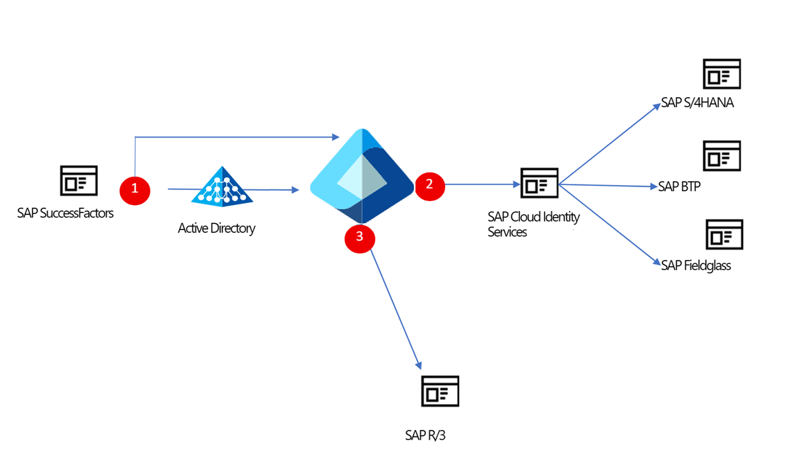
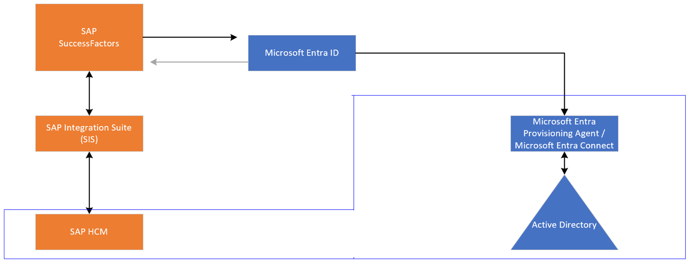

# Manage access to your SAP applications

SAP software and services likely runs critical functions, such as HR and ERP, for your organization. At the same time, your organization relies on Microsoft for various Azure services, Microsoft 365, and Microsoft Entra ID Governance for managing access to applications. This article describes how you can use Identity Governance to manage identities across your SAP applications.

## Migrate from SAP Identity Management

If you've been using SAP Identity Management (IDM), then you can migrate identity management scenarios from SAP IDM to Microsoft Entra. For more information, see [Migrate identity management scenarios from SAP IDM to Microsoft Entra](~/identity/app-provisioning/migrate-from-sap-idm.md).

## Bring identities from HR into Microsoft Entra ID

The tutorial [plan deploying Microsoft Entra for user provisioning with SAP source and target apps](~/identity/app-provisioning/plan-sap-user-source-and-target.md) illustrates how to connect Microsoft Entra with authoritative sources for the list of workers in an organization, such as SAP SuccessFactors. It also shows you how to use Microsoft Entra to set up identities for those workers. Then you learn how to use Microsoft Entra to provide workers with access to sign in to one or more SAP applications, such as SAP ECC or SAP S/4HANA.

### SuccessFactors

Customers who use SAP SuccessFactors can easily bring identities [from SuccessFactors into Microsoft Entra ID](../identity/saas-apps/sap-successfactors-inbound-provisioning-cloud-only-tutorial.md) or [from SuccessFactors into on-premises Active Directory](../identity/saas-apps/sap-successfactors-inbound-provisioning-tutorial.md) by using native connectors. The connectors support the following scenarios:

* **Hiring new employees**: When a new employee is added to SuccessFactors, a user account is automatically created in Microsoft Entra ID and optionally Microsoft 365 and [other software as a service (SaaS) applications that Microsoft Entra ID supports](../identity/app-provisioning/user-provisioning.md). This process includes write-back of the email address to SuccessFactors.
* **Employee attribute and profile updates**: When an employee record is updated in SuccessFactors (such as name, title, or manager), the employee's user account is automatically updated in Microsoft Entra ID and optionally Microsoft 365 and other SaaS applications that Microsoft Entra ID supports.
* **Employee terminations**: When an employee is terminated in SuccessFactors, the employee's user account is automatically disabled in Microsoft Entra ID and optionally Microsoft 365 and other SaaS applications that Microsoft Entra ID supports.
* **Employee rehires**: When an employee is rehired in SuccessFactors, the employee's old account can be automatically reactivated or reprovisioned (depending on your preference) to Microsoft Entra ID and optionally Microsoft 365 and other SaaS applications that Microsoft Entra ID supports.

You can also [write back from Microsoft Entra ID to SAP SuccessFactors](../identity/saas-apps/sap-successfactors-writeback-tutorial.md).

> [!VIDEO https://www.youtube-nocookie.com/embed/66v2FR2-QrY]

### SAP HCM

Customers who still use SAP Human Capital Management (HCM) can also bring identities into Microsoft Entra ID. By using SAP Integration Suite, you can synchronize lists of workers between SAP HCM and SAP SuccessFactors. From there, you can bring identities directly into Microsoft Entra ID or provision them into Active Directory Domain Services by using the native provisioning integrations mentioned earlier.

## Provide access to SAP applications

In addition to the native provisioning integrations that allow you to manage access to your SAP applications, Microsoft Entra ID supports a rich set of integrations with those applications.

### Enable SSO

Along with setting up provisioning for your SAP applications, you can enable SSO for them. Microsoft Entra ID can serve as the identity provider and serve as the authentication authority for your SAP applications. Microsoft Entra ID can integrate with [SAP NetWeaver using SAML or OAuth](../identity/saas-apps/sap-netweaver-tutorial.md). For SAP SaaS and modern apps, [learn how to configure Microsoft Entra ID as the corporate identity provider for your SAP applications via SAP Cloud Identity Services](https://help.sap.com/docs/IDENTITY_AUTHENTICATION/6d6d63354d1242d185ab4830fc04feb1/058c7b14209f4f2d8de039da4330a1c1.html).

For more information on how to configure single sign-on from Microsoft Entra ID, see the following documentation and tutorials:

- [SAP Cloud Identity Services](../identity/saas-apps/sap-hana-cloud-platform-identity-authentication-tutorial.md)
- [SAP SuccessFactors](../identity/saas-apps/successfactors-tutorial.md)
- [SAP Analytics Cloud](../identity/saas-apps/sapboc-tutorial.md)
- [SAP Fiori](../identity/saas-apps/sap-fiori-tutorial.md)
- [SAP Ariba](../identity/saas-apps/ariba-tutorial.md)
- [SAP Concur Travel and Expense](../identity/saas-apps/concur-travel-and-expense-tutorial.md)
- [SAP Business Technology Platform](../identity/saas-apps/sap-hana-cloud-platform-tutorial.md)
- [SAP Business ByDesign](../identity/saas-apps/sapbusinessbydesign-tutorial.md)
- [SAP HANA](../identity/saas-apps/saphana-tutorial.md)
- [SAP Cloud for Customer](../identity/saas-apps/sap-customer-cloud-tutorial.md)
- [SAP Fieldglass](../identity/saas-apps/fieldglass-tutorial.md)

Also see the following blog posts and SAP resources:

- SAP GUI MFA with Microsoft Entra [integration with SAP Secure Login Service](https://community.sap.com/t5/technology-blogs-by-members/sap-gui-mfa-with-microsoft-entra-part-i-integration-with-sap-secure-login/ba-p/13605383) and [integration with Microsoft Entra Private Access](https://community.sap.com/t5/technology-blogs-by-members/sap-gui-mfa-with-microsoft-entra-part-ii-integration-with-microsoft-entra/ba-p/13691141)
- [Managing access to SAP BTP](https://community.sap.com/t5/technology-blogs-by-members/identity-and-access-management-with-microsoft-entra-part-i-managing-access/ba-p/13873276)
- [Azure Application Gateway setup of SAML Single Sign On for Public and Internal SAP URLs](https://blogs.sap.com/2020/12/10/sap-on-azure-single-sign-on-configuration-using-saml-and-azure-active-directory-for-public-and-internal-urls/)
- [Single sign on using Microsoft Entra Domain Services and Kerberos](https://blogs.sap.com/2018/08/03/your-sap-on-azure-part-8-single-sign-on-using-azure-ad-domain-services/)

### Provision identities into modern SAP applications

After your users are in Microsoft Entra ID, you can provision accounts into the various SaaS and on-premises SAP applications that they need access to. You have two ways to accomplish this:

- Use the [SAP Cloud Identity Services](../identity/saas-apps/sap-cloud-platform-identity-authentication-provisioning-tutorial.md) enterprise application in Microsoft Entra ID to provision identities into SAP Cloud Identity Services. After you bring all the identities into SAP Cloud Identity Services, you can use SAP Cloud Identity Services - Identity Provisioning to provision the accounts from there into your applications when required.
- Use the [SAP Cloud Identity Services - Identity Provisioning](https://help.sap.com/docs/IDENTITY_PROVISIONING/f48e822d6d484fa5ade7dda78b64d9f5/f2b2df8a273642a1bf801e99ecc4a043.html) integration to directly export identities from Microsoft Entra ID into [SAP Cloud Identity Services integrated applications](https://help.sap.com/docs/IDENTITY_PROVISIONING/f48e822d6d484fa5ade7dda78b64d9f5/ab3f641552464c79b94d10b9205fd721.html). When you're using SAP Cloud Identity Services - Identity Provisioning to bring users into those applications, all provisioning configuration for those applications is managed in SAP directly. You can still use the enterprise application in Microsoft Entra ID to manage SSO and use [Microsoft Entra ID as the corporate identity provider](https://help.sap.com/docs/IDENTITY_AUTHENTICATION/6d6d63354d1242d185ab4830fc04feb1/058c7b14209f4f2d8de039da4330a1c1.html).

### Provision identities into on-premises SAP systems

Once you have users in Microsoft Entra ID, you can provision those users from Microsoft Entra ID to SAP Cloud Identity Services or SAP ECC, to enable them to sign in to SAP applications. If you have [`SAP S/4HANA On-premise`](https://help.sap.com/docs/identity-provisioning/identity-provisioning/target-sap-s-4hana-on-premise), then provision users from Microsoft Entra ID to SAP Cloud Identity Directory. SAP Cloud Identity Services then provisions the users originating from Microsoft Entra ID that are in the SAP Cloud Identity Directory into the downstream SAP applications to SAP S/4HANA On-Premise through the SAP cloud connector.

Customers who have yet to transition from applications such as  SAP R/3 and SAP ERP Central Component (SAP ECC) to SAP S/4HANA can still rely on the Microsoft Entra provisioning service to provision user accounts. Within SAP R/3 and SAP ECC, you expose the necessary Business Application Programming Interfaces (BAPIs) for creating, updating, and deleting users. Within Microsoft Entra ID, you have two options:

* Use the lightweight Microsoft Entra provisioning agent and [web services connector](../identity/app-provisioning/on-premises-web-services-connector.md) to [provision users into apps such as SAP ECC](../identity/app-provisioning/on-premises-sap-connector-configure.md).
* In scenarios where you need to do more complex group and role management, use [Microsoft Identity Manager](/microsoft-identity-manager/reference/microsoft-identity-manager-2016-ma-ws) to manage access to your legacy SAP applications.

You can also use Microsoft Entra ID to provision workers into Active Directory, as well as other on-premises systems that SAP Cloud Identity Services doesn't support for provisioning.

## Trigger custom workflows

When a new employee is hired in your organization, you might need to trigger a workflow within your SAP on-premises systems for additional tasks beyond user provisioning. By using the [Microsoft Entra lifecycle workflows Logic Apps extensibility](lifecycle-workflow-extensibility.md), or the [Microsoft Entra entitlement management Logic Apps extensibility](entitlement-management-logic-apps-integration.md) with the [SAP connector in Azure Logic Apps](/azure/logic-apps/logic-apps-using-sap-connector), you can trigger custom actions in SAP upon hiring a new employee.

## Check for separation of duties

With separation-of-duties checks in Microsoft Entra [entitlement management](https://techcommunity.microsoft.com/t5/azure-active-directory-identity/ensure-compliance-using-separation-of-duties-checks-in-access/ba-p/2466939), customers can ensure that users don't take on excessive access rights:

* Admins and access managers can prevent users from requesting extra access packages if they're already assigned to other access packages or are a member of other groups that are incompatible with the requested access.
* Enterprises with critical regulatory requirements for SAP apps have a single consistent view of access controls. They can then enforce separation-of-duties checks across their financial and other business-critical applications, along with Microsoft Entra integrated applications.
* With Microsoft Entra integrations to [SAP access governance](https://learning.sap.com/learning-journeys/exploring-the-fundamentals-of-sap-system-security/discussing-access-governance-integration-scenarios-ac-iag-), to [Pathlock](https://pathlock.com/applications/microsoft-entra-id-governance/) and to other partner products, customers can take advantage of additional risk and fine-grained separation-of-duties checks enforced in those products, with access packages in Microsoft Entra ID Governance.

## Additional guidance

For more information about SAP integrations with Microsoft Entra ID, see the following documentation:

- [Secure access with SAP Cloud Identity Services and Microsoft Entra ID](../fundamentals/scenario-azure-first-sap-identity-integration.md)
- [SAP workload security - Microsoft Azure Well-Architected Framework](/azure/architecture/framework/sap/security)
- [Services and integration partners for deploying Microsoft Entra with SAP applications](~/identity/app-provisioning/migrate-from-sap-idm.md#services-and-integration-partners-for-deploying-microsoft-entra-with-sap-applications)

## Next steps

* [Plan deploying Microsoft Entra for user provisioning with SAP source and target apps](~/identity/app-provisioning/plan-sap-user-source-and-target.md)
* [Bring identities from SAP SuccessFactors into Microsoft Entra ID](../identity/saas-apps/sap-successfactors-inbound-provisioning-cloud-only-tutorial.md)
* [Provision accounts in SAP Cloud Identity Services](../identity/saas-apps/sap-cloud-platform-identity-authentication-provisioning-tutorial.md)
* [Get started with SAP and Microsoft integration scenarios](/azure/sap/workloads/integration-get-started)
