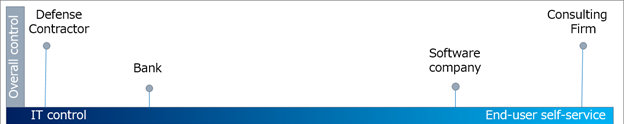
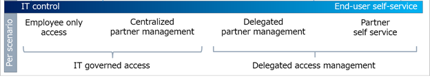

# Planning new governance scenarios for business partners and external users

The following documentation will guide you through creating and deploying business partner and external user scenarios.

:::zone pivot="identity-governance-guest-overview"

## Overview: An overview of business partner and external user scenarios
Typically all business processes, at some point, require work with partners, contractors, or vendors. In order to facilitate this work, business partners and external users may need access to your organization. Business planning with regard to partners, vendors and external users involves designing and implementing technology solutions that enable effective collaboration, integration, and alignment of goals between your organization and the partners. 

Microsoft defines the following personae based on their relationship with your organization.

- **Workforce.** Your full-time employees, part-time employees, or contractors for your organization.
- **Business partners.** Organizations that have a business relationship with your enterprise. These organizations can include suppliers, vendors, consultants, and strategic alliances who collaborate with your enterprise to achieve mutual goals.
- **External user.** Users that are external to your organization such as business partners and consumers.

### Business processes and business partner and external user scenario examples
Guest Scenarios or external access scenarios are specific use cases where business partners or external users interact with the organization’s resources and need to be represented in one of the organization's Microsoft Entra tenants. These scenarios stretch across almost every aspect of business processes.

Consider each of the following business processes and the examples of how partner planning and interaction come into play. The following table provides a breakdown of these processes and example scenarios that involve business partners and external users.

|Business Process|Definition|Business Partner and External User Example|
|-----|-----|-----|
|Business Process Management|A systematic approach to improving an organization’s workflows and operations.|A financial services company that partners with a credit scoring agency to streamline the loan approval process.|
|Integrated Business Planning|A holistic approach that aligns an organization’s strategic goals, operational plans, and financial forecasts to create a cohesive, unified framework for decision-making.|The retail company shares sales forecasts and inventory levels with suppliers through an integrated planning platform.|
|Customer Relations Management|A strategic approach and system for managing an organization’s interactions with its customers.|An automobile company in coordinating, supporting, and optimizing their interactions with dealerships.| 
|Supply Chain Orchestration|Coordinated management of all supply chain processes to ensure efficiency, visibility, and responsiveness across all stages, from procurement to delivery.|Any company that has a supply chain and needs to coordinate with suppliers and vendors.|
|Business Partner Account Lifecycle|The end-to-end process of managing the relationships and interactions between an organization and its external business partners.|a technology company that partners with a software vendor to enhance its product offerings.|
|B2B Collaboration with Other Organizations|Strategic partnership between two or more businesses to achieve common objectives through shared resources, information, and efforts.|A local coffee shop that collaborates with a bakery to enhance both businesses' offerings.|

Understanding your scenario helps in designing appropriate access controls and ensuring smooth collaboration with external individuals. 

## Areas of a new governance scenario for business partners and external users
A new business partner and external user solution typically involve the following areas. They are:

:::image type="content" source="media/external-guest-new/govern-access-1.png" alt-text="Conceputal drawing of governing access to your resources." lightbox="media/external-guest-new/govern-access-1.png":::

- **Discover your business requirements** - Identify your current lifecycle and governance processes for external identities. This exercise will help you to determine applicable scenarios, feasibility and scope.
- **Determine your security posture** - As you consider the governance of external access, assess your organization's security and collaboration needs, by scenario.
- **Onboarding of business partners and external users** - Onboarding, with regard to guest or external identities, is the process or processes of getting these identities set up in your organizations systems. 
- **Offboarding business partners and external users** - Offboarding, with regard to guest or external identities, is the process or processes of getting these identities removed from your organizations systems. 

## License Requirements 

Using some of the below features mentioned requires Microsoft Entra ID Governance or Microsoft Entra Suite licenses. To find the right license for your requirements, see [Microsoft Entra ID Governance licensing fundamentals](../licensing-fundamentals.md)

:::zone-end

:::zone pivot="identity-governance-guest-discover"

## Discovery: Identify current lifecycle and governance processes for business partners and external users 
Identify your current lifecycle and governance processes for external identities. This exercise will help you to determine applicable scenarios, feasibility and scope. 

Review the [Govern the employee and guest lifecycle with Microsoft Entra ID Governance](govern-the-employee-lifecycle.md) with emphasis on external identities. The processes covered here are also needed for guest users, suppliers and other external users, to enable them to collaborate or have access to resources. This document covers actions you can take to discover your governance processes.

Because a governance scenario for business parnters and external users uses entitlement management, you should also review [Common scenarios in entitlement management](../entitlement-management-scenarios.md). This will provide you with the common scenarios for entitlement management based on a user's role. You should consider these while planning your solution.

You can also use the following table as a guide for additional areas to consider while evaluating your current state.

|Process|Description|
|-----|-----|
|Determine who initiates external collaboration|Generally, users seeking external collaboration know the applications to use, and when access ends. Therefore, determine users with delegated permissions to invite external users, create access packages, and complete access reviews.|
|Enumerate business partners and external users|External users might be Microsoft Entra B2B users with partner-managed credentials, or external users with locally provisioned credentials. Typically, these users are the Guest UserType.|
|Discover email domains and companyName property|You can determine external organizations with the domain names of external user email addresses.|
|Use allowlist, blocklist, and entitlement management|Use the allowlist or blocklist to enable your organization to collaborate with, or block, organizations at the tenant level.|
|Determine external user access|With an inventory of external users and organizations, determine the access to grant to the users.|
|Enumerate application permissions|Investigate access to your sensitive apps for awareness about external access.|
|Detect informal sharing|If your email and network plans are enabled, you can investigate content sharing through email or unauthorized software as a service (SaaS) apps.|

For more information, see [Discover the current state of external collaboration in your organization](../../architecture/2-secure-access-current-state.md)

### Example - Identify current lifecycle and governance processes
You're the IT admin at a bustling tech company, Contoso, and often face the challenge of efficiently and securely onboarding business external users like consultants, vendors, and partners. The current onboarding process is fragmented and inconsistent, leading to security vulnerabilities and inefficiencies. To tackle this, you embark on a discovery phase to identify key requirements and understand how you could leverage Microsoft Entra.

:::image type="content" source="media/external-guest-new/discover-1.png" alt-text="Conceputal drawing of an organization." lightbox="media/external-guest-new/discover-1.png":::

Some of your key requirements include, 

 - Diverse guest onboarding needs with different departments requiring unique levels of access. 
 - Ensuring that guest users have the least privilege necessary to perform their tasks is critical and needs robust conditional access policies and multi-factor authentication to protect sensitive data. 
 - Seamless and user friendly onboarding process for both you as an IT admin, and your external users. External users should be able to quickly and easily access the resources they require without unnecessary delays. 
 - Integration with existing collaboration tools like Microsoft Teams and SharePoint, along with the option for Self-Service Sign-Up (SSSU) 
 - Capability to govern guest by regularly monitoring guest user activity, set an expiration on access and periodic access reviews ensure that guest access remains appropriate over time. For more information, see [Govern the employee and guest lifecycle with Microsoft Entra ID Governance](govern-the-employee-lifecycle.md) and [Discover the current state of external collaboration in your organization](../../architecture/2-secure-access-current-state.md)

With these key requirements in mind, here are two things to consider:
 - onboarding the external users to the tenant
 - getting the external users access to resources

There are different options depending on the business case. Let’s deep dive into onboarding of the external users and the options that are available.

:::zone-end

:::zone pivot="identity-governance-guest-secure"

## Security posture: Determine your security posture for business partners and external users

As you consider the governance of external access, assess your organization's security and collaboration needs, by scenario. You can start with the level of control the IT team has over the day-to-day collaboration of end users. Organizations in highly regulated industries might require more IT team control. 

For example:

 - Defense contractors can have a requirement to positively identify and document external users, their access, and access removal.
 - Consulting agencies can use certain features to allow end users to determine the external users they collaborate with.
 - A contractor at a bank may require more control than a contractor at a software company

 

  > [!NOTE]
  > A high degree of control over collaboration can lead to higher IT budgets, reduced productivity, and delayed business outcomes. When official collaboration channels are perceived as onerous, end users tend to evade official channels. An example is end users sending unsecured documents by email.

### Scenario-based planning

IT teams can delegate partner access to empower employees to collaborate with partners. This delegation can occur while maintaining sufficient security to protect intellectual property.

Compile and assess your organizations scenarios to help assess employee versus business partner access to resources. Financial institutions might have compliance standards that restrict employee access to resources such as account information. Conversely, the same institutions can enable delegated partner access for projects such as marketing campaigns.

  

#### Scenario considerations

Use the following list to help measure the level of access control.

- Information sensitivity, and associated risk of its exposure
- Partner access to information about other end users
- The cost of a breach versus the overhead of centralized control and end-user friction

Organizations can start with highly managed controls to meet compliance targets, and then delegate some control to end users, over time. There can be simultaneous access-management models in an organization.

### Architectural considerations
Proper security architectural design is an essential component of ensuring a secure business partner and external user scenario. You should familiarize yourself with the different types of recommended architectures while drafting your security plan. The recommended architectures that use Microsoft Identity Governance are:

  - [Workforce and collaboration-oriented architecture considerations](../../architecture/external-identity-deployment-architectures.md#workforce-and-collaboration-oriented-architecture) - enables your workforce to collaborate with business partners from external organizations. 
  - [Isolated access for business partners](../../architecture/external-identity-deployment-architectures.md#isolated-access-for-business-partners) - isolate external users from your organization's tenant

#### Suggested documentation
Finally, you should review the following documentation. Reviewing this documentation will allow you to devise and create a security plan that can be used with your business partner and exteranl user scenarios.

- [Microsoft Entra External ID deployment architectures with Microsoft Entra](../../architecture/external-identity-deployment-architectures.md)
- [Secure external Collaboration](../../architecture/1-secure-access-posture.md)
- [Plan a Microsoft Entra B2B collaboration deployment](../../architecture/secure-external-access-resources.md). 

:::zone-end

::: zone pivot="identity-governance-guest-onboard" 

## Onboard: Onboarding of business partners and external users
Onboarding of business partners and external users is a critical aspect of identity and access management, helping to maintain security, compliance, and operational efficiency within your organization. Onboarding for business partners and external users can be broken down in to the following:

1. Develop an onboarding process to add external partners. 
2. Develop an onboarding process to add external users to your systems.

### Onboarding process for business partners
The following items are a generic list of steps that one should consider when onboarding business partners from your organization.

- determine the start date for working with a business partner. 
- notify all relevant departments as to the specific start time and date.
- coordinate initiation of business partner access to all systems (portals, tools, APIs)
- Partner linked accounts are added and roles and assignments are approved

### Onboarding process for external users
The following items are a generic list of steps that one should consider when onboarding external users from your organization.

- determine the start date.
- notify IT to add individual user access to systems. This can be automated with an access package and using a self-request.
- record the onboarding steps taken.
- obtain final approvals from HR, IT, and any relevant departments, ensuring all aspects of the onboarding are complete.

## Use Entitlement management to facilitate onboarding
Entitlement management uses catalogs, access packages, and polices to: 

- Control who can get access to resources
- Give users access automatically 
- Remove a user's access
- Delegate to nonadministrators the ability to create access packages. 
- Select connected organizations whose users can request access. 

For more information, see [What is Entitlement Management?](../entitlement-management-overview.md)

### Catalog, Access Packages, and Policies
In Entitlement Management, an access package can have multiple policies, and each policy establishes how users get an assignment to the access package, and for how long. Entitlement management can be configured to onboard business partners and external users, adding their access rights and their account to your tenant. 

A typical access package may include the following:

- access to all resources associated with the package is added
- user is added to any group that is needed
- account is added to the guest user directory
- use audit logs for compliance
- notifications are sent confirming successful onboarding

A catalog is a container of resources and access packages. You can create a catalog when you want to group related resources and access packages. For instance, you may create a business partner catalog for organizations dealings with another organization such as Contoso. Inside this catalog, you can create access packages. An access package enables you to do a one-time setup of resources and policies that automatically administers access for the life of the access package. These access packages can be tailored to the various external users and partners within Contoso and for the entire Contoso org itself. For instance, you may have an access package for Contoso vendors and one for Contoso contractors and one for the Contoso organization. For more information, see [Create and manage a catalog of resources in entitlement management](../entitlement-management-catalog-create.md)

An access package enables you to do a one-time setup of resources and policies that automatically administers access for the life of the access package. All access packages must be in a container called a catalog. An access package can be used to assign access to roles of multiple resources that are in the catalog. All access packages must have at least one policy for users to be assigned to them. For more information, see [Create an access package in entitlement management](../entitlement-management-access-package-create.md)

Policies specify who can request the access package, along with approval and lifecycle settings, or how access is automatically assigned. 

For more information, see [Onboard external users with entitlement management](../entitlement-management-onboard-external-user.md)

#### Providing onboarding access to business partners and external users 
With entitlement management, you can define a policy that allows users from organizations you specify to be able to self-service an access package. That policy includes whether approval is required, whether access reviews are required, and an expiration date for the access.

For more information, see [Govern access for external users in entitlement management](../entitlement-management-external-users.md)

For a specific example, see [Tutorial - Onboard external users to Microsoft Entra ID through an approval process](../entitlement-management-onboard-external-user.md)

### Use Lifecycle Workflows to assist with onboarding tasks
Lifecycle workflows are an identity governance feature that enables organizations to manage Microsoft Entra users by automating these three basic lifecycle processes:

- **Joiner**: When an individual enters the scope of needing access. An example is a new employee joining a company or organization.
- **Mover**: When an individual moves between boundaries within an organization. This movement might require more access or authorization. An example is a user who was in marketing and is now a member of the sales organization.
- **Leaver**: When an individual leaves the scope of needing access. This movement might require the removal of access. Examples are an employee who's retiring or an employee who's terminated.

Workflows contain specific processes that run automatically against users as they move through their lifecycle. Workflows consist of [tasks](../lifecycle-workflow-tasks.md) and [execution conditions](../understanding-lifecycle-workflows.md#understanding-lifecycle-workflows).

Many of the tasks that will allow business partners and external users to get started, can be automated using lifecycle workflows. 
For more information, see [What are lifecycle workflows?](../what-are-lifecycle-workflows.md)

For more information on how you can automate these and additional tasks, see [Automate employee and guest onboarding tasks](../tutorial-onboard-custom-workflow-portal.md)

### Iterate additional resources via direct assignment
Now you may have additional requirements that need to be assigned to guest users. This can be done through the use of Access packages and entitlement management. 

For instance, you may have an access package that is assigned to your regular users and you want a similar package assigned to guest users. You can use entitlement management to assign the guest users to these access packages. See [View, add, and remove assignments for an access package in entitlement management](../entitlement-management-access-package-assignments.md)

You may opt to create a new package, not touching your exisiting one, and assign guest users to that package. For more information see:
 - [Creating an access package](../entitlement-management-access-package-create.md)
 - [Configure an automatic assignment policy for an access package in entitlement management](../entitlement-management-access-package-auto-assignment-policy.md)
 - [Change lifecycle settings for an access package in entitlement management](../entitlement-management-access-package-lifecycle-policy.md)

The sections below provide examples of various ways that you can onboard guest users

### Example - Provisioning a user using Entitlement Management
As an IT admin, you have identified a project that requires onboarding external consultants from Fabrikam to collaborate. It's important to have automated access management, approval workflows, and lifecycle management.
Using Microsoft Entra’s Entitlement Management, you create an access package that allows you to bundle multiple resources (like groups, applications, and SharePoint sites), include approval workflows ensuring that access requests are reviewed and approved by the appropriate individuals before access is granted and set time period for the access. 

You send out the invitations to the consultants, who receive emails with links to accept the access package. John, one of the consultants, follows the link, verifies his identity, and gains access to the necessary resources within minutes. The onboarding process is smooth and secure, allowing the consultants to start collaborating immediately. The project kicks off without delays, ensuring a productive partnership between Contoso and Fabrikam. 

:::image type="content" source="media/external-guest-new/user-1.png" alt-text="Conceputal drawing of invite using entitlement management." lightbox="media/external-guest-new/user-1.png":::

For more information, see:

- [Onboard external users with entitlement management](../entitlement-management-onboard.md)
- [Configure an automatic assignment policy for an access package in entitlement management](../entitlement-management-access-package-auto-assignment-policy.md)
- [Tutorial - Onboard external users to Microsoft Entra ID through an approval process](../entitlement-management-onboard-external-user.md)
- [Microsoft Entra deployment scenario - Workforce and guest onboarding, identity, and access lifecycle governance across all your apps](../../architecture/deployment-scenario-workforce-guest.md)

### Example - End User Driven Collaboration
For another design project, the design team manager asked you as the IT admin to add John Doe from Global Solutions to collaborate. The primary goal is to invite the user to join your directory and collaborate. You invite external user John as a guest user by using his email. The email invite is simple and flexible and allows you to invite users from various domains and identity providers, including social identities like Gmail or Microsoft accounts. 
John uses his own credentials to sign in securely eliminating the need for password maintenance or account lifecycle management that simplifies the onboarding process. 

:::image type="content" source="media/external-guest-new/user-2.png" alt-text="Conceputal drawing of invite using B2B." lightbox="media/external-guest-new/user-2.png":::

For more information, see [Add B2B collaboration users in the Microsoft Entra admin center](../../external-id/add-users-administrator.yml) and [Configure external collaboration settings](../../external-id/external-collaboration-settings-configure.md)

### Example - Iterate additional resources via direct assignment
Now you as an IT administrator have a requirement to bypass access requests and directly assign specific users to an access package, granting the external team instant access. You'll create the first access package assignment policy in the access package. You review the access package’s policies to confirm that it permits external users to be added directly. 

With everything in place, Emma moved to the assignments tab. She entered the email addresses of the external team members, ensuring they were correctly listed. After a final review, she clicked the “Assign” button. 

Almost immediately, the external partners received their invitations. They joined the directory seamlessly and gained access to the necessary resources without any delays. This efficient setup allowed both teams to start their collaborative work right away, fostering a productive and innovative environment. For more information see:
 - [Creating an access package](../entitlement-management-access-package-create.md)
 - [Configure an automatic assignment policy for an access package in entitlement management](../entitlement-management-access-package-auto-assignment-policy.md)
 - [Change lifecycle settings for an access package in entitlement management](../entitlement-management-access-package-lifecycle-policy.md)

::: zone-end 

::: zone pivot="identity-governance-guest-offboard" 

## Offboard: Efficiently offboarding business partners and external users.  
Offboarding of business partners and external users is a critical aspect of identity and access management, helping to maintain security, compliance, and operational efficiency within your organization. Offboarding for business partners and external users can be broken down in to the following:

1. Develop an offboarding process to remove external partners. 
2. Develop an offboarding process to remove external users from your systems.

### Offboarding process for business partners
The following items are a generic list of steps that one should consider when offboarding business partners from your organization.

- determine the end date for working with a business partner. 
- notify all relevant departments as to the specific end time and date.
- coordinate termination of business partner access to all systems (portals, tools, APIs)
- Partner linked accounts are removed and roles and assignments are revoked
- review data shared with the partner and determine if any should be retained or securely deleted.
- gather any proprietry or sensitive data from partner's systems
- verify that data deletion is performed to ensure compliance.

### Offboarding process for external users
The following items are a generic list of steps that one should consider when offboarding external users from your organization.

- determine the end date.
- ensuring any pending deliverables or tasks are completed.
- notify IT to remove individual user access from systems. This can be automated with an access package
- confirm that any data in the external user’s possession has been transferred or returned.
- ensure all accounts specific to the external user are disabled without affecting other users from the same organization.
- record the offboarding steps taken.
- obtain final approvals from HR, IT, and any relevant departments, ensuring all aspects of the offboarding are complete.

### Use Entitlement Management to facilitate offboarding
In Entitlement Management, an access package can have multiple policies, and each policy establishes how users get an assignment to the access package, and for how long. Entitlement management can be configured to automatically offboard a guest user when their last access package assignment expires, removing their access rights and their guest user account from your tenant. 

When an access package expires, the offboarding process should include the following:

- access to all resources associated with the expired package are revoked
- user is removed from any group that they're a member of
- account is removed from the guest user directory
- use audit logs for compliance
- notifications are sent confirming successful offboarding

For more information, see [Govern access for external users in entitlement management](../entitlement-management-external-users.md)

## Use Lifecycle Workflows to assist with offboarding tasks
Lifecycle workflows are a identity governance feature that enables organizations to manage Microsoft Entra users by automatings some basic lifecycle processes.

Workflows contain specific processes that run automatically against users as they move through their lifecycle. Workflows consist of [tasks](../lifecycle-workflow-tasks.md) and [execution conditions](../understanding-lifecycle-workflows.md#understanding-lifecycle-workflows).

For more information, see [Automate employee offboarding tasks after their last day of work with the Microsoft Entra admin center](../tutorial-scheduled-leaver-portal.md)

### Example - Offboarding guest accounts
John is a guest whose access package has expired. The system then revokes John's access to all resources linked to that package. John is removed from any group that he's a part of. Once his last active package expires, John's account is removed from the guest user directory. 

For more information, see [Manage user and guest user access with access reviews](../manage-access-review.md) and 
[Automate employee offboarding tasks after their last day of work with the Microsoft Entra admin center](../tutorial-scheduled-leaver-portal.md)

::: zone-end 

