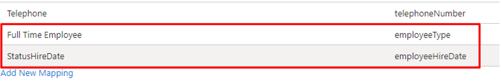

# Lifecycle workflows - FAQs

In this article, you find questions to commonly asked questions about [Lifecycle Workflows](what-are-lifecycle-workflows.md). Check back to this page frequently as changes happen often, and answers are continually being added.

## Frequently asked questions

### Can I create custom workflows for guests?

Yes, custom workflows can be configured for members or guests in your tenant. Workflows can run for all types of external guests, external members, internal guests, and internal members.

### Why do I see "Lifecycle Management" instead of "Lifecycle Workflows"?

For a small portion of our customers, Lifecycle Workflows could still be listed under the former name Lifecycle Management in the audit logs and enterprise applications.

### Do I need to map employeeHireDate in provisioning apps like WorkDay?

Yes, key user properties like employeeHireDate are supported for user provisioning from HR apps like WorkDay. To use these properties in Lifecycle workflows, you need to map them in the provisioning process to ensure the values are set. The following screenshot is an example of the mapping: 

For more information on syncing employee attributes in Lifecycle Workflows, see: [How to synchronize attributes for Lifecycle workflows](how-to-lifecycle-workflow-sync-attributes.md)

### How do I see more details and parameters of tasks and the attributes that are being updated? 

Some tasks do update existing attributes; however, we don’t currently share those specific details. As these tasks are updating attributes related to other Microsoft Entra features, so you can find that info in those docs. For temporary access pass, we're writing to the appropriate attributes listed [here](/graph/api/resources/temporaryaccesspassauthenticationmethod). 

### Is it possible for me to create new tasks and how? For example, triggering other graph APIs/web hooks?

We currently don’t support the ability to create new tasks outside of the set of tasks supported in the task templates. As an alternative, you can accomplish this by setting up a logic app and then creating a logic apps task in Lifecycle Workflows with the URL. For more information, see [Trigger Logic Apps based on custom task extensions](trigger-custom-task.md).

###  Why can’t I see any custom security attributes in the Property list?

Make sure you have active custom security attributes in your tenant as deactivated custom security attributes won't appear in the list. You also need the [Attribute Assignment Administrator](../identity/role-based-access-control/permissions-reference.md#attribute-assignment-administrator) or [Attribute Assignment Reader](../identity/role-based-access-control/permissions-reference.md#attribute-assignment-reader) roles in order for custom security attributes to be visible.

### What does it mean when it says “This rule contains invalid properties.” and there’s a red x icon on the rule expression for an existing workflow?

The red icon indicates that this custom security attribute is no longer active, so the rule is invalid. As the rule is invalid, the workflow won't be processed. You should remove the deactivated custom security attribute expression from the workflow's rule.

### My user is assigned a custom security attribute that’s part of the workflow trigger, why didn’t the workflow run for this user?

Lifecycle workflows checks that the user is assigned the custom security attribute that matches the specified value, including case-sensitivity. So check that the custom security attribute value matches exactly.

### How does Lifecycle workflows handle custom security attributes with multiple values?

If a user is assigned a custom security attribute that has multiple values, and one of the values matches the value in the specified in rule expressions, the user matches the scope.

## Next steps

- [What are Lifecycle workflows?](what-are-lifecycle-workflows.md)
