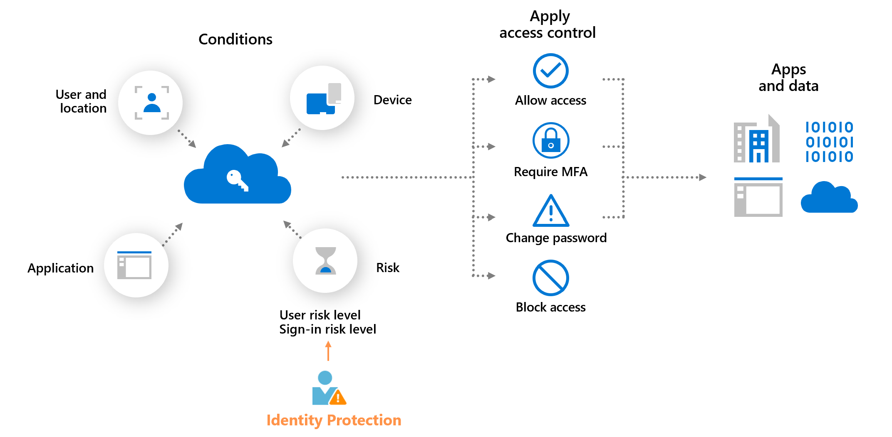
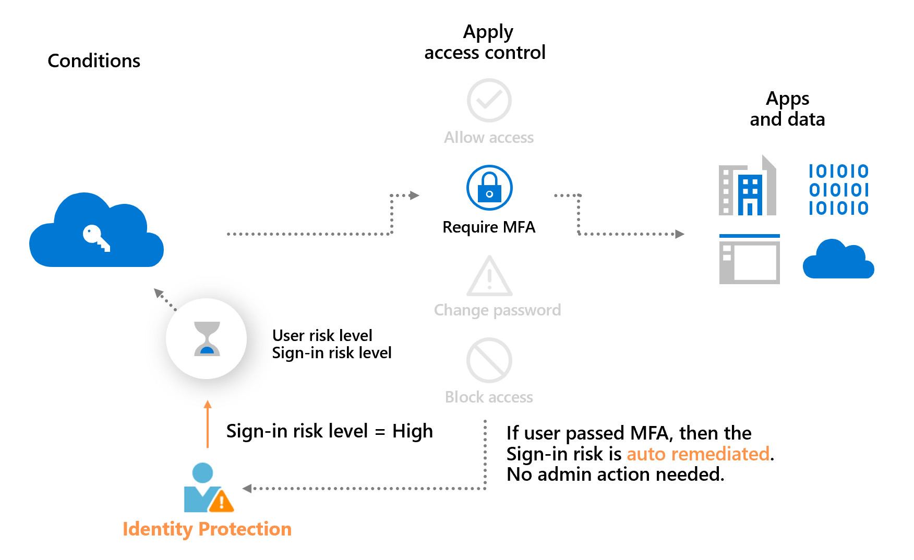

# Risk-based access policies

Risk-based access control policies can be applied to protect organizations when a sign-in or user is detected to be at risk.

Microsoft Entra Conditional Access offers two user-specific risk conditions powered by Microsoft Entra ID Protection signals: **[Sign-in risk](../identity/conditional-access/concept-conditional-access-conditions.md#sign-in-risk)** and **[User risk](../identity/conditional-access/concept-conditional-access-conditions.md#user-risk)**. Organizations can create risk-based Conditional Access policies by configuring these two risk conditions and choosing an access control method. During each sign-in, ID Protection sends the detected risk levels to Conditional Access, and the risk-based policies apply if the policy conditions are satisfied.

> [!VIDEO https://www.youtube.com/embed/cT0RnKQ8VgI?si=ORGAbnuFMu1TyELV]

You might require multifactor authentication when the sign-in risk level is medium or high. Users are only prompted at that level.

The previous example also demonstrates a main benefit of a risk-based policy: **automatic risk remediation**. When a user successfully completes the required access control, like a secure password change, their risk is remediated. That sign-in session and user account are no longer at risk, and no action is needed from the administrator. 

Allowing users to self-remediate using this process significantly reduces the risk investigation and remediation burden on administrators while protecting your organization from security compromises. More information about risk remediation can be found in the article, [Remediate risks and unblock users](howto-identity-protection-remediate-unblock.md).

## User risk-based Conditional Access policy

ID Protection analyzes signals about user accounts and calculates a risk score based on the probability that the user is compromised. If a user has risky user sign-in behavior, or their credentials were leaked, ID Protection uses these signals to calculate the user risk level. Administrators can configure risk-based Conditional Access policies to enforce access controls based on user risk, including requirements such as: 

1. Require risk remediation (preview): ID Protection manages the appropriate remediation flow for all authentication methods.
1. Require password change: ID Protection blocks access until user completes a secure password change.
1. Block access: ID Protection blocks the user until risk is addressed.

Policies requiring either #1 or #2 forces end users to remediate their user risk and unblock themselves.

## Require risk remediation with Microsoft-managed remediation (preview)

The Microsoft-managed remediation risk-based Conditional Access policy lets you author a risk policy that accommodates all authentication methods, including password-based and passwordless. This means that when you select "Require risk remediation" in your policy's grant controls, Microsoft Entra ID Protection manages the appropriate remediation flow based on the threat observed and the user's authentication method.  For detailed steps on how to enable Microsoft-managed remediation, see [Configure risk policies](howto-identity-protection-configure-risk-policies.md#microsoft-recommendations).

- **Password authentication**: Risky user has an active risk detection, such as a leaked credential, password spray, or session history involving a compromised password. The user is prompted to perform a secure password change and when completed, their previous sessions are revoked. 
- **Passwordless authentication**: Risky user has an active risk detection, but it doesn't involve a compromised password. Possible risk detections include anomalous token, impossible travel, or unfamiliar sign-in properties. The user's sessions are revoked and they're prompted to sign in again.

### Special considerations

- [Microsoft Entra ID P2](https://www.microsoft.com/security/business/microsoft-entra-pricing) is required to use the Microsoft-managed remediation policy.
- The **Require Risk Remediation** setting remediates user risk, not sign-in risk.
- If a user is assigned to both a policy with **Require Risk Remediation** and another policy with **Require Password Change** or **Block**, a conflict will occur, causing the user to be forced through all policies or blocked. Ensure each user is assigned to only one such policy at a time. 
- **Require authentication strength** and **Sign-in frequency - Every time** are automatically applied to the policy for two reasons:
   - Users need to be prompted to reauthenticate after their sessions are revoked.
   - Requiring auth strength ensures that password-based and passwordless users are covered by the policy.
- Risky Workload ID isn't supported.
- External and guest users must continue to self-remediate through secure password reset, as Microsoft Entra ID doesn't support session revocation for external and guest users.
- The "Require risk remediation" grant control is now available in Azure for US Government.

## Sign-in risk-based Conditional Access policy

During each sign-in, ID Protection analyzes hundreds of signals in real-time and calculates a sign-in risk level that represents the probability that the given authentication request isn't authorized. This risk level then gets sent to Conditional Access, where the organization's configured policies are evaluated. Administrators can configure sign-in risk-based Conditional Access policies to enforce access controls based on sign-in risk, including requirements such as:

- Block access
- Allow access
- Require multifactor authentication
- Require reauthentication (Sign-in frequency)

If risks are detected on a sign-in, users can perform the required access control such as multifactor authentication to self-remediate and close the risky sign-in event to prevent unnecessary noise for administrators.

> [!NOTE] 
> Users must have registered an authentication method that can satisfy Microsoft Entra multifactor authentication before triggering a sign-in risk policy.

## Migrate ID Protection risk policies to Conditional Access

If you have the legacy **user risk policy** or **sign-in risk policy** enabled in ID Protection (formerly Identity Protection), [migrate them to Conditional Access](howto-identity-protection-configure-risk-policies.md#migrate-risk-policies-to-conditional-access).

> [!WARNING]
> The legacy risk policies configured in Microsoft Entra ID Protection are retiring on **October 1, 2026**.

Configuring risk policies in Conditional Access provides benefits like the ability to:

- Manage access policies in one location.
- Use report-only mode and Graph APIs.
- Enforce sign-in frequency to require reauthentication every time.
- Provide granular access control combining risk with other conditions like location. 
- Enhance security with multiple risk-based policies targeting different user groups or risk levels. 
- Improve diagnostics experience detailing which risk-based policy applied in sign-in Logs.
- Support the backup authentication system.

## Microsoft Entra multifactor authentication registration policy

ID Protection helps organizations roll out Microsoft Entra multifactor authentication using a policy requiring registration at sign-in. Enabling this policy ensures new users in your organization register for MFA on their first day. Multifactor authentication is one of the self-remediation methods for risk events within ID Protection. Self-remediation allows your users to take action on their own to reduce helpdesk call volume.

Learn more about Microsoft Entra multifactor authentication in the article, [How it works: Microsoft Entra multifactor authentication](~/identity/authentication/concept-mfa-howitworks.md).

## Related content

- [Enable the Microsoft Entra multifactor authentication registration policy](howto-identity-protection-configure-mfa-policy.md)
- [Enable sign-in and user risk policies](howto-identity-protection-configure-risk-policies.md)