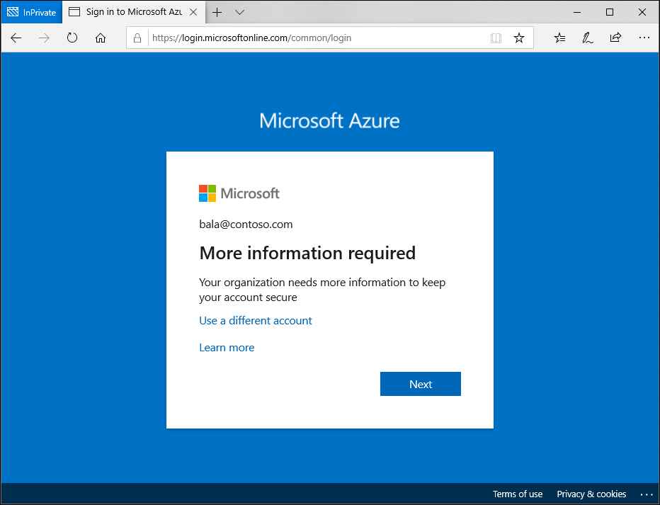

# Self-remediation experience with Microsoft Entra ID Protection and Conditional Access

With Microsoft Entra ID Protection and Conditional Access, you can:

* Require users to register for Microsoft Entra multifactor authentication
* Automate remediation of risky sign-ins and compromised users
* Block users in specific cases.

Conditional Access policies that integrate user and sign-in risk have an impact on the sign in experience for users. Allowing users to register for and use tools like Microsoft Entra multifactor authentication and self-service password reset can lessen the impact. These tools along with the appropriate policy choices gives users a self-remediation option when they need it, while still enforcing strong security controls.

## Multifactor authentication registration

When an administrator enables the ID Protection policy requiring Microsoft Entra multifactor authentication registration, it ensures that users can use Microsoft Entra multifactor authentication to self-remediate in the future. Configuring this policy gives your users a 14-day period where they can choose to register and at the end are forced to register.

### Registration interrupt

1. At sign-in to any Microsoft Entra integrated application, the user gets a notification about the requirement to set up the account for multifactor authentication. This policy is also triggered in the Windows Out of Box Experience for new users with a new device.
   
   

1. Complete the guided steps to register for Microsoft Entra multifactor authentication and complete your sign-in.

## Risk self-remediation

When an administrator configures risk-based Conditional Access policies, affected users are interrupted when they reach the configured risk level. If administrators allow self-remediation using multifactor authentication, this process appears to a user as a normal multifactor authentication prompt.

If the user is able to complete multifactor authentication, their risk is remediated and they can sign in.

:::image type="content" source="media/concept-identity-protection-user-experience/conditional-access-mfa-prompt.png" alt-text="A screenshot showing a multifactor authentication prompt at sign in." lightbox="media/concept-identity-protection-user-experience/conditional-access-mfa-prompt.png":::

If the user is at risk, not just the sign-in, administrators can configure a user risk policy in Conditional Access to require a password change in addition to performing multifactor authentication. In that case, a user sees the following extra screen.

:::image type="content" source="media/concept-identity-protection-user-experience/conditional-access-password-change-prompt.png" alt-text="A screenshot showing the password change is required prompt when user risk is detected." lightbox="media/concept-identity-protection-user-experience/conditional-access-password-change-prompt.png":::

### Risky sign-in administrator unblock

Administrators might choose to block users upon sign-in depending on their risk level. To get unblocked, end users must contact their IT staff, or they can try signing in from a familiar location or device. Self-remediation isn't an option in this case.

:::image type="content" source="media/concept-identity-protection-user-experience/conditional-access-blocked.png" alt-text="A screenshot showing your account is blocked screen." lightbox="media/concept-identity-protection-user-experience/conditional-access-blocked.png":::

IT staff can follow the instructions in the section [Unblocking users](howto-identity-protection-remediate-unblock.md#unblocking-based-on-sign-in-risk) to allow users to sign back in.

## High risk technician

If your organization has users who are delegated access to another tenant and they trigger high risk they might be blocked from signing into those other tenants. For example: 

1. An organization has a managed service provider (MSP) or cloud solution provider (CSP) who takes care of configuring their cloud environment. 
1. One of the MSPs technicians credentials are leaked and triggers high risk. That technician is blocked from signing in to other tenants. 
1. The technician can self-remediate and sign in if the home tenant enabled the appropriate policies [requiring password change for high risk users](~/identity/conditional-access/policy-risk-based-user.md) or [MFA for risky users](~/identity/conditional-access/policy-risk-based-sign-in.md). 
   1. If the home tenant didn't enable self-remediation policies, an administrator in the technician's home tenant has to [remediate the risk](howto-identity-protection-remediate-unblock.md#risk-remediation).

## See also

- [Remediate risks and unblock users](howto-identity-protection-remediate-unblock.md)
- [Microsoft Entra ID Protection](./overview-identity-protection.md)
