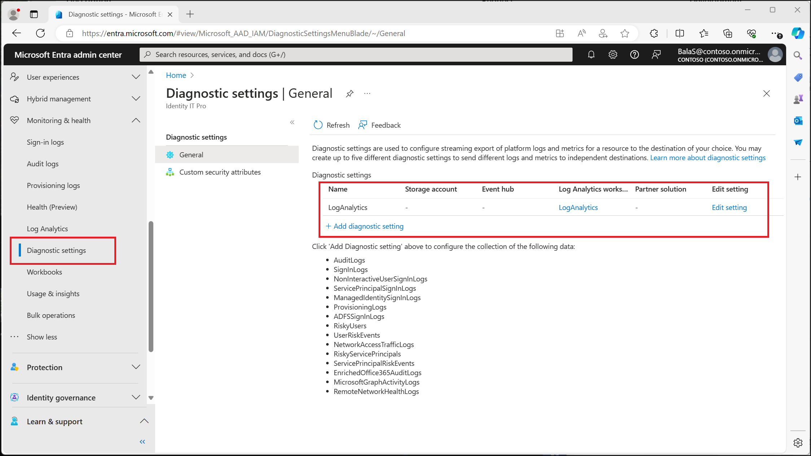
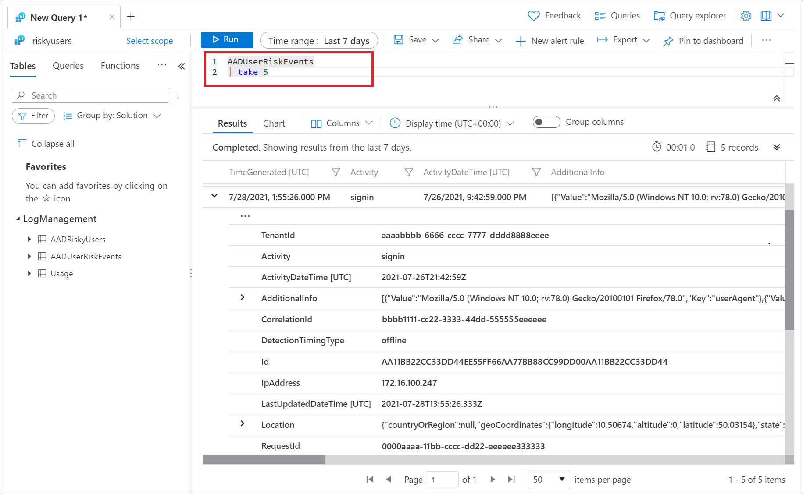

# How To: Export risk data

Microsoft Entra ID stores reports and security signals for a defined period of time. When it comes to risk information that period might not be long enough.

| Report / Signal | Microsoft Entra ID Free | Microsoft Entra ID P1 | Microsoft Entra ID P2 |
| --- | --- | --- | --- |
| Audit logs | 7 days | 30 days | 30 days |
| Sign-ins | 7 days | 30 days | 30 days |
| Microsoft Entra multifactor authentication usage | 30 days | 30 days | 30 days |
| Risky sign-ins | 7 days | 30 days | 30 days |

Organizations can choose to store data for longer periods by changing diagnostic settings in Microsoft Entra ID to send **RiskyUsers**, **UserRiskEvents**, **RiskyServicePrincipals**, and **ServicePrincipalRiskEvents** data to a Log Analytics workspace, archive data to a storage account, stream data to an event hub, or send data to a partner solution. Find these options in the [Microsoft Entra admin center](https://entra.microsoft.com) > **Identity** > **Monitoring & health** > **Diagnostic settings** > **Edit setting**. If you don't have a diagnostic setting, follow the instructions in the article [Create diagnostic settings to send platform logs and metrics to different destinations](/azure/azure-monitor/essentials/diagnostic-settings) to create one.

[  ](./media/howto-export-risk-data/change-diagnostic-setting-in-portal.png#lightbox)

## Log Analytics

Log Analytics allows organizations to query data using built in queries or custom created Kusto queries, for more information, see [Get started with log queries in Azure Monitor](/azure/azure-monitor/logs/get-started-queries).

Once enabled you find access to Log Analytics in the [Microsoft Entra admin center](https://entra.microsoft.com) > **Identity** > **Monitoring & health** > **Log Analytics**. The following tables are of most interest to Identity Protection administrators:

- AADRiskyUsers - Provides data like the **Risky users** report in Identity Protection.
- AADUserRiskEvents - Provides data like the **Risk detections** report in Identity Protection.
- RiskyServicePrincipals - Provides data like the **Risky workload identities** report in Identity Protection.
- ServicePrincipalRiskEvents - Provides data like the **Workload identity detections** report in Identity Protection.

> [!NOTE]
> Log Analytics only has visibility into data as it is streamed. Events prior to enabling the sending of events from Microsoft Entra ID do not appear.

### Sample queries

[  ](./media/howto-export-risk-data/log-analytics-view-query-user-risk-events.png#lightbox)

In the previous image, the following query was run to show the most recent five risk detections triggered. 

```kusto
AADUserRiskEvents
| take 5
```

Another option is to query the AADRiskyUsers table to see all risky users.

```kusto
AADRiskyUsers
```

View the count of high risk users by day:
 
```kusto
AADUserRiskEvents
| where TimeGenerated > ago(30d)
| where RiskLevel has "high"
| summarize count() by bin (TimeGenerated, 1d)
```

View helpful investigation details, such as user agent string, for detections that are high risk and aren't remediated or dismissed:
 
```kusto
AADUserRiskEvents
| where RiskLevel has "high"
| where RiskState has "atRisk"
| mv-expand ParsedFields = parse_json(AdditionalInfo)
| where ParsedFields has "userAgent"
| extend UserAgent = ParsedFields.Value
| project TimeGenerated, UserDisplayName, Activity, RiskLevel, RiskState, RiskEventType, UserAgent,RequestId
```

Access more queries and visual insights based on AADUserRiskEvents and AADRisky Users logs in the [Impact analysis of risk-based access policies workbook](workbook-risk-based-policy-impact.md).

## Storage account

By routing logs to an Azure storage account, you can keep it for longer than the default retention period. For more information, see the article [Tutorial: Archive Microsoft Entra logs to an Azure storage account](~/identity/monitoring-health/howto-archive-logs-to-storage-account.md).

## Azure Event Hubs

Azure Event Hubs can look at incoming data from sources like Microsoft Entra ID Protection and provide real-time analysis and correlation. For more information, see the article [Tutorial: Stream Microsoft Entra logs to an Azure event hub](~/identity/monitoring-health/howto-stream-logs-to-event-hub.md).

## Other options

Organizations can choose to [connect Microsoft Entra data to Microsoft Sentinel](/azure/sentinel/data-connectors/azure-active-directory-identity-protection) as well for further processing.

Organizations can use the [Microsoft Graph API to programmatically interact with risk events](howto-identity-protection-graph-api.md).

## Next steps

- [What is Microsoft Entra monitoring?](~/identity/monitoring-health/overview-monitoring-health.md)
- [Install and use the log analytics views for Microsoft Entra ID](/azure/azure-monitor/visualize/workbooks-view-designer-conversion-overview)
- [Connect data from Microsoft Entra ID Protection](/azure/sentinel/data-connectors/azure-active-directory-identity-protection)
- [Microsoft Entra ID Protection and the Microsoft Graph PowerShell SDK](howto-identity-protection-graph-api.md)
- [Tutorial: Stream Microsoft Entra logs to an Azure event hub](~/identity/monitoring-health/howto-stream-logs-to-event-hub.md)
