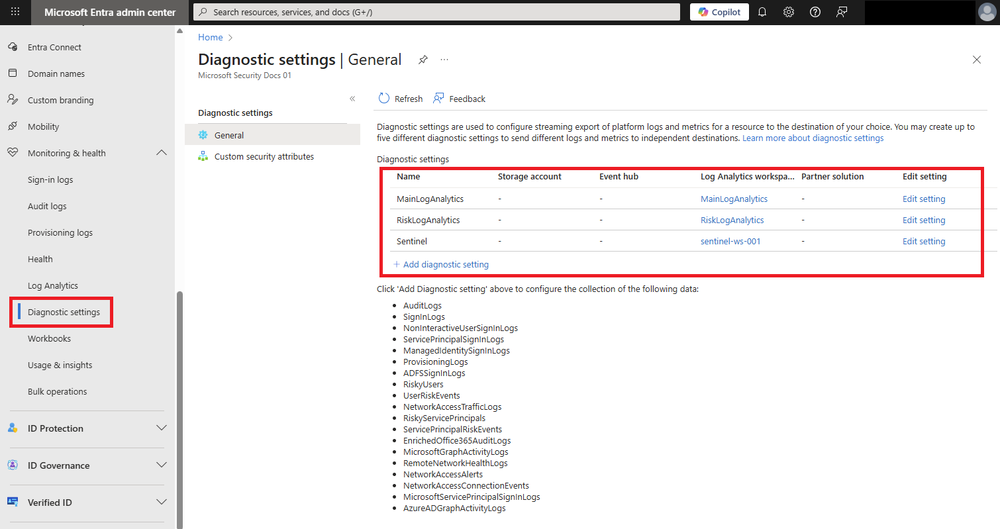

# How To: Export risk data

Microsoft Entra ID stores reports and security signals for a defined period of time. When it comes to risk information that period might not be long enough.

| Report / Signal | Microsoft Entra ID Free | Microsoft Entra ID P1 | Microsoft Entra ID P2 |
| --- | --- | --- | --- |
| Audit logs | 7 days | 30 days | 30 days |
| Sign-ins | 7 days | 30 days | 30 days |
| Microsoft Entra multifactor authentication usage | 30 days | 30 days | 30 days |
| Risky sign-ins | 7 days | 30 days | 30 days |

This article describes the available methods for exporting risk data from Microsoft Entra ID Protection for long-term storage and analysis.

## Prerequisites

To export risk data for storage and analysis, you need:

- A Log Analytics workspace *and* [access to that workspace](/azure/azure-monitor/logs/manage-access)

- The appropriate role for Azure Monitor:
  - Monitoring Reader
  - Log Analytics Reader
  - Monitoring Contributor
  - Log Analytics Contributor

- The appropriate role for Microsoft Entra ID:
  - Reports Reader
  - Security Reader
  - Global Reader
  - Security Administrator

## Diagnostic settings

Organizations can choose to store or export **RiskyUsers**, **UserRiskEvents**, **RiskyServicePrincipals**, and **ServicePrincipalRiskEvents** data by changing diagnostic settings in Microsoft Entra ID to export the data. You can integrate the data with a Log Analytics workspace, archive data to a storage account, stream data to an event hub, or send data to a partner solution. For a quick summary of the methods available for log storage and analysis, see [How to access activity logs in Microsoft Entra ID](../identity/monitoring-health/howto-access-activity-logs.md). If you don't have diagnostic settings configured, follow the instructions in [How to configure Microsoft Entra diagnostic settings](../identity/monitoring-health/howto-configure-diagnostic-settings.md) to get started.

[](./media/howto-export-risk-data/change-diagnostic-setting-in-portal.png#lightbox)

1. Sign in to the [Microsoft Entra admin center](https://entra.microsoft.com) as at least a [Security Administrator](~/identity/role-based-access-control/permissions-reference.md#security-administrator).

1. Browse to **Identity** > **Monitoring & health** > **Diagnostic settings**.

1. Select **+ Add diagnostic setting**, enter a **Diagnostic setting name**, select the log categories that you want to stream and select **Save**.

You might need to wait around 15 minutes for the data to start appearing in the destination you selected.

## Log Analytics

Integrating risk data with Log Analytics provides robust data analysis and visualization capabilities. You need to configure a Log Analytics workspace before you can export and then query the data. For more information, see [Configure a Log Analytics workspace](../identity/monitoring-health/tutorial-configure-log-analytics-workspace.md).

With Log Analytics, organizations can query data using built-in or custom Kusto queries. For more information, see [Get started with log queries in Azure Monitor](/azure/azure-monitor/logs/get-started-queries).

Once you've configured a Log Analytics workspace and exported the data with diagnostic settings, you go to [Microsoft Entra admin center](https://entra.microsoft.com) > **Identity** > **Monitoring & health** > **Log Analytics**. The following tables are of most interest to Microsoft Entra ID Protection administrators:

- AADRiskyUsers - Provides data like the **Risky users** report.
- AADUserRiskEvents - Provides data like the **Risk detections** report.
- RiskyServicePrincipals - Provides data like the **Risky workload identities** report.
- ServicePrincipalRiskEvents - Provides data like the **Workload identity detections** report.

> [!NOTE]
> Log Analytics only has visibility into data as it is streamed. Events prior to enabling the sending of events from Microsoft Entra ID do not appear.

### Sample queries

[](./media/howto-export-risk-data/log-analytics-view-query-user-risk-events.png#lightbox)

In the previous image, the following query was run to show the most recent five risk detections triggered. 

```kusto
AADUserRiskEvents
| take 5
```

Another option is to query the AADRiskyUsers table to see all risky users.

```kusto
AADRiskyUsers
```

View the count of high risk users by day:
 
```kusto
AADUserRiskEvents
| where TimeGenerated > ago(30d)
| where RiskLevel has "high"
| summarize count() by bin (TimeGenerated, 1d)
```

View helpful investigation details, such as user agent string, for detections that are high risk and aren't remediated or dismissed:
 
```kusto
AADUserRiskEvents
| where RiskLevel has "high"
| where RiskState has "atRisk"
| mv-expand ParsedFields = parse_json(AdditionalInfo)
| where ParsedFields has "userAgent"
| extend UserAgent = ParsedFields.Value
| project TimeGenerated, UserDisplayName, Activity, RiskLevel, RiskState, RiskEventType, UserAgent,RequestId
```

Access more queries and visual insights based on AADUserRiskEvents and AADRisky Users logs in the [Impact analysis of risk-based access policies workbook](workbook-risk-based-policy-impact.md).

## Storage account

By routing logs to an Azure storage account, you can keep it for longer than the default retention period. For more information, see the article [How to archive Microsoft Entra activity logs to an Azure storage account](../identity/monitoring-health/howto-archive-logs-to-storage-account.md).

## Azure Event Hubs

Azure Event Hubs can look at incoming data from sources like Microsoft Entra ID Protection and provide real-time analysis and correlation. For more information, see the article [How to stream logs to Event Hub](../identity/monitoring-health/howto-stream-logs-to-event-hub.md).

## Other options

Organizations can choose to [connect Microsoft Entra data to Microsoft Sentinel](/azure/sentinel/data-connectors/azure-active-directory-identity-protection) as well for further processing.

Organizations can use the [Microsoft Graph API to programmatically interact with risk events](howto-identity-protection-graph-api.md).

## Related content

- [What is Microsoft Entra monitoring?](~/identity/monitoring-health/overview-monitoring-health.md)
- [Connect data from Microsoft Entra ID Protection with Microsoft Sentinel](/azure/sentinel/data-connectors/azure-active-directory-identity-protection)
- [Microsoft Entra ID Protection and the Microsoft Graph PowerShell SDK](howto-identity-protection-graph-api.md)

