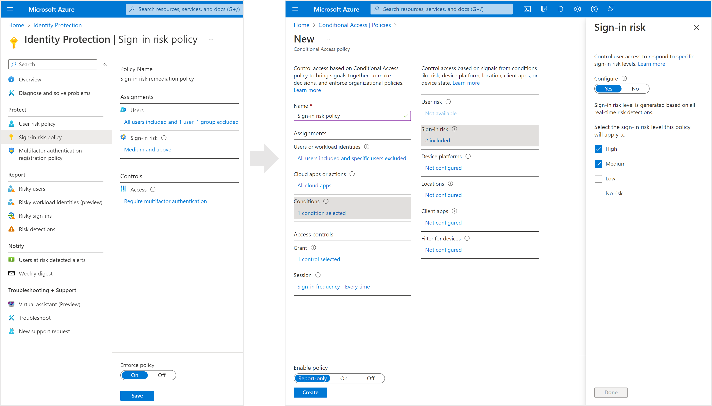

# Configure and enable risk policies

As we learned in the previous article, [Risk-based access policies](concept-identity-protection-policies.md), there are two types of risk policies in Microsoft Entra Conditional Access you can set up. You can use these policies to automate the response to risks allowing users to self-remediate when risk is detected:

- Sign-in risk policy
- User risk policy

## Choosing acceptable risk levels

Organizations must decide the level of risk they want to require access control on balancing user experience and security posture. 

Choosing to apply access control on a **High** risk level reduces the number of times a policy is triggered and minimizes friction for users. However, it excludes **Low** and **Medium** risks from the policy, which might not block an attacker from exploiting a compromised identity. Selecting a **Low** risk level to require access control introduces more user interrupts.

Configured trusted [network locations](~/identity/conditional-access/location-condition.md) are used by Identity Protection in some risk detections to reduce false positives.

The policy configurations that follow include the [sign-in frequency session control](../identity/conditional-access/howto-conditional-access-session-lifetime.md#require-reauthentication-every-time) requiring a reauthentication for risky users and sign-ins.

### Risk remediation

Organizations can choose to block access when risk is detected. Blocking sometimes stops legitimate users from doing what they need to. A better solution is to [allow self-remediation using Microsoft Entra multifactor authentication and secure password change](howto-identity-protection-remediate-unblock.md#self-remediation-with-risk-based-policy).

> [!WARNING]
> Users must register for Microsoft Entra multifactor authentication before they face a situation requiring remediation. For hybrid users that are synced from on-premises to cloud, password writeback must have been enabled on them. Users not registered are blocked and require administrator intervention.
> 
> Password change (I know my password and want to change it to something new) outside of the risky user policy remediation flow does not meet the requirement for secure password change.

### Microsoft's recommendation

Microsoft recommends the following risk policy configurations to protect your organization:

- User risk policy
   - Require a secure password change when user risk level is **High**. Microsoft Entra multifactor authentication is required before the user can create a new password with password writeback to remediate their risk. 
- Sign-in risk policy
   - Require Microsoft Entra multifactor authentication when sign-in risk level is **Medium** or **High**, allowing users to prove it's them by using one of their registered authentication methods, remediating the sign-in risk. 

Requiring access control when risk level is low introduces more friction and user interrupts than medium or high. Choosing to block access rather than allowing self-remediation options, like secure password change and multifactor authentication, affect your users and administrators even more. Weigh these choices when configuring your policies.

## Exclusions

Policies allow for excluding users such as your [emergency access or break-glass administrator accounts](~/identity/role-based-access-control/security-emergency-access.md). Organizations might need to exclude other accounts from specific policies based on the way the accounts are used. Exclusions should be reviewed regularly to see if they're still applicable.

## Enable policies

Organizations can choose to deploy risk-based policies in Conditional Access using the following steps or using [Conditional Access templates](~/identity/conditional-access/concept-conditional-access-policy-common.md#conditional-access-templates).

Before organizations enable remediation policies, they should [investigate](howto-identity-protection-investigate-risk.md) and [remediate](howto-identity-protection-remediate-unblock.md) any active risks.

### User risk policy in Conditional Access

1. Sign in to the [Microsoft Entra admin center](https://entra.microsoft.com) as at least a [Conditional Access Administrator](~/identity/role-based-access-control/permissions-reference.md#conditional-access-administrator).
1. Browse to **Protection** > **Conditional Access**.
1. Select **New policy**.
1. Give your policy a name. We recommend that organizations create a meaningful standard for the names of their policies.
1. Under **Assignments**, select **Users or workload identities**.
   1. Under **Include**, select **All users**.
   1. Under **Exclude**, select **Users and groups** and choose your organization's emergency access or break-glass accounts. 
   1. Select **Done**.
1. Under **Cloud apps or actions** > **Include**, select **All cloud apps**.
1. Under **Conditions** > **User risk**, set **Configure** to **Yes**. 
   1. Under **Configure user risk levels needed for policy to be enforced**, select **High**. ([This guidance is based on Microsoft recommendations and might be different for each organization](#choosing-acceptable-risk-levels))
   1. Select **Done**.
1. Under **Access controls** > **Grant**.
   1. Select **Grant access**, **Require multifactor authentication** and **Require password change**.
   1. Select **Select**.
1. Under **Session**.
   1. Select **Sign-in frequency**.
   1. Ensure **Every time** is selected.
   1. Select **Select**.
1. Confirm your settings and set **Enable policy** to **Report-only**.
1. Select **Create** to create to enable your policy.

After administrators confirm the settings using [report-only mode](~/identity/conditional-access/howto-conditional-access-insights-reporting.md), they can move the **Enable policy** toggle from **Report-only** to **On**.

### Sign-in risk policy in Conditional Access

1. Sign in to the [Microsoft Entra admin center](https://entra.microsoft.com) as at least a [Conditional Access Administrator](~/identity/role-based-access-control/permissions-reference.md#conditional-access-administrator).
1. Browse to **Protection** > **Conditional Access**.
1. Select **New policy**.
1. Give your policy a name. We recommend that organizations create a meaningful standard for the names of their policies.
1. Under **Assignments**, select **Users or workload identities**.
   1. Under **Include**, select **All users**.
   1. Under **Exclude**, select **Users and groups** and choose your organization's emergency access or break-glass accounts. 
   1. Select **Done**.
1. Under **Cloud apps or actions** > **Include**, select **All cloud apps**.
1. Under **Conditions** > **Sign-in risk**, set **Configure** to **Yes**. Under **Select the sign-in risk level this policy will apply to**. ([This guidance is based on Microsoft recommendations and might be different for each organization](#choosing-acceptable-risk-levels))
   1. Select **High** and **Medium**.
   1. Select **Done**.
1. Under **Access controls** > **Grant**.
   1. Select **Grant access**, **Require multifactor authentication**.
   1. Select **Select**.
1. Under **Session**.
   1. Select **Sign-in frequency**.
   1. Ensure **Every time** is selected.
   1. Select **Select**.
1. Confirm your settings and set **Enable policy** to **Report-only**.
1. Select **Create** to create to enable your policy.

After administrators confirm the settings using [report-only mode](~/identity/conditional-access/howto-conditional-access-insights-reporting.md), they can move the **Enable policy** toggle from **Report-only** to **On**.

## Migrate risk policies to Conditional Access

> [!WARNING]
> The legacy risk policies configured in Microsoft Entra ID Protection will be retired on **October 1, 2026**.

If you have risk policies enabled in Microsoft Entra ID, you should plan to migrate them to Conditional Access:

### Migrating to Conditional Access

1. **Create an equivalent** [user risk-based](#user-risk-policy-in-conditional-access) and [sign-in risk-based](#sign-in-risk-policy-in-conditional-access) policy in Conditional Access in report-only mode. You can create a policy with the previous steps or using [Conditional Access templates](~/identity/conditional-access/concept-conditional-access-policy-common.md) based on Microsoft's recommendations and your organizational requirements.
   1. Ensure that the new Conditional Access risk policy works as expected by testing it in [report-only mode](~/identity/conditional-access/howto-conditional-access-insights-reporting.md).
1. **Enable** the new Conditional Access risk policy. You can choose to have both policies running side-by-side to confirm the new policies are working as expected before turning off the ID Protection risk policies.
   1. Browse back to **Protection** > **Conditional Access**. 
   1. Select this new policy to edit it.
   1. Set **Enable policy** to **On** to enable the policy
1. **Disable** the old risk policies in ID Protection.
   1. Browse to **Protection** > **Identity Protection** > Select the **User risk** or **Sign-in risk** policy.
   1. Set **Enforce policy** to **Disabled**
1. Create other risk policies if needed in [Conditional Access](~/identity/conditional-access/concept-conditional-access-policy-common.md).

## Next steps

- [Enable Microsoft Entra multifactor authentication registration policy](howto-identity-protection-configure-mfa-policy.md)
- [What is risk](concept-identity-protection-risks.md)
- [Investigate risk detections](howto-identity-protection-investigate-risk.md)
- [Simulate risk detections](howto-identity-protection-simulate-risk.md)
- [Require reauthentication every time](~/identity/conditional-access/howto-conditional-access-session-lifetime.md#require-reauthentication-every-time)
