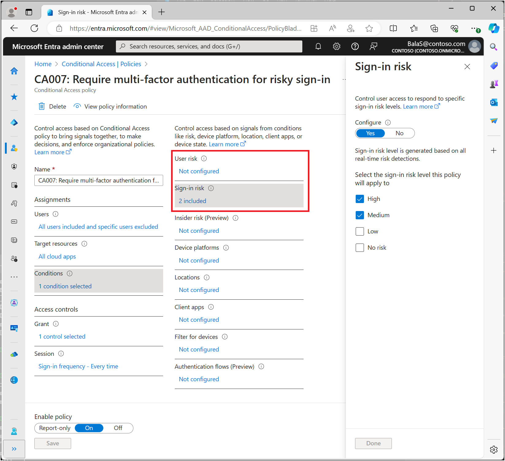

# Configure and enable risk policies

There are two types of [risk policies](concept-identity-protection-policies.md) in Microsoft Entra Conditional Access you can set up. You can use these policies to automate the response to risks allowing users to self-remediate when risk is detected:

- [Sign-in risk policy](#sign-in-risk-policy-in-conditional-access)
- [User risk policy](#user-risk-policy-in-conditional-access)

## Choosing acceptable risk levels

Organizations must decide the level of risk they want to require access control on balancing user experience and security posture. 

Choosing to apply access control on a **High** risk level reduces the number of times a policy is triggered and minimizes friction for users. However, it excludes **Low** and **Medium** risks from the policy, which might not block an attacker from exploiting a compromised identity. Selecting a **Low** risk level to require access control introduces more user interrupts.

Configured trusted [network locations](../identity/conditional-access/concept-assignment-network.md#trusted-locations) are used by Identity Protection in some risk detections to reduce false positives.

The policy configurations that follow include the [sign-in frequency session control](../identity/conditional-access/concept-session-lifetime.md#require-reauthentication-every-time) requiring a reauthentication for risky users and sign-ins.

### Microsoft's recommendation

Microsoft recommends the following risk policy configurations to protect your organization:

- User risk policy
   - Require a secure password change when user risk level is **High**. Microsoft Entra multifactor authentication is required before the user can create a new password with password writeback to remediate their risk. 
- Sign-in risk policy
   - Require Microsoft Entra multifactor authentication when sign-in risk level is **Medium** or **High**, allowing users to prove it's them by using one of their registered authentication methods, remediating the sign-in risk. 

Requiring access control when risk level is low introduces more friction and user interrupts than medium or high. Choosing to block access rather than allowing self-remediation options, like secure password change and multifactor authentication, affect your users and administrators even more. Weigh these choices when configuring your policies.

### Risk remediation

Organizations can choose to block access when risk is detected. Blocking sometimes stops legitimate users from doing what they need to. A better solution is to configure [user](#user-risk-policy-in-conditional-access) and [sign-in](#sign-in-risk-policy-in-conditional-access) risk-based Conditional Access policies that [allow users to self-remediate](howto-identity-protection-remediate-unblock.md#self-remediation-with-risk-based-policy).

> [!WARNING]
> Users must register for Microsoft Entra multifactor authentication before they face a situation requiring remediation. For hybrid users that are synced from on-premises, password writeback must be enabled. Users not registered are blocked and require administrator intervention.
> 
> Password change (I know my password and want to change it to something new) outside of the risky user policy remediation flow does not meet the requirement for secure password change.

## Enable policies

Organizations can choose to deploy risk-based policies in Conditional Access using the following steps or use [Conditional Access templates](~/identity/conditional-access/concept-conditional-access-policy-common.md#conditional-access-templates).

Before organizations enable these policies, they should take action to [investigate](howto-identity-protection-investigate-risk.md) and [remediate](howto-identity-protection-remediate-unblock.md) any active risks.

### Policy exclusions

[!INCLUDE [active-directory-policy-exclusions](../includes/entra-policy-exclude-user.md)]

### User risk policy in Conditional Access

[!INCLUDE [conditional-access-policy-user-risk](../includes/conditional-access-policy-user-risk.md)]

### Sign-in risk policy in Conditional Access

[!INCLUDE [conditional-access-policy-sign-in-risk](../includes/conditional-access-policy-sign-in-risk.md)]

## Migrate risk policies to Conditional Access

If you have legacy risk policies enabled in Microsoft Entra ID Protection, you should plan to migrate them to Conditional Access:

> [!WARNING]
> The legacy risk policies configured in Microsoft Entra ID Protection will be retired on **October 1, 2026**.

### Migrate to Conditional Access

1. **Create an equivalent** [user risk-based](#user-risk-policy-in-conditional-access) and [sign-in risk-based](#sign-in-risk-policy-in-conditional-access) policy in Conditional Access in report-only mode. You can create a policy with the previous steps or using [Conditional Access templates](~/identity/conditional-access/concept-conditional-access-policy-common.md) based on Microsoft's recommendations and your organizational requirements.
   1. After administrators confirm the settings using [report-only mode](../identity/conditional-access/howto-conditional-access-insights-reporting.md), they can move the **Enable policy** toggle from **Report-only** to **On**.
1. **Disable** the old risk policies in ID Protection.
   1. Browse to **Protection** > **Identity Protection** > Select the **User risk** or **Sign-in risk** policy.
   1. Set **Enforce policy** to **Disabled**.
1. Create other risk policies if needed in [Conditional Access](~/identity/conditional-access/concept-conditional-access-policy-common.md).

## Related content

- [Enable Microsoft Entra multifactor authentication registration policy](howto-identity-protection-configure-mfa-policy.md)
- [What is risk](concept-identity-protection-risks.md)
- [Investigate risk detections](howto-identity-protection-investigate-risk.md)
- [Simulate risk detections](howto-identity-protection-simulate-risk.md)
