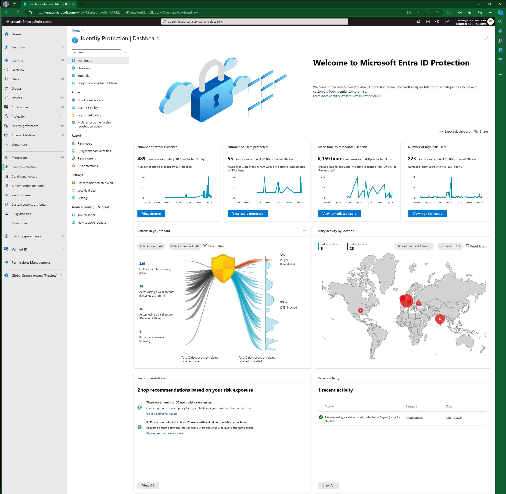
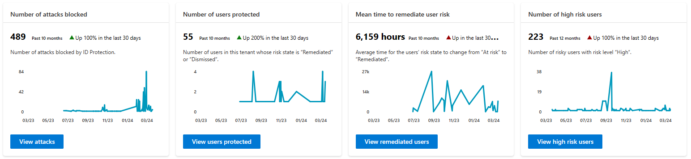
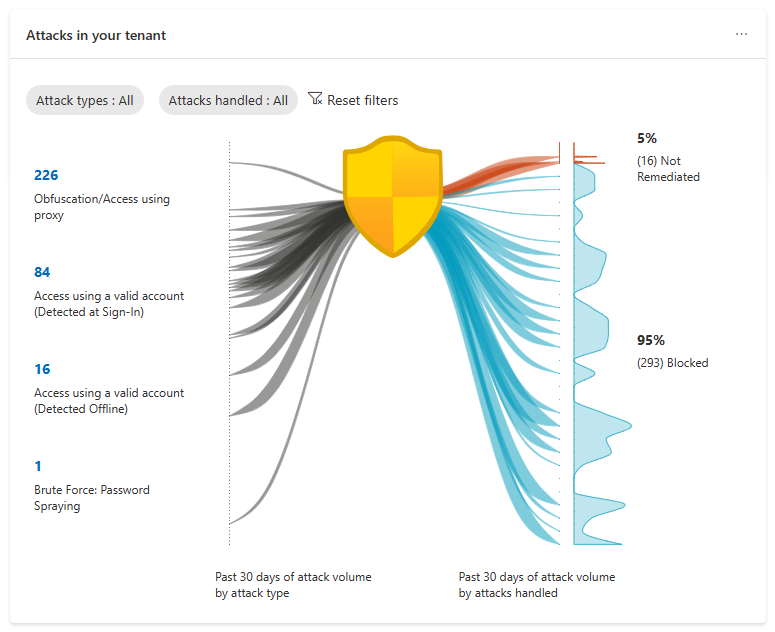
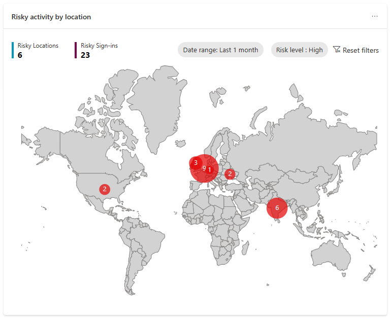
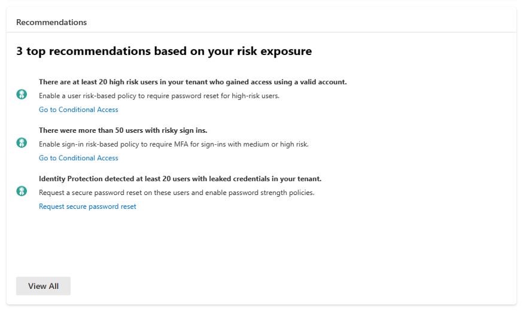
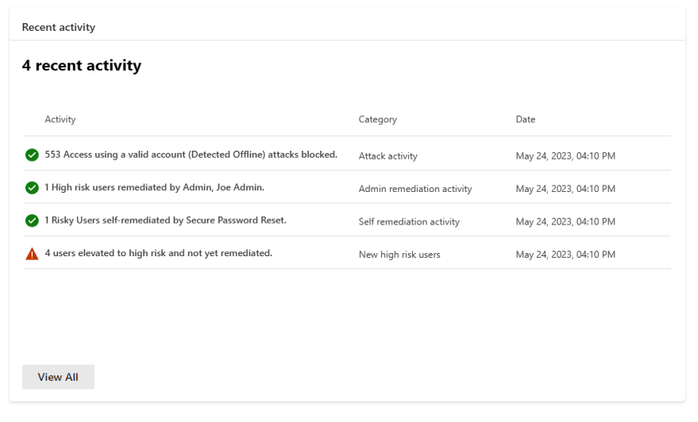

# Microsoft Entra ID Protection dashboard

Microsoft Entra ID Protection prevents identity compromises by detecting identity attacks and reporting risks. It lets customers protect their organizations by monitoring risks, investigating them, and configuring risk-based access policies to guard sensitive access and automatically remediate risks. 

Our dashboard helps customers better analyze their security posture, understand how well they're protected, identify vulnerabilities, and perform recommended actions. 

This dashboard empowers organizations with rich insights and actionable recommendations tailored to your tenant. This information provides a better view into your organization’s security posture and lets you enable effective protections accordingly. You have access to key metrics, attack graphics, a map highlighting risky locations, top recommendations to enhance security posture, and recent activities.

## Prerequisites

To access this dashboard, you need:

- Microsoft Entra ID Free, Microsoft Entra ID P1, or Microsoft Entra ID P2 licenses for your users.
- Microsoft Entra ID P2 licenses to view a comprehensive list of recommendations and select the recommended action links.
- Microsoft 365 E5 or Microsoft Enterprise Mobility + Security E5 licenses for some risk detections. For more information, see [What is Microsoft Entra ID Protection?](overview-identity-protection.md#microsoft-defender).

## Access the dashboard

You can access the dashboard by:

1. Sign in to the **[Microsoft Entra admin center](https://entra.microsoft.com)** as at least a [Security Reader](../identity/role-based-access-control/permissions-reference.md#security-reader).
1. Browse to **ID Protection** > **Dashboard**.

### Metric cards
 
As you implement more security measures such as risk-based policies, your tenant protection strengthens. We provide four key metrics to help you understand the effectiveness of the security measures you have in place. 

| Metric | Metric definition | Refresh frequency | Where to view detail |
| --- | --- | --- | --- |
| Number of attacks blocked | Number of attacks blocked for this tenant on each day.    An attack is considered blocked if the risky sign-in is interrupted by any access policy. The access control required by the policy should block the attacker from signing in, therefore blocking the attack in real-time. | Every 24 hours. | View the risk detections that determined the attacks in the **Risk detections report**, filter "Risk state" by:   - **Remediated**  - **Dismissed**  - **Confirmed safe** |
| Number of users protected | Number of users in this tenant whose risk state changed from **At risk** to **Remediated** or **Dismissed** on each day.    A **Remediated** risk state indicates that the user self-remediated their user risk by completing MFA or secure password change, and their account is therefore protected.    A **Dismissed** risk state indicates that an admin dismissed the user’s risk because they identified the user’s account to be safe. | Every 24 hours. | View users protected in the **Risky users report**, filter "Risk state" by:   - **Remediated**  - **Dismissed** |
| Mean time your users take to self-remediate their risks | Average time for the Risk state of risky users in your tenant to change from **At risk** to **Remediated**.    A user’s risk state changes to **Remediated** when they self-remediated their user risk through MFA or secure password change.    To reduce the self-remediation time in your tenant, deploy risk-based Conditional Access policies. | Every 24 hours. | View remediated users in the Risky users report, filter "Risk state" by:   - Remediated |
| Number of new high-risk users detected | Number of new risky users with risk level **High** detected on each day. | Every 24 hours. | View high-risk users in the Risky users report, filter risk level by   - "High" |

Data aggregation for the following three metrics started on June 22, 2023, so these metrics are available from that date. We're working on updating the graph to reflect that.

- Number of attacks blocked
- Number of users protected
- Mean time to remediate user risk

The graphs provide a rolling 12 month window of data.

### Attack graphic

To help you better understand your risk exposure, our attack graphic displays common identity-based attack patterns detected for your tenant. The attack patterns are represented by MITRE ATT&CK techniques and are determined by our advanced risk detections. For more information, see the section [Risk detection type to MITRE attack type mapping](#risk-detection-type-to-mitre-attack-type-mapping).

#### What is considered an attack in Microsoft Entra ID Protection?

An attack is an event where we detect a bad actor attempting to sign-in to your environment. This event triggers a real-time sign-in [risk detection](concept-identity-protection-risks.md#what-are-risk-detections) mapped to a corresponding MITRE ATT&CK technique. Refer to the following table for the mapping between Microsoft Entra ID Protection’s real-time sign-in risk detections and attacks as categorized by MITRE ATT&CK techniques. 

Since the attack graph is only illustrating real-time sign-in risk activity, [risky user activity](concept-identity-protection-risks.md#risk-detections-mapped-to-riskeventtype) isn't included. To visualize risky user activity in your environment, you can go to the [risky users report](https://entra.microsoft.com/#view/Microsoft_AAD_IAM/IdentityProtectionMenuBlade/~/RiskyUsers/fromNav/).

#### How to interpret the attack graphic?

The graphic presents attack types that impacted your tenant over the past 30 days, and whether they were blocked during sign-in. On the left side, you see the volume of each attack type. On the right, the numbers of blocked and yet-to-be-remediated attacks are displayed. The graph updates every 24 hours and is counting risk sign-in detections that occur in real-time; therefore, the total number of attacks don't match total number of detections.

- Blocked: An attack is classified as blocked if the associated risky sign-in is interrupted by an access policy, like requiring multifactor authentication. This action prevents the attacker's sign-in and blocks the attack. 
- Not remediated: Successful risky sign-ins that weren't interrupted and need remediation. Therefore, risk detections associated with these risky sign-ins also require remediation. You can view these sign-ins and associated risk detections in the Risky sign-ins report by filtering with the "At risk" risk state.

#### Where can I view the attacks?

To view attack details, you can select the count of attacks on the left-hand side of the graph. This graph takes you to the risk detections report filtered on that attack type. 

You can go directly to the risk detections report and filter on **Attack types**. The number of attacks and detections isn't a one to one mapping.

### Risk detection type to MITRE attack type mapping

| Real-time sign-in risk detection | Detection type | MITRE ATT&CK technique mapping | Attack display name | Type |
| --- | --- | --- | --- | --- |
| Anomalous Token | Real-time or Offline | T1539 | Steal Web Session Cookie/Token Theft | Premium |
| Unfamiliar sign-in properties | Real-time | T1078 | Access using a valid account (Detected at Sign-In) | Premium |
| Verified threat actor IP | Real-time | T1078 | Access using a valid account (Detected at Sign-In) | Premium |
| Anonymous IP address | Real-time | T1090 | Obfuscation/Access using proxy | Nonpremium |
| Microsoft Entra threat intelligence | Real-time or Offline | T1078 | Access using a valid account (Detected at Sign-In) | Nonpremium |

### Map

A map is provided to display the geographic location of the risky sign-ins in your tenant. The size of the bubble reflects the volume of the risk sign-ins in at that location. Hovering over the bubble shows a call-out box, providing the country name and number of risky sign-ins from that place.

It contains the following elements:

- Date range: choose the date range and view risky sign-ins from within that time range on the map. Values available are: last 24 hours, last seven days, and last one month.
- Risk level: choose the risk level of the risky sign-ins to view. Values available are: High, Medium, Low.
- **Risky Locations** count: 
   - Definition: The number of locations from where your tenant's risky sign-ins were from.
   - The date range and risk level filter apply to this count. 
   - Selecting this count takes you to the Risky sign-ins report filtered by the selected date range and risk level.
- **Risky Sign-ins** count: 
   - Definition: The number of total risky sign-ins with the selected risk level in the selected date range. 
   - The date range and risk level filter apply to this count. 
   - Selecting this count takes you to the Risky sign-ins report filtered by the selected date range and risk level.

### Recommendations

Microsoft Entra ID Protection recommendations help customers to configure their environment to increase their security posture. These Recommendations are based on the attacks detected in your tenant over the past 30 days. The recommendations are provided to guide your security staff with recommended actions to take. 

Common attacks that are seen, like password spray, leaked credentials in your tenant, and mass access to sensitive files can inform you that there was a potential breach. In the previous screenshot, the example **Identity Protection detected at least 20 users with leaked credentials in your tenant** the recommended action in this case would be to create a Conditional Access policy requiring secure password reset on risky users.

In the recommendations component on our dashboard, customers see:

- Up to three recommendations if specific attacks occur in their tenant.
- Insight into the impact of the attack.
- Direct links to take appropriate actions for remediation.

Customers with P2 licenses can view a comprehensive list of recommendations that provide insights with actions. When "View All" is selected, it opens a panel showing more recommendations that were triggered based on the attacks in their environment.

### Recent activities

Recent Activity provides a summary of recent risk-related activities in your tenant. Possible activity types are:

1. Attack Activity 
1. Admin Remediation Activity 
1. Self-Remediation Activity 
1. New High-Risk Users 

## Known issues

Depending on the configuration of your tenant, there might not be recommendations or recent activities on your dashboard.

## Related content

- [Plan a deployment](how-to-deploy-identity-protection.md)
- [What are risks?](concept-risk-detections.md)
- [How can users self-remediate their risks through risk-based access policies?](howto-identity-protection-remediate-unblock.md#user-self-remediation)
