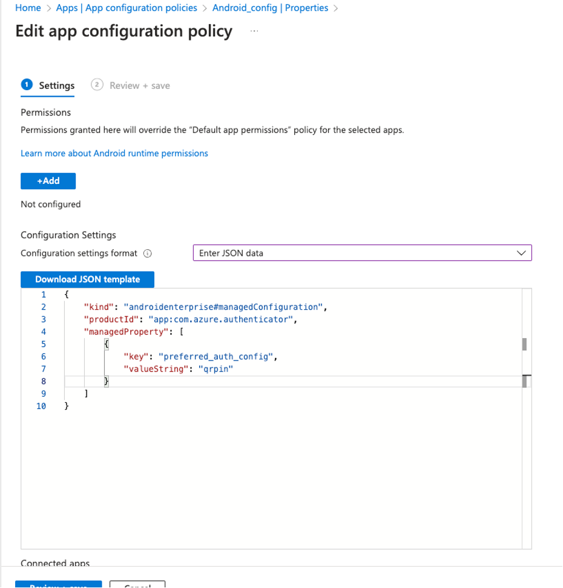
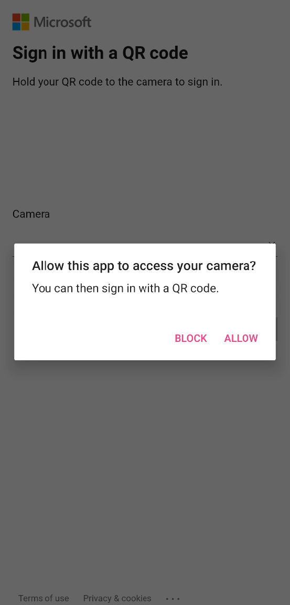

# Set up optimized QR code authentication experience in Android app

QR code authentication method enables frontline workers to sign in quickly and easily in apps on shared device. Users are able to use unique QR code provided by their admins and enter their PIN to sign in, eliminating the need to enter usernames and passwords.

You can use QR code web sign-in experience available at *login.microsoft.com*. This user entry point doesn't require any developer changes. Users select **Sign in options** > **Sign in to an organization** > **Sign in with a QR code**. You can optimize QR code sign-in experience by providing the entry point at your sign in page, eliminating two user clicks. To take advantage of QR code authentication method, app developers and [Authentication Policy Administrator](/entra/identity/role-based-access-control/permissions-reference) work together:

- App developers integrate QR code authentication's optimized entry point in their app using the Microsoft Authentication Library for Android (MSAL).
- Authentication Policy Administrator configures the [authentication method](/entra/identity/authentication/how-to-authentication-qr-code) in Microsoft Entra ID.

## Configure your app to use QR code authentication

To configure your app to use QR code authentication, you need to set the `PreferredAuthMethod` to QR in the `AcquireTokenParameters` object. The following code snippet shows how to configure your app to use QR code authentication:

```java 
final AcquireTokenParameters acquireTokenParameters = 
    new AcquireTokenParameters.Builder()
    .startAuthorizationFromActivity(activity)
    .withLoginHint(requestOptions.getLoginHint())
     .forAccount(requestOptions.getAccount())
     .withPrompt(requestOptions.getPrompt())
     .withPreferredAuthMethod(PreferredAuthMethod.QR)
     .withCallback(getAuthenticationCallback(callback))
     .build(); 
```


The `PreferredAuthMethod` is set to `PreferredAuthMethod.QR`, which specifies that the QR code authentication method should be used. This method allows users to authenticate by scanning a QR code and entering their pin.

Once you have configured the `AcquireTokenParameters` object, you can call the `acquireToken` method to start the authentication process. The following code snippet shows how to acquire a token using the `AcquireTokenParameters` object:

```java
// Create the MultipleAccountPublicClientApplication instance with the given configuration
final MultipleAccountPublicClientApplication mpca = new MultipleAccountPublicClientApplication(config);

// Pass the acquireTokenParameters object to the acquireToken function
mpca.acquireToken(acquireTokenParameters);

```

This initiates the token acquisition process using the specified parameters, including the preferred QR code authentication method.

## Get preferred authentication method

The QR code authentication method is configured by the Authentication Policy Administrator through an [app configuration policy for managed Android Enterprise devices](/mem/intune/apps/app-configuration-policies-use-android) on the Microsoft Authenticator App, setting `preferred_auth_method` equal to `qrpin`.




You can get the preferred authentication method for the current account by calling the `getPreferredAuthMethod` method on the `mpca` object. The following code snippet shows how to get the preferred authentication method for the current account:

```java
mpca.getPreferredAuthConfiguration()
```

The `getPreferredAuthConfiguration` method requires the Microsoft Authenticator app to be installed on the device. If the Microsoft Authenticator app isn't installed, the method returns `None`.

## Suppress camera consent prompt

By default, QR code and PIN authentication prompts users for camera permission every time they need to use the camera to scan a QR code. However, administrators can suppress this behavior and skip requesting camera permission.



This is configured by the Authentication Policy Administrator through an [app configuration policy for managed Android Enterprise devices](/mem/intune/apps/app-configuration-policies-use-android) on the Microsoft Authenticator App, setting `sdm_suppress_camera_consent` equal to `true`, similar to how the `preferred_auth_method` is configured.

When this setting is enabled:
- The app will not show the camera consent prompt if camera permissions are already granted at the OS level
- Users will have a smoother authentication experience without repeated permission requests
- The QR code scanning flow will be more streamlined for managed devices

This configuration is particularly useful in enterprise environments where devices are managed and camera permissions can be pre-configured by IT administrators.


## Related content

- [Set up QR code authentication in iOS//macOS app](ios-qr-code-pin-authentication.md)
- [Authentication methods in Microsoft Entra ID - QR code authentication method (Preview)](/entra/identity/authentication/how-to-authentication-qr-code)
