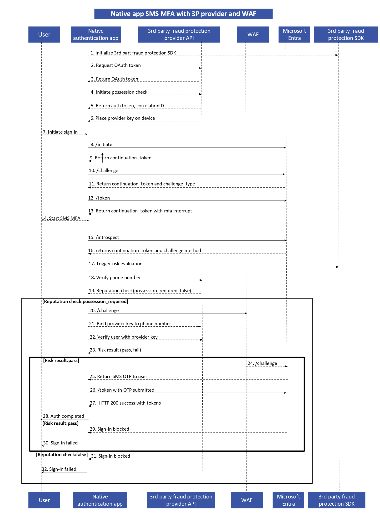

# Third-party fraud protection for native authentication with SMS MFA

Native authentication applications that use SMS-based multifactor authentication (MFA) are exposed to account takeover (ATO) and International Revenue Share Fraud (IRSF) risks. These threats commonly exploit automated traffic, compromised phone numbers, or SIM-based abuse to trigger SMS challenges at scale.

This architecture introduces third-party fraud protection into native API authentication flows to evaluate risk before an SMS MFA challenge is issued. By incorporating external risk signals—such as device intelligence and phone number reputation—the system can block high-risk sign-in attempts earlier and reduce exposure to fraud.

The following diagram illustrates the end-to-end authentication flow, showing how a native app coordinates with Microsoft Entra Native Authentication, a web application firewall (WAF), and a third-party fraud provider to gate SMS MFA based on real-time risk evaluation.

Third-party fraud protection provides an external risk signal that complements native authentication controls. The provider evaluates whether a phone number is genuinely associated with a real user and device, rather than a virtual environment, emulator, or automated system.

This evaluation is performed passively using device intelligence, phone reputation, and behavioral signals. The result determines whether the authentication flow can proceed to SMS MFA or should be blocked.

## Device possession and phone number reputation

A key capability of the third-party provider is establishing a trusted link between a device and a phone number. This is achieved by placing a device-bound key on the user’s device and later binding it to the phone number during authentication.

By validating device possession, the system mitigates fraud scenarios such as SIM-swap attacks, where an attacker ports a victim’s number to a new SIM. The possession signal strengthens confidence that the authentication request originates from a legitimate user.

## Risk evaluation and decision points

Risk evaluation occurs when SMS MFA is required during the authentication flow. Before an SMS challenge is issued, the native app triggers a reputation check through the third-party provider.
Based on the evaluation, one of the following outcomes occurs:

- Low or acceptable risk: The authentication flow proceeds, and the SMS one-time passcode (OTP) is issued.
- High risk requiring additional verification: Device possession is verified before allowing the flow to continue.
- High risk with failed evaluation: The sign-in attempt is blocked immediately, and no SMS challenge is sent.

This gating mechanism prevents unnecessary SMS delivery and reduces exposure to ATO and IRSF attacks.

## Integration with native API authentication

The third-party fraud protection does not replace native authentication endpoints. Instead, it extends the existing flow by introducing an additional risk decision point before SMS MFA.

The native authentication process continues to use standard endpoints for initiating sign-in, challenging factors, and issuing tokens. The fraud protection layer influences whether the SMS challenge is permitted based on risk signals.

## Related content

- [Native authentication overview](concept-native-authentication.md)
