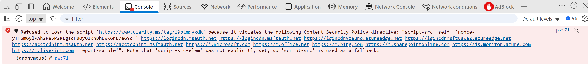

# Content Security Policy overview for Microsoft Entra ID

Content Security Policy (CSP) is a browser security header that allows only trusted scripts and resources to load. Microsoft Entra ID enforces CSP on sign-in pages as a proactive measure to block unauthorized scripts from external sources and reduce the risk of vulnerabilities stemming from script-injection attacks such as Cross-Site Scripting (XSS).

> [!IMPORTANT]
> **CSP enforcement will start globally in mid-to-late October 2026.**  
> Applies only to browser-based sign-in at `login.microsoftonline.com`. Microsoft Entra External ID customers using custom domains and MSAL/API flows are **not affected**.

Microsoft recommends not using browser extensions or tools that inject code into the Microsoft Entra sign-in experience. If you follow this advice, your experience will remain unchanged, and no further action is needed.

If you use tools or browser extensions that inject code into the Microsoft Entra sign-in page, switch to alternative tools that don’t inject code before this change is released.

For details on preparing for CSP enforcement, see [How to prepare for CSP enforcement](#how-to-prepare-for-csp-enforcement).

## Risk of script or code injection

Script or code injection occurs when malicious scripts run in a user’s browser without authorization. This vulnerability can lead to:

- **Data theft**: Attackers can steal sensitive information such as credentials or tokens.
- **Session hijacking**: Injected scripts can take control of active sessions.
- **Malware delivery**: Malicious code can install harmful software on user devices.
- **Loss of trust**: Compromised sign-in pages damage user confidence and brand reputation.

XSS is one of the most common injection attacks. It enables attackers to run malicious scripts in a user’s browser, which can steal credentials, hijack sessions, and compromise sensitive data.

CSP further helps shield against these attacks by restricting which scripts can execute in the browser. By enforcing CSP, Microsoft Entra ID allows only scripts from trusted Microsoft domains to run during authentication. 

## CSP is a defense in depth

CSP adds an important layer of defense against script injection attacks like XSS. Today, Microsoft Entra, and modern browsers already implement mechanisms to prevent malicious scripts from being injected into a website as a first and primary layer of defense. However, in cases where a script can be injected despite those mechanisms—such as through a user-installed malicious browser extension or a zero-day vulnerability—CSP prevents that script from executing. CSP achieves this by allow-listing only trusted script nonces and origins and blocking everything else by default. This defense-in-depth approach strengthens existing security measures.

## CSP enforcement scope and key details

CSP enforcement further hardens the security of the Microsoft Entra sign-in experience by only allowing scripts to run from trusted Microsoft domains. This minimizes opportunities for unauthorized external script injection. Our analysis shows most violations come from external browser extensions or injected scripts linked to third-party tools.

Here’s what you need to know about the scope and key details of CSP enforcement:

- **Header enforcement scope**: CSP enforcement applies only to browser-based sign-in experiences at `login.microsoftonline.com`. Other domains and nonbrowser authentication flows aren't affected.
- **Microsoft Authentication Library (MSAL) and API authentication**: MSAL-based authentication flows that interact with Microsoft Entra security token service (STS) APIs remain unaffected because enforcement is limited to the browser sign-in URL.
- **Microsoft Entra External ID and custom domains**: External ID customers using custom domains or CIAM domains for sign-in aren't impacted.

## Non-Microsoft tools with CSP violations

Some third-party tools may inject scripts into sign-in pages, which can cause CSP violations. When CSP is enforced on `login.microsoftonline.com`, these scripts will be blocked from executing. Users will still be able to sign in normally, but this may disrupt certain sign-in or monitoring workflows.
 
Customers using tools that rely on injected scripts should work directly with their vendors to identify and implement fixes that comply with CSP requirements.

## How to prepare for CSP enforcement

Review your sign-in experience early. Remove or migrate browser extensions and tools that inject scripts into the Microsoft Entra sign-in page. If your organization relies on such tools, work with vendors to adopt compliant alternatives before rollout. 

Test sign-in flows ahead of time to identify and resolve violations, minimize disruption, and keep your users’ experience seamless. Use the instructions below to identify the exact effect in your tenant.

- **Step 1**: Go through a sign-in flow with the dev console open to identify any violations.
- **Step 2**: Review the information about the violation displayed in red. If a specific team or person caused the violation, it appears only in their flows. To ensure accuracy, thoroughly assess different sign-in scenarios within your organization. Here's an example of a violation:

    

This update to our CSP adds an extra layer of protection by blocking unauthorized scripts, further helping safeguard your organization against evolving security threats. To ensure a smooth rollout, test your sign-in flow thoroughly ahead of time. This helps you catch and address any issues early, so your users stay protected, and your sign-in experience remains seamless. 

