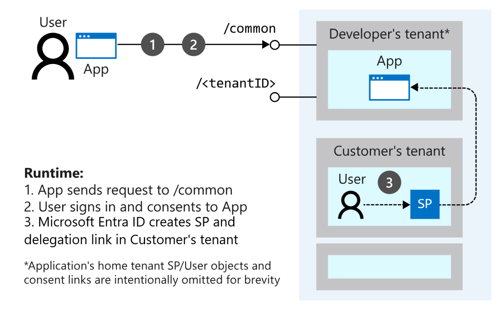

# Convert single-tenant app to multitenant on Microsoft Entra ID

If you offer a Software as a Service (SaaS) application to many organizations, you can configure your application to accept sign-ins from any Microsoft Entra tenant by converting it to multitenant. Users in any Microsoft Entra tenant will be able to sign in to your application after consenting to use their account with your application.

For existing apps with its own account system (or other sign-ins from other cloud providers), you should add sign-in code via OAuth2, OpenID Connect, or Security Assertion Markup Language (SAML), and put a ["Sign in with Microsoft" button](howto-add-branding-in-apps.md) in your application.

In this how-to guide, you undertake the four steps needed to convert a single tenant app into a Microsoft Entra multitenant app:

1. [Update your application registration to be multitenant](#update-registration-to-be-multitenant)
2. [Update your code to send requests to the `/common` endpoint](#update-your-code-to-send-requests-to-common)
3. [Update your code to handle multiple issuer values](#update-your-code-to-handle-multiple-issuer-values)
4. [Understand user and admin consent and make appropriate code changes](#understand-user-and-admin-consent-and-make-appropriate-code-changes)

If you want to try using one of our samples, refer to [Build a multitenant SaaS web application that calls Microsoft Graph using Microsoft Entra ID and OpenID Connect](https://github.com/Azure-Samples/active-directory-aspnetcore-webapp-openidconnect-v2/blob/master/2-WebApp-graph-user/2-3-Multi-Tenant/README.md)

## Prerequisites

- A Microsoft Entra tenant. If you don't have one, you can create one in our [Quickstart: Create a new tenant in Microsoft Entra ID](/entra/fundamentals/create-new-tenant)
- An application registered in the Microsoft identity platform. If you don't have one, you can create one in our [Quickstart: Register an application with the Microsoft identity platform](quickstart-register-app.md).
- Familiarity with [Tenancy in Microsoft Entra ID](./single-and-multi-tenant-apps.md).
- An integrated development environment (IDE) that enables you to edit your application code.

## Update registration to be multitenant

By default, web app/API registrations in Microsoft Entra ID are single-tenant upon creation. To make the registration multitenant, sign in to the [Microsoft Entra admin center](https://entra.microsoft.com) and select the app registration that you want to update. With the app registration open, select the **Authentication** pane and navigate to the **Supported account types** section. Change the setting to **Accounts in any organizational directory**.

When a single-tenant application is created in the Microsoft Entra admin center, one of the items listed on the **Overview** page is the **Application ID URI**. This is one of the ways an application is identified in protocol messages, and can be added at any time. The App ID URI for single tenant apps can be globally unique within that tenant. In contrast, for multitenant apps it must be globally unique across all tenants, ensuring that Microsoft Entra ID can find the app across all tenants.

For example, if the name of your tenant was `contoso.onmicrosoft.com` then a valid App ID URI would be `https://contoso.onmicrosoft.com/myapp`. If the App ID URI doesn’t follow this pattern, setting an application as multitenant fails.

## Update your code to send requests to `/common`

With a multitenant application, the application can't immediately tell which tenant the user is from, so requests can't be sent to a tenant’s endpoint. Instead, requests are sent to a common endpoint (`https://login.microsoftonline.com/common`) that serves across all Microsoft Entra tenants, acting as a central hub that handles requests.

Open your app in your IDE and edit your code and change the value for your tenant ID to `/common`. For SAML apps, this can be configured in the identity provider XML file. This endpoint isn't a tenant or an issuer itself. When the Microsoft identity platform receives a request on the `/common` endpoint, it signs the user in, discovering which tenant the user is from. This endpoint works with all of the authentication protocols supported by the Microsoft Entra ID (OpenID Connect, OAuth 2.0, SAML 2.0, WS-Federation).

The sign-in response to the application then contains a token representing the user. The issuer value in the token tells an application what tenant the user is from. When a response returns from the `/common` endpoint, the issuer value in the token corresponds to the user’s tenant.

> [!NOTE]
> There are, in reality 2 authorities for multitenant applications:
>
> - `https://login.microsoftonline.com/common` for applications processing accounts in any organizational directory (any Microsoft Entra directory) and personal Microsoft accounts (such as Skype, XBox).
> - `https://login.microsoftonline.com/organizations` for applications processing accounts in any organizational directory (any Microsoft Entra directory):
>
> The explanations in this document use `common`. But you can replace it by `organizations` if your application doesn't support Microsoft personal accounts.

## Update your code to handle multiple issuer values

Web applications and web APIs receive and validate tokens from the Microsoft identity platform. Native client applications don't validate access tokens and must treat them as opaque. They instead request and receive tokens from the Microsoft identity platform, and do so to send them to APIs, where they're then validated.

Multitenant applications must perform more checks when validating a token. A multitenant application is configured to consume keys metadata from `/organizations` or `/common` keys URLs. The application must validate that the `issuer` property in the published metadata matches the `iss` claim in the token, in addition to the usual check that the `iss` claim in the token contains the tenant ID (`tid`) claim. For more information, see [Validate tokens](access-tokens.md#validate-tokens).

## Understand user and admin consent and make appropriate code changes

For a user to sign in to an application in Microsoft Entra ID, the application must be represented in the user’s tenant. The organization is then allowed to do things like apply unique policies when users from their tenant sign in to the application. For a single-tenant application, one can use the registration via the [Microsoft Entra admin center](https://entra.microsoft.com).

For a multitenant application, the initial registration for the application resides in the Microsoft Entra tenant used by the developer. When a user from a different tenant signs in to the application for the first time, Microsoft Entra ID asks them to consent to the permissions requested by the application. If they consent, then a representation of the application called a *service principal* is created in the user’s tenant, and sign-in can continue. A delegation is also created in the directory that records the user’s consent to the application. For details on the application's Application and ServicePrincipal objects, and how they relate to each other, see [Application objects and service principal objects](app-objects-and-service-principals.md).



The permissions requested by the application affect the consent experience. The Microsoft identity platform supports two kinds of permissions;

- **Delegated**: This permission grants an application the ability to act as a signed in user for a subset of the things the user can do. For example, you can grant an application the delegated permission to read the signed in user’s calendar.
- **App-only**: This permission is granted directly to the identity of the application. For example, you can grant an application the app-only permission to read the list of users in a tenant, regardless of who is signed in to the application.

Regular users can consent to some permissions, while others require a tenant administrator’s consent.

To learn more about user and admin consent, see [Configure the admin consent workflow](/entra/identity/enterprise-apps/configure-admin-consent-workflow).

### Admin consent

App-only permissions always require a tenant administrator’s consent. If your application requests an app-only permission and a user tries to sign in to the application, an error message is displayed saying the user isn’t able to consent.

Certain delegated permissions also require a tenant administrator’s consent. For example, the ability to write back to Microsoft Entra ID as the signed in user requires a tenant administrator’s consent. Like app-only permissions, if an ordinary user tries to sign in to an application that requests a delegated permission that requires administrator consent, the app receives an error. The developer that published the resource determines whether a permission requires admin consent, and you can find this information in the resource's documentation. The permissions documentation for the [Microsoft Graph API](/graph/permissions-reference) indicate which permissions require admin consent.

If your application uses permissions that require admin consent, consider adding a button or link where the admin can initiate the action. The request your application sends for this action is the usual OAuth2/OpenID Connect authorization request that also includes the `prompt=consent` query string parameter. After the admin consents and the service principal is created in the customer’s tenant, subsequent sign-in requests don't need the `prompt=consent` parameter. Since the administrator has approved the requested permissions, no other users in the tenant are prompted for consent.

A tenant administrator can disable the ability for regular users to consent to applications. If this capability is disabled, admin consent is always required for the application to be used in the tenant. You can test your application with end-user consent disabled, in the Microsoft Entra admin center. In **Enterprise applications** > [Consent and permissions](https://entra.microsoft.com/#view/Microsoft_AAD_IAM/ConsentPoliciesMenuBlade/~/UserSettings), check the **Do not allow user consent** option.

The `prompt=consent` parameter can also be used by applications that request permissions that don't require admin consent. An example use case is if the application requires an experience where the tenant admin “signs up” one time, and no other users are prompted for consent from that point on.

If an application requires admin consent and an admin signs in without the `prompt=consent` parameter being sent, when the admin successfully consents to the application it applies **only for their user account**. Regular users won't able to sign in or consent to the application. This feature is useful if you want to give the tenant administrator the ability to explore your application before allowing other users access.

### Consent and multi-tier applications

Your application may have multiple tiers, with each represented by its own registration in Microsoft Entra ID. For example, a native application that calls a web API, or a web application that calls a web API. In both of these cases, the client (native app or web app) requests permissions to call the resource (web API). For the client to be successfully consented into a customer’s tenant, all resources to which it requests permissions must already exist in the customer’s tenant. If this condition isn’t met, Microsoft Entra ID returns an error that the resource must be added first.

#### Multiple tiers in a single tenant

If your logical application consists of two or more application registrations, for example a separate client and resource, you can encounter some problems. For example, how do you get the resource into the external tenant first? Microsoft Entra ID covers this case by enabling client and resource to be consented in a single step. The user sees the sum total of the permissions requested by both the client and resource on the consent page. To enable this behavior, the resource’s application registration must include the client’s App ID as a `knownClientApplications` in its [application manifest](./reference-app-manifest.md). For example:

```json
"knownClientApplications": ["12ab34cd-56ef-78gh-90ij11kl12mn"]
```

You can refer to the [multitenant application sample](https://github.com/Azure-Samples/active-directory-aspnetcore-webapp-openidconnect-v2/blob/master/2-WebApp-graph-user/2-3-Multi-Tenant/README.md) for a demonstration. The following diagram provides an overview of consent for a multi-tier app registered in a single tenant.


#### Multiple tiers in multiple tenants

A similar case happens if the different tiers of an application are registered in different tenants. For example, consider the case of building a native client application that calls the Exchange Online API. To develop the native application, and later for the native application to run in a customer’s tenant, the Exchange Online service principal must be present. Here, the developer and customer must purchase Exchange Online for the service principal to be created in their tenants.

If it's an API built by an organization other than Microsoft, the developer of the API needs to provide a way for their customers to consent the application into their customers' tenants. The recommended design is for the third-party developer to build the API such that it can also function as a web client to implement sign-up. You can;

1. Follow the earlier sections to ensure the API implements the multitenant application registration/code requirements.
2. In addition to exposing the API's scopes/roles, make sure the registration includes the "Sign in and read user profile" permission (provided by default).
3. Implement a sign-in/sign-up page in the web client and follow the [admin consent](#admin-consent) guidance.
4. Once the user consents to the application, the service principal and consent delegation links are created in their tenant, and the native application can get tokens for the API.

The following diagram provides an overview of consent for a multi-tier app registered in different tenants.


### Revoking consent

Users and administrators can revoke consent to your application at any time:

* Users revoke access to individual applications by removing them from their [Access Panel Applications](https://myapps.microsoft.com) list.
* Administrators revoke access to applications by removing them using the [Enterprise applications](https://entra.microsoft.com/#view/Microsoft_AAD_IAM/StartboardApplicationsMenuBlade/~/AppAppsPreview) section of the Microsoft Entra admin center. Select the application and navigate to the **Permissions** tab to revoke access.

If an administrator consents to an application for all users in a tenant, users can't revoke access individually. Only the administrator can revoke access, and only for the whole application.

## Multitenant applications and caching access tokens

Multitenant applications can also get access tokens to call APIs that are protected by Microsoft Entra ID. A common error when using the Microsoft Authentication Library (MSAL) with a multitenant application is to initially request a token for a user using `/common`, receive a response, then request a subsequent token for that same user also using `/common`. Because the response from Microsoft Entra ID comes from a tenant, not `/common`, MSAL caches the token as being from the tenant. The subsequent call to `/common` to get an access token for the user misses the cache entry, and the user is prompted to sign in again. To avoid missing the cache, make sure subsequent calls for an already signed in user are made to the tenant’s endpoint.

## See also

* [Multitenant application sample](https://github.com/Azure-Samples/active-directory-aspnetcore-webapp-openidconnect-v2/blob/master/2-WebApp-graph-user/2-3-Multi-Tenant/README.md)
* [Application objects and service principal objects](app-objects-and-service-principals.md)
* [Integrating applications with Microsoft Entra ID](./quickstart-register-app.md)
* [Overview of the Consent Framework](./application-consent-experience.md)
* [Microsoft Graph API permission scopes](/graph/permissions-reference)
* [Access tokens](access-tokens.md)
* [Microsoft Graph API](/graph/)
