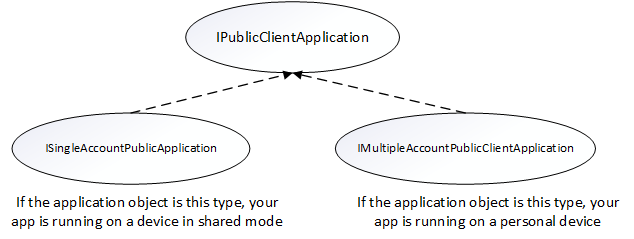
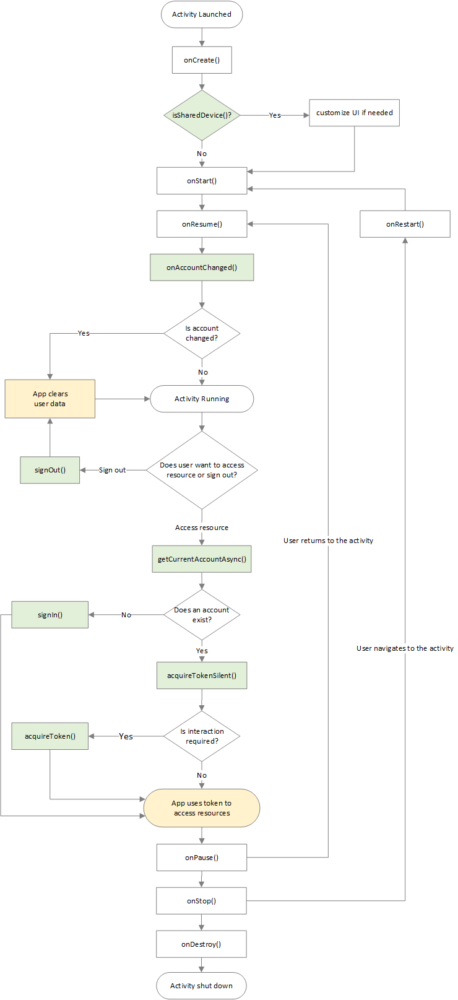

# Shared device mode for Android devices

Frontline workers such as retail associates, flight crew members, and field service workers often use a shared mobile device to perform their work. These shared devices can present security risks if your users share their passwords or PINs, intentionally or not, to access customer and business data on the shared device.

[Shared device mode](/entra/identity-platform/msal-shared-devices) allows you to configure an Android 8.0 or higher device such that employees can securely share the device. Employees can sign-in once and get single sign-on (SSO) to all apps that support this feature, giving them faster access to information. When employees sign out after completing their shift or task, they're automatically signed out of the device and all supported applications, making the device ready for the next user.

To take advantage of the Shared Device Mode feature, app developers and cloud device administrators work together:

1. **Device administrators** prepare the device to be shared manually or by using a mobile device management (MDM) provider like Microsoft Intune. The preferred option is using an MDM as it allows the device setup in shared device mode at scale via zero-touch provisioning. The MDM pushes the [Microsoft Authenticator app](https://support.microsoft.com/account-billing/how-to-use-the-microsoft-authenticator-app-9783c865-0308-42fb-a519-8cf666fe0acc) to the devices and turns on "Shared Mode" for each device through a managed configuration update to the device. This Shared Mode setting is what changes the behavior of the supported apps on the device. This configuration from the MDM provider sets the shared device mode for the device and triggers shared device registration using the Authenticator App.

2. **Application developers** write a single-account app (multiple-account apps aren't supported in shared device mode) to handle the following scenario:

   - Sign in a user device-wide through any supported application
   - Sign out a user device-wide through any supported application
   - Query the state of the device to determine if your application is on a device that's in shared device mode
   - Query the device state of the user to determine any changes in your application since the last use

   Supporting shared device mode should be considered a feature upgrade for your application, and can help increase its adoption in environments where the same device is used among multiple users.

   > [!IMPORTANT]
   > [Microsoft applications](#microsoft-applications-that-support-shared-device-mode) that support shared device mode on Android don't require any changes and just need to be installed on the device to get the benefits that come with shared device mode.

## Set up device in Shared Device Mode

To configure your Android device to support shared device mode, it should be running Android OS 8.0 or later. The device should also be wiped by either factory reset or have all Microsoft and other shared device mode enabled apps uninstalled and reinstalled.

Microsoft Intune supports zero-touch provisioning for devices in Microsoft Entra shared device mode, which means that the device can be set up and enrolled in Intune with minimal interaction from the frontline worker. To set up device in shared device mode when using Microsoft Intune as the MDM, see [Set up enrollment for devices in Microsoft Entra shared device mode](/mem/intune/enrollment/automated-device-enrollment-shared-device-mode/).


## Modify your Android application to support shared device mode

Your users depend on you to ensure their data isn't leaked to another user. The following sections provide helpful signals to indicate to your application that a change has occurred and should be handled.
You're responsible for checking the state of the user on the device every time your app is used, and then clearing the previous user's data. This includes if it's reloaded from the background in multi-tasking.
On a user change, you should ensure both the previous user's data is cleared and that any cached data being displayed in your application is removed. We highly recommend you and your company conduct a security review process after updating your app to support shared device mode.  

### Add the Microsoft Authentication Library (MSAL) SDK to your application's dependencies

Add the MSAL library as a dependency in your build.gradle file, like so:

```gradle
dependencies{
  implementation 'com.microsoft.identity.client.msal:5.+'
}
```

### Configure your app to use shared-device mode
Applications written using the Microsoft Authentication Library (MSAL) SDK can manage a single account or multiple accounts. For details, see [single-account mode or multiple-account mode](single-multi-account.md). Shared device mode apps only work in single-account mode. 

If you aren't planning to support multiple-account mode, set `"account_mode"` to `"SINGLE"` in your msal config file. This guarantees that your app will always get `ISingleAccountPublicClientApplication`, and significantly simplifies your MSAL integration. The default value of `"account_mode"` is `"MULTIPLE"`, so it's important to change this value in the config file if you're using `"single account"` mode.

Here's an example of the configuration file:

```json
{
  "client_id": "Client ID after app registration at https://aka.ms/MobileAppReg",
  "authorization_user_agent": "WEBVIEW",
  "redirect_uri": "Redirect URI after app registration at https://aka.ms/MobileAppReg",
  "account_mode": "SINGLE",
  "broker_redirect_uri_registered": true,
  "authorities": [
    {
      "type": "AAD",
      "audience": {
        "type": "AzureADandPersonalMicrosoftAccount",
        "tenant_id": "common"
      }
    }
  ]
}
```
Refer to the [configuration documentation](./msal-configuration.md) for more information on setting up your config file.

#### Supporting both single-account and multiple-accounts

Your app can be built to support running on both personal devices and shared devices. If your app currently supports multiple accounts and you want to support shared device mode, add support for single account mode.

You may also want your app to change its behavior depending on the type of device it's running on. Use `ISingleAccountPublicClientApplication.isSharedDevice()` to determine when to run in single-account mode.

There are two different interfaces that represent the type of device your application is on. When you request an application instance from MSAL's application factory, the correct application object is provided automatically.

The following object model illustrates the type of object you may receive and what it means in the context of a shared device:



You need to do a type check and cast to the appropriate interface when you get your `PublicClientApplication` object. The following code checks for multiple account modes or single account modes, and casts the application object appropriately:

```java
private IPublicClientApplication mApplication;

        // Running in personal-device mode?
        if (mApplication instanceOf IMultipleAccountPublicClientApplication) {
          IMultipleAccountPublicClientApplication multipleAccountApplication = (IMultipleAccountPublicClientApplication) mApplication;
          ...
        // Running in shared-device mode?
        } else if (mApplication instanceOf ISingleAccountPublicClientApplication) {
           ISingleAccountPublicClientApplication singleAccountApplication = (ISingleAccountPublicClientApplication) mApplication;
            ...
        }
```

The following differences apply depending on whether your app is running on a shared or personal device:

|                             | Shared mode device | Personal device                                                                                     |
| --------------------------- | ------------------ | --------------------------------------------------------------------------------------------------- |
| **Accounts**                | Single account     | Multiple accounts                                                                                   |
| **Sign-in**                 | Global             | Global                                                                                              |
| **Sign-out**                | Global             | Each application can control if the sign-out is local to the app. |
| **Supported account types** | Work accounts only | Personal and work accounts supported                                                                |

### Initialize the PublicClientApplication object

If you set `"account_mode":"SINGLE"` in the MSAL config file, you can safely cast the returned application object as an `ISingleAccountPublicCLientApplication`.

```java
private ISingleAccountPublicClientApplication mSingleAccountApp;

PublicClientApplication.create(
    this.getApplicationCOntext(),
    R.raw.auth_config_single_account,
    new PublicClientApplication.ApplicationCreatedListener() {

        @Override
        public void onCreated(IPublicClientApplication application){
            mSingleAccountApp = (ISingleAccountPublicClientApplication)application;
        }

        @Override
        public void onError(MsalException exception){
            /*Fail to initialize PublicClientApplication */
        }
    });
```

### Detect shared device mode

Detecting shared device mode is important for your application. Many applications require a change in their user experience (UX) when the application is used on a shared device. For example, your application might have a "Sign-Up" feature, which isn't appropriate for a frontline worker because they likely already have an account. You may also want to add extra security to your application's handling of data if it's in shared device mode.

Use the `isSharedDevice` API in the `IPublicClientApplication` to determine if an app is running on a device in shared device mode.

The following code snippets show examples of using the `isSharedDevice` API.

```Java
deviceModeTextView.setText(mSingleAccountApp.isSharedDevice() ? "Shared" : "Non-Shared");
```


### Get the signed-in user and determine if a user has changed on the device

Another important part of supporting shared device mode is determining the state of the user on the device and clearing application data if a user has changed or if there's no user at all on the device. You're responsible for ensuring data isn't leaked to another user.

You can use `getCurrentAccountAsync` API to query the currently signed-in account on the device.

The `loadAccount` method retrieves the account of the signed in user. The `onAccountChanged` method determines if the signed-in user has changed, and if so, clean up:

```java
private void loadAccount()
{
  mSingleAccountApp.getCurrentAccountAsync(new ISingleAccountPublicClientApplication.CurrentAccountCallback())
  {
    @Override
    public void onAccountLoaded(@Nullable IAccount activeAccount)
    {
      if (activeAccount != null)
      {
        signedInUser = activeAccount;
        mSingleAccountApp.acquireTokenSilentAsync(SCOPES,"http://login.microsoftonline.com/common",getAuthSilentCallback());
      }
    }
    @Override
    public void onAccountChanged(@Nullable IAccount priorAccount, @Nullable Iaccount currentAccount)
    {
      if (currentAccount == null)
      {
        //Perform a cleanup task as the signed-in account changed.
        cleaUp();
      }
    }
    @Override
    public void onError(@NonNull Exception exception)
    {
        //getCurrentAccountAsync failed
    }
  }
}
```

### Globally sign in a user

When a device is configured as a shared device, your application can call the `signIn` API to sign in the account. The account will be available globally for all eligible apps on the device after the first app signs in the account.

```java
final SignInParameters signInParameters = ... /* create SignInParameters object */
mSingleAccountApp.signIn(signInParameters);
```

### Globally sign out a user

The following code removes the signed-in account and clears cached tokens from not only the app, but also from the device that's in shared device mode. It doesn't, however, clear the _data_ from your application. You must clear the data from your application, and clear any cached data your application may be displaying to the user.

```java
mSingleAccountApp.signOut(new ISingleAccountPublicClientApplication.SignOutCallback() {
    @Override
    public void onSignOut() {
        // clear data from your application
    }

    @Override
    public void onError(@NonNull MsalException exception) {
        // signout failed, show error
    }
});
```

### Receive broadcast to detect global sign out initiated from other applications

To receive the account change broadcast, you need to register a broadcast receiver. It’s recommended to register your broadcast receiver via the [Context-registered receivers](https://developer.android.com/guide/components/broadcasts#context-registered-receivers).

When an account change broadcast is received, immediately [get the signed in user and determine if a user has changed on the device](#get-the-signed-in-user-and-determine-if-a-user-has-changed-on-the-device). If a change is detected, initiate data cleanup for previously signed-in account. It's recommended to properly stop any operations and do data cleanup.

The following code snippet shows how you could register a broadcast receiver.

```java
private static final String CURRENT_ACCOUNT_CHANGED_BROADCAST_IDENTIFIER = "com.microsoft.identity.client.sharedmode.CURRENT_ACCOUNT_CHANGED";
private BroadcastReceiver mAccountChangedBroadcastReceiver;
private void registerAccountChangeBroadcastReceiver(){
    mAccountChangedBroadcastReceiver = new BroadcastReceiver() {
        @Override
        public void onReceive(Context context, Intent intent) {
            //INVOKE YOUR PRIOR ACCOUNT CLEAN UP LOGIC HERE
        }
    };
    IntentFilter filter = new

    IntentFilter(CURRENT_ACCOUNT_CHANGED_BROADCAST_IDENTIFIER);
    this.registerReceiver(mAccountChangedBroadcastReceiver, filter);
}
```

## Microsoft applications that support shared device mode

These Microsoft applications support Microsoft Entra shared device mode:

- [Microsoft Teams](/microsoftteams/platform/)
- [Microsoft Viva Engage](/viva/engage/overview) (previously [Yammer](/viva/engage/overview))
- [Outlook](/mem/intune/apps/app-configuration-policies-outlook) (in Public Preview)
- [Microsoft Power Apps](/power-apps/)
- [Microsoft 365](https://apps.apple.com/us/app-bundle/microsoft-365/id1450038993?mt=12) (in Public Preview)
- [Microsoft Power BI Mobile](/power-bi/consumer/mobile/mobile-app-shared-device-mode)
- [Microsoft Edge](/microsoft-edge/)

## Third-party MDMs that support shared device mode

These third-party Mobile Device Management (MDM) providers support Microsoft Entra shared device mode:

- [VMware Workspace ONE](https://blogs.vmware.com/euc/2023/08/announcing-general-availability-of-shared-device-conditional-access-with-vmware-workspace-one-and-microsoft-entra-id.html)
- [SOTI MobiControl](https://soti.net/resources/blog/2023/soti-mobicontrol-supports-microsoft-shared-device-mode/)
- [42Gears SureMDM](https://docs.42gears.com/suremdm/intergrations/integrations_reports/conditional-access-suremdm/shared-device-mode-with-microsoft-entra)

## Shared device sign-out and the overall app lifecycle

When a user signs out, you need to take action to protect the privacy and data of the user. For example, if you're building a medical records app you want to make sure that when the user signs out previously displayed patient records are cleared. Your application must be prepared for data privacy and check every time it enters the foreground.

When your app uses MSAL to sign out the user in an app running on device that is in shared mode, the signed-in account and cached tokens are removed from both the app and the device.

The following diagram shows the overall app lifecycle and common events that may occur while your app runs. The diagram covers from the time an activity launch, signing in and signing out an account, and how events such as pausing, resuming, and stopping the activity fit in.



## Next steps

Set up an Android device to run apps in shared device mode and test your app.

> [Shared device mode for Android devices](tutorial-mobile-android-device-shared-mode.md)
