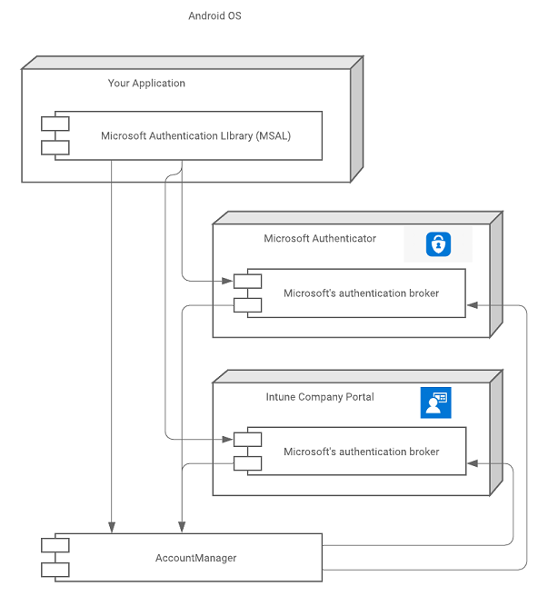
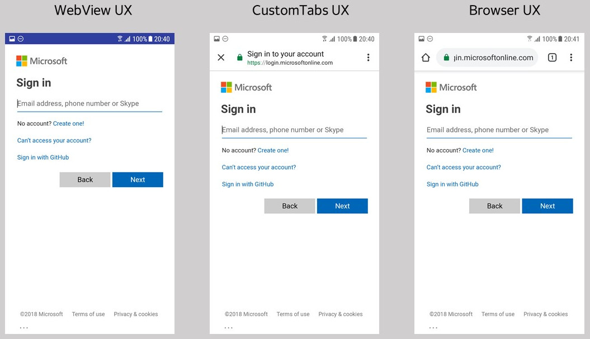

# Enable cross-app SSO on Android using MSAL

Single sign-on (SSO) allows users to only enter their credentials once and have those credentials automatically work across applications.It enhances user experience and improves security by reducing the number of passwords users need to manage, lowering the risk of password fatigue and associated vulnerabilities.

The [Microsoft identity platform](./index.yml) and the Microsoft Authentication Library (MSAL) help you enable SSO across your suite of applications. By enabling Broker capability you can extend SSO across the entire device.

In this how-to, you'll learn how to configure the SDKs used by your application to provide SSO to your customers.

## Prerequisites

This how-to assumes you know how to:

- Provision your app. For more information, see the instructions for creating an app in [the Android tutorial](./tutorial-v2-android.md#create-a-project)
- Integrate your application with the [MSAL for Android](https://github.com/AzureAD/microsoft-authentication-library-for-android)

## Methods for SSO

There are two ways for applications using MSAL for Android to achieve SSO:

- Through a [broker application](#sso-through-brokered-authentication)
- Through the [system browser](#sso-through-system-browser)

  It's recommended to use a broker application for benefits like device-wide SSO, account management, and Conditional Access. However, it requires your users to download additional applications.

## SSO through brokered authentication

We recommend that you use one of Microsoft's authentication brokers to participate in device-wide SSO and to meet organizational Conditional Access policies. Integrating with a broker provides the following benefits:

- Device SSO
- Conditional Access for:
  - Intune App Protection
  - Device Registration (Workplace Join)
  - Mobile Device Management
- Device-wide Account Management
  - via Android AccountManager & Account Settings
  - "Work Account" - custom account type

On Android, the Microsoft Authentication Broker is a component that's included in the [Microsoft Authenticator](https://play.google.com/store/apps/details?id=com.azure.authenticator), [Intune Company Portal](https://play.google.com/store/apps/details?id=com.microsoft.windowsintune.companyportal) and [Link to Windows](https://play.google.com/store/apps/details?id=com.microsoft.appmanager) apps.

The following diagram illustrates the relationship between your app, the MSAL, and Microsoft's authentication brokers.



### Installing apps that host a broker

Broker-hosting apps can be installed by the device owner from their app store (typically Google Play Store) at any time. However, some APIs (resources) are protected by Conditional Access Policies that require devices to be:

- Registered (workplace joined) and/or
- Enrolled in Device Management or
- Enrolled in Intune App Protection

If the device with above mentioned requirements doesn't already have a broker app installed, MSAL instructs the user to install one as soon as the app attempts to get a token interactively. The app will then lead the user through the steps to make the device compliant with the required policy. If there is no policy requirement, or the user is signing in with Microsoft account, then Broker app installation isn't required. 

### Effects of installing and uninstalling a broker

#### When a broker is installed

When a broker is installed on a device, all subsequent interactive token requests (calls to `acquireToken()`) are handled by the broker rather than locally by MSAL. Any SSO state previously available to MSAL isn't available to the broker. As a result, the user needs to authenticate again, or select an account from the existing list of accounts known to the device.

Installing a broker doesn't require the user to sign in again. Only when the user needs to resolve an `MsalUiRequiredException` will the next request go to the broker. `MsalUiRequiredException` can be thrown for several reasons, and needs to be resolved interactively. For example:

- The user changed the password associated with their account.
- The user's account no longer meets a Conditional Access policy.
- The user revoked their consent for the app to be associated with their account.

**Multiple brokers** - If multiple brokers are installed on a device, MSAL will identify the active broker on its own to complete the authentication process

#### When a broker is uninstalled

If there's only one broker hosting app installed, and it's removed, then the user needs to sign in again. Uninstalling the active broker removes the account and associated tokens from the device.

If Microsoft Authenticator, Intune Company Portal, or Link to Windows is uninstalled, the user *might* be asked to sign in again.

### Integrating with a broker

#### Generate a redirect URI for a broker

[!INCLUDE [portal updates](~/includes/portal-update.md)]

You must register a redirect URI that is compatible with the broker. The redirect URI for the broker should include your app's package name and the Base64-encoded representation of your app's signature.

The format of the redirect URI is: `msauth://<yourpackagename>/<base64urlencodedsignature>`

You can use [keytool](https://manpages.debian.org/buster/openjdk-11-jre-headless/keytool.1.en.html) to generate a Base64-encoded signature hash using your app's signing keys, and then generate your redirect URI using that hash.

Linux and macOS:

```bash
keytool -exportcert -alias androiddebugkey -keystore ~/.android/debug.keystore | openssl sha1 -binary | openssl base64
```

Windows:

```powershell
keytool -exportcert -alias androiddebugkey -keystore %HOMEPATH%\.android\debug.keystore | openssl sha1 -binary | openssl base64
```

Once you've generated a signature hash with *keytool*, use the Azure portal to generate the redirect URI:

1. Sign in to the [Microsoft Entra admin center](https://entra.microsoft.com) as at least a [Cloud Application Administrator](~/identity/role-based-access-control/permissions-reference.md#cloud-application-administrator).
1. If you have access to multiple tenants, use the **Settings** icon :::image type="icon" source="media/common/admin-center-settings-icon.png" border="false"::: in the top menu to switch to the tenant containing the app registration from the **Directories + subscriptions** menu.
1. Browse to **Identity** > **Applications** > **App registrations**.
1. Select your application, and then select **Authentication** > **Add a platform** > **Android**.
1. In the **Configure your Android app** pane that opens, enter the **Signature hash** that you generated earlier and a **Package name**.
1. Select the **Configure** button.

The redirect URI is generated for you and is displayed in the **Android configuration** pane's **Redirect URI** field.

For more information about signing your app, see [Sign your app](https://developer.android.com/studio/publish/app-signing) in the Android Studio User Guide.

#### Configure MSAL to use a broker

To use a broker in your app, you must attest that you've configured your broker redirect. For example, include both your broker enabled redirect URI--and indicate that you registered it--by including the following settings in your MSAL configuration file:

```json
"redirect_uri" : "<yourbrokerredirecturi>",
"broker_redirect_uri_registered": true
```

#### Broker-related exceptions

MSAL communicates with the broker in two ways:

- Broker bound service
- Android AccountManager

MSAL first uses the broker-bound service because calling this service doesn't require any Android permissions. If binding to the bound service fails, MSAL uses the Android AccountManager API. MSAL only does so if your app has already been granted the `"READ_CONTACTS"` permission.

If you get an `MsalClientException` with error code `"BROKER_BIND_FAILURE"`, then there are two options:

- Ask the user to disable power optimization for the Microsoft Authenticator app and the Intune Company Portal.
- Ask the user to grant the `"READ_CONTACTS"` permission

### Verify broker integration

It might not be immediately clear that broker integration is working, but you can use the following steps to check:

1. On your Android device, complete a request using the broker.
1. In the settings on your Android device, look for a newly created account corresponding to the account that you authenticated with. The account should be of type *Work account*.

You can remove the account from settings if you want to repeat the test.

## SSO through system browser

Android applications have the option to use the `WEBVIEW`, system browser, or Chrome Custom Tabs for authentication user experience. If the application isn't using brokered authentication, it needs to use the system browser rather than the native webview in order to achieve SSO.

### Authorization agents

Choosing a specific strategy for authorization agents is important and represents additional functionality apps can customize. We recommend using 'WEBVIEW'. To know more about other confguration values (see [Understand the Android MSAL configuration file](msal-configuration.md).

MSAL supports authorization using a `WEBVIEW`, or the system browser. The image below shows how it looks using the `WEBVIEW`, or the system browser with CustomTabs or without CustomTabs:



### SSO implications


If the application uses a `WEBVIEW` strategy without integrating with brokered auth into their app, users won't have a single sign-on experience across the device or between native apps and web apps.

Appplications can be integrated with MSAL to use the `BROWSER` to authorize. Unlike WEBVIEW, `BROWSER` share a cookie jar with the default system browser enabling fewer sign-ins with web or other native apps that have integrated with Custom Tabs.

If the application uses MSAL with a broker like Microsoft Authenticator, Intune Company Portal, or Link to Windows, then users can have SSO experience across applications if they have an active sign-in with one of the apps.

> [!NOTE]
> MSAL with broker utilizes WebView and provides Single Sign-On (SSO) for all the applications consuming MSAL library and participating in brokered auth. The SSO state from broker is not extended to other apps which do not use MSAL.

### WebView

To use the in-app WebView, put the following line in the app configuration JSON that is passed to MSAL:

```json
"authorization_user_agent" : "WEBVIEW"
```

When using the in-app `WEBVIEW`, the user signs in directly to the app. The tokens are kept inside the sandbox of the app and aren't available outside the app's cookie jar. As a result, the user can't have SSO experience across applications unless the apps integrate with the Microsoft Authenticator app, Intune Company Portal or Link to Windows.

However, `WEBVIEW` does provide the capability to customize the look and feel for sign-in UI. See [Android WebViews](https://developer.android.com/reference/android/webkit/WebView) for more about how to do this customization.

### Browser

We recommend using WEBVIEW, though we provide option to use browser and a [custom tabs](https://developer.chrome.com/multidevice/android/customtabs) strategy. You can explicitly indicate this strategy  by using the following JSON configuration in the custom configuration file:

```json
"authorization_user_agent" : "BROWSER"
```

Use this approach to provide SSO experience through the device's browser. MSAL uses a shared cookie jar, which allows other native apps or web apps to achieve SSO on the device by using the persist session cookie set by MSAL.

### Browser selection heuristic

Because it's impossible for MSAL to specify the exact browser package to use on each of the broad array of Android phones, MSAL implements a browser selection heuristic that tries to provide the best cross-device SSO.

MSAL primarily retrieves the default browser from the package manager and checks if it is in a tested list of safe browsers. If not, MSAL falls back on using the Webview rather than launching another non-default browser from the safe list. The default browser is chosen regardless of whether it supports custom tabs. If the browser supports Custom Tabs, MSAL launches the Custom Tab. Custom Tabs have a look and feel closer to an in-app `WebView` and allow basic UI customization. See [Custom Tabs in Android](https://developer.chrome.com/multidevice/android/customtabs) to learn more.

If there are no browser packages on the device, MSAL uses the in-app `WebView`. If the device default setting isn't changed, the same browser should be launched for each sign-in to ensure SSO experience.

#### Tested Browsers

The following browsers have been tested to see if they correctly redirect to the `"redirect_uri"` specified in the configuration file:

| Device              | Built-in Browser |                     Chrome |          Opera | Microsoft Edge |     UC Browser |        Firefox |
| ------------------- | :--------------: | -------------------------: | -------------: | -------------: | -------------: | -------------: |
| Nexus 4 (API 17)    |       pass       |                       pass | not applicable | not applicable | not applicable | not applicable |
| Samsung S7 (API 25) | pass<sup>1</sup> |                       pass |           pass |           pass |           fail |           pass |
| Vivo (API 26)       |       pass       |                       pass |           pass |           pass |           pass |           fail |
| Pixel 2 (API 26)    |       pass       |                       pass |           pass |           pass |           fail |           pass |
| Oppo                |       pass       | not applicable<sup>2</sup> | not applicable | not applicable | not applicable | not applicable |
| OnePlus (API 25)    |       pass       |                       pass |           pass |           pass |           fail |           pass |
| Nexus (API 28)      |       pass       |                       pass |           pass |           pass |           fail |           pass |
| MI                  |       pass       |                       pass |           pass |           pass |           fail |           pass |

<sup>1</sup>Samsung's built-in browser is Samsung Internet.<br/>
<sup>2</sup>The default browser can't be changed inside the Oppo device setting.

## Next steps

[Shared device mode for Android devices](msal-android-shared-devices.md) allows you to configure an Android device so that it can be easily shared by multiple employees.

For more information on broker applications go to following pages:
- [Microsoft Authenticator](https://support.microsoft.com/account-billing/how-to-use-the-microsoft-authenticator-app-9783c865-0308-42fb-a519-8cf666fe0acc)
- [Intune Company Portal](/mem/intune/user-help/sign-in-to-the-company-portal)
- [Link to Windows](https://aka.ms/LTWBroker)
