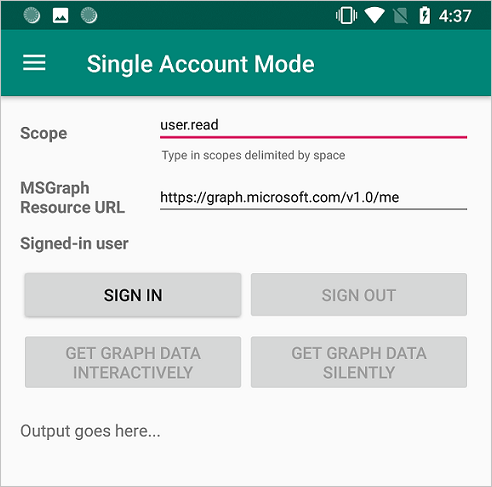
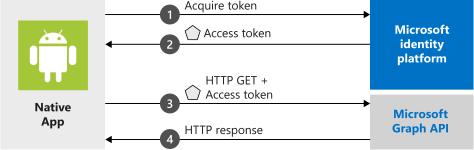
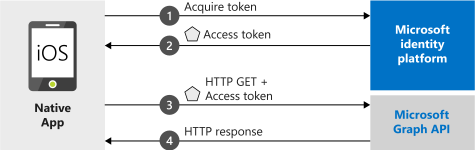

# Quickstart: Sign in users in a sample mobile app

[!INCLUDE [applies-to-workforce-external](../external-id/includes/applies-to-workforce-external.md)]

[!INCLUDE [select-tenant-type-statement](./includes/select-tenant-type-statement.md)]

::: zone pivot="workforce"

#### [Android](#tab/android-workforce)

In this quickstart, you download and run a code sample that demonstrates how an Android application can sign in users and get an access token to call the Microsoft Graph API.

Applications must be represented by an app object in Microsoft Entra ID so that the Microsoft identity platform can provide tokens to your application.

#### [iOS/macOS](#tab/ios-macos-workforce)

In this quickstart, you download and run a code sample that demonstrates how a native iOS or macOS application can sign in users and get an access token to call the Microsoft Graph API.

The quickstart applies to both iOS and macOS apps. Some steps are needed only for iOS apps and will be indicated as such.

---

## Prerequisites

* An Azure account with an active subscription. If you don't already have one, [Create an account for free](https://azure.microsoft.com/free/?WT.mc_id=A261C142F).
* This Azure account must have permissions to manage applications. Any of the following Microsoft Entra roles include the required permissions:
  * Application Administrator
  * Application Developer
* A workforce tenant. You can use your Default Directory or [set up a new tenant](./quickstart-create-new-tenant.md).

#### [Android](#tab/android-workforce)

* Register a new app in the [Microsoft Entra admin center](https://entra.microsoft.com), configured for *Accounts in any organizational directory and personal Microsoft accounts*. Refer to [Register an application](quickstart-register-app.md) for more details. Record the following values from the application **Overview** page for later use:
  * Application (client) ID 
  * Directory (tenant) ID
* Android Studio
* Android 16+

#### [iOS/macOS](#tab/ios-macos-workforce)

* Register a new app in the [Microsoft Entra admin center](https://entra.microsoft.com), configured for *Accounts in this organizational directory only*. Refer to [Register an application](quickstart-register-app.md) for more details. Record the following values from the application **Overview** page for later use:
  * Application (client) ID 
  * Directory (tenant) ID
* XCode 10+
* iOS 10+
* macOS 10.12+

---

## Add a redirect URI

You must configure specific redirect URIs in your app registration to ensure compatibility with the downloaded code sample. These URIs are essential for redirecting users back to the app after they successfully sign in.

#### [Android](#tab/android-workforce)

1. Under **Manage**, select **Authentication** > **Add a platform** > **Android**.
1. Enter your project's Package Name based on the sample type you downloaded above.
   - Java sample - `com.azuresamples.msalandroidapp`
   - Kotlin sample - `com.azuresamples.msalandroidkotlinapp`
1. In the **Signature hash** section of the **Configure your Android app** pane, select **Generating a development Signature Hash.** and copy the KeyTool command to your command line.

   - KeyTool.exe is installed as part of the Java Development Kit (JDK). You must also install the OpenSSL tool to execute the KeyTool command. For more information, see [Android documentation on generating a key](https://developer.android.com/studio/publish/app-signing#generate-key) for more information.

1. Enter the **Signature hash** generated by KeyTool.
1. Select **Configure** and save the **MSAL Configuration** that appears in the **Android configuration** pane so you can enter it when you configure your app later.
1. Select **Done**.

#### [iOS/macOS](#tab/ios-macos-workforce)

1. Under **Manage**, select **Authentication** > **Add Platform** > **iOS**.
1. Enter the **Bundle Identifier** for your application. The bundle identifier is a unique string that uniquely identifies your application, for example `com.<yourname>.identitysample.MSALMacOS`. Make a note of the value you use. Note that the iOS configuration is also applicable to macOS applications.
1. Select **Configure** and save the **MSAL Configuration** details for later in this quickstart.
1. Select **Done**.

---

## Download the sample app

### [Android](#tab/android-workforce)

- Java: [Download the code](https://github.com/Azure-Samples/ms-identity-android-java/archive/master.zip).
- Kotlin: [Download the code](https://github.com/Azure-Samples/ms-identity-android-kotlin/archive/master.zip).

### [iOS/macOS](#tab/ios-macos-workforce)

Download the sample project

- [Download the code sample for iOS](https://github.com/Azure-Samples/active-directory-ios-swift-native-v2/archive/master.zip)
- [Download the code sample for macOS](https://github.com/Azure-Samples/active-directory-macOS-swift-native-v2/archive/master.zip)

### Install dependencies

1. Extract the zip file.
1. In a terminal window, navigate to the folder with the downloaded code sample and run `pod install` to install the latest MSAL library.

---

## Configure the sample application

#### [Android](#tab/android-workforce)

1. In Android Studio's project pane, navigate to **app\src\main\res**.
1. Right-click **res** and choose **New** > **Directory**. Enter `raw` as the new directory name and select **OK**.
1. In **app** > **src** > **main** > **res** > **raw**, go to JSON file called `auth_config_single_account.json` and paste the MSAL Configuration that you saved earlier.

   Below the redirect URI, paste:

   ```json
     "account_mode" : "SINGLE",
   ```

   Your config file should resemble this example:

   ```json
   {
     "client_id": "00001111-aaaa-bbbb-3333-cccc4444",
     "authorization_user_agent": "WEBVIEW",
     "redirect_uri": "msauth://com.azuresamples.msalandroidapp/00001111%cccc4444%3D",
     "broker_redirect_uri_registered": false,
     "account_mode": "SINGLE",
     "authorities": [
       {
         "type": "AAD",
         "audience": {
           "type": "AzureADandPersonalMicrosoftAccount",
           "tenant_id": "common"
         }
       }
     ]
   }
   ```

1. Open */app/src/main/AndroidManifest.xml* file.
1. Find the placeholder:

    - `enter_the_signature_hash` and replace it with the **Signature Hash** that you generated earlier when you added the platform redirect URL.


   As this tutorial only demonstrates how to configure an app in Single Account mode, see [single vs. multiple account mode](./single-multi-account.md) and [configuring your app](./msal-configuration.md) for more information

## Run the sample app

Select your emulator, or physical device, from Android Studio's **available devices** dropdown and run the app.

The sample app starts on the **Single Account Mode** screen. A default scope, **user.read**, is provided by default, which is used when reading your own profile data during the Microsoft Graph API call. The URL for the Microsoft Graph API call is provided by default. You can change both of these if you wish.



Use the app menu to change between single and multiple account modes.

In single account mode, sign in using a work or home account:

1. Select **Get graph data interactively** to prompt the user for their credentials. You'll see the output from the call to the Microsoft Graph API in the bottom of the screen.
2. Once signed in, select **Get graph data silently** to make a call to the Microsoft Graph API without prompting the user for credentials again. You'll see the output from the call to the Microsoft Graph API in the bottom of the screen.

In multiple account mode, you can repeat the same steps. Additionally, you can remove the signed-in account, which also removes the cached tokens for that account.

#### [iOS/macOS](#tab/ios-macos-workforce)

If you selected Option 1 above, you can skip these steps.
1. Open the project in XCode.
1. Edit **ViewController.swift** and replace the line starting with 'let kClientID' with the following code snippet. Remember to update the value for `kClientID` with the clientID that you saved when you registered your app earlier in this quickstart:

   ```swift
   let kClientID = "Enter_the_Application_Id_Here"
   ```

1. If you're building an app for [Microsoft Entra national clouds](/graph/deployments#app-registration-and-token-service-root-endpoints), replace the line starting with 'let kGraphEndpoint' and 'let kAuthority' with correct endpoints. For global access, use default values:

   ```swift
   let kGraphEndpoint = "https://graph.microsoft.com/"
   let kAuthority = "https://login.microsoftonline.com/common"
   ```

1. Other endpoints are documented [here](/graph/deployments#app-registration-and-token-service-root-endpoints). For example, to run the quickstart with Microsoft Entra Germany, use following:

   ```swift
   let kGraphEndpoint = "https://graph.microsoft.de/"
   let kAuthority = "https://login.microsoftonline.de/common"
   ```

3. Open the project settings. In the **Identity** section, enter the **Bundle Identifier**.
4. Right-click **Info.plist** and select **Open As** > **Source Code**.
5. Under the dict root node, replace `Enter_the_bundle_Id_Here` with the ***Bundle Id*** that you used in the portal. Notice the `msauth.` prefix in the string.

   ```xml
   <key>CFBundleURLTypes</key>
   <array>
      <dict>
         <key>CFBundleURLSchemes</key>
         <array>
            <string>msauth.Enter_the_Bundle_Id_Here</string>
         </array>
      </dict>
   </array>
   ```

6. Build and run the app!

---

## How the sample works

#### [Android](#tab/android-workforce)



The code is organized into fragments that show how to write a single and multiple accounts MSAL app. The code files are organized as follows:

| File                                    | Demonstrates                                                                                                     |
| --------------------------------------- | ---------------------------------------------------------------------------------------------------------------- |
| MainActivity                            | Manages the UI                                                                                                   |
| MSGraphRequestWrapper                   | Calls the Microsoft Graph API using the token provided by MSAL                                                   |
| MultipleAccountModeFragment             | Initializes a multi-account application, loads a user account, and gets a token to call the Microsoft Graph API  |
| SingleAccountModeFragment               | Initializes a single-account application, loads a user account, and gets a token to call the Microsoft Graph API |
| res/auth_config_multiple_account.json   | The multiple account configuration file                                                                          |
| res/auth_config_single_account.json     | The single account configuration file                                                                            |
| Gradle Scripts/build.grade (Module:app) | The MSAL library dependencies are added here                                                                     |

We'll now look at these files in more detail and call out the MSAL-specific code in each.

#### [iOS/macOS](#tab/ios-macos-workforce)



---

## Next steps

#### [Android](#tab/android-workforce)

Move on to the Android tutorial in which you build an Android app that gets an access token from the Microsoft identity platform and uses it to call the Microsoft Graph API.

> [!div class="nextstepaction"] 
> [Tutorial: Sign in users and call the Microsoft Graph from an Android application](tutorial-v2-android.md)

#### [iOS/macOS](#tab/ios-macos-workforce)

Move on to the step-by-step tutorial in which you build an iOS or macOS app that gets an access token from the Microsoft identity platform and uses it to call the Microsoft Graph API.

> [!div class="nextstepaction"]
> [Tutorial: Sign in users and call Microsoft Graph from an iOS or macOS app](tutorial-v2-ios.md)

---


::: zone-end 

::: zone pivot="external"

The quickstart guides you in configuring sample Android, .NET MAUI Android, and iOS/macOS apps to sign in users by registering applications, setting up redirect URLs, updating configurations, and testing the app.

## Prerequisites

* An Azure account with an active subscription. If you don't already have one, [Create an account for free](https://azure.microsoft.com/free/?WT.mc_id=A261C142F).
* This Azure account must have permissions to manage applications. Any of the following Microsoft Entra roles include the required permissions:
  * Application Administrator
  * Application Developer
* An external tenant. To create one, choose from the following methods:
  * Use the [Microsoft Entra External ID extension](https://aka.ms/ciamvscode/samples/marketplace) to set up an external tenant directly in Visual Studio Code. *(Recommended)*
  * [Create a new external tenant](../external-id/customers/how-to-create-external-tenant-portal.md) in the Microsoft Entra admin center.
* Register a new app in the [Microsoft Entra admin center](https://entra.microsoft.com), configured for *Accounts in this organizational directory only*. Refer to [Register an application](quickstart-register-app.md) for more details. Record the following values from the application **Overview** page for later use:
  * Application (client) ID 
  * Directory (tenant) ID


#### [Android](#tab/android-external)

- <a href="https://developer.android.com/studio" target="_blank">Android Studio</a>.

#### [Android(.NET MAUI)](#tab/android-netmaui-external)

* A user flow. For more information, refer to [create self-service sign-up user flows for apps in external tenants](../external-id/customers/how-to-user-flow-sign-up-sign-in-customers.md). This user flow can be used for multiple applications.
* [Add your application to the user flow](/entra/external-id/customers/how-to-user-flow-add-application).
* [.NET 7.0 SDK](https://dotnet.microsoft.com/download/dotnet/7.0)
* [Visual Studio 2022](https://aka.ms/vsdownloads) with the MAUI workload installed:
  * [Instructions for Windows](/dotnet/maui/get-started/installation?tabs=vswin)
  * [Instructions for macOS](/dotnet/maui/get-started/installation?tabs=vsmac)

#### [iOS/macOS](#tab/ios-macos-external)

- <a href="https://developer.apple.com/xcode/resources/" target="_blank">Xcode</a>.

---

## Add a platform redirect URL

You must configure specific redirect URIs in your app registration to ensure compatibility with the downloaded code sample. These URIs are essential for redirecting users back to the app after they successfully sign in.

#### [Android](#tab/android-external)

[!INCLUDE [Enable public client](../external-id//customers/includes/register-app/add-platform-redirect-url-android.md)]

## Enable public client flow

[!INCLUDE [Enable public client](../external-id/customers/includes/register-app/enable-public-client-flow.md)]

#### [Android(.NET MAUI)](#tab/android-netmaui-external)

[!INCLUDE [active-directory-b2c-app-integration-add-platform](../external-id/customers/includes/register-app/add-platform-redirect-url-dotnet-maui.md)]

#### [iOS/macOS](#tab/ios-macos-external)

[!INCLUDE [Enable public client](../external-id//customers/includes/register-app/add-platform-redirect-url-ios.md)]

## Enable public client flow

[!INCLUDE [Enable public client](../external-id/customers/includes/register-app/enable-public-client-flow.md)]

---

## Clone sample application


#### [Android](#tab/android-external)

To obtain the sample application, you can either clone it from GitHub or [download it as a .zip file](https://github.com/Azure-Samples/ms-identity-ciam-browser-delegated-android-sample/archive/refs/heads/main.zip).

- To clone the sample, open a command prompt and navigate to where you wish to create the project, and enter the following command:
 
   ```console 
   git clone https://github.com/Azure-Samples/ms-identity-ciam-browser-delegated-android-sample
   ```

#### [Android(.NET MAUI)](#tab/android-netmaui-external)

To get the .NET MAUI Android application sample code, [download the .zip file](https://github.com/Azure-Samples/ms-identity-ciam-dotnet-tutorial/archive/refs/heads/main.zip) or clone the sample .NET MAUI Android application from GitHub by running the following command:

```bash
git clone https://github.com/Azure-Samples/ms-identity-ciam-dotnet-tutorial.git
```

#### [iOS/macOS](#tab/ios-macos-external)

To obtain the sample application, you can either clone it from GitHub or download it as a .zip file.

- To clone the sample, open a command prompt and navigate to where you wish to create the project, and enter the following command:

   ```console 
   git clone https://github.com/Azure-Samples/ms-identity-ciam-browser-delegated-ios-sample.git
   ```
---

## Configure the sample application

#### [Android](#tab/android-external)

To enable authentication and access to Microsoft Graph resources, configure the sample by following these steps:
 
1. In Android Studio, open the project that you cloned. 
1. Open */app/src/main/res/raw/auth_config_ciam.json* file. 
1. Find the placeholder: 
 
   - `Enter_the_Application_Id_Here` and replace it with the **Application (client) ID** of the app you registered earlier.
   - `Enter_the_Redirect_Uri_Here` and replace it with the value of *redirect_uri* in the Microsoft Authentication Library (MSAL) configuration file you downloaded earlier when you added the platform redirect URL.
   - `Enter_the_Tenant_Subdomain_Here` and replace it with the Directory (tenant) subdomain. For example, if your tenant primary domain is `contoso.onmicrosoft.com`, use `contoso`. If you don't know your tenant subdomain, learn how to [read your tenant details](../external-id/customers/how-to-create-customer-tenant-portal.md#get-the-customer-tenant-details).
1. Open */app/src/main/AndroidManifest.xml* file.
1. Find the placeholder:

    - `ENTER_YOUR_SIGNATURE_HASH_HERE` and replace it with the **Signature Hash** that you generated earlier when you added the platform redirect URL.

1. Open */app/src/main/java/com/azuresamples/msaldelegatedandroidkotlinsampleapp/MainActivity.kt* file.
1. Find property named `scopes` and set the scopes recorded in [Grant admin consent](./quickstart-register-app.md#grant-admin-consent-external-tenants-only). If you haven't recorded any scopes, you can leave this scope list empty.

    ```kotlin
    private const val scopes = "" // Developers should set the respective scopes of their Microsoft Graph resources here. For example, private const val scopes = "api://{clientId}/{ToDoList.Read} api://{clientId}/{ToDoList.ReadWrite}"
    ```
   
You've configured the app and it's ready to run. 


#### [Android(.NET MAUI)](#tab/android-netmaui-external)

1. In Visual Studio, open *ms-identity-ciam-dotnet-tutorial-main/1-Authentication/2-sign-in-maui/appsettings.json* file.
1. Find the placeholder:
   1. `Enter_the_Tenant_Subdomain_Here` and replace it with the Directory (tenant) subdomain. For example, if your tenant primary domain is `contoso.onmicrosoft.com`, use `contoso`. If you don't have your tenant name, learn how to [read your tenant details](../external-id/customers/how-to-create-external-tenant-portal.md#get-the-external-tenant-details).
   1. `Enter_the_Application_Id_Here` and replace it with the **Application (client) ID** of the app you registered earlier.
1. In Visual Studio, open *ms-identity-ciam-dotnet-tutorial-main/1-Authentication/2-sign-in-maui/Platforms/Android/AndroidManifest.xml* file.
1. Find the placeholder:
   1. `Enter_the_Application_Id_Here` and replace it with the **Application (client) ID** of the app you registered earlier.

#### [iOS/macOS](#tab/ios-macos-external)

To enable authentication and access to Microsoft Graph resources, configure the sample by following these steps:

1. In Xcode, open the project that you cloned.
1. Open */MSALiOS/Configuration.swift* file.
1. Find the placeholder:

    - `Enter_the_Application_Id_Here` and replace it with the **Application (client) ID** of the app you registered earlier.
    - `Enter_the_Redirect_URI_Here` and replace it with the value of *kRedirectUri* in the Microsoft Authentication Library (MSAL) configuration file you downloaded earlier when you added the platform redirect URL.
    - `Enter_the_Protected_API_Scopes_Here` and replace it with the scopes recorded in [Grant admin consent](./quickstart-register-app.md#grant-admin-consent-external-tenants-only). If you haven't recorded any scopes, you can leave this scope list empty.
    - `Enter_the_Tenant_Subdomain_Here` and replace it with the Directory (tenant) subdomain. For example, if your tenant primary domain is `contoso.onmicrosoft.com`, use `contoso`. If you don't know your tenant subdomain, learn how to [read your tenant details](../external-id/customers/how-to-create-external-tenant-portal.md#get-the-external-tenant-details).


You've configured the app and it's ready to run.

---

## Run and test the sample app

#### [Android](#tab/android-external)

To build and run your app, follow these steps:  
 
1. In the toolbar, select your app from the run configurations menu.
  
1. In the target device menu, select the device that you want to run your app on.  
 
   If you don't have any devices configured, you need to either create an Android Virtual Device to use the Android Emulator or connect a physical Android device.  
 
1. Select the **Run** button.
1. Select **Acquire Token Interactively** to request an access token.
1. If you select **API - Perform GET** to call a protected ASP.NET Core web API, you will get an error. 

For more information about calling a protected web API, see our [next steps](#next-steps) 

#### [Android(.NET MAUI)](#tab/android-netmaui-external)

.NET MAUI apps are designed to run on multiple operating systems and devices. You'll need to select which target you want to test and debug your app with.

Set the **Debug Target** in the Visual Studio toolbar to the device you want to debug and test with. The following steps demonstrate setting the **Debug Target** to *Android*:

1. Select **Debug Target** drop-down.
1. Select **Android Emulators**. 
1. Select emulator device.

Run the app by pressing *F5* or select the *play button* at the top of Visual Studio.

1. You can now test the sample .NET MAUI Android app. After you run the app, the Android app window appears in an emulator:

   :::image type="content" source="media/how-to-mobile-app-maui-sample-sign-in/maui-android-sign-in.jpg" alt-text="Screenshot of the sign-in button in the Android application.":::

1. On the Android window that appears, select the **Sign In** button. A browser window opens, and you're prompted to sign in.

   :::image type="content" source="media/how-to-mobile-app-maui-sample-sign-in/maui-android-sign-in-prompt.jpg" alt-text="Screenshot of user prompt to enter credential in Android application.":::

   During the sign in process, you're prompted to grant various permissions (to allow the application to access your data). Upon successful sign in and consent, the application screen displays the main page.

   :::image type="content" source="media/how-to-mobile-app-maui-sample-sign-in/maui-android-after-sign-in.png" alt-text="Screenshot of the main page in the Android application after signing in.":::


#### [iOS/macOS](#tab/ios-macos-external)

To build and run your app, follow these steps:
 
1. To build and run your code, select **Run** from the **Product** menu in Xcode. After a successful build, Xcode will launch the sample app in the Simulator.
1. Select **Acquire Token Interactively** to request an access token.
1. If you select **API - Perform GET** to call a protected ASP.NET Core web API, you will get an error. 

For more information about calling a protected web API, see our [Next steps](#next-steps) 

---

## Next steps

#### [Android](#tab/android-external)

- [Sign in users and call a protected web API in sample Android (Kotlin) app](../external-id/customers/sample-mobile-app-android-kotlin-sign-in-call-api.md).

#### [Android(.NET MAUI)](#tab/android-netmaui-external)

- [Customize the default branding](../external-id/customers/how-to-customize-branding-customers.md).
- [Configure sign-in with Google](../external-id/customers/how-to-google-federation-customers.md).

#### [iOS/macOS](#tab/ios-macos-external)

- [Sign in users and call a protected web API in sample iOS (Swift) app](../external-id/customers/sample-mobile-app-ios-swift-sign-in-call-api.md).

---

::: zone-end
