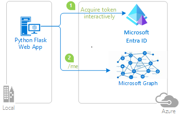

# Quickstart: Sign in users and call Microsoft Graph from a Python Flask web app

In this quickstart, you download and run a Python Flask web app sample that demonstrates how to authenticate users and call the Microsoft Graph API. Users in your Microsoft Entra organization can sign into the application.

## Prerequisites

- An Azure account with an active subscription. [Create an account for free](https://azure.microsoft.com/free/?WT.mc_id=A261C142F).
- A Microsoft Entra tenant. For more information, see [how to get a Microsoft Entra tenant.](./quickstart-create-new-tenant.md)
- [Python 3 +](https://www.python.org/downloads/)

## Step 1: Register your application

[!INCLUDE [portal updates](~/includes/portal-update.md)]

Follow these steps to register your application in the Microsoft Entra admin center:

1. Sign in to the [Microsoft Entra admin center](https://entra.microsoft.com) as at least a [Cloud Application Administrator](~/identity/role-based-access-control/permissions-reference.md#cloud-application-administrator). 
1. If you have access to multiple tenants, use the **Settings** icon :::image type="icon" source="./media/common/admin-center-settings-icon.png" border="false"::: in the top menu to switch to the tenant in which you want to register the application from the **Directories + subscriptions** menu.
1. Browse to **Identity** > **Applications** > **App registrations** and select **New registration**.
1. Enter a **Name** for your application, for example *python-webapp*. 
1. Under **Supported account types**, select **Accounts in this organizational directory only**.
1. Under **Redirect URIs**, select **Web** for the platform.
1. Enter a redirect URI of `http://localhost:5000/getAToken`. You can change this value later.
1. Select **Register**.

## Step 2: Add a client secret

The sample app uses a client secret to prove its identity when it requests for tokens. Follow these steps to create a client secret for your Python web app:

1. On the app **Overview** page, note the **Application (client) ID** value for later use.
1. Under **Manage**, select the **Certificates & secrets** and from the **Client secrets** section, select **New client secret**.
1. Enter a description for the client secret, leave the default expiration, and select **Add**.
1. Save the **Value** of the **Client Secret** in a safe location. You need this value configure the code, and you can't retrieve it later.

When creating credentials for a confidential client application, Microsoft recommends that you use a certificate instead of a client secret before moving the application to a production environment. For more information on how to use a certificate, see [these instructions](./certificate-credentials.md). 

## Step 3: Add a scope

Since this app signs in users, you need to add delegated permissions:

1. Under **Manage**, select **API permissions** > **Add a permission**.
1. Ensure that the **Microsoft APIs** tab is selected.
1. From the **Commonly used Microsoft APIs** section, select **Microsoft Graph**.
1. From the **Delegated permissions** section, ensure that **User.Read** is selected. Use the search box if necessary.
1. Select **Add permissions**.

## Step 4: Download the sample app

[Download the Python code sample](https://github.com/Azure-Samples/ms-identity-docs-code-python/archive/refs/heads/main.zip) or clone the repository:

```Console
git clone https://github.com/Azure-Samples/ms-identity-docs-code-python/
```

## Step 5: Configure the sample app

1. Open the application you downloaded in an IDE and navigate to root folder of the sample app.

    ```Console
    cd flask-web-app
    ```
1. Create an *.env* file in the root folder of the project using *.env.sample* as a guide.

    ```python
    # The following variables are required for the app to run.
    CLIENT_ID=<Enter_your_client_id>
    CLIENT_SECRET=<Enter_your_client_secret>
    AUTHORITY=<Enter_your_authority_url>
    ```

    * Set the value of `CLIENT_ID` to the **Application (client) ID** for the registered application, available on the overview page.
    * Set the value of `CLIENT_SECRET` to the client secret you created in the **Certificates & Secrets** for the registered application.
    * Set the value of `AUTHORITY` to a `https://login.microsoftonline.com/<TENANT_GUID>`. The **Directory (tenant) ID** is available on the app registration overview page.
    
    The environment variables are referenced in *app_config.py*, and are kept in a separate *.env* file to keep them out of source control. The provided *.gitignore* file prevents the *.env* file from being checked in.


## Step 6: Run the sample app

1. Create a virtual environment for the app:

    [!INCLUDE [Virtual environment setup](./includes/python-web-app/virtual-environment-setup.md)]

1. Install the requirements using `pip`:

    ```Console
    pip install -r requirements.txt
    ```

1. Run the app from the command line. Ensure your app is running on the same port as the redirect URI you configured earlier.

    ```Console
    flask run --debug --host=localhost --port=5000
    ```
1. Copy the https URL that appears in the terminal, for example, https://localhost:5000, and paste it into a browser. We recommend using a private or incognito browser session.

1. Follow the steps and enter the necessary details to sign in with your Microsoft account. You're requested to provide an email address and password to sign in.

1. The application requests permission to maintain access to data you've given it access to, and to sign you in and read your profile, as shown. Select Accept.

  

1. The following screenshot appears, indicating that you've successfully signed in to the application. 

  

## How it works

The following diagram demonstrates how the sample app works:



1. The application uses the [`identity` package](https://pypi.org/project/identity/) to obtain an access token from the Microsoft identity platform. This package is built on top of the Microsoft Authentication Library (MSAL) for Python to simplify authentication and authorization in web apps.

1. The access token you obtain in the previous step is used as a bearer token to authenticate the user when calling the Microsoft Graph API.

## Next steps

Learn more by building a Python web app that signs in users and calls a protected web API in the following multi-part tutorial series:

> [!div class="nextstepaction"]
> [Tutorial: Web app that signs in users](tutorial-web-app-python-register-app.md)