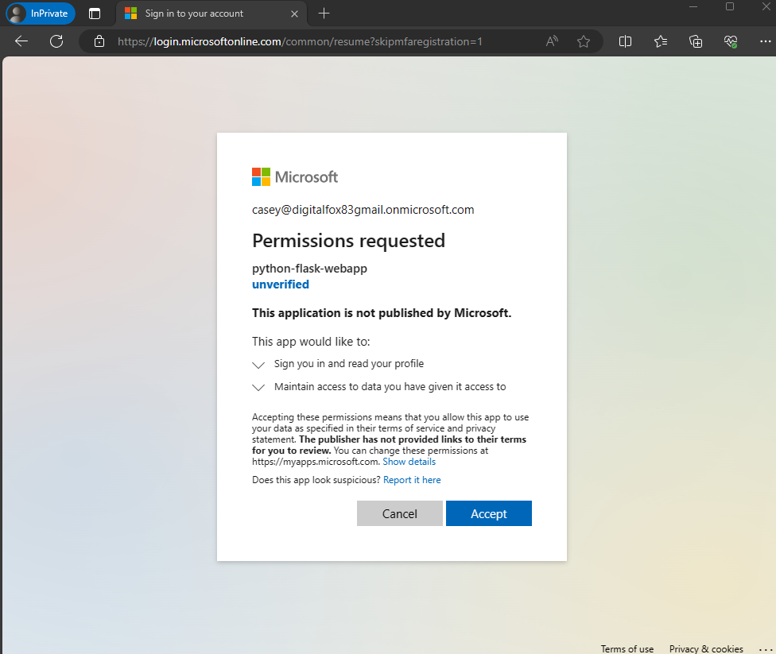

# Quickstart: Sign in users in a sample web app

[!INCLUDE [select-tenant-type-statement](./includes/select-tenant-type-statement.md)]

::: zone pivot="workforce"

This quickstart uses a sample web app to show you how to sign in users and call Microsoft Graph API in your workforce tenant. The sample app uses the [Microsoft Authentication Library](msal-overview.md) to handle authentication.

## Prerequisites

#### [Node](#tab/node-worforce)

* An Azure subscription. [Create an Azure subscription for free](https://azure.microsoft.com/free/?WT.mc_id=A261C142F).
* [Node.js](https://nodejs.org/en/download/)
* [Visual Studio Code](https://code.visualstudio.com/download) or another code editor
* A Microsoft Entra workforce tenant. For more information, see [how to get a Microsoft Entra tenant.](./quickstart-create-new-tenant.md)

#### [ASP.NET Core](#tab/asp-dot-net-core-worforce)

* An Azure account with an active subscription. If you don't already have one, [Create an account for free](https://azure.microsoft.com/free/?WT.mc_id=A261C142F).
* A minimum requirement of [.NET 6.0 SDK](https://dotnet.microsoft.com/download/dotnet)
* [Visual Studio 2022](https://visualstudio.microsoft.com/vs/) or [Visual Studio Code](https://code.visualstudio.com/)

#### [Java](#tab/java-worforce)

- [Java Development Kit (JDK)](https://openjdk.java.net/) 8 or later.
- [Maven](https://maven.apache.org/).
- A Microsoft Entra workforce tenant. For more information, see [how to get a Microsoft Entra tenant.](./quickstart-create-new-tenant.md)

#### [Python Flask](#tab/python-flask-worforce)

- An Azure account with an active subscription. [Create an account for free](https://azure.microsoft.com/free/?WT.mc_id=A261C142F).
- A Microsoft Entra workforce tenant. For more information, see [how to get a Microsoft Entra tenant.](./quickstart-create-new-tenant.md)
- [Python 3 +](https://www.python.org/downloads/)

---

## Register the web app

[!INCLUDE [Register a single-page application](./includes/register-app/web-app-common/register-application-web-app-common.md)]

## Add platform and URLs

To specify your app type to your app registration, follow these steps:

#### [Node](#tab/node-worforce)

1. Under **Manage**, select **Authentication**.
1. On the **Platform configurations** page, select **Add a platform**, and then select **Web** option.
1. For the **Redirect URIs** enter `http://localhost:3000/auth/redirect`.
1. Under **Front-channel logout URL**, enter `https://localhost:5001/signout-callback-oidc` for signing out.
1. Select **Configure** to save your changes. 

#### [ASP.NET Core](#tab/asp-dot-net-core-worforce)

[!INCLUDE [Add a platform redirect URI](./includes/register-app/web-app-common/add-platform-redirect-web-app-port-5001.md)] 


#### [Java](#tab/java-worforce)

1. Under **Manage**, select **Authentication**.
1. On the **Platform configurations** page, select **Add a platform**, and then select **Web** option.
1. For the **Redirect URIs** enter `https://localhost:8443/msal4jsample/secure/aad`. 
1. Add `https://localhost:8443/msal4jsample/graph/me` as a second redirect URI.
1. Select **Configure** to save your changes. 

#### [Python Flask](#tab/python-flask-worforce)

1. Under **Manage**, select **Authentication**.
1. On the **Platform configurations** page, select **Add a platform**, and then select **Web** option.
1. For the **Redirect URIs** enter `http://localhost:5000/getAToken`.
1. Select **Configure** to save your changes.  

---

## Add app client secret or certificate

#### [Node](#tab/node-worforce)

Create a client secret for the registered application. The application uses the client secret to prove its identity when it requests for tokens:

1. Under **Manage**, select **Certificates & secrets** > **Client secrets** > **New client secret**.  
1. In the **Description** box, enter a description for the client secret (for example, *web app client secret*).
1. Under **Expires**, select a duration for which the secret is valid (per your organizations security rules), and then select **Add**.
1. Record the secret's **Value**. You'll use this value for configuration in a later step. The secret value won't be displayed again, and isn't retrievable by any means, after you navigate away from the **Certificates and secrets**. Make sure you record it.

#### [ASP.NET Core](#tab/asp-dot-net-core-worforce)

To use a certificate credential for your web app, you need to create, then upload the certificate. For testing purposes, you can use a self-signed certificate. Use the following steps to create and upload a self-signed certificate:

1. Using your terminal,navigate to your project directory, then create the self-signed certificate.

    ```console
    cd ms-identity-docs-code-dotnet\web-app-aspnet\
    dotnet dev-certs https -ep ./certificate.crt --trust
    ```

1. Return to the Microsoft Entra admin center, and under **Manage**, select **Certificates & secrets** > **Upload certificate**.
1. Select the **Certificates (0)** tab, then select **Upload certificate**.
1. An **Upload certificate** pane appears. Use the icon to navigate to the certificate file you created in the previous step, and select **Open**.
1. Enter a description for the certificate, for example *Certificate for aspnet-web-app*, and select **Add**.
1. Record the **Thumbprint** value for use in the next step.


#### [Java](#tab/java-worforce)

Create a client secret for the registered application. The application uses the client secret to prove its identity when it requests for tokens:

1. Under **Manage**, select **Certificates & secrets** > **Client secrets** > **New client secret**.  
1. In the **Description** box, enter a description for the client secret (for example, *web app client secret*).
1. Under **Expires**, select a duration for which the secret is valid (per your organizations security rules), and then select **Add**.
1. Record the secret's **Value**. You'll use this value for configuration in a later step. The secret value won't be displayed again, and isn't retrievable by any means, after you navigate away from the **Certificates and secrets**. Make sure you record it.  


#### [Python Flask](#tab/python-flask-worforce)

Create a client secret for the registered application. The application uses the client secret to prove its identity when it requests for tokens:

1. Under **Manage**, select **Certificates & secrets** > **Client secrets** > **New client secret**.  
1. In the **Description** box, enter a description for the client secret (for example, *web app client secret*).
1. Under **Expires**, select a duration for which the secret is valid (per your organizations security rules), and then select **Add**.
1. Record the secret's **Value**. You'll use this value for configuration in a later step. The secret value won't be displayed again, and isn't retrievable by any means, after you navigate away from the **Certificates and secrets**. Make sure you record it. 

---

When creating credentials for a confidential client application, Microsoft recommends that you use a certificate instead of a client secret before moving the application to a production environment. For more information on how to use a certificate, see [these instructions](./certificate-credentials.md). 

## Clone or download sample web application 

#### [Node](#tab/node-worforce)

To obtain the sample application, you can either clone it from GitHub or download it as a *.zip* file.

* To clone the sample, open a command prompt and navigate to where you wish to create the project, and enter the following command:

    ```console
    git clone https://github.com/Azure-Samples/ms-identity-node.git
    ```

* [Download the .zip file](https://github.com/Azure-Samples/ms-identity-node/archive/refs/heads/main.zip). Extract it to a file path where the length of the name is fewer than 260 characters.
 

#### [ASP.NET Core](#tab/asp-dot-net-core-worforce)

To obtain the sample application, you can either clone it from GitHub or download it as a *.zip* file.

* To clone the sample, open a command prompt and navigate to where you wish to create the project, and enter the following command:

    ```console
    git clone https://github.com/Azure-Samples/ms-identity-docs-code-dotnet.git
    ```

* [Download the .zip file](https://github.com/Azure-Samples/ms-identity-docs-code-dotnet/archive/refs/heads/main.zip). Extract it to a file path where the length of the name is fewer than 260 characters. 

#### [Java](#tab/java-worforce)

[Download the code sample](https://github.com/Azure-Samples/ms-identity-java-webapp/archive/master.zip) 

#### [Python Flask](#tab/python-flask-worforce)

[Download the Python code sample](https://github.com/Azure-Samples/ms-identity-docs-code-python/archive/refs/heads/main.zip) or clone the repository:

```Console
git clone https://github.com/Azure-Samples/ms-identity-docs-code-python/
```

---

## Configure the sample web app

For you to sign in users with the sample app, you need to update it with your app and tenant details:

#### [Node](#tab/node-worforce)

In the *ms-identity-node-main* folder, open the *.env* file in the *App* folder. Replace the the following placeholders:

| Variable  |  Description | Example(s) |
|-----------|--------------|------------|
| `Enter_the_Cloud_Instance_Id_Here` | The Azure cloud instance in which your application is registered | `https://login.microsoftonline.com/` (include the trailing forward-slash) |
| `Enter_the_Tenant_Info_here` | Tenant ID or Primary domain | `contoso.microsoft.com` or `aaaabbbb-0000-cccc-1111-dddd2222eeee` |
| `Enter_the_Application_Id_Here` | Client ID of the application you registered | `00001111-aaaa-2222-bbbb-3333cccc4444` |
| `Enter_the_Client_Secret_Here` | Client secret of the application you registered | `A1b-C2d_E3f.H4i,J5k?L6m!N7o-P8q_R9s.T0u` |
| `Enter_the_Graph_Endpoint_Here` | The Microsoft Graph API cloud instance that your app will call | `https://graph.microsoft.com/` (include the trailing forward-slash) |
| `Enter_the_Express_Session_Secret_Here` | A random string of characters used to sign the Express session cookie | `A1b-C2d_E3f.H4...` |

After you make changes, your file should look similar to the following snippet:

```env
CLOUD_INSTANCE=https://login.microsoftonline.com/
TENANT_ID=aaaabbbb-0000-cccc-1111-dddd2222eeee
CLIENT_ID=00001111-aaaa-2222-bbbb-3333cccc4444
CLIENT_SECRET=A1b-C2d_E3f.H4...

REDIRECT_URI=http://localhost:3000/auth/redirect
POST_LOGOUT_REDIRECT_URI=http://localhost:3000

GRAPH_API_ENDPOINT=https://graph.microsoft.com/

EXPRESS_SESSION_SECRET=6DP6v09eLiW7f1E65B8k
```


#### [ASP.NET Core](#tab/asp-dot-net-core-worforce)

1. In your IDE, open the project folder, *ms-identity-docs-code-dotnet\web-app-aspnet*, containing the sample.
1. Open *appsettings.json* and replace the file contents with the following snippet;

    :::code language="json" source="~/../ms-identity-docs-code-dotnet/web-app-aspnet/appsettings.json" :::

    * `TenantId` - The identifier of the tenant where the application is registered. Replace the text in quotes with the `Directory (tenant) ID` that was recorded earlier from the overview page of the registered application.
    * `ClientId` - The identifier of the application, also referred to as the client. Replace the text in quotes with the `Application (client) ID` value that was recorded earlier from the overview page of the registered application.
    * `ClientCertificates` - A self-signed certificate is used for authentication in the application. Replace the text of the `CertificateThumbprint` with the thumbprint of the certificate that was previously recorded.

#### [Java](#tab/java-worforce)

1. Extract the zip file to a local folder.
1. *Optional.* If you use an integrated development environment, open the sample in that environment.
1. Open the *application.properties* file. You can find it in the *src/main/resources/* folder. Replace the values in the fields `aad.clientId`, `aad.authority`, and `aad.secretKey` with the application ID, tenant ID, and client secret values, respectively. Here's what it should look like:

     ```file
      aad.clientId=Enter_the_Application_Id_here
      aad.authority=https://login.microsoftonline.com/Enter_the_Tenant_Info_Here/
      aad.secretKey=Enter_the_Client_Secret_Here
      aad.redirectUriSignin=https://localhost:8443/msal4jsample/secure/aad
      aad.redirectUriGraph=https://localhost:8443/msal4jsample/graph/me
      aad.msGraphEndpointHost="https://graph.microsoft.com/"
     ```
  In the previous code:

   - `Enter_the_Application_Id_here` is the application ID for the application you registered.
   - `Enter_the_Client_Secret_Here` is the **Client Secret** you created in **Certificates & secrets** for the application you registered.
   - `Enter_the_Tenant_Info_Here` is the **Directory (tenant) ID** value of the application you registered.
1. To use HTTPS with localhost, provide the `server.ssl.key` properties. To generate a self-signed certificate, use the keytool utility (included in JRE).

 Here's an example:

```
keytool -genkeypair -alias testCert -keyalg RSA -storetype PKCS12 -keystore keystore.p12 -storepass password

server.ssl.key-store-type=PKCS12
server.ssl.key-store=classpath:keystore.p12
server.ssl.key-store-password=password
server.ssl.key-alias=testCert
```
1. Put the generated keystore file in the *resources* folder. 

#### [Python Flask](#tab/python-flask-worforce)

1. Open the application you downloaded in an IDE and navigate to root folder of the sample app.

    ```Console
    cd flask-web-app
    ```
1. Create an *.env* file in the root folder of the project using *.env.sample* as a guide.

    ```python
    # The following variables are required for the app to run.
    CLIENT_ID=<Enter_your_client_id>
    CLIENT_SECRET=<Enter_your_client_secret>
    AUTHORITY=<Enter_your_authority_url>
    ```

    * Set the value of `CLIENT_ID` to the **Application (client) ID** for the registered application, available on the overview page.
    * Set the value of `CLIENT_SECRET` to the client secret you created in the **Certificates & Secrets** for the registered application.
    * Set the value of `AUTHORITY` to a `https://login.microsoftonline.com/<TENANT_GUID>`. The **Directory (tenant) ID** is available on the app registration overview page.
    
    The environment variables are referenced in *app_config.py*, and are kept in a separate *.env* file to keep them out of source control. The provided *.gitignore* file prevents the *.env* file from being checked in. 
---

## Run and test sample web app


#### [Node](#tab/node-worforce)

Run the project by using Node.js.

1. To start the server, run the following commands from within the project directory:

    ```console
    cd App
    npm install
    npm start
    ```

1. Go to `http://localhost:3000/`.

1. Select **Sign in** to start the sign-in process.

The first time you sign in, you're prompted to provide your consent to allow the application to sign you in and access your profile. After you're signed in successfully, you'll be redirected back to the application home page. 

### How the app works

The sample hosts a web server on localhost, port 3000. When a web browser accesses this address, the app renders the home page. Once the user selects **Sign in**, the app redirects the browser to Microsoft Entra sign-in screen, via the URL generated by the MSAL Node library. After user consents, the browser redirects the user back to the application home page, along with an ID and access token.  

#### [ASP.NET Core](#tab/asp-dot-net-core-worforce)

1. In your project directory, use the terminal to enter the following command;

    ```console
    dotnet run
    ```

1. Copy the `https` URL that appears in the terminal, for example, `https://localhost:5001`, and paste it into a browser. We recommend using a private or incognito browser session.
1. Follow the steps and enter the necessary details to sign in with your Microsoft account. You're requested to provide an email address so a one time passcode can be sent to you. Enter the code when prompted.
1. The application requests permission to maintain access to data you have given it access to, and to sign you in and read your profile. Select **Accept**.
1. The following screenshot appears, indicating that you have signed in to the application and have accessed your profile details from the Microsoft Graph API.

    :::image type="content" source="./media/common-web-app/dotnet-core/display-api-call-results-dotnet-core.png" alt-text="Screenshot depicting the results of the API call." lightbox="./media/common-web-app/dotnet-core/display-api-call-results-dotnet-core.png":::

### Sign out from the application

1. Find the **Sign out** link in the top right corner of the page, and select it.
1. You're prompted to pick an account to sign out from. Select the account you used to sign in.
1. A message appears indicating that you signed out. You can now close the browser window. 

#### [Java](#tab/java-worforce)

To run the project, take one of these steps:

- Run it directly from your IDE by using the embedded Spring Boot server.
- Package it to a WAR file by using [Maven](https://maven.apache.org/plugins/maven-war-plugin/usage.html), and then deploy it to a J2EE container solution like [Apache Tomcat](http://tomcat.apache.org/).

### Run the project from an IDE

To run the web application from an IDE, select run, and then go to the home page of the project. For this sample, the standard home page URL is https://localhost:8443.

1. On the front page, select the **Login** button to redirect users to Microsoft Entra ID and prompt them for credentials.

1. After users are authenticated, they're redirected to `https://localhost:8443/msal4jsample/secure/aad`. They're now signed in, and the page will show information about the user account. The sample UI has these buttons:
    - **Sign Out**: Signs the current user out of the application and redirects that user to the home page.
    - **Show User Info**: Acquires a token for Microsoft Graph and calls Microsoft Graph with a request that contains the token, which returns basic information about the signed-in user.

### Run the project from Tomcat

If you want to deploy the web sample to Tomcat, make a couple changes to the source code.

1. Open *ms-identity-java-webapp/src/main/java/com.microsoft.azure.msalwebsample/MsalWebSampleApplication*.

    - Delete all source code and replace it with this code:

      ```Java
       package com.microsoft.azure.msalwebsample;

       import org.springframework.boot.SpringApplication;
       import org.springframework.boot.autoconfigure.SpringBootApplication;
       import org.springframework.boot.builder.SpringApplicationBuilder;
       import org.springframework.boot.web.servlet.support.SpringBootServletInitializer;

       @SpringBootApplication
       public class MsalWebSampleApplication extends SpringBootServletInitializer {

        public static void main(String[] args) {
         SpringApplication.run(MsalWebSampleApplication.class, args);
        }

        @Override
        protected SpringApplicationBuilder configure(SpringApplicationBuilder builder) {
         return builder.sources(MsalWebSampleApplication.class);
        }
       }
      ```

2.   Tomcat's default HTTP port is 8080, but you need an HTTPS connection over port 8443. To configure this setting:
        - Go to *tomcat/conf/server.xml*.
        - Search for the `<connector>` tag, and replace the existing connector with this connector:

          ```xml
          <Connector
                   protocol="org.apache.coyote.http11.Http11NioProtocol"
                   port="8443" maxThreads="200"
                   scheme="https" secure="true" SSLEnabled="true"
                   keystoreFile="C:/Path/To/Keystore/File/keystore.p12" keystorePass="KeystorePassword"
                   clientAuth="false" sslProtocol="TLS"/>
          ```

3. Open a Command Prompt window. Go to the root folder of this sample (where the `pom.xml` file is located), and run `mvn package` to build the project.
    - This command will generate a `msal-web-sample-0.1.0.war` file in your `/targets` directory.
    - Rename this file to `msal4jsample.war`.
    - Deploy the WAR file by using Tomcat or any other J2EE container solution.
        - To deploy the `msal4jsample.war` file, copy it to the `/webapps/` directory in your Tomcat installation, and then start the Tomcat server.

4. After the file is deployed, go to `https://localhost:8443/msal4jsample` by using a browser. 

#### [Python Flask](#tab/python-flask-worforce)

1. Create a virtual environment for the app:

    [!INCLUDE [Virtual environment setup](./includes/python-web-app/virtual-environment-setup.md)]

1. Install the requirements using `pip`:

    ```Console
    pip install -r requirements.txt
    ```

1. Run the app from the command line. Ensure your app is running on the same port as the redirect URI you configured earlier.

    ```Console
    flask run --debug --host=localhost --port=5000
    ```
1. Copy the https URL that appears in the terminal, for example, https://localhost:5000, and paste it into a browser. We recommend using a private or incognito browser session.

1. Follow the steps and enter the necessary details to sign in with your Microsoft account. You're requested to provide an email address and password to sign in.

1. The application requests permission to maintain access to data you've given it access to, and to sign you in and read your profile, as shown. Select Accept.

  

1. The following screenshot appears, indicating that you've successfully signed in to the application. 

   

### How the app works

The following diagram demonstrates how the sample app works:


1. The application uses the [`identity` package](https://pypi.org/project/identity/) to obtain an access token from the Microsoft identity platform. This package is built on top of the Microsoft Authentication Library (MSAL) for Python to simplify authentication and authorization in web apps.

1. The access token you obtain in the previous step is used as a bearer token to authenticate the user when calling the Microsoft Graph API.
1. 
---

## Related content

#### [Node](#tab/node-worforce)

- Learn how to build a Node.js web app that signs in users and  calls Microsoft Graph API in [Tutorial: Sign in users and acquire a token for Microsoft Graph in a Node.js & Express web app](tutorial-v2-nodejs-webapp-msal.md).


#### [ASP.NET Core](#tab/asp-dot-net-core-worforce)


* Learn by building this ASP.NET web app with the series [Tutorial: Register an application with the Microsoft identity platform](./tutorial-web-app-dotnet-sign-in-users.md).
* [Quickstart: Protect an ASP.NET Core web API with the Microsoft identity platform](./quickstart-web-api-aspnet-core-protect-api.md).
* [Quickstart: Deploy an ASP.NET web app to Azure App Service](/azure/app-service/quickstart-dotnetcore?tabs=net70&pivots=development-environment-vs) 


#### [Java](#tab/java-worforce)

For a more in-depth discussion of building web apps that sign in users on the Microsoft identity platform, see the multipart scenario series:

- [Scenario: Web app that signs in users](scenario-web-app-sign-user-app-registration.md?tabs=java) 


#### [Python Flask](#tab/python-flask-worforce)

- Learn how to build a Python web app that signs in users and calls a protected web API in [Tutorial: Web app that signs in users](tutorial-web-app-python-register-app.md).

---

::: zone-end 

::: zone pivot="external"

This quickstart uses a sample web app to show you how to sign in users in your external tenant. The sample app uses the [Microsoft Authentication Library](msal-overview.md) to handle authentication.

## Prerequisites

#### [Node](#tab/node-external)

- [Visual Studio Code](https://code.visualstudio.com/download) or another code editor.
- [Node.js](https://nodejs.org).
- An external tenant. To create one, choose from the following methods:
  - (Recommended) Use the [Microsoft Entra External ID extension](https://aka.ms/ciamvscode/samples/marketplace) to set up an external tenant directly in Visual Studio Code.
  - [Create a new external tenant](../external-id/customers/how-to-create-external-tenant-portal.md) in the Microsoft Entra admin center.

#### [ASP.NET Core](#tab/asp-dot-net-core-external)

- [Visual Studio Code](https://code.visualstudio.com/download) or another code editor.
- [.NET 7.0 SDK](https://dotnet.microsoft.com/download/dotnet).
- An external tenant. To create one, choose from the following methods:
  - (Recommended) Use the [Microsoft Entra External ID extension](https://aka.ms/ciamvscode/samples/marketplace) to set up an external tenant directly in Visual Studio Code.
  - [Create a new external tenant](../external-id/customers/how-to-create-external-tenant-portal.md) in the Microsoft Entra admin center.

#### [Python Django](#tab/python-django-external)

- [Visual Studio Code](https://code.visualstudio.com/download) or another code editor.
- [Python 3+](https://www.python.org/).
- An external tenant. To create one, choose from the following methods:
  - (Recommended) Use the [Microsoft Entra External ID extension](https://aka.ms/ciamvscode/samples/marketplace) to set up an external tenant directly in Visual Studio Code.
  - [Create a new external tenant](../external-id/customers/how-to-create-external-tenant-portal.md) in the Microsoft Entra admin center.

#### [Python Flask](#tab/python-flask-external)

- [Visual Studio Code](https://code.visualstudio.com/download) or another code editor.
- [Python 3+](https://www.python.org/).
- An external tenant. To create one, choose from the following methods:
  - (Recommended) Use the [Microsoft Entra External ID extension](https://aka.ms/ciamvscode/samples/marketplace) to set up an external tenant directly in Visual Studio Code.
  - [Create a new external tenant](../external-id/customers/how-to-create-external-tenant-portal.md) in the Microsoft Entra admin center.
  
---

## Register the web app

[!INCLUDE [register-application-common-steps](../external-id/customers/includes/register-app/register-client-app-common.md)]

## Add platform and URLs

#### [Node](#tab/node-external)

[!INCLUDE [ciam-redirect-url-node](../external-id/customers/includes/register-app/add-platform-redirect-url-node.md)]

#### [ASP.NET Core](#tab/asp-dot-net-core-external)

[!INCLUDE [ciam-redirect-url-dotnet](../external-id/customers/includes/register-app/add-platform-redirect-url-dotnet.md)]

#### [Python Django](#tab/python-django-external)

[!INCLUDE [django-app-redirect-uri-configuration](../external-id/customers/includes/register-app/add-platform-redirect-url-python-django.md)]  

#### [Python Flask](#tab/python-flask-external)

[!INCLUDE [flask-app-redirect-uri-configuration](../external-id/customers/includes/register-app/add-platform-redirect-url-python-flask.md)]  

---

## Add app client secret

[!INCLUDE [ciam-add-client-secret](../external-id/customers/includes/register-app/add-app-client-secret.md)]

## Grant admin consent

[!INCLUDE [ciam-grant-delegated-permissions](../external-id/customers/includes/register-app/grant-api-permission-sign-in.md)]

## Create a user flow 

[!INCLUDE [add-user-flow](../external-id/customers/includes/configure-user-flow/create-sign-in-sign-out-user-flow.md)]

## Associate the web application with the user flow

[!INCLUDE [associate-app-with-user-flow](../external-id/customers/includes/configure-user-flow/add-app-user-flow.md)]

## Clone or download sample web application 

#### [Node](#tab/node-external)

To obtain the sample application, you can either clone it from GitHub or download it as a .zip file:

- To clone the sample, open a command prompt and navigate to where you wish to create the project, and enter the following command:

    ```console
    git clone https://github.com/Azure-Samples/ms-identity-ciam-javascript-tutorial.git
    ```

- Alternatively, [download the sample .zip file](https://github.com/Azure-Samples/ms-identity-ciam-javascript-tutorial/archive/refs/heads/main.zip), then extract it to a file path where the length of the name is fewer than 260 characters.

### Install project dependencies

1. Open a console window, and change to the directory that contains the Node.js sample app:

    ```console
    cd 1-Authentication\5-sign-in-express\App
    ```

1. Run the following commands to install app dependencies:

    ```console
    npm install
    ```

#### [ASP.NET Core](#tab/asp-dot-net-core-external)

To obtain the sample application, you can either clone it from GitHub or download it as a .zip file.

- To clone the sample, open a command prompt and navigate to where you wish to create the project, and enter the following command:

    ```console
    git clone https://github.com/Azure-Samples/ms-identity-ciam-dotnet-tutorial.git
    ```

- [Download the .zip file](https://github.com/Azure-Samples/ms-identity-ciam-dotnet-tutorial/archive/refs/heads/main.zip). Extract it to a file path where the length of the name is fewer than 260 characters. 


#### [Python Django](#tab/python-django-external)

To obtain the sample application, you can either clone it from GitHub or download it as a .zip file.

- To clone the sample, open a command prompt and navigate to where you wish to create the project, and enter the following command:

    ```console
    git clone https://github.com/Azure-Samples/ms-identity-docs-code-python.git
    ```
- [Download the .zip file](https://github.com/Azure-Samples/ms-identity-docs-code-python/archive/refs/heads/main.zip). Extract it to a file path where the length of the name is fewer than 260 characters.

### Install project dependencies

1. Open a console window, and change to the directory that contains the Flask sample web app:

    ```console
    cd django-web-app
    ```

1. Set up virtual environment:
    
    [!INCLUDE [Virtual environment setup](./includes/python-web-app/virtual-environment-setup.md)]

1. To install app dependencies, run the following commands:

    ```console
    python3 -m pip install -r requirements.txt
    ```

#### [Python Flask](#tab/python-flask-external)

To obtain the sample application, you can either clone it from GitHub or download it as a .zip file.

- To clone the sample, open a command prompt and navigate to where you wish to create the project, and enter the following command:

    ```console
    git clone https://github.com/Azure-Samples/ms-identity-docs-code-python.git
    ```

- [Download the .zip file](https://github.com/Azure-Samples/ms-identity-docs-code-python/archive/refs/heads/main.zip). Extract it to a file path where the length of the name is fewer than 260 characters.


### Install project dependencies

1. Open a console window, and change to the directory that contains the Flask sample web app:

    ```console
    cd flask-web-app
    ```

1. Set up virtual environment:

    a. For **Windows**, run the following commands:    
    ```console
    py -m venv .venv
    .venv\scripts\activate
    ```    
    b. For **macOS/Linux**, run the following commands:    
    ```console
    python3 -m venv .venv
    source .venv/bin/activate
    ```
1. To install app dependencies, run the following commands:

    ```console
    python3 -m pip install -r requirements.txt
    ```

---

## Configure the sample web app


For you to sign in users with the sample app, you need to update it with your app and tenant details:

#### [Node](#tab/node-external)

1. In your code editor, open *App\authConfig.js* file.

1. Find the placeholder:

    - `Enter_the_Application_Id_Here` and replace it with the Application (client) ID of the app you registered earlier.
    - `Enter_the_Tenant_Subdomain_Here` and replace it with the Directory (tenant) subdomain. For example, if your tenant primary domain is `contoso.onmicrosoft.com`, use `contoso`. If you don't have your tenant name, learn how to [read your tenant details](/entra/external-id/customers/how-to-create-customer-tenant-portal#get-the-customer-tenant-details).
    - `Enter_the_Client_Secret_Here` and replace it with the app secret value you copied earlier.


#### [ASP.NET Core](#tab/asp-dot-net-core-external)

1. Navigate to the root folder of the sample you have downloaded and directory that contains the ASP.NET Core sample app:

    ```console
    cd 1-Authentication\1-sign-in-aspnet-core-mvc
    ```

1. Open the *appsettings.json* file.
1. In **Authority**, find `Enter_the_Tenant_Subdomain_Here` and replace it with the subdomain of your tenant. For example, if your tenant primary domain is *caseyjensen@onmicrosoft.com*, the value you should enter is *casyjensen*.
1. Find the `Enter_the_Application_Id_Here` value and replace it with the application ID (clientId) of the app you registered in the Microsoft Entra admin center.
1. Replace `Enter_the_Client_Secret_Here` with the client secret value you set up in [Add app client secret](#add-app-client-secret).


#### [Python Django](#tab/python-django-external)

1. Open your project files on Visual Studio Code or the editor you're using.

1. Create an *.env* file in the root folder of the project using *.env.sample* file as a guide.

1. In your *.env* file, provide the following environment variables:

    1. `CLIENT_ID` which is the Application (client) ID of the app you registered earlier.
    1. `CLIENT_SECRET` which is the app secret value you copied earlier.
    1. `AUTHORITY` which is the URL that identifies a token authority. It should be of the format *https://{subdomain}.ciamlogin.com/{subdomain}.onmicrosoft.com*. Replace *subdomain* with the Directory (tenant) subdomain. For example, if your tenant primary domain is `contoso.onmicrosoft.com`, use `contoso`. If you don't have your tenant subdomain, learn how to [read your tenant details](/entra/external-id/customers/how-to-create-external-tenant-portal#get-the-external-tenant-details).
    1. `REDIRECT_URI` which should be similar to the redirect URI you registered earlier should match your configuration.


#### [Python Flask](#tab/python-flask-external)

1. Open your project files on Visual Studio Code or the editor you're using.

1. Create an *.env* file in the root folder of the project using *.env.sample* file as a guide.

1. In your *.env* file, provide the following environment variables:

    - `CLIENT_ID` which is the Application (client) ID of the app you registered earlier.
    - `CLIENT_SECRET` which is the app secret value you copied earlier.
    - `AUTHORITY` which is the URL that identifies a token authority. It should be of the format *https://{subdomain}.ciamlogin.com/{subdomain}.onmicrosoft.com*. Replace *subdomain* with the Directory (tenant) subdomain. For example, if your tenant primary domain is `contoso.onmicrosoft.com`, use `contoso`. If you don't have your tenant subdomain, learn how to [read your tenant details](/entra/external-id/customers/how-to-create-customer-tenant-portal#get-the-customer-tenant-details).

1. Confirm that the redirect URI is well configured. The redirect URI you registered earlier should match your configuration. This sample by default sets the redirect URI path to `/getAToken`. This is configured in the *app_config.py* file as *REDIRECT_PATH*.

---


## Run and test sample web app

#### [Node](#tab/node-external)

You can now test the sample Node.js web app. You need to start the Node.js server and access it through your browser at `http://localhost:3000`.

1. In your terminal, run the following command:

    ```console
    npm start 
    ```

1. Open your browser, then go to `http://localhost:3000`. You should see the page similar to the following screenshot:

    :::image type="content" source="media/how-to-web-app-node-sample-sign-in/web-app-node-sign-in.png" alt-text="Screenshot of sign in into a node web app.":::

1. After the page completes loading, select **Sign in** link. You're prompted to sign in.

1. On the sign-in page, type your **Email address**, select **Next**, type your **Password**, then select **Sign in**. If you don't have an account, select **No account? Create one** link, which starts the sign-up flow.

1. If you choose the sign-up option, after filling in your email, one-time passcode, new password and more account details, you complete the whole sign-up flow. You see a page similar to the following screenshot. You see a similar page if you choose the sign-in option.

    :::image type="content" source="media/how-to-web-app-node-sample-sign-in/web-app-node-view-claims.png" alt-text="Screenshot of view ID token claims.":::

1. Select **Sign out** to sign the user out of the web app or select **View ID token claims** to view ID token claims returned by Microsoft Entra.

### How it works

When users select the **Sign in** link, the app initiates an authentication request and redirects users to Microsoft Entra External ID. On the sign-in or sign-up page that appears, once a user successfully signs in or creates an account, Microsoft Entra External ID returns an ID token to the app. The app validates the ID token, reads the claims, and returns a secure page to the users.  

When the users select the **Sign out** link, the app clears its session, the redirect the user to Microsoft Entra External ID sign-out endpoint to notify it that the user has signed out.

If you want to build an app similar to the sample you've run, complete the steps in [Sign in users in your own Node.js web application](/entra/external-id/customers/tutorial-web-app-node-sign-in-prepare-tenant) article.

#### [ASP.NET Core](#tab/asp-dot-net-core-external)

1. From your shell or command line, execute the following commands:

    ```console
    dotnet run
    ```

1. Open your web browser and navigate to `https://localhost:7274`.

1. Sign-in with an account registered to the external tenant.

1. Once signed in the display name is shown next to the **Sign out** button as shown in the following screenshot.

    :::image type="content" source="media/tutorial-web-app-dotnet-sign-in-sign-in-out/display-aspnet-welcome.png" alt-text="Screenshot of sign in into a ASP.NET Core web app.":::

1. To sign out from the application, select the **Sign out** button.

#### [Python Django](#tab/python-django-external)

Run the app to see the sign-in experience at play.

[!INCLUDE [python-identity-library-warning](../external-id/customers/includes/python-identity-library-alert.md)]

1. In your terminal, run the following command:

    ```console
    python manage.py runserver localhost:5000                                             
    ```
    
    You can use the port of your choice. This should be similar to the port of the redirect URI you registered earlier.

1. Open your browser, then go to `http://localhost:5000`. You should see the page similar to the following screenshot:

    :::image type="content" source="media/sample-web-app-django-sign-in/django-sign-in-page.png" alt-text="Screenshot of Django web app sample sign-in page.":::

1. After the page completes loading, select **Sign In** link. You're prompted to sign in.

1. On the sign-in page, type your **Email address**, select **Next**, type your **Password**, then select **Sign in**. If you don't have an account, select **No account? Create one** link, which starts the sign-up flow.

1. If you choose the sign-up option, you'll go through the sign-uo flow. Fill in your email, one-time passcode, new password, and more account details to complete the whole sign-up flow.

1. After you sign in or sign up, you're redirected back to the web app. You'll see a page that looks similar to the following screenshot:

    :::image type="content" source="media/sample-web-app-django-sign-in/django-authenticated-page.png" alt-text="Screenshot of flask web app sample after successful authentication.":::

1. Select **Logout** to sign the user out of the web app or select **Call a downstream API** to make a call to a Microsoft Graph endpoint.

### How it works

When users select the **Sign in** link, the app initiates an authentication request and redirects users to Microsoft Entra External ID. A user then signs in or signs up page on the page that appears. After providing in the required credentials and consenting to required scopes, Microsoft Entra External ID redirects the user back to the web app with an authorization code. The web app then uses this authorization code to acquire a token from Microsoft Entra External ID.

When the users select the **Logout** link, the app clears its session, the redirect the user to Microsoft Entra External ID sign-out endpoint to notify it that the user has signed out. The user is then redirected back to the web app.

#### [Python Flask](#tab/python-flask-external)

Run the app to see the sign-in experience at play.

[!INCLUDE [python-identity-library-warning](../external-id/customers/includes/python-identity-library-alert.md)]

[!INCLUDE [python-flask-web-app-run-app](../external-id/customers/includes/run-app/flask-web-app.md)]

### How it works

When users select the **Sign in** link, the app initiates an authentication request and redirects users to Microsoft Entra External ID. A user then signs in or signs up page on the page that appears. After providing in the required credentials and consenting to required scopes, Microsoft Entra External ID redirects the user back to the web app with an authorization code. The web app then uses this authorization code to acquire a token from Microsoft Entra External ID.

When the users select the **Logout** link, the app clears its session, the redirect the user to Microsoft Entra External ID sign-out endpoint to notify it that the user has signed out. The user is then redirected back to the web app.

---

## Related content

#### [Node](#tab/node-external)

- [Customize the default branding](/entra/external-id/customers/how-to-customize-branding-customers)
- [Configure sign-in with Google](/entra/external-id/customers/how-to-google-federation-customers)
- [Sign in users in your Node.js web application](/entra/external-id/customers/tutorial-web-app-node-sign-in-prepare-tenant)

#### [ASP.NET Core](#tab/asp-dot-net-core-external)

- [Use our multi-part tutorial series to build this ASP.NET web application from scratch](/entra/external-id/customers/tutorial-web-app-dotnet-sign-in-prepare-app)
- [Enable password reset](/entra/external-id/customers/how-to-enable-password-reset-customers)
- [Customize the default branding](/entra/external-id/customers/how-to-customize-branding-customers)


#### [Python Django](#tab/python-django-external)

- [Sign in users using a sample Flask web application](/entra/external-id/customers/sample-web-app-python-flask-sign-in)
- [Enable password reset](/entra/external-id/customers/how-to-enable-password-reset-customers)
- [Customize the default branding](/entra/external-id/customers/how-to-customize-branding-customers)


#### [Python Flask](#tab/python-flask-external)

- [Enable password reset](/entra/external-id/customers/how-to-enable-password-reset-customers)
- [Customize the default branding](/entra/external-id/customers/how-to-customize-branding-customers)

---

::: zone-end