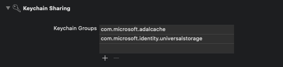

# Tutorial: Prepare your iOS (Swift) app for authentication

[!INCLUDE [applies-to-workforce-external](../external-id/includes/applies-to-workforce-external.md)]

::: zone pivot="workforce"

This is the second tutorial in the tutorial series that demonstrates how to add Microsoft Authentication Library (MSAL) for iOS and macOS to your iOS Swift app.

[!INCLUDE [select-tenant-type-statement](./includes/select-tenant-type-statement.md)]

In this tutorial, you:

> [!div class="checklist"]
>
> - Add the MSAL framework to an iOS (Swift) app.
> - Create SDK instance.
> - Configure Xcode project settings.

## Prerequisites

* Register a new client web app in the [Microsoft Entra admin center](https://entra.microsoft.com), configured for *Accounts in any organizational directory and personal Microsoft accounts*. Refer to [Register an application](quickstart-register-app.md) for more details. Record the following values from the application **Overview** page for later use:
  * Application (client) ID 
  * Directory (tenant) ID
* <a href="https://developer.apple.com/xcode/resources/" target="_blank">Xcode</a>.
* iOS (Swift) project.

## Add a platform redirect URL

To specify your app type to your app registration, follow these steps:

1. Under **Manage**, select **Authentication** > **Add a platform** > **iOS/macOS**.
1. Enter your project's Bundle ID. If downloaded the code sample, the Bundle ID is `com.microsoft.identitysample.MSALiOS`. If you're creating your own project, select your project in Xcode and open the **General** tab. The bundle identifier appears in the **Identity** section.
1. Select **Configure** and save the **MSAL Configuration** that appears in the **MSAL configuration** page so you can enter it when you configure your app later.
1. Select **Done**.

## Add the MSAL framework to an iOS (Swift) app

Choose one of the following ways to install the MSAL library in your app:

### CocoaPods

1. If you're using [CocoaPods](https://cocoapods.org/), install `MSAL` by first creating an empty file called *podfile* in the same folder as your project's *.xcodeproj* file. Add the following to *podfile*:

   ```
   use_frameworks!

   target '<your-target-here>' do
      pod 'MSAL'
   end
   ```

2. Replace `<your-target-here>` with the name of your project.
3. In a terminal window, navigate to the folder that contains the *podfile* you created and run `pod install` to install the MSAL library.
4. Close Xcode and open `<your project name>.xcworkspace` to reload the project in Xcode.

### Carthage

If you're using [Carthage](https://github.com/Carthage/Carthage), install `MSAL` by adding it to your *Cartfile*:

```
github "AzureAD/microsoft-authentication-library-for-objc" "master"
```

From a terminal window, in the same directory as the updated *Cartfile*, run the following command to have Carthage update the dependencies in your project.

iOS:

```bash
carthage update --platform iOS
```

macOS:

```bash
carthage update --platform macOS
```

### Manually

You can also use Git Submodule, or check out the latest release to use as a framework in your application.

## Add the app registration

Next, we add your app registration to your code.

First, add the following import statement to the top of the *ViewController.swift* file and either *AppDelegate.swift* or *SceneDelegate.swift*:

```swift
import MSAL
```

Next, add the following code to *ViewController.swift* before to `viewDidLoad()`:

```swift
// Update the below to your client ID. The below is for running the demo only
let kClientID = "Your_Application_Id_Here"
let kGraphEndpoint = "https://graph.microsoft.com/" // the Microsoft Graph endpoint
let kAuthority = "https://login.microsoftonline.com/common" // this authority allows a personal Microsoft account and a work or school account in any organization's Azure AD tenant to sign in

let kScopes: [String] = ["user.read"] // request permission to read the profile of the signed-in user

var accessToken = String()
var applicationContext : MSALPublicClientApplication?
var webViewParameters : MSALWebviewParameters?
var currentAccount: MSALAccount?
```

The only value you modify is the value assigned to `kClientID` to be your [Application ID](./developer-glossary.md#application-client-id). This value is part of the MSAL Configuration data that you saved during the step at the beginning of this tutorial to register the application.

## Create SDK instance

To create MSAL instance in your project, follow these steps:

To the `ViewController` class, add the `initMSAL` method:

```swift
    func initMSAL() throws {

        guard let authorityURL = URL(string: kAuthority) else {
            self.updateLogging(text: "Unable to create authority URL")
            return
        }

        let authority = try MSALAADAuthority(url: authorityURL)

        let msalConfiguration = MSALPublicClientApplicationConfig(clientId: kClientID, redirectUri: nil, authority: authority)
        self.applicationContext = try MSALPublicClientApplication(configuration: msalConfiguration)
        self.initWebViewParams()
    }
```

Still in the `ViewController` class and after the `initMSAL` method, add the `initWebViewParams` method:

### iOS code:

```swift
func initWebViewParams() {
        self.webViewParameters = MSALWebviewParameters(authPresentationViewController: self)
    }
```

### macOS code:

```swift
func initWebViewParams() {
        self.webViewParameters = MSALWebviewParameters()
    }
```

## Configure Xcode project settings

Add a new keychain group to your project **Signing & Capabilities**. The keychain group should be `com.microsoft.adalcache` on iOS and `com.microsoft.identity.universalstorage` on macOS.



### For iOS only, configure URL schemes

In this step, you'll register `CFBundleURLSchemes` so that the user can be redirected back to the app after sign in. By the way, `LSApplicationQueriesSchemes` also allows your app to make use of Microsoft Authenticator.

In Xcode, open *Info.plist* as a source code file, and add the following inside of the `<dict>` section. Replace `[BUNDLE_ID]` with the value you previously used. If you downloaded the code, the bundle identifier is `com.microsoft.identitysample.MSALiOS`. If you're creating your own project, select your project in Xcode and open the **General** tab. The bundle identifier appears in the **Identity** section.

```xml
<key>CFBundleURLTypes</key>
<array>
    <dict>
        <key>CFBundleURLSchemes</key>
        <array>
            <string>msauth.[BUNDLE_ID]</string>
        </array>
    </dict>
</array>
<key>LSApplicationQueriesSchemes</key>
<array>
    <string>msauthv2</string>
    <string>msauthv3</string>
</array>
```

### For macOS only, configure App Sandbox

1. Go to your Xcode Project Settings > **Capabilities tab** > **App Sandbox**
2. Select **Outgoing Connections (Client)** checkbox.


## Next steps

> [!div class="nextstepaction"] 
> [Tutorial: Sign in users in iOS (Swift) mobile app](tutorial-mobile-app-ios-swift-sign-in.md)


::: zone-end

::: zone pivot="external"

This is the second tutorial in the tutorial series that demonstrates how to add Microsoft Authentication Library (MSAL) for iOS and macOS to your iOS Swift app.

[!INCLUDE [select-tenant-type-statement](./includes/select-tenant-type-statement.md)]

In this tutorial, you;

> [!div class="checklist"]
>
> - Add the MSAL framework to an iOS (Swift) app.
> - Create SDK instance.

## Prerequisites

* Register a new client web app in the [Microsoft Entra admin center](https://entra.microsoft.com), configured for *Accounts in any organizational directory and personal Microsoft accounts*. Refer to [Register an application](quickstart-register-app.md) for more details. Record the following values from the application **Overview** page for later use:
  * Application (client) ID 
  * Directory (tenant) ID
* <a href="https://developer.apple.com/xcode/resources/" target="_blank">Xcode</a>.
* iOS (Swift) project.

## Add a platform redirect URL

To specify your app type to your app registration, follow these steps:

1. Under **Manage**, select **Authentication** > **Add a platform** > **iOS/macOS**.
1. Enter your project's Bundle ID. If downloaded the code sample, the Bundle ID is `com.microsoft.identitysample.MSALiOS`. If you're creating your own project, select your project in Xcode and open the **General** tab. The bundle identifier appears in the **Identity** section.
1. Select **Configure** and save the **MSAL Configuration** that appears in the **MSAL configuration** page so you can enter it when you configure your app later.
1. Select **Done**.

## Enable public client flow

[!INCLUDE [Enable public client](../external-id/customers/includes/register-app/enable-public-client-flow.md)]

## Add the MSAL framework to an iOS (Swift) app

The MSAL authentication SDK is used for integrating authentication into your apps using standard OAuth2 and OpenID Connect. It allows you to sign in users or apps with Microsoft identities. To add MSAL to your iOS (Swift) project, follow these steps:

1. Open your iOS project in Xcode.
1. Select **Add Package Dependencies...** from the **File** menu.
1. Enter `https://github.com/AzureAD/microsoft-authentication-library-for-objc` as the Package URL and choose **Add Package**

### Update the Bundle Identifier

In Apple ecosystem, a Bundle Identifier is a unique identifier for an application. To update the Bundle Identifier in your project, follow these steps:

1. Open the project settings. In the **Identity** section, enter the **Bundle Identifier**.
1. Right-click **Info.plist** and select **Open As** > **Source Code**.
1. Under the dict root node, replace `Enter_the_bundle_Id_Here` with the ***Bundle Id*** that you used in the portal. Notice the `msauth.` prefix in the string.

   ```xml
   <key>CFBundleURLTypes</key>
   <array>
      <dict>
         <key>CFBundleURLSchemes</key>
         <array>
            <string>msauth.Enter_the_Bundle_Id_Here</string>
         </array>
      </dict>
   </array>
   ```

## Create SDK instance

To create MSAL instance in your project, follow these steps:

1. Import the MSAL library into your view controller by adding `import MSAL` at the top of your `ViewController` class.
1. Add an `applicationContext` member variable to your ViewController class by adding the following code just before the `viewDidLoad()` function:
    
    ```swift
    var applicationContext : MSALPublicClientApplication?
    var webViewParameters : MSALWebviewParameters?
    ```

    The code declares two variables: `applicationContext`, which stores an instance of `MSALPublicClientApplication`, and `webViewParameters`, which stores an instance of `MSALWebviewParameters`. `MSALPublicClientApplication` is a class provided by the MSAL for handling public client applications. The `MSALWebviewParameters` is a class provided by MSAL that defines parameters for configuring the web view used during the authentication process.

1. Add the following code to the view `viewDidLoad()` function:

    ```swift
     do {
            try self.initMSAL()
        } catch let error {
            self.updateLogging(text: "Unable to create Application Context \(error)")
        }
    ``` 
    The code attempts to initialize MSAL, handling any errors that occur during the process. If an error occurs, it updates the logging with the details of the error.

1. Add the following code that creates `initMSAL()` function, which initializes MSAL:

    ```swift
        func initMSAL() throws {
        
        guard let authorityURL = URL(string: Configuration.kAuthority) else {
            self.updateLogging(text: "Unable to create authority URL")
            return
        }
        
        let authority = try MSALCIAMAuthority(url: authorityURL)
        
        let msalConfiguration = MSALPublicClientApplicationConfig(clientId: Configuration.kClientID,
                                                                  redirectUri: Configuration.kRedirectUri,
                                                                  authority: authority)
        self.applicationContext = try MSALPublicClientApplication(configuration: msalConfiguration)
    }
    ```
    
    This code initializes the MSAL for iOS. It first attempts to create a URL for the authority using the provided *Configuration.kAuthority* string. If successful, it creates an MSAL authority object based on that URL. Then, it configures the `MSALPublicClientApplication` with the given client ID, redirect URI, and authority. If all configurations are set up correctly, it initializes the application context with the configured `MSALPublicClientApplication`. If any errors occur during the process, it throws an error.

1. Create *Configuration.swift* file and add the following configurations:

    ```swift
    import Foundation

    @objcMembers
    class Configuration {
        static let kTenantSubdomain = "Enter_the_Tenant_Subdomain_Here"
        
        // Update the below to your client ID you received in the portal.
        static let kClientID = "Enter_the_Application_Id_Here"
        static let kRedirectUri = "Enter_the_Redirect_URI_Here"
        static let kProtectedAPIEndpoint = "Enter_the_Protected_API_Full_URL_Here"
        static let kScopes = ["Enter_the_Protected_API_Scopes_Here"]
        
        static let kAuthority = "https://\(kTenantSubdomain).ciamlogin.com"
    
    }
    ```
    
    This Swift configuration code defines a class named `Configuration` and is marked with `@objcMembers`. It includes static constants for various configuration parameters related to an authentication setup. These parameters include the *tenant subdomain*, *client ID*, *redirect URI*, *protected API endpoint*, and *scopes*. These configuration constants should be updated with appropriate values specific to the application's setup.

    Find the placeholder:

    - `Enter_the_Application_Id_Here` and replace it with the **Application (client) ID** of the app you registered earlier.
    - `Enter_the_Redirect_URI_Here` and replace it with the value of *kRedirectUri* in the MSAL configuration file you downloaded earlier when you added the platform redirect URL.
    - `Enter_the_Protected_API_Scopes_Here` and replace it with the scopes recorded earlier. If you haven't recorded any scopes, you can leave this scope list empty.
    - `Enter_the_Tenant_Subdomain_Here` and replace it with the Directory (tenant) subdomain. For example, if your tenant primary domain is `contoso.onmicrosoft.com`, use `contoso`. If you don't know your tenant subdomain, learn how to [read your tenant details](../external-id/customers/how-to-create-external-tenant-portal.md#get-the-external-tenant-details).

[!INCLUDE [external-id-custom-domain](../external-id/customers/includes/use-custom-domain-url-ios.md)]

## Next steps

> [!div class="nextstepaction"] 
> [Tutorial: Sign in users in iOS (Swift) mobile app](tutorial-mobile-app-ios-swift-sign-in.md)


::: zone-end


