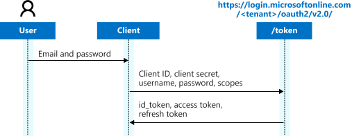

# Microsoft identity platform and OAuth 2.0 Resource Owner Password Credentials

The Microsoft identity platform supports the [OAuth 2.0 Resource Owner Password Credentials (ROPC) grant](https://tools.ietf.org/html/rfc6749#section-4.3), which allows an application to sign in the user by directly handling their password.  This article describes how to program directly against the protocol in your application.  When possible, we recommend you use the supported Microsoft Authentication Libraries (MSAL) instead to [acquire tokens and call secured web APIs](authentication-flows-app-scenarios.md#scenarios-and-supported-authentication-flows).  Also take a look at the [sample apps that use MSAL](sample-v2-code.md).

> [!WARNING]
> Microsoft recommends you do *not* use the ROPC flow; it's incompatible with multifactor authentication (MFA). In most scenarios, more secure alternatives are available and recommended. This flow requires a very high degree of trust in the application, and carries risks that aren't present in other flows. You should only use this flow when more secure flows aren't viable.

> [!IMPORTANT]
>
> * The Microsoft identity platform only supports the ROPC grant within Microsoft Entra tenants, not personal accounts. This means that you must use a tenant-specific endpoint (`https://login.microsoftonline.com/{TenantId_or_Name}`) or the `organizations` endpoint.
> * Personal accounts that are invited to a Microsoft Entra tenant can't use the ROPC flow.
> * Accounts that don't have passwords can't sign in with ROPC, which means features like SMS sign-in, FIDO, and the Authenticator app won't work with that flow. If your app or users require these features, use a grant type other than ROPC. 
> * If users need to use [multi-factor authentication (MFA)](~/identity/authentication/concept-mfa-howitworks.md) to log in to the application, they will be blocked instead.
> * ROPC is not supported in [hybrid identity federation](~/identity/hybrid/connect/whatis-fed.md) scenarios (for example, Microsoft Entra ID and AD FS used to authenticate on-premises accounts). If users are full-page redirected to an on-premises identity provider, Microsoft Entra ID is not able to test the username and password against that identity provider. [Pass-through authentication](~/identity/hybrid/connect/how-to-connect-pta.md) is supported with ROPC, however.
> * An exception to a hybrid identity federation scenario would be the following: Home Realm Discovery policy with **AllowCloudPasswordValidation** set to TRUE will enable ROPC flow to work for federated users when an on-premises password is synced to the cloud. For more information, see [Enable direct ROPC authentication of federated users for legacy applications](~/identity/enterprise-apps/home-realm-discovery-policy.md#enable-direct-ropc-authentication-of-federated-users-for-legacy-applications).
> * Passwords with leading or trailing whitespaces are not supported by the ROPC flow.

## How to migrate away from ROPC

As MFA becomes more prevalent, some Microsoft web APIs will only accept access tokens if they have passed MFA requirements. Applications and test rigs relying on ROPC will be locked out. Microsoft Entra will either not issue the token, or the resource will reject the request.

If you are using ROPC to acquire tokens to call protected downstream APIs, migrate to a secure token acquisition strategy.

### When user context is available

If an end user needs to access a resource, the client application that acts on their behalf should use a form of interactive authentication. The end user can be only challenged for MFA when prompted in the browser.

- For web applications:
  - If the authentication is done in the front-end, see [Single Page Application](./sample-v2-code.md?tabs=apptype#single-page-applications).
  - If the authentication is done in the back-end, see [Web Applications](./sample-v2-code.md?tabs=apptype#web-applications).
- Web APIs cannot display a browser. Instead, they must return a challenge back to the client application. For details, see [Web APIs](./sample-v2-code.md?tabs=apptype#web-api) and [challenging users in web APIs](v2-oauth2-on-behalf-of-flow.md#error-response-example).
- Desktop applications should use broker-based authentication. Brokers use browser-based authentication, so they can enforce MFA, and also enable the most secure posture possible.
- Mobile applications should also be configured to use broker (Authenticator, Company Portal) based authentication.

### When user context is not available

Examples of scenarios where no user context is involved can be, but is not limited to, the following:

- A script running as part of a CI pipeline.
- A service needing to call a resource on behalf of itself, with no user details.

Application developers should use [Service Principal authentication](app-objects-and-service-principals.md), which is illustrated in the [daemon samples](./sample-v2-code.md?tabs=apptype#service--daemon). MFA does not apply to Service Principals.

There are multiple ways to authenticate as a service principal:

- If your app is running on Azure infrastructure, use [Managed Identity](./../identity/managed-identities-azure-resources/overview.md). Managed Identity eliminates the overhead of maintaining and rotating secrets and certificates.
- If your app is running on a system managed by another OAuth2-compliant Identity provider, such as GitHub, use [Federated Identity Credentials](./../workload-id/workload-identity-federation-create-trust.md?pivots=identity-wif-apps-methods-azp).
- If you cannot use a Managed Identity or a Federated Identity, use a [certificate credential](certificate-credentials.md).

> [!WARNING]
> Do not use Service Principal authentication when a user context is available.  App-only access is inherently high-privilege, often granting tenant-wide access and potentially allowing a bad actor to access customer data for any user. 

## Protocol diagram

The following diagram shows the ROPC flow.



## Authorization request

The ROPC flow is a single request; it sends the client identification and user's credentials to the identity provider, and receives tokens in return. The client must request the user's email address (UPN) and password before doing so. Immediately after a successful request, the client should securely discard the user's credentials from memory. It must never save them.

```HTTP
// Line breaks and spaces are for legibility only.  This is a public client, so no secret is required.

POST {tenant}/oauth2/v2.0/token
Host: login.microsoftonline.com
Content-Type: application/x-www-form-urlencoded

client_id=00001111-aaaa-2222-bbbb-3333cccc4444
&scope=user.read%20openid%20profile%20offline_access
&username=MyUsername@myTenant.com
&password=SuperS3cret
&grant_type=password
```

| Parameter | Condition | Description |
| --- | --- | --- |
| `tenant` | Required | The directory tenant that you want to log the user into. The tenant can be in GUID or friendly name format. However, its parameter can't be set to `common` or `consumers`, but may be set to `organizations`. |
| `client_id` | Required | The Application (client) ID that the [Microsoft Entra admin center - App registrations](https://go.microsoft.com/fwlink/?linkid=2083908) page assigned to your app. |
| `grant_type` | Required | Must be set to `password`. |
| `username` | Required | The user's email address. |
| `password` | Required | The user's password. |
| `scope` | Recommended | A space-separated list of [scopes](./permissions-consent-overview.md), or permissions, that the app requires. In an interactive flow, the admin or the user must consent to these scopes ahead of time. |
| `client_secret`| Sometimes required | If your app is a public client, then the `client_secret` or `client_assertion` can't be included.  If the app is a confidential client, then it must be included.|
| `client_assertion` | Sometimes required | A different form of `client_secret`, generated using a certificate. For more information, see [certificate credentials](./certificate-credentials.md). |

### Successful authentication response

The following example shows a successful token response:

```json
{
    "token_type": "Bearer",
    "scope": "User.Read profile openid email",
    "expires_in": 3599,
    "access_token": "eyJ0eXAiOiJKV1QiLCJhbGciOiJSUzI1NiIsIng1dCI6Ik5HVEZ2ZEstZnl0aEV1Q...",
    "refresh_token": "AwABAAAAvPM1KaPlrEqdFSBzjqfTGAMxZGUTdM0t4B4...",
    "id_token": "eyJ0eXAiOiJKV1QiLCJhbGciOiJub25lIn0.eyJhdWQiOiIyZDRkMTFhMi1mODE0LTQ2YTctOD..."
}
```

| Parameter | Format | Description |
| --------- | ------ | ----------- |
| `token_type` | String | Always set to `Bearer`. |
| `scope` | Space separated strings | If an access token was returned, this parameter lists the scopes the access token is valid for. |
| `expires_in`| int | Number of seconds that the included access token is valid for. |
| `access_token`| Opaque string | Issued for the [scopes](./permissions-consent-overview.md) that were requested. |
| `id_token` | JWT | Issued if the original `scope` parameter included the `openid` scope. |
| `refresh_token` | Opaque string | Issued if the original `scope` parameter included `offline_access`. |

You can use the refresh token to acquire new access tokens and refresh tokens using the same flow described in the [OAuth Code flow documentation](v2-oauth2-auth-code-flow.md#refresh-the-access-token).

[!INCLUDE [remind-not-to-validate-access-tokens](includes/remind-not-to-validate-access-tokens.md)]

### Error response

If the user hasn't provided the correct username or password, or the client hasn't received the requested consent, authentication will fail.

| Error | Description | Client action |
|------ | ----------- | -------------|
| `invalid_grant` | The authentication failed | The credentials were incorrect or the client doesn't have consent for the requested scopes. If the scopes aren't granted, a `consent_required` error will be returned. To resolve this error, the client should send the user to an interactive prompt using a webview or browser. |
| `invalid_request` | The request was improperly constructed | The grant type isn't supported on the `/common` or `/consumers` authentication contexts.  Use `/organizations` or a tenant ID instead. |

## Learn more

For an example implementation of the ROPC flow, see the [.NET console application](https://github.com/azure-samples/active-directory-dotnetcore-console-up-v2) code sample on GitHub.
