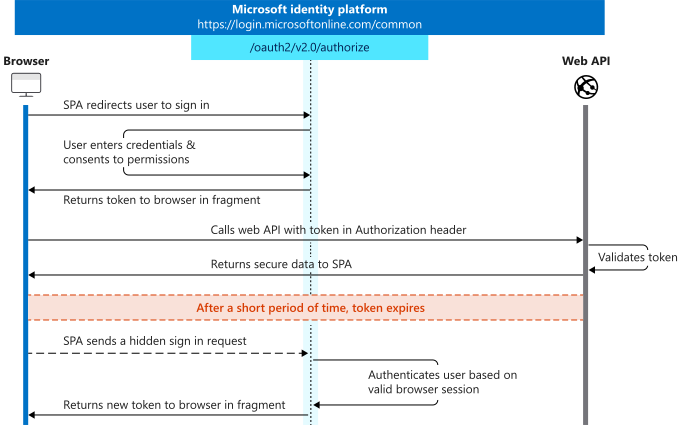

# Microsoft identity platform and OAuth 2.0 implicit grant flow

The Microsoft identity platform supports the OAuth 2.0 implicit grant flow as described in the [OAuth 2.0 Specification](https://tools.ietf.org/html/rfc6749#section-4.2). The defining characteristic of the implicit grant is that tokens (ID tokens or access tokens) are returned directly from the /authorize endpoint instead of the /token endpoint. This is often used as part of the [authorization code flow](v2-oauth2-auth-code-flow.md), in what is called the "hybrid flow" - retrieving the ID token on the /authorize request along with an authorization code.

[!INCLUDE [suggest-msal-from-protocols](includes/suggest-msal-from-protocols.md)]

> [!WARNING]
> Microsoft recommends you do *not* use the implicit grant flow flow. In most scenarios, more secure alternatives are available and recommended. Certain configurations of this flow requires a very high degree of trust in the application, and carries risks that are not present in other flows. You should only use this flow when other more secure flows aren't viable. For more information, see the [security concerns with implicit grant flow](#security-concerns-with-implicit-grant-flow).

## Protocol diagram

The following diagram shows what the entire implicit sign-in flow looks like and the sections that follow describe each step in detail.



## Suitable scenarios for the OAuth2 implicit grant

The implicit grant is only reliable for the initial, interactive portion of your sign-in flow, where the lack of [third party cookies](reference-third-party-cookies-spas.md) doesn't impact your application. This limitation means you should use it exclusively as part of the hybrid flow, where your application requests a code and a token from the authorization endpoint. In a hybrid flow, your application receives a code that can be redeemed for a refresh token, thus ensuring your app's login session remains valid over time.

### Prefer the auth code flow

With some browsers [removing support for third party cookies](reference-third-party-cookies-spas.md), the **implicit grant flow is no longer a suitable authentication method**. The [silent single sign-on (SSO) features](#acquire-access-tokens-silently) of the implicit flow don't work without third party cookies, causing applications to break when they attempt to get a new token. We strongly recommend that all new applications use the [authorization code flow](v2-oauth2-auth-code-flow.md) that now supports single-page apps in place of the implicit flow. Existing single-page apps should also [migrate to the authorization code flow](migrate-spa-implicit-to-auth-code.md).

### Security Concerns with implicit Grant Flow

The implicit grant flow is intended for traditional web applications where the server has control over processing POST data securely. There are two main ways to deliver tokens with the implicit grant flow: where `response_mode` is returned as a URL fragment or as a query parameter (using `form POST` and `GET` ). In the implicit flow where `response_mode=form_post`, the token is delivered securely through an HTML form POST to the client's redirect URI. This method ensures that the token isn't exposed in the URL fragment, which in turn avoids the risks of token leakage through browser history or referrer headers. 

The security concerns with the implicit flow arise when tokens are delivered using `response_mode=fragment`. The URL fragment is the part of the URL that comes after the `#` symbol and is not sent to the server when the browser requests a new page, but is available to JavaScript running in the browser. This means that the token is exposed to any JavaScript running on the page, which could be a security risk if the page includes third-party scripts. This security concerns for tokens in SPAs also don't apply to the implicit flow with `form POST`.

### When should you allow an access token or ID token to be issued when requested using implicit grant or hybrid flow?

The implicit grant and hybrid flow aren't as secure as other OAuth flows. Unless absolutely required, you shouldn’t allow an access or ID token to be issued when requested using implicit grant or hybrid flow in your app registration. If you (or your developers) are using the MSAL in your application to implement authentication and authorization, then neither field needs to be enabled.

However, if you (or your developers) aren't using MSAL in your application, the following table outlines when access tokens or ID token should be enabled.

| Type of application you're building | Tokens you should enable in App Registration |
| ------------------------------------ | -------------------------------------------- |
| A SPA (single-page application) that doesn't use the authorization code flow with PKCE | Access tokens & ID tokens |
| A web or SPA application that calls a web API via JavaScript using implicit flow | Access tokens & ID tokens |
| An ASP.NET Core web app and other web apps that use hybrid authentication | ID tokens |

## Send the sign-in request

To initially sign the user into your app, you can send an [OpenID Connect](v2-protocols-oidc.md) authentication request and get an `id_token` from the Microsoft identity platform.

> [!IMPORTANT]
> To successfully request an ID token and/or an access token, the app registration in the [Microsoft Entra admin center - App registrations](https://go.microsoft.com/fwlink/?linkid=2083908) page must have the corresponding implicit grant flow enabled, by selecting **ID tokens** and **access tokens** in the **Implicit grant and hybrid flows** section. If it's not enabled, an `unsupported_response` error will be returned:
>
> `The provided value for the input parameter 'response_type' is not allowed for this client. Expected value is 'code'`

```https
// Line breaks for legibility only

https://login.microsoftonline.com/{tenant}/oauth2/v2.0/authorize?
client_id=00001111-aaaa-2222-bbbb-3333cccc4444
&response_type=id_token
&redirect_uri=http%3A%2F%2Flocalhost%2Fmyapp%2F
&scope=openid
&response_mode=fragment
&state=12345
&nonce=678910
```

| Parameter | Type | Description |
| --------- | ---- | ----------- |
| `tenant` | required |The `{tenant}` value in the path of the request can be used to control who can sign into the application. The allowed values are `common`, `organizations`, `consumers`, and tenant identifiers. For more detail, see [protocol basics](./v2-protocols.md#endpoints). Critically, for guest scenarios where you sign a user from one tenant into another tenant, you **must** provide the tenant identifier to correctly sign them into the resource tenant.|
| `client_id` | required | The Application (client) ID that the [Microsoft Entra admin center - App registrations](https://go.microsoft.com/fwlink/?linkid=2083908) page assigned to your app. |
| `response_type` | required | Must include `id_token` for OpenID Connect sign-in. It may also include the `response_type`, `token`. Using `token` here allows your app to receive an access token immediately from the /authorize endpoint without having to make a second request to the /authorize endpoint. If you use the `token` response_type, the `scope` parameter must contain a scope indicating which resource to issue the token for (for example, `user.read` on Microsoft Graph). It can also contain `code` in place of `token` to provide an authorization code, for use in the [authorization code flow](v2-oauth2-auth-code-flow.md). This `id_token`+`code` response is sometimes called the hybrid flow.  |
| `redirect_uri` | recommended | The redirect URI of your app, where authentication responses are sent and received in your app. It must exactly match one of the redirect URIs you registered in the Microsoft Entra admin center, except it must be URL-encoded. |
| `scope` | required |A space-separated list of [scopes](./permissions-consent-overview.md). For OpenID Connect (`id_tokens`), it must include the scope `openid`, which translates to the "Sign you in" permission in the consent UI. Optionally you may also want to include the `email` and `profile` scopes for gaining access to additional user data. You may also include other scopes in this request for requesting consent to various resources, if an access token is requested. |
| `response_mode` | recommended | Specifies the method that should be used to send the resulting token back to your app. Defaults to `query` for just an access token, but `fragment` if the request includes an id_token. For security reasons, it's recommended to use `form_post` for the implicit flow to ensure that the token isn't exposed in the URL fragment. |
| `state` | recommended |A value included in the request are also returned in the token response. It can be a string of any content that you wish. A randomly generated unique value is typically used for [preventing cross-site request forgery attacks](https://tools.ietf.org/html/rfc6749#section-10.12). The state is also used to encode information about the user's state in the app before the authentication request occurred, such as the page or view they were on. |
| `nonce` | required | A value included in the request, generated by the app, that is included in the resulting ID token as a claim. The app can then verify this value to mitigate token replay attacks. The value is typically a randomized, unique string that can be used to identify the origin of the request. Only required when an id_token is requested. |
| `prompt` | optional | Indicates the type of user interaction that is required. The only valid values at this time are `login`, `none`, `select_account`, and `consent`. `prompt=login` forces the user to enter their credentials on that request, negating single-sign on. `prompt=none` is the opposite - it ensures that the user isn't presented with any interactive prompt whatsoever. If the request can't be completed silently via SSO, the Microsoft identity platform returns an error. `prompt=select_account` sends the user to an account picker where all of the accounts remembered in the session appear. `prompt=consent` will trigger the OAuth consent dialog after the user signs in, asking the user to grant permissions to the app. |
| `login_hint` | optional | You can use this parameter to prefill the username and email address field of the sign-in page for the user, if you know the username ahead of time. Often, apps use this parameter during reauthentication, after already extracting the `login_hint` [optional claim](./optional-claims.md) from an earlier sign-in. |
| `domain_hint` | optional |If included, it skips the email-based discovery process that user goes through on the sign-in page, leading to a slightly more streamlined user experience. This parameter is commonly used for Line of Business apps that operate in a single tenant, where they provide a domain name within a given tenant, forwarding the user to the federation provider for that tenant. This hint prevents guests from signing into this application, and limits the use of cloud credentials such as FIDO. |

At this point, the user is asked to enter their credentials and complete the authentication. The Microsoft identity platform ensures that the user has consented to the permissions indicated in the `scope` query parameter. If the user has consented to **none** of those permissions, it asks the user to consent to the required permissions. For more info, see [permissions, consent, and multitenant apps](./permissions-consent-overview.md).

Once the user authenticates and grants consent, the Microsoft identity platform returns a response to your app at the indicated `redirect_uri`, using the method specified in the `response_mode` parameter.

#### Successful response

A successful response using `response_mode=fragment` and `response_type=id_token+code` looks like the following (with line breaks for legibility):

```https
GET https://localhost/myapp/#
code=0.AgAAktYV-sfpYESnQynylW_UKZmH-C9y_G1A
&id_token=eyJ0eXAiOiJKV1QiLCJhbGciOiJSUzI1NiIsIng1dCI6Ik5HVEZ2ZEstZnl0aEV1Q...
&state=12345
```

| Parameter | Description |
| --- | --- |
| `code` | Included if `response_type` includes `code`. It's an authorization code suitable for use in the [authorization code flow](v2-oauth2-auth-code-flow.md).  |
| `access_token` |Included if `response_type` includes `token`. The access token that the app requested. The access token shouldn't be decoded or otherwise inspected, it should be treated as an opaque string. |
| `token_type` |Included if `response_type` includes `token`. This is always a `Bearer`. |
| `expires_in`|Included if `response_type` includes `token`. Indicates the number of seconds the token is valid, for caching purposes. |
| `scope` |Included if `response_type` includes `token`. Indicates one or more scopes for which the `access_token` is valid. May not include all the requested scopes if they weren't applicable to the user. For example, Microsoft Entra-only scopes requested when logging in using a personal account. |
| `id_token` | A signed JSON Web Token (JWT). The  app can decode the segments of this token to request information about the user who signed in. The app can cache the values and display them, but it shouldn't rely on them for any authorization or security boundaries. For more information about ID tokens, see the [`id_token reference`](id-tokens.md). <br> **Note:** Only provided if `openid` scope was requested and `response_type` included `id_tokens`. |
| `state` |If a state parameter is included in the request, the same value should appear in the response. The app should verify that the state values in the request and response are identical. |

[!INCLUDE [remind-not-to-validate-access-tokens](includes/remind-not-to-validate-access-tokens.md)]

### Error response

Error responses may also be sent to the `redirect_uri` so the app can handle them appropriately:

```https
GET https://localhost/myapp/#
error=access_denied
&error_description=the+user+canceled+the+authentication
```

| Parameter | Description |
| --- | --- |
| `error` |An error code string that can be used to classify types of errors that occur, and can be used to react to errors.|
| `error_description` |A specific error message that can help a developer identify the root cause of an authentication error.|

## Acquire access tokens silently

Now that your user is signed into your single-page app, you can silently get access tokens for calling web APIs secured by Microsoft identity platform, such as the [Microsoft Graph](https://developer.microsoft.com/graph). Even if you already received a token using the `token` response_type, you can use this method to acquire tokens to additional resources without redirecting the user to sign in again.

> [!Important]
> This part of the implicit flow is unlikely to work for your application as it's used across different browsers due to the [removal of third party cookies by default](reference-third-party-cookies-spas.md).  While this still currently works in Chromium-based browsers that are not in Incognito, developers should reconsider using this part of the flow. In browsers that do not support third party cookies, you will receive an error indicating that no users are signed in, as the login page's session cookies were removed by the browser. 

In the normal OpenID Connect/OAuth flow, you would do this by making a request to the Microsoft identity platform `/token` endpoint. You can make the request in a hidden iframe to get new tokens for other web APIs:

```https
// Line breaks for legibility only

https://login.microsoftonline.com/{tenant}/oauth2/v2.0/authorize?
client_id=00001111-aaaa-2222-bbbb-3333cccc4444&response_type=token
&redirect_uri=http%3A%2F%2Flocalhost%2Fmyapp%2F
&scope=https%3A%2F%2Fgraph.microsoft.com%2Fuser.read
&response_mode=fragment
&state=12345
&nonce=678910
&prompt=none
&login_hint=myuser@mycompany.com
```

For details on the query parameters in the URL, see [send the sign in request](#send-the-sign-in-request).

> [!TIP]
> Try copy & pasting the following request into a browser tab using a real `client_id` and `username` from your app registration. This will allow you to see the silent token request in action.
>
> ```https
> https://login.microsoftonline.com/common/oauth2/v2.0/authorize?client_id={your-client-id}&response_type=token&redirect_uri=http%3A%2F%2Flocalhost%2Fmyapp%2F&scope=https%3A%2F%2Fgraph.microsoft.com%2Fuser.read&response_mode=fragment&state=12345&nonce=678910&prompt=none&login_hint={username}
> ```
>
> Note that this will work even in browsers without third party cookie support, since you're entering this directly into a browser bar as opposed to opening it within an iframe. 

Thanks to the `prompt=none` parameter, this request either succeeds or fails immediately and returns to your application. The response is sent to your app at the indicated `redirect_uri`, using the method specified in the `response_mode` parameter.

### Successful response

A successful response using `response_mode=fragment` looks like:

```https
GET https://localhost/myapp/#
access_token=eyJ0eXAiOiJKV1QiLCJhbGciOiJSUzI1NiIsIng1dCI6Ik5HVEZ2ZEstZnl0aEV1Q...
&state=12345
&token_type=Bearer
&expires_in=3599
&scope=https%3A%2F%2Fgraph.microsoft.com%2Fdirectory.read
```

| Parameter | Description |
| --- | --- |
| `access_token` |Included if `response_type` includes `token`. The access token that the app requested, in this case for the Microsoft Graph. The access token shouldn't be decoded or otherwise inspected, it should be treated as an opaque string. |
| `token_type` | This is always a `Bearer`. |
| `expires_in` | Indicates the number of seconds the token is valid, for caching purposes. |
| `scope` | Indicates one or more scopes for which the access token is valid. May not include all of the scopes requested, if they weren't applicable to the user (If Microsoft Entra-only scopes are being requested when a personal account is used to sign in). |
| `id_token` | A signed JSON Web Token (JWT). Included if `response_type` includes `id_token`. The  app can decode the segments of this token to request information about the user who signed in. The  app can cache the values and display them, but it shouldn't rely on them for any authorization or security boundaries. For more information about id_tokens, see the [`id_token` reference](id-tokens.md). <br> **Note:** Only provided if `openid` scope was requested. |
| `state` |If a state parameter is included in the request, the same value should appear in the response. The app should verify that the state values in the request and response are identical. |

#### Error response

Error responses may also be sent to the `redirect_uri` so the app can handle them appropriately. If `prompt=none`, an expected error is:

```https
GET https://localhost/myapp/#
error=user_authentication_required
&error_description=the+request+could+not+be+completed+silently
```

| Parameter | Description |
| --- | --- |
| `error` |An error code string that can be used to classify types of errors that occur, and can be used to react to errors. |
| `error_description` |A specific error message that can help a developer identify the root cause of an authentication error. |

If you receive this error in the iframe request, the user must interactively sign in again to retrieve a new token. You can choose to handle this case in whatever way makes sense for your application.

## Refreshing tokens

The implicit grant doesn't provide refresh tokens. Both ID tokens and access tokens will expire after a short period of time, so your app must be prepared to refresh these tokens periodically. To refresh either type of token, you can perform the same hidden iframe request previously outlined, using the `prompt=none` parameter to control the identity platform's behavior. If you want to receive a new ID token, be sure to use `id_token` in the `response_type` and `scope=openid`, and a `nonce` parameter.

In browsers that don't support third party cookies, this results in an error indicating that no user is signed in. 

## Send a sign-out request

The OpenID Connect `end_session_endpoint` allows your app to send a request to the Microsoft identity platform to end a user's session and clear cookies set by the Microsoft identity platform. To fully sign a user out of a web application, your app should end its own session with the user (usually by clearing a token cache or dropping cookies), and then redirect the browser to:

```https
https://login.microsoftonline.com/{tenant}/oauth2/v2.0/logout?post_logout_redirect_uri=https://localhost/myapp/
```

| Parameter | Type | Description |
| --- | --- | --- |
| `tenant` |required |The `{tenant}` value in the path of the request can be used to control who can sign into the application. The allowed values are `common`, `organizations`, `consumers`, and tenant identifiers. For more detail, see [protocol basics](./v2-protocols.md#endpoints). |
| `post_logout_redirect_uri` | recommended | The URL that the user should be returned to after sign out completes. This value must match one of the redirect URIs registered for the application. If not included, the user is shown a generic message by the Microsoft identity platform. |

## See also

- Go over the [MSAL JS samples](sample-v2-code.md) to get started coding.
- Review the [authorization code flow](v2-oauth2-auth-code-flow.md) as a newer, better alternative to the implicit grant. 
