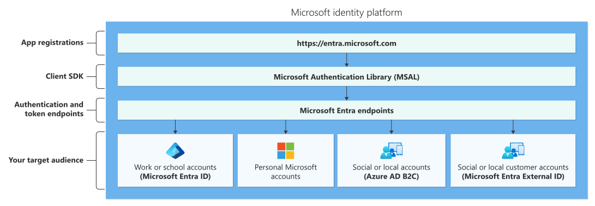

# What is the Microsoft identity platform?

The Microsoft identity platform is a cloud identity service that allows you to build applications your users and customers can sign in to using their Microsoft identities or social accounts. It authorizes access to your own APIs or Microsoft APIs like Microsoft Graph. The identity platform supports developers building single-tenant, line-of-business (LOB) applications, as well as multitenant software-as-a-service (SaaS) applications.

The following diagram shows the Microsoft identity platform at a high level, including the application registration experience, SDKs, endpoints, and supported identities or account types.

There are several components that make up the Microsoft identity platform:

- **OAuth 2.0 and OpenID Connect standard-compliant authentication service** enabling developers to authenticate several identity types, including:
  - Work or school accounts, provisioned through Microsoft Entra ID
  - Personal Microsoft accounts (Skype, Xbox, Outlook.com)
  - Social or local accounts, by using Azure AD B2C
  - Social or local customer accounts, by using Microsoft Entra External ID
  
- **Open-source libraries**: Microsoft Authentication Library (MSAL) and support for other standards-compliant libraries. The open source MSAL libraries are recommended as they provide built-in support for Conditional Access scenarios, single sign-on (SSO) experiences for your users, built-in token caching support, and more. MSAL supports the different authorization grants and token flows used in different application types and scenarios.
- **Microsoft identity platform endpoint** - The Microsoft identity platform endpoint is OIDC certified. It works with the Microsoft Authentication Libraries (MSAL) or any other standards-compliant library. It implements human readable scopes, in accordance with industry standards.
- **Application management portal**: A registration and configuration experience in the Microsoft Entra admin center, along with the other application management capabilities.
- **Application configuration API and PowerShell**: Programmatic configuration of your applications through the Microsoft Graph API and PowerShell so you can automate your DevOps tasks.
- **Developer content**: Technical documentation including quickstarts, tutorials, how-to guides, API reference, and code samples.

> [!VIDEO https://www.youtube.com/embed/uDU1QTSw7Ps]

For developers, the Microsoft identity platform offers integration of modern innovations in the identity and security space like passwordless authentication, step-up authentication, and Conditional Access. You don't need to implement such functionality yourself. Applications integrated with the Microsoft identity platform natively take advantage of such innovations.

With the Microsoft identity platform, you can write code once and reach any user. You can build an app once and have it work across many platforms, or build an app that functions as both a client and a resource application (API).
 
## Tenant configurations

A tenant is a dedicated and trusted instance of Microsoft Entra ID that contains an organization's resources such as registered apps and a directory of users. Microsoft identity platform offers two different tenant configurations: workforce and external. The tenant configuration you choose depends on the type of users you want to authenticate and authorize in your application.

* A **workforce** configuration is for your employees, internal business apps, and other organizational resources. You can invite external business partners and guests to your workforce tenant but the primary focus is on internal users. A workforce tenant is the default configuration for Microsoft Entra tenants.

* An **external** configuration is used exclusively for External ID scenarios where you want to publish apps to consumers or business customers who are not part of your organization. With an external tenant, you can create a customized sign-in and sign-up experiences for your customers, manage their identities and access to your apps.

Workforce and external tenants have different capabilities and limitations. Choosing the right tenant configuration will help you build the right identity and access management solution for your application. For a more detailed comparison of features in both configurations, see [Supported features in workforce and external tenants](../external-id/customers/concept-supported-features-customers.md).

## Getting started

Choose your preferred [application scenario](authentication-flows-app-scenarios.md). Each of these scenario paths has an overview and links to a quickstart to help you get started:

Browser based authentication (Workforce and External tenants):

- [React Single-page app (SPA)](quickstart-single-page-app-react-sign-in.md) using browser-based authentication.
- [ASP.NET Core Web app](quickstart-web-app-dotnet-core-sign-in.md).
- [ASP.NET Core API](quickstart-web-api-aspnet-core-protect-api.md).
- [Desktop app](scenario-desktop-app-registration.md).
- [Daemon app](scenario-daemon-app-registration.md).
- [Mobile app](scenario-mobile-app-configuration.md) in a workforce tenant.

Native authentication (External tenants only):
- [React Single-page app (SPA)](quickstart-native-authentication-single-page-app-react-sign-in.md)
- [Android app](quickstart-native-authentication-android-sign-in.md)
- [iOS app](quickstart-native-authentication-ios-sign-in.md)
- [macOS app](quickstart-native-authentication-macos-sign-in.md)

For a more in-depth look at building applications using the Microsoft identity platform, see our multipart tutorial series for the following applications:

Browser based authentication (Workforce and External tenants):

- [React Single-page app (SPA)](tutorial-single-page-app-react-prepare-app.md)
- [ASP.NET Core Web app](tutorial-web-app-dotnet-prepare-app.md)
- [ASP.NET Core API](tutorial-web-api-dotnet-register-app.md)

Native authentication (External tenants only):
- [React Single-page app (SPA)](tutorial-native-authentication-single-page-app-react-sign-up.md)
- [Android Kotlin app](tutorial-native-authentication-prepare-android-app.md)
- [iOS/macOS Switch app](tutorial-native-authentication-prepare-ios-macos-app.md)

As you work with the Microsoft identity platform to integrate authentication and authorization in your apps, you can refer to this image that outlines the most common app scenarios and their identity components. Select the image to view it full-size.

## Learn authentication concepts

Learn how core authentication and Microsoft Entra concepts apply to the Microsoft identity platform in this recommended set of articles:

- [Authentication basics](./authentication-vs-authorization.md)
- [Application and service principals](app-objects-and-service-principals.md)
- [Audiences](v2-supported-account-types.md)
- [Permissions and consent](./permissions-consent-overview.md)
- [ID tokens](id-tokens.md)
- [Access tokens](access-tokens.md)
- [Authentication flows and application scenarios](authentication-flows-app-scenarios.md)

## More identity and access management options

[Azure AD B2C](/azure/active-directory-b2c/overview) - Build customer-facing applications your users can sign in to using their social accounts like Facebook or Google, or by using an email address and password.
Effective May 1, 2025, Azure AD B2C will no longer be available to purchase for new customers. To learn more, please see [Is Azure AD B2C still available to purchase?](/azure/active-directory-b2c/faq?tabs=app-reg-ga#azure-ad-b2c-end-of-sale) in our FAQ.

[Microsoft Entra External ID in workforce tenants](../external-id/what-is-b2b.md) - Invite external users into your Microsoft Entra tenant as "guest" users, and assign permissions for authorization while they use their existing credentials for authentication.

## Next steps

If you have an Azure account, then you have access to a Microsoft Entra tenant. However, most Microsoft identity platform developers need their own Microsoft Entra tenant for use while developing applications, known as a *dev tenant*.

Learn how to create your own tenant for use while building your applications:

> [!div class="nextstepaction"]
> [Quickstart: Set up a Microsoft Entra tenant](quickstart-create-new-tenant.md)
