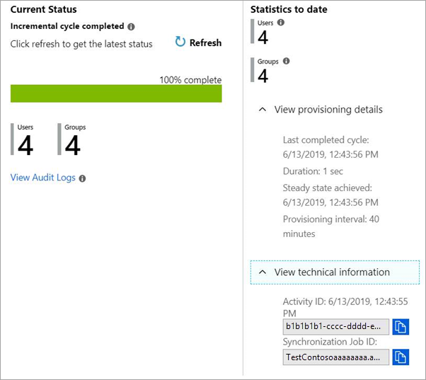
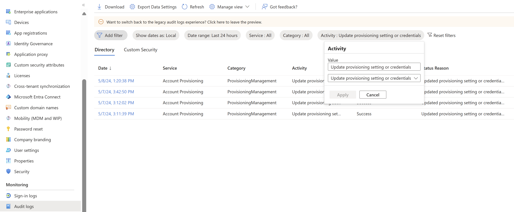

# Check the status of user provisioning

The Microsoft Entra provisioning service runs an initial provisioning cycle against the source system and target system, followed by periodic incremental cycles. When you configure provisioning for an app, you can check the current status of the provisioning service and see when a user is able to access an app.

## View the provisioning progress bar

 On the **Provisioning** page for an app, you can view the status of the Microsoft Entra provisioning service. The **Current Status** section at the bottom of the page shows whether a provisioning cycle has started provisioning user accounts. You can watch the progress of the cycle, see how many users and groups have been provisioned, and see how many roles are created.

When you first configure automatic provisioning, the **Current Status** section at the bottom of the page shows the status of the initial provisioning cycle. This section updates each time an incremental cycle is run. The following details are shown:
- The type of provisioning cycle (initial or incremental) that is currently running or was last completed.
- A **progress bar** showing the percentage of the provisioning cycle that has completed. The percentage reflects the count of pages provisioned. Each page could contain multiple users or groups, so the percentage doesn't directly correlate to the number of users, groups, or roles provisioned.
- A **Refresh** button you can use to keep the view updated.
- The number of **Users** and **Groups** in the connector data store. The count increases anytime an object is added to the scope of provisioning. The count doesn't go down if a user is soft-deleted or hard-deleted because the operation doesn't remove the object from the connector data store. The count is recalculated the first sync after the CDS is [reset](/graph/api/synchronization-synchronizationjob-restart?tabs=http&view=graph-rest-beta&preserve-view=true) 
- A **View Provisioning Logs** link, which opens the Microsoft Entra provisioning logs. To learn more about operations run by the user provisioning service, including provisioning status for individual users, see [Use provisioning logs](#use-provisioning-logs-to-check-a-users-provisioning-status) later in the article.

After a provisioning cycle is complete, the **Statistics to date** section shows the cumulative numbers of users and groups that have been provisioned to date, along with the completion date and duration of the last cycle. The **Activity ID** uniquely identifies the most recent provisioning cycle. The **Job ID** is a unique identifier for the provisioning job, and is specific to the app in your tenant.

The provisioning progress is viewed in the Microsoft Entra admin center at **Entra ID** > **Enterprise apps** > \[*application name*\] > **Provisioning**.

You can also use Microsoft Graph to programmatically monitor the status of provisioning to an application.  For more information, see [monitor provisioning](application-provisioning-configuration-api.md#step-5-monitor-provisioning).

## Use provisioning logs to check a user's provisioning status

To see the provisioning status for a selected user, consult the [Provisioning logs](~/identity/monitoring-health/concept-provisioning-logs.md?context=azure/active-directory/manage-apps/context/manage-apps-context) in Microsoft Entra ID. All operations run by the user provisioning service are recorded in the Microsoft Entra provisioning logs. The logs include read and write operations made to the source and target systems. Associated user data related to read and write operations is also logged.

You can access the provisioning logs in the Microsoft Entra admin center by selecting **Entra ID** > **Enterprise apps** > **Provisioning logs** in the **Activity** section. You can search the provisioning data based on the name of the user or the identifier in either the source system or the target system. For details, see [Provisioning logs](~/identity/monitoring-health/concept-provisioning-logs.md?context=azure/active-directory/manage-apps/context/manage-apps-context). 

The provisioning logs record all the operations performed by the provisioning service, including:

* Querying Microsoft Entra ID for assigned users that are in scope for provisioning
* Querying the target app for the existence of those users
* Comparing the user objects between the system
* Adding, updating, or disabling the user account in the target system based on the comparison

For more information on how to read the provisioning logs in the Microsoft Entra admin center, see [provisioning reporting guide](check-status-user-account-provisioning.md).

## How long will it take to provision users?
The time to provision a user, group, or group membership varies based on several factors. 
- The more users, groups, and group memberships in scope for provisioning, the longer that it will take for the sync job to complete. For example, a sync job with 10 groups, each with 20K members, will take longer to provision than a sync job with 1 group of 20K members.
- If the sync scope is set to "sync all users and groups," the sync engine will evaluate every user, group in the tenant during the initial cycle. This enables the sync engine to determine which objects are in scope. As a result, the total number of users, groups, and group members present in the source system (ex: Microsoft Entra ID) impacts performance.  
- The number of changes in the source system impacts the time to provision updates during an incremental cycle. Changes to users or groups that aren't in scope for provisioning (ex: new users created in the tenant or group memberships updated) can impact performance as the service will need to evaluate the change and skip it. This is particularly important when the scope is "sync all users and groups"
- Some target systems implement request rate limits and throttling, which can impact performance during large sync operations. Under these conditions, an app that receives too many requests too fast might slow its response rate or close the connection. Gallery applications are configured to adhere to the rate limits set by the application developer, with no action required by an administrator configuring provisioning. 
- Sync jobs for which all users are created for the first time take about twice as long as sync jobs for which all users are matched to existing users.
- The number of failures that the provisioning service has to retry on a given sync cycle impacts performance. Check the progress bar and [provisioning logs](check-status-user-account-provisioning.md) for any failures and remediate them.
- Provisioning jobs in quarantine run at a reduced frequency. Review the quarantine reason and remediate it to restore the typical execution frequency.

For the configuration **Sync assigned user and groups only**, you can use the following formulas to determine the **approximate** minimum and maximum expected **initial cycle** times:

- Minimum minutes =  0.01 x [Number of assigned users, groups, and group members]
- Maximum minutes = 0.08 x [Number of assigned users, groups, and group members]

## Recommendations for reducing the time to provision a user and / or group:
1. Set the provisioning scope to sync `assigned users and groups` rather than `sync all users and groups`.
2. Minimize the number of users and groups in scope for provisioning.
3. Create multiple provisioning jobs targeting the same system. When doing this, each sync job will operate independently, reducing the time to process changes. Please make sure that the scope of users is distinct between these provisioning jobs to avoid changes from one job impacting another. 
4. Add scoping filters to further limit the number of users and groups in scope for provisioning. If performance becomes an issue, and you're attempting to provision most users and groups in your tenant, then use scoping filters. Scoping filters allow you to fine tune the data that the provisioning service extracts from Microsoft Entra ID by filtering out users based on specific attribute values. For more information on scoping filters, see [Attribute-based application provisioning with scoping filters](define-conditional-rules-for-provisioning-user-accounts.md).

## Audit changes to your provisioning configuration
Provisioning configuration changes are logged in the audit logs. Users with the necessary permissions, such as Application Administrator and Reports Reader, can access logs through the audit logs UI, API, and through PowerShell. You can use the activity filter in the audit logs to identify the following actions.

> [!Note]
> For actions that the provisioning service performs such as creating users, updating users, and deleting users we recommend using the [provisioning logs](~/identity/monitoring-health/howto-analyze-provisioning-logs.md). For monitoring changes to your provisioning configuration, we recommend using the [audit logs](~/identity/monitoring-health/concept-audit-logs.md). 

| Action | Activity (filter the logs on this property)| 
| -------- | -------- | 
| Update credentials (ex: add a new bearer token) |  Update provisioning setting or credentials |  
| Change settings on your provisioning job (ex: notification email, sync all vs. sync assigned users and groups, accidental deletions prevention)|  Update provisioning setting or credentials| 
| Start provisioning | Enable/start provisioning configuration | 
| Stop provisioning |  Disable/pause provisioning configuration | 
| Restart provisioning |  Enable/restart provisioning configuration |  
| Update attribute mappings or scoping rules |  Update attribute mappings or scope  | 

## Next steps
[Automate user provisioning and deprovisioning to SaaS applications with Microsoft Entra ID](user-provisioning.md)
