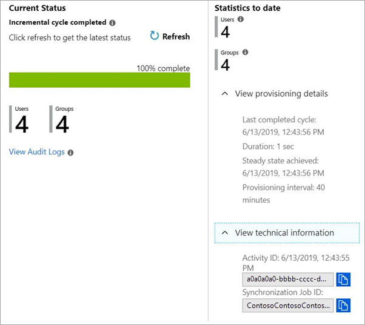

# Tutorial: Reporting on automatic user account provisioning

Microsoft Entra ID includes a [user account provisioning service](user-provisioning.md). The service helps automate the provisioning deprovisioning of user accounts in SaaS apps and other systems. The automation helps with end-to-end identity lifecycle management. Microsoft Entra ID supports preintegrated user provisioning connectors for many applications and systems. To learn more about user provisioning tutorials, see [Provisioning Tutorials](~/identity/saas-apps/tutorial-list.md).

This article describes how to check the status of provisioning jobs after setup, and how to troubleshoot the provisioning of individual users and groups.

## Overview

Provisioning connectors are set up and configured using the [Microsoft Entra admin center](https://entra.microsoft.com), by following the [provided documentation](~/identity/saas-apps/tutorial-list.md) for the supported application. When the connector is configured and running, provisioning jobs can be reported using the following methods:

- Using the [Microsoft Entra admin center](https://entra.microsoft.com)

- Streaming the provisioning logs into [Azure Monitor](~/identity/app-provisioning/application-provisioning-log-analytics.md). This method allows for extended data retention and building custom dashboards, alerts, and queries.

- Querying the [Microsoft Graph API](/graph/api/resources/provisioningobjectsummary) for the provisioning logs.

- Downloading the provisioning logs as a CSV or JSON file.

### Definitions

This article uses the following terms:

* **Source System** - The repository of users that the Microsoft Entra provisioning service synchronizes from. Microsoft Entra ID is the source system for most preintegrated provisioning connectors, however there are some exceptions (example: Workday Inbound Synchronization).
* **Target System** - The repository of users where the Microsoft Entra provisioning service synchronizes. The repository is typically a SaaS application, such as Salesforce, ServiceNow, G Suite, and Dropbox for Business. In some cases the repository can be an on-premises system such as Active Directory, such as Workday Inbound Synchronization to Active Directory.

## Getting provisioning reports from the Microsoft Entra admin center

To get provisioning report information for a given application:
1. Sign in to the [Microsoft Entra admin center](https://entra.microsoft.com) as at least an [Application Administrator](~/identity/role-based-access-control/permissions-reference.md#application-administrator).
1. Browse to **Entra ID** > **Enterprise apps**.
1. Select **Provisioning logs** in the **Activity** section. You can also browse to the Enterprise Application for which provisioning is configured. For example, if you're provisioning users to LinkedIn Elevate, the navigation path to the application details is:

**Entra ID** > **Enterprise apps** > **All applications** > **LinkedIn Elevate**

From the all applications area, you access both the provisioning progress bar and provisioning logs.

## Provisioning progress bar

The [provisioning progress bar](application-provisioning-when-will-provisioning-finish-specific-user.md#view-the-provisioning-progress-bar) is visible in the **Provisioning** tab for a given application. It appears in the **Current Status** section and shows the status of the current initial or incremental cycle. This section also shows:

* The total number of users and groups that are synchronized and currently in scope for provisioning between the source system and the target system.
* The last time the synchronization was run. Synchronizations typically occur every 20-40 minutes, after the [initial cycle](~/identity/app-provisioning/how-provisioning-works.md#provisioning-cycles-initial-and-incremental) completes.
* The status of an [initial cycle](~/identity/app-provisioning/how-provisioning-works.md#provisioning-cycles-initial-and-incremental) and if the cycle is complete.
* The status of the provisioning process and if it's being placed in quarantine. The status also shows the reason for the quarantine. For example, a status might indicate a failure to communicate with the target system due to invalid admin credentials.

The **Current Status** should be the first place admins look to check on the operational health of the provisioning job.

 

You can also use Microsoft Graph to programmatically monitor the status of provisioning to an application. For more information, see [monitor provisioning](application-provisioning-configuration-api.md#step-5-monitor-provisioning).

## Provisioning logs 

All activities performed by the provisioning service are recorded in the Microsoft Entra Provisioning logs. You can access the Provisioning logs in the Microsoft Entra admin center. You can search the provisioning data based on the name of the user or the identifier in either the source system or the target system. For details, see [Provisioning logs](~/identity/monitoring-health/concept-provisioning-logs.md). 

## Troubleshooting

The provisioning summary report and Provisioning logs play a key role helping admins troubleshoot various user account provisioning issues.

For scenario-based guidance on how to troubleshoot automatic user provisioning, see [Problems configuring and provisioning users to an application](troubleshoot.md).

## Related content

- [Managing user account provisioning for Enterprise Apps](configure-automatic-user-provisioning-portal.md)
- [What is application access and single sign-on with Microsoft Entra ID?](~/identity/enterprise-apps/what-is-single-sign-on.md)
