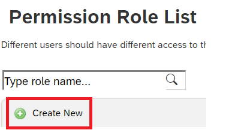
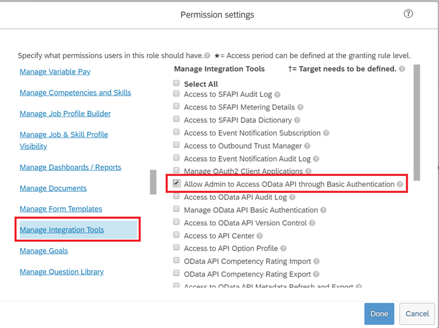
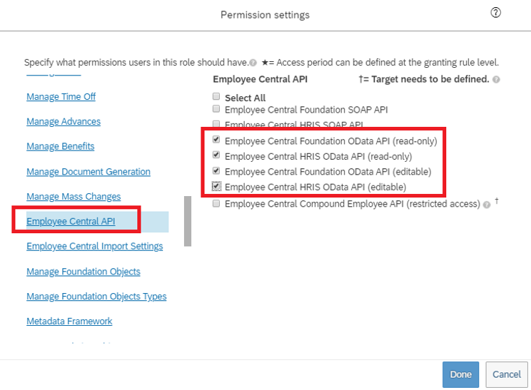
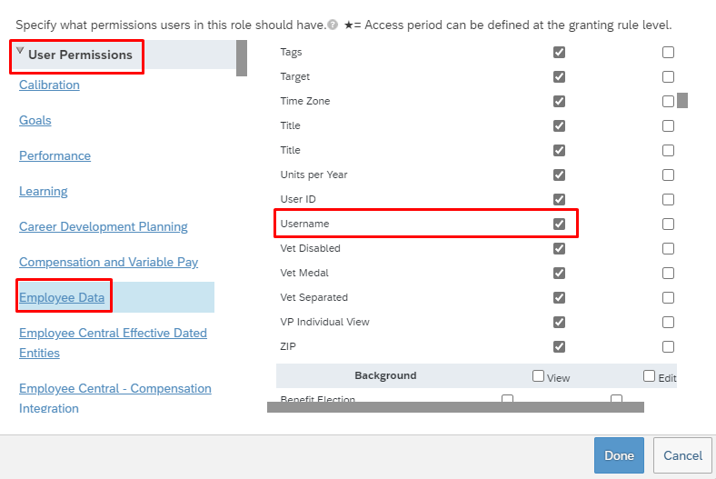
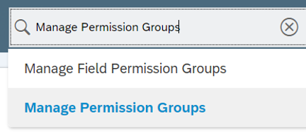
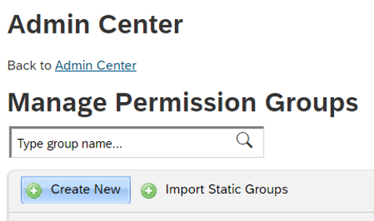
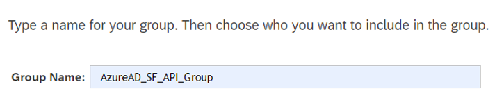
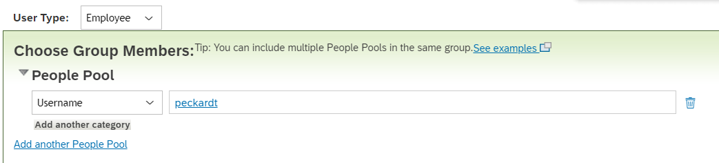

# Configure SAP SuccessFactors API user

A common requirement of all the SuccessFactors provisioning connectors is that they require credentials of a SuccessFactors account with the right permissions to invoke the SuccessFactors OData APIs. This section describes steps to create the service account in SuccessFactors and grant appropriate permissions.

## Create/identify API user account in SuccessFactors

Work with your SuccessFactors admin team or implementation partner to create or identify a user account in SuccessFactors to invoke the OData APIs. The username and password credentials of this account are required when configuring the provisioning apps in Microsoft Entra ID.

## Create an API permissions role

1. Sign in to SAP SuccessFactors with a user account that has access to the Admin Center.
1. Search for **Manage Permission Roles**, then select **Manage Permission Roles** from the search results.

    
1. From the Permission Role List, select **Create New**.
    > [!div class="mx-imgBorder"]
    > 
1. Add a **Role Name** and **Description** for the new permission role. The name and description should indicate that the role is for API usage permissions.
1. Under Permission settings, select **Permission...**, then scroll down the permission list and select **Manage Integration Tools**. Check the box for **Allow Admin to Access to OData API through Basic Authentication**.
    > [!div class="mx-imgBorder"]
    > 
1. Scroll down in the same box and select **Employee Central API**. Add permissions as shown below to read using ODATA API and edit using ODATA API. Select the edit option if you plan to use the same account for the Writeback to SuccessFactors scenario.
    > [!div class="mx-imgBorder"]
    > 

1. In the same permissions box, go to **User Permissions -> Employee Data** and review the attributes that the service account can read from the SuccessFactors tenant. For example, to retrieve the *Username* attribute from SuccessFactors, ensure that "View" permission is granted for this attribute. Similarly review each attribute for view permission.

    > [!div class="mx-imgBorder"]
    > 

    >[!NOTE]
    >For the complete list of attributes retrieved by this provisioning app, see [SuccessFactors Attribute Reference](~/identity/app-provisioning/sap-successfactors-attribute-reference.md).

1. Select **Done**. Select **Save Changes**.

## Create a permission group for the API user

1. In the SuccessFactors Admin Center, search for **Manage Permission Groups**, then select **Manage Permission Groups** from the search results.
    > [!div class="mx-imgBorder"]
    > 
1. From the Manage Permission Groups window, select **Create New**.
    > [!div class="mx-imgBorder"]
    > 
1. Add a Group Name for the new group. The group name should indicate that the group is for API users.
    > [!div class="mx-imgBorder"]
    > 
1. Add members to the group. For example, you could select **Username** from the People Pool drop-down menu and then enter the username of the API account that's used for the integration.
    > [!div class="mx-imgBorder"]
    > 
1. Select **Done** to finish creating the Permission Group.

## Grant the permission role to the permission group

1. In SuccessFactors Admin Center, search for **Manage Permission Roles**, then select **Manage Permission Roles** from the search results.
1. From the **Permission Role List**, select the role that you created for API usage permissions.
1. Under **Grant this role to...**, select the **Add...** button.
1. Select **Permission Group...** from the drop-down menu, then select **Select...** to open the Groups window to search and select the group created above.
1. Review the Permission Role grant to the Permission Group.
1. Select **Save Changes**.
