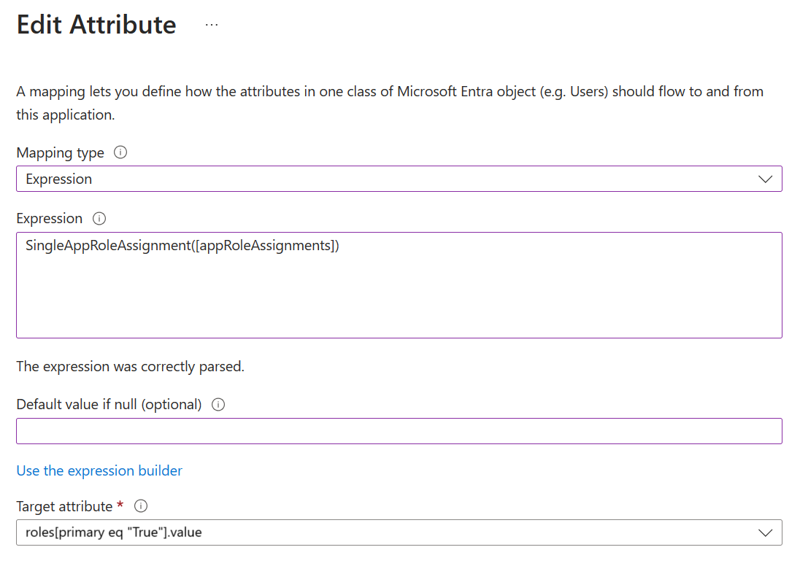
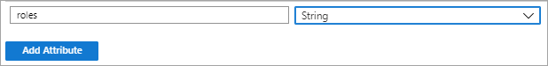
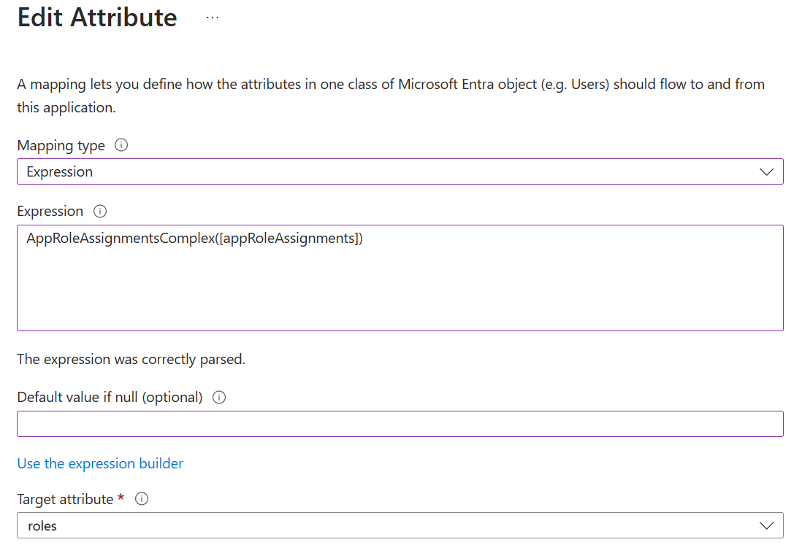
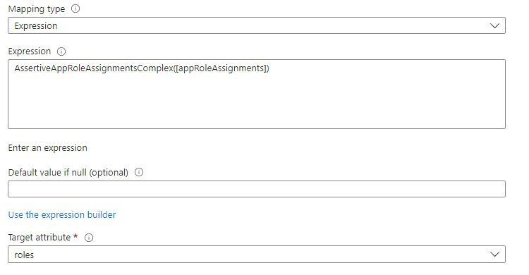

# Tutorial - Customize user provisioning attribute-mappings for SaaS applications in Microsoft Entra ID

Microsoft Entra ID provides support for user provisioning to non-Microsoft SaaS applications such as Salesforce, G Suite and others. If you enable user provisioning for a non-Microsoft SaaS application, the Microsoft Entra admin center controls its attribute values through attribute-mappings.

Before you get started, make sure you're familiar with app management and **single sign-on (SSO)** concepts. Check out the following links:
- [Quickstart Series on App Management in Microsoft Entra ID](~/identity/enterprise-apps/view-applications-portal.md)
- [What is single sign-on (SSO)?](~/identity/enterprise-apps/what-is-single-sign-on.md)

There's a preconfigured set of attributes and attribute-mappings between Microsoft Entra user objects and each SaaS app's user objects. Some apps manage other types of objects along with Users, such as Groups.

You can customize the default attribute-mappings according to your business needs. So, you can change or delete existing attribute-mappings, or create new attribute-mappings.

> [!NOTE]
> In addition to configuring attribute mappings through the Microsoft Entra interface, you can review, download, and edit the JSON representation of your schema.

## Editing user attribute-mappings


Follow these steps to access the **Attribute Mapping** feature of user provisioning:

1. Sign in to the [Microsoft Entra admin center](https://entra.microsoft.com) as at least an [Application Administrator](~/identity/role-based-access-control/permissions-reference.md#application-administrator).
1. Browse to **Entra ID** > **Enterprise apps**.
1. A list of all configured apps is shown, including apps that were added from the gallery.
1. Select any app to load its app management pane, where you can view reports and manage app settings.
1. Select **Provisioning** to manage user account provisioning settings for the selected app.
1. Under **Manage**, select **Attribute Mapping**. The attribute mapping page displays a table of current mappings organized by object type (**Users** and **Groups**). The table shows the **Source Attribute**, **Target Attribute**, **Mapping Type**, and **Matching Precedence** for each mapping.

1. To edit an existing mapping, select the pencil icon to the right of the mapping row. The **Edit Attribute** screen opens, where you can modify the user attributes that flow between Microsoft Entra ID and the target application.

2. To delete a mapping, select the trash can icon to the right of the mapping row. For required attributes, the **Delete** option is unavailable.

### Understanding attribute-mapping types

With attribute-mappings, you control how attributes are populated in a non-Microsoft SaaS application.
There are four different mapping types supported:

- **Direct** – the target attribute is populated with the value of an attribute of the linked object in Microsoft Entra ID.
- **Constant** – the target attribute is populated with a specific string you specified.
- **Expression** - the target attribute is populated based on the result of a script-like expression. For more information about expressions, see [Writing Expressions for Attribute-Mappings in Microsoft Entra ID](~/identity/app-provisioning/functions-for-customizing-application-data.md).

  > [!NOTE]
  > The maximum supported length for a single attribute mapping expression is **10,000 characters**.

- **LCW extensibility workflow** - The target attribute is populated with the value generated by an Azure Logic app, which is triggered by an LCW extensibility workflow. For more information about this mapping type, see [Extend attribute mappings with LCW extensibility workflows](~/identity/app-provisioning/extend-application-attributes.md).
- **None** - the target attribute is left unmodified. However, if the target attribute is ever empty, it populates with the default value that you specify.

Along with these four basic types, custom attribute-mappings support the concept of an optional **default** value assignment. The default value assignment ensures that a target attribute is populated with a value if there's not a value in Microsoft Entra ID or on the target object. The most common configuration is to leave this blank. For more information about mapping attributes, see [How Application Provisioning works in Microsoft Entra ID](~/identity/app-provisioning/how-provisioning-works.md#mapping-attributes).

### Understanding attribute-mapping properties

In the previous section, you were introduced to the attribute-mapping type property.
Along with this property, attribute-mappings also supports the attributes:

- **Source attribute** - The user attribute from the source system (example: Microsoft Entra ID).
- **Target attribute** – The user attribute in the target system (example: ServiceNow).
- **Default value if null (optional)** - The value that is passed to the target system if the source attribute is null. This value is only provisioned when a user is created. The "default value when null" isn't provisioned when updating an existing user. For example, add a default value for job title, when creating a user, with the expression: `Switch(IsPresent([jobTitle]), "DefaultValue", "True", [jobTitle])`. For more information about expressions, see [Reference for writing expressions for attribute mappings in Microsoft Entra ID](~/identity/app-provisioning/functions-for-customizing-application-data.md).
- **Match objects using this attribute** – Whether this mapping should be used to uniquely identify users between the source and target systems. Used on `userPrincipalName` or mail attribute in Microsoft Entra ID and mapped to a username field in a target application.
- **Matching precedence** – Multiple matching attributes can be set. When there are multiple, they're evaluated in the order defined by this field. As soon as a match is found, no further matching attributes are evaluated. While you can set as many matching attributes as you would like, consider whether the attributes you're using as matching attributes are truly unique and need to be matching attributes. Generally customers have one or two matching attributes in their configuration. 
- **Apply the mapping**.
  - **Always** – Apply this mapping on both user creation and update actions.
  - **Only during creation** - Apply this mapping only on user creation actions.

## Matching users in the source and target  systems
The Microsoft Entra provisioning service can be deployed in both "green field" scenarios (where users don't exist in the target system) and "brownfield" scenarios (where users already exist in the target system). To support both scenarios, the provisioning service uses the concept of matching attributes. Matching attributes allow you to determine how to uniquely identify a user in the source and match the user in the target. As part of planning your deployment, identify the attribute that can be used to uniquely identify a user in the source and target systems. Things to note:

- **Matching attributes should be unique:** Customers often use attributes such as userPrincipalName, mail, or object ID as the matching attribute.
- **Multiple attributes can be used as matching attributes:** You can define multiple attributes to be evaluated when matching users and the order in which they're evaluated (defined as matching precedence in the UI). If for example, you define three attributes as matching attributes, and a user is uniquely matched after evaluating the first two attributes, the service won't evaluate the third attribute. The service evaluates matching attributes in the order specified and stops evaluating when a match is found.  
- **The value in the source and the target don't have to match exactly:** The value in the target can be a function of the value in the source. So, one could have an emailAddress attribute in the source and the userPrincipalName in the target, and match by a function of the emailAddress attribute that replaces some characters with some constant value.  
- **Matching based on a combination of attributes isn't supported:** Most applications don't support querying based on two properties. Therefore, it's not possible to match based on a combination of attributes. It's possible to evaluate single properties on after another.
- **All users must have a value for at least one matching attribute:** If you define one matching attribute, all users must have a value for that attribute in the source system. If for example, you define userPrincipalName as the matching attribute, all users must have a userPrincipalName. If you define multiple matching attributes (for example, both extensionAttribute1 and mail), not all users have to have the same matching attribute. One user could have a extensionAttribute1 but not mail while another user could have mail but no extensionAttribute1. 
- **The target application must support filtering on the matching attribute:** Application developers allow filtering for a subset of attributes on their user or group API. For applications in the gallery, we ensure that the default attribute mapping is for an attribute that the target application's API does support filtering on. When changing the default matching attribute for the target application, check the non-Microsoft API documentation to ensure that the attribute can be filtered on.
- **An attribute with the LCW extensibility workflow mapping type cannot be used as a matching attribute:** If the value of an attribute is set using the LCW extensibility workflow mapping type (where an Azure Logic app generates the value), the attribute cannot be used as a matching attribute.

## Editing group attribute-mappings

A selected number of applications, such as ServiceNow, Box, and G Suite, support the ability to provision group and user objects. Group objects can contain group properties such as display names and email aliases, along with group members.

For apps that support group sync, enable or disable group sync by navigating to the **Scoping filters** page. 

The attributes provisioned as part of Group objects can be customized in the same manner as User objects, described previously. 

> [!TIP]
> Provisioning of group objects (properties and members) is a distinct concept from [assigning groups](~/identity/enterprise-apps/assign-user-or-group-access-portal.md) to an application. It's possible to assign a group to an application, but only provision the user objects contained in the group. Provisioning of full group objects isn't required to use groups in assignments.

## Editing the list of supported attributes

The user attributes supported for a given application are preconfigured. Most application's user management APIs don't support schema discovery. So, the Microsoft Entra provisioning service isn't able to dynamically generate the list of supported attributes by making calls to the application.

However, some applications support custom attributes, and the Microsoft Entra provisioning service can read and write to custom attributes. To enter their definitions into the Microsoft Entra admin center, select the **Advanced Options** dropdown menu at the top of the **Attribute Mapping** page, and then select **Edit target User attributes**.

Applications and systems that support customization of the attribute list include:

- Salesforce
- ServiceNow
- Workday to Active Directory / Workday to Microsoft Entra ID
- SuccessFactors to Active Directory / SuccessFactors to Microsoft Entra ID
- Microsoft Entra ID ([Microsoft Entra ID Graph API default attributes](/previous-versions/azure/ad/graph/api/entity-and-complex-type-reference#user-entity) and custom directory extensions are supported). For more information about creating extensions, see [Syncing extension attributes for Microsoft Entra Application Provisioning](./user-provisioning-sync-attributes-for-mapping.md) and [Known issues for provisioning in Microsoft Entra ID](./known-issues.md)
- Apps that support [System for Cross-domain Identity (SCIM) 2.0](https://tools.ietf.org/html/rfc7643)
- Microsoft Entra ID supports writeback to Workday or SuccessFactors for XPATH and JSONPath metadata. Microsoft Entra ID doesn't support new Workday or SuccessFactors attributes not included in the default schema


> [!NOTE]
> Editing the list of supported attributes is only recommended for administrators who have customized the schema of their applications and systems, and have first-hand knowledge of how their custom attributes have been defined or if a source attribute isn't automatically displayed in the Microsoft Entra admin center UI. This sometimes requires familiarity with the APIs and developer tools provided by an application or system. The ability to edit the list of supported attributes is locked down by default, but customers can enable the capability by navigating to the following URL: https://portal.azure.com/?Microsoft_AAD_Connect_Provisioning_forceSchemaEditorEnabled=true . You can then navigate to your application to view the [attribute list](#editing-the-list-of-supported-attributes). The **Advanced Options** dropdown on the **Attribute Mapping** page provides access to **Edit target User attributes** and **Edit schema**.

> [!NOTE]
> When a directory extension attribute in Microsoft Entra ID doesn't show up automatically in your attribute mapping drop-down, you can manually add it to the "Microsoft Entra attribute list".  When manually adding Microsoft Entra directory extension attributes to your provisioning app, note that directory extension attribute names are case-sensitive. For example: If you have a directory extension attribute named `extension_53c9e2c0exxxxxxxxxxxxxxxx_acmeCostCenter`, make sure you enter it in the same format as defined in the directory. Provisioning multi-valued directory extension attributes is not supported.    

When you're editing the list of supported attributes, the following properties are provided:

- **Name** - The system name of the attribute, as defined in the target object's schema.
- **Type** - The type of data the attribute stores, as defined in the target object's schema, which can be one of the following types.
  - *Binary* - Attribute contains binary data.
  - *Boolean* - Attribute contains a True or False value.
  - *DateTime* - Attribute contains a date string.
  - *Integer* - Attribute contains an integer.
  - *Reference* - Attribute contains an ID that references a value stored in another table in the target application.
  - *String*  - Attribute contains a text string.
- **Primary Key?** - Whether the attribute is defined as a primary key field in the target object's schema.
- **Required?** - Whether the attribute is required to be populated in the target application or system.
- **Multi-value?** - Whether the attribute supports multiple values.
- **Exact case?** - Whether the attributes values are evaluated in a case-sensitive way.
- **API Expression** - Don't use, unless instructed to do so by the documentation for a specific provisioning connector (such as Workday).
- **Referenced Object Attribute** - If it's a Reference type attribute, then this menu lets you select the table and attribute in the target application that contains the value associated with the attribute. For example, if you have an attribute named "Department" whose stored value references an object in a separate "Departments" table, you would select `Departments.Name`. The reference tables and the primary ID fields supported for a given application are preconfigured and can't be edited using the Microsoft Entra admin center. However, you can edit them using the [Microsoft Graph API](/graph/synchronization-configure-with-custom-target-attributes).

#### Provisioning a custom extension attribute to a SCIM compliant application

The SCIM Request for Comments (RFC) defines a core user and group schema, while also allowing for extensions to the schema to meet your application's needs. To add a custom attribute to a SCIM application:
  1. Sign in to the [Microsoft Entra admin center](https://entra.microsoft.com) as at least an [Application Administrator](~/identity/role-based-access-control/permissions-reference.md#application-administrator). 
  1. Browse to **Entra ID** > **Enterprise apps**.
  1. Select your application, and then select **Provisioning**.
  1. Under **Manage**, select **Attribute Mapping**, and then select the object type (**Users** or **Groups**) for which you'd like to add a custom attribute.
  1. Select the **Advanced Options** dropdown and then select **Edit target User attributes**.

      > [!NOTE]
      > If the **Edit attribute list for AppName** option doesn't appear, navigate to your application using the URL `https://portal.azure.com/?Microsoft_AAD_Connect_Provisioning_forceSchemaEditorEnabled=true` to enable the schema editor.
   
  1. At the bottom of the attribute list, enter information about the custom attribute in the fields provided. Then select **Add Attribute**.

For SCIM applications, the attribute name must follow the pattern shown in the example. The ```CustomExtensionName``` and ```CustomAttribute``` can be customized per your application's requirements, for example: ```urn:ietf:params:scim:schemas:extension:CustomExtensionName:2.0:User:CustomAttribute```. 

These instructions are only applicable to SCIM-enabled applications. Applications such as ServiceNow and Salesforce aren't integrated with Microsoft Entra ID using SCIM, and therefore they don't require this specific namespace when adding a custom attribute.

Custom attributes can't be referential attributes, multi-value, or complex-typed attributes. Custom multi-value and complex-typed extension attributes are currently supported only for applications in the gallery. The custom extension schema header is omitted in the example because it isn't sent in requests from the Microsoft Entra SCIM client. 
 
**Example representation of a user with an extension attribute:**

```json
{
  "schemas": [
    "urn:ietf:params:scim:schemas:core:2.0:User",
    "urn:ietf:params:scim:schemas:extension:enterprise:2.0:User"
  ],
  "userName": "bjensen",
  "id": "48af03ac28ad4fb88478",
  "externalId": "bjensen",
  "name": {
    "formatted": "Ms. Barbara J Jensen III",
    "familyName": "Jensen",
    "givenName": "Barbara"
  },
  "urn:ietf:params:scim:schemas:extension:enterprise:2.0:User": {
    "employeeNumber": "701984",
    "costCenter": "4130",
    "organization": "Universal Studios",
    "division": "Theme Park",
    "department": "Tour Operations",
    "manager": {
      "value": "26118915-6090-4610-87e4-49d8ca9f808d",
      "$ref": "../Users/26118915-6090-4610-87e4-49d8ca9f808d",
      "displayName": "John Smith"
    }
  },
  "urn:ietf:params:scim:schemas:extension:CustomExtensionName:2.0:User": {
    "CustomAttribute": "701984",
  },
  "meta": {
    "resourceType": "User",
    "created": "2010-01-23T04:56:22Z",
    "lastModified": "2011-05-13T04:42:34Z",
    "version": "W\/\"3694e05e9dff591\"",
    "location": "https://example.com/v2/Users/00aa00aa-bb11-cc22-dd33-44ee44ee44ee"
  }
}
```

## Provisioning a role to a SCIM app

Use the steps in the example to provision application roles for a user to your application. The description is specific to custom SCIM applications. For gallery applications such as Salesforce and ServiceNow, use the predefined role mappings. The bullets describe how to transform the AppRoleAssignments attribute to the format your application expects.

- Mapping an appRoleAssignment in Microsoft Entra ID to a role in your application requires that you transform the attribute using an [expression](~/identity/app-provisioning/functions-for-customizing-application-data.md). The appRoleAssignment attribute **shouldn't be mapped directly** to a role attribute without using an expression to parse the role details. 

> [!NOTE]
> When provisioning roles from enterprise applications, the SCIM standard defines enterprise user role attributes differently. For more information, see [Develop and plan provisioning for a SCIM endpoint in Microsoft Entra ID](~/identity/app-provisioning/use-scim-to-provision-users-and-groups.md#design-your-user-and-group-schema).

**SingleAppRoleAssignment**

**When to use:** Use the SingleAppRoleAssignment expression to provision a single role for a user and to specify the primary role. 

**How to configure:** Use the steps described to navigate to the attribute mappings page and use the SingleAppRoleAssignment expression to map to the roles attribute. There are three role attributes to choose from (`roles[primary eq "True"].display`, `roles[primary eq "True"].type`, and `roles[primary eq "True"].value`). You can choose to include any or all of the role attributes in your mappings. If you would like to include more than one, just add a new mapping and include it as the target attribute.



**Things to consider**
- Make sure multiple roles aren't assigned to a user. There's no guarantee which role is provisioned.
- Check the `SingleAppRoleAssignments` attribute. The attribute isn't compatible with setting scope to `Sync All users and groups`.

**Example request (POST)** 

```json
{
  "schemas": [
    "urn:ietf:params:scim:schemas:core:2.0:User"
  ],
  "externalId": "alias",
  "userName": "alias@contoso.OnMicrosoft.com",
  "active": true,
  "displayName": "First Name Last Name",
  "meta": {
    "resourceType": "User"
  },
  "roles": [
    {
      "primary": true,
      "type": "WindowsAzureActiveDirectoryRole",
      "value": "Admin"
    }
  ]
}
```

**Example output (PATCH)** 

```json
{
  "schemas": [
    "urn:ietf:params:scim:api:messages:2.0:PatchOp"
  ],
  "Operations": [
    {
      "op": "Add",
      "path": "roles",
      "value": [
        {
          "value": "{\"id\":\"06b07648-ecfe-589f-9d2f-6325724a46ee\",\"value\":\"25\",\"displayName\":\"Role1234\"}"
        }
      ]
    }
  ]
}
```

The request formats in the PATCH and POST differ. To ensure that POST and PATCH are sent in the same format, you can use the feature flag described [here](./application-provisioning-config-problem-scim-compatibility.md#flags-to-alter-the-scim-behavior). 

**AppRoleAssignmentsComplex**

**When to use:** Use the AppRoleAssignmentsComplex expression to provision multiple roles for a user. 

**How to configure:** Edit the list of supported attributes as described to include a new attribute for roles:

<br>

Then use the AppRoleAssignmentsComplex expression to map to the custom role attribute as shown in the image:

<br>

**Things to consider**

- All roles are provisioned as primary = false.
- The `id` attribute isn't required in SCIM roles. Use the `value` attribute instead. For example, if the `value` attribute contains the name or identifier for the role, use it to provision the role. You can use the feature flag [here](./application-provisioning-config-problem-scim-compatibility.md#flags-to-alter-the-scim-behavior) to fix the id attribute issue. However, relying solely on the value attribute isn't always sufficient; for example, if there are multiple roles with the same name or identifier. In certain cases, it's necessary to use the id attribute to properly provision the role


**Limitations** 

- AppRoleAssignmentsComplex isn't compatible with setting scope to "Sync All users and groups."

**Example Request (POST)**

```json
{
  "schemas": [
    "urn:ietf:params:scim:schemas:core:2.0:User"
  ],
  "externalId": "alias",
  "userName": "alias@contoso.OnMicrosoft.com",
  "active": true,
  "displayName": "First Name Last Name",
  "meta": {
    "resourceType": "User"
  },
  "roles": [
    {
      "primary": false,
      "type": "WindowsAzureActiveDirectoryRole",
      "displayName": "Admin",
      "value": "Admin"
    },
    {
      "primary": false,
      "type": "WindowsAzureActiveDirectoryRole",
      "displayName": "User",
      "value": "User"
    }
  ]
}
```

**Example output (PATCH)** 

```json
{
  "schemas": [
    "urn:ietf:params:scim:api:messages:2.0:PatchOp"
  ],
  "Operations": [
    {
      "op": "Add",
      "path": "roles",
      "value": [
        {
          "value": "{\"id\":\"06b07648-ecfe-589f-9d2f-6325724a46ee\",\"value\":\"Admin\",\"displayName\":\"Admin\"}"
        },
        {
          "value": "{\"id\":\"06b07648-ecfe-599f-9d2f-6325724a46ee\",\"value\":\"User\",\"displayName\":\"User\"}"
        }
      ]
    }
  ]
}
```

**AssertiveAppRoleAssignmentsComplex**   (Recommended for complex roles)

**When to use:** Use the AssertiveAppRoleAssignmentsComplex to enable PATCH Replace functionality. For SCIM applications that support multiple roles, this ensures that roles removed in Microsoft Entra ID are also removed in the target application. The replace functionality will also remove any additional roles the user has that are not reflected in Entra ID 

The difference between the AppRoleAssignmentsComplex and AssertiveAppRoleAssignmentsComplex is the mode of the patch call and the effect on the target system. The former does PATCH add only and therefore does not remove any existing roles on the target. The latter does PATCH replace which removes roles in the target system if they have not been assigned to the user on Entra ID. 

**How to configure:** Edit the list of supported attributes as described to include a new attribute for roles: 

<br>

Then use the AssertiveAppRoleAssignmentsComplex expression to map to the custom role attribute as shown in the image:

<br>  

**Things to consider**
- All roles are provisioned as primary = false.
- The `id` attribute isn't required in SCIM roles. Use the `value` attribute instead. For example, if the `value` attribute contains the name or identifier for the role, use it to provision the role. You can use the feature flag [here](./application-provisioning-config-problem-scim-compatibility.md#flags-to-alter-the-scim-behavior) to fix the id attribute issue. However, relying solely on the value attribute isn't always sufficient; for example, if there are multiple roles with the same name or identifier. In certain cases, it's necessary to use the id attribute to properly provision the role

**Limitations** 

- AssertiveAppRoleAssignmentsComplex isn't compatible with setting scope to "Sync All users and groups."

**Example Request (POST)**

```json
{
  "schemas": [
    "urn:ietf:params:scim:schemas:core:2.0:User"
  ],
  "externalId": "contoso",
  "userName": "contoso@alias.onmicrosoft.com",
  "active": true,
  "roles": [
    {
      "primary": false,
      "type": "WindowsAzureActiveDirectoryRole",
      "display": "User",
      "value": "User"
    },
    {
      "primary": false,
      "type": "WindowsAzureActiveDirectoryRole",
      "display": "Test",
      "value": "Test"
    }
  ]
}
```

**Example output (PATCH)** 

```json
{
  "schemas": [
    "urn:ietf:params:scim:api:messages:2.0:PatchOp"
  ],
  "Operations": [
    {
      "op": "replace",
      "path": "roles",
      "value": [
        {
          "primary": false,
          "type": "WindowsAzureActiveDirectoryRole",
          "display": "User",
          "value": "User"
        },
        {
          "primary": false,
          "type": "WindowsAzureActiveDirectoryRole",
          "display": "Test",
          "value": "Test"
        }
      ]
    }
  ]
}
```

## Provisioning a multi-value attribute

Certain attributes such as phoneNumbers and emails are multi-value attributes where you need to specify different types of phone numbers or emails. Use the expression for multi-value attributes. It allows you to specify the attribute type and map that to the corresponding Microsoft Entra user attribute for the value. 

* `phoneNumbers[type eq "work"].value`
* `phoneNumbers[type eq "mobile"].value`
* `phoneNumbers[type eq "fax"].value`

```json
{
  "schemas": [
    "urn:ietf:params:scim:schemas:core:2.0:User"
  ],
  "phoneNumbers": [
    {
      "value": "555-555-5555",
      "type": "work"
    },
    {
      "value": "555-555-5555",
      "type": "mobile"
    },
    {
      "value": "555-555-5555",
      "type": "fax"
    }
  ]
}
```

## Restoring the default attributes and attribute-mappings

If you need to reset your mapping settings back to their default state, select **Attribute mapping** > **Restore default mappings** to restore and save the configuration. Doing so sets all mappings and scoping filters as if the application was added to your Microsoft Entra tenant from the application gallery. This will also restart synchronization.

Selecting this option forces a resynchronization of all users while the provisioning service is running.

> [!IMPORTANT]
> We strongly recommend that **Provisioning status** be set to **Off** before invoking this option.

## What you should know

- Microsoft Entra ID provides an efficient implementation of a synchronization process. In an initialized environment, only objects requiring updates are processed during a synchronization cycle.
- Updating attribute-mappings affects the performance of a synchronization cycle. An update to the attribute-mapping configuration requires all managed objects to be reevaluated.
- A recommended best practice is to keep the number of consecutive changes to your attribute-mappings at a minimum.
- Adding a photo attribute to be provisioned to an app isn't supported today as you can't specify the format to sync the photo. You can request the feature on [User Voice](https://feedback.azure.com/d365community/forum/22920db1-ad25-ec11-b6e6-000d3a4f0789).
- The attribute `IsSoftDeleted` is often part of the default mappings for an application and can be true in one of four scenarios:
  - The user is out of scope due to being unassigned from the application. 
  - The user is out of scope due to not meeting a scoping filter. 
  - The user is soft deleted in Microsoft Entra ID. 
  - The property `AccountEnabled` is set to false on the user. Try to keep the `IsSoftDeleted` attribute in your attribute mappings.
- By default, the Microsoft Entra provisioning service doesn't send null values to target systems. Clearing attribute values is available in preview only for API-driven inbound provisioning apps. It isn't currently supported for other application provisioning scenarios or for inbound provisioning from Workday or SAP SuccessFactors. To enable this feature for API-driven inbound provisioning apps, see [Clear attribute values (Preview)](clear-attribute-values.md).
- They primary key, typically `ID`, shouldn't be included as a target attribute in your attribute mappings. 
- The role attribute typically needs to be mapped using an expression, rather than a direct mapping. For more information about role mapping, see [Provisioning a role to a SCIM app](#provisioning-a-role-to-a-scim-app). 
- While you can disable groups from your mappings, disabling users isn't supported. 

## Next steps

- [Automate User Provisioning/Deprovisioning to SaaS Apps](user-provisioning.md)
- [Writing Expressions for Attribute-Mappings](functions-for-customizing-application-data.md)
- [Scoping Filters for User Provisioning](define-conditional-rules-for-provisioning-user-accounts.md)
- [Using SCIM to enable automatic provisioning of users and groups from Microsoft Entra ID to applications](use-scim-to-provision-users-and-groups.md)
- [List of Tutorials on How to Integrate SaaS Apps](~/identity/saas-apps/tutorial-list.md)
