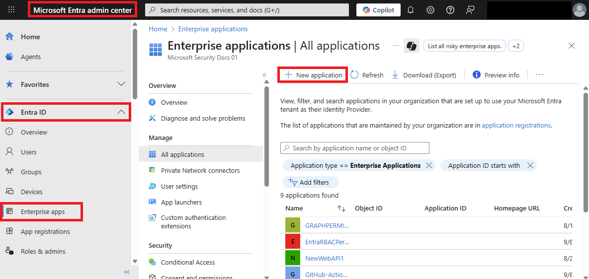

# Configure API-driven inbound provisioning app

## Introduction

This tutorial describes how to configure [API-driven inbound user provisioning](inbound-provisioning-api-concepts.md). 

This feature is available only when you configure the following Enterprise Gallery apps: 
* API-driven inbound user provisioning to Microsoft Entra ID
* API-driven inbound user provisioning to on-premises AD

## Prerequisites
To complete the steps in this tutorial, you need access to Microsoft Entra admin center with the following roles: 

* [Application Administrator](~/identity/role-based-access-control/permissions-reference.md#application-administrator) (if you're configuring inbound user provisioning to Microsoft Entra ID) OR
* [Application Administrator](~/identity/role-based-access-control/permissions-reference.md#application-administrator) + [Hybrid Identity Administrator](~/identity/role-based-access-control/permissions-reference.md#hybrid-identity-administrator) (if you're configuring inbound user provisioning to on-premises Active Directory)

If you're configuring inbound user provisioning to on-premises Active Directory, you need access to a Windows Server where you can install the provisioning agent for connecting to your Active Directory domain controller. 

## Create your API-driven provisioning app

1. Log in to the [Microsoft Entra admin center](<https://entra.microsoft.com>) as at least an [Application Administrator](https://go.microsoft.com/fwlink/?linkid=2247823).
2. Browse to **Identity** > **Applications** > **Enterprise applications**.
3. Click on **New application** to create a new provisioning application. 
     
4. Enter **API-driven** in the search field, then select the application for your setup:
     * **API-driven provisioning to on-premises Active Directory**: Select this app if you're provisioning hybrid identities (identities that need both on-premises AD and Microsoft Entra account) from your system of record. Once these accounts are provisioned in on-premises AD, they are automatically synchronized to your Microsoft Entra tenant using Microsoft Entra Connect Sync or Microsoft Entra Connect cloud sync.
     * **API-driven provisioning to Microsoft Entra ID**: Select this app if you're provisioning cloud-only identities (identities that don't require on-premises AD accounts and only need Microsoft Entra account) from your system of record.
     
     

5. In the **Name** field, rename the application to meet your naming requirements, then click **Create**.

     

     > [!NOTE]
     > If you plan to ingest data from multiple sources, each with their own sync rules, you can create multiple apps and give each app a descriptive name, such as `Provision-Employees-From-CSV-to-AD` or `Provision-Contractors-From-SQL-to-AD`.
6. Once the application creation is successful, go to the Provisioning blade and click on **Get started**.
     
7. Switch the Provisioning Mode from Manual to **Automatic**.

Depending on the app you selected, use one of the following sections to complete your setup: 
* [Configure API-driven inbound provisioning to on-premises AD](#configure-api-driven-inbound-provisioning-to-on-premises-ad)
* [Configure API-driven inbound provisioning to Microsoft Entra ID](#configure-api-driven-inbound-provisioning-to-azure-ad)

## Configure API-driven inbound provisioning to on-premises AD

1. After setting the Provisioning Mode to **Automatic**, click on **Save** to create the initial configuration of the provisioning job. 
1. Click on the information banner about the Microsoft Entra provisioning Agent.
1. Click **Accept terms & download** to download the Microsoft Entra provisioning Agent.
1. Refer to the steps documented here to [install and configure the provisioning agent.](https://go.microsoft.com/fwlink/?linkid=2241216). This step registers your on-premises Active Directory domains with your Microsoft Entra tenant.
1. Once the agent registration is successful, select your domain in the drop-down **Active Directory domain** and specify the distinguished name of the OU where new user accounts are created by default.
     > [!NOTE]
     > If your AD domain is not visible in the **Active Directory Domain** dropdown list, reload the provisioning app in the browser. Click on **View on-premises agents for your domain** to ensure that your agent status is healthy.
1. Click on **Test connection** to ensure that Microsoft Entra ID can connect to the provisioning agent.
1. Click on **Save** to save your changes.
1. Once the save operation is successful, you'll see two more expansion panels – one for **Mappings** and one for **Settings**. Before proceeding to the next step, provide a valid notification email ID and save the configuration again.
     > [!NOTE]
     > Providing the **Notification Email** in **Settings** is mandatory. If the Notification Email is left empty, then the provisioning goes into quarantine when you start the execution.
1. Click on hyperlink in the **Mappings** expansion panel to view the default attribute mappings. 
     > [!NOTE]
     > The default configuration in the **Attribute Mappings** page maps SCIM Core User and Enterprise User attributes to on-premises AD attributes. We recommend using the default mappings to get started and customizing these mappings later as you get more familiar with the overall data flow.
1. Complete the configuration by following steps in the section [Start accepting provisioning requests](#start-accepting-provisioning-requests).

## Configure API-driven inbound provisioning to Microsoft Entra ID
 

1. After setting the Provisioning Mode to **Automatic**, click on **Save** to create the initial configuration of the provisioning job. 
1. Once the save operation is successful, you will see two more expansion panels – one for **Mappings** and one for **Settings**. Before proceeding to the next step, make sure you provide a valid notification email ID and Save the configuration once more. 

     > [!NOTE]
     > Providing the **Notification Email** in **Settings** is mandatory. If the Notification Email is left empty, then the provisioning goes into quarantine when you start the execution.
1. Click on hyperlink in the **Mappings** expansion panel to view the default attribute mappings. 
     > [!NOTE]
     > The default configuration in the **Attribute Mappings** page maps SCIM Core User and Enterprise User attributes to on-premises AD attributes. We recommend using the default mappings to get started and customizing these mappings later as you get more familiar with the overall data flow.
1. Complete the configuration by following steps in the section [Start accepting provisioning requests](#start-accepting-provisioning-requests).

## Start accepting provisioning requests

1. Open the provisioning application's **Provisioning** > **Overview** page. 
1. On this page, you can take the following actions: 
     - **Start provisioning** control button – Click on this button to place the provisioning job in **listen mode** to process inbound bulk upload request payloads.  
     - **Stop provisioning** control button – Use this option to pause/stop the provisioning job. 
     - **Restart provisioning** control button – Use this option to purge any existing request payloads pending processing and start a new provisioning cycle. 
     - **Edit provisioning** control button – Use this option to edit the job settings, attribute mappings and to customize the provisioning schema. 
     - **Provision on demand** control button – This feature is not supported for API-driven inbound provisioning. 
     - **Provisioning API Endpoint** URL text – Copy the HTTPS URL value shown and save it in a Notepad or OneNote for use later with the API client.
1. Expand the **Statistics to date** > **View technical information** panel and copy the **Provisioning API Endpoint** URL. Share this URL with your API developer after [granting access permission](inbound-provisioning-api-grant-access.md) to invoke the API. 

## Next steps
- [Grant access to the inbound provisioning API](inbound-provisioning-api-grant-access.md)
- [Frequently asked questions about API-driven inbound provisioning](inbound-provisioning-api-faqs.md)
- [Automate user provisioning and deprovisioning to SaaS applications with Microsoft Entra ID](user-provisioning.md)
