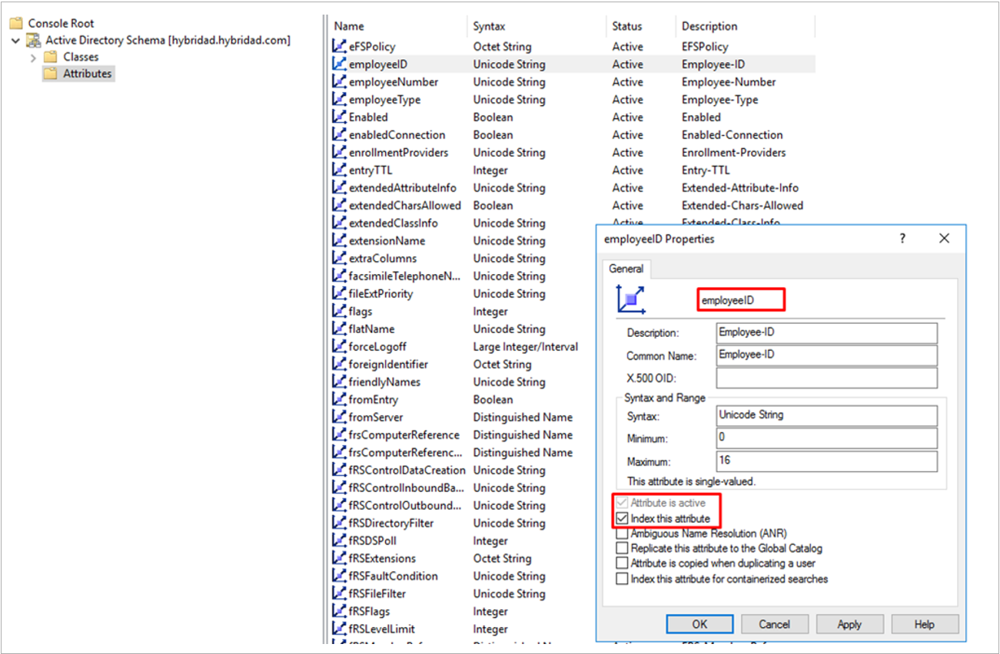

# Index the 'employeeId' Attribute for Microsoft Entra Inbound Provisioning to Active Directory

Microsoft Entra inbound provisioning allows organizations to automate user account creation and updates in on-premises Active Directory (AD) environments from sources such as Workday, SuccessFactors, or API-driven integrations. To ensure smooth and efficient synchronization, it's important to understand the role of attribute indexing—particularly the `employeeId` attribute, which is used as the default matching property during provisioning. This article provides guidance for optimizing synchronization performance with the `employeeId` attribute.

## Why Indexing employeeId Is Needed

By default, the `employeeId` attribute isn't indexed in Active Directory. However, we recommend indexing this attribute as it's used as the primary property to match identities between Microsoft Entra and AD during both full and incremental provisioning runs. Without indexing, directory lookups may be slower as your user base grows, potentially impacting synchronization performance and increasing provisioning times. Indexing ensures that these operations are completed efficiently and reliably.

## Scope: Applies to Multiple Provisioning Scenarios

This guidance applies to all Microsoft Entra inbound provisioning scenarios that synchronize identities to on-premises AD, including:
- Workday-to-Active Directory provisioning
- SuccessFactors-to-Active Directory provisioning
- API-driven inbound provisioning-to-Active Directory

## Multiple Matching Properties

If your provisioning setup uses more than one matching property (for example, `employeeId` and `mail`), be sure to check that each property is indexed in Active Directory. Indexing all matching properties used in synchronization helps maintain optimal performance and reduces the risk of delays or timeouts during provisioning runs.

## Impact on Active Directory domain storage

Enabling indexing for other attributes such as `employeeId` increases storage requirements within your AD domain. While the storage impact is typically modest, it's important to consider this when planning large-scale deployments or when working with domains that have limited available resources.

## How to Use the AD Schema Snap-in to Index an Attribute (for example, employeeId) 

**Prerequisites:**
  - Ensure you're a member of the **Schema Admins** group in Active Directory.
  - The AD Schema snap-in is not registered by default; you must register it first.

### Register the Schema Snap-in
  1. Open a Command Prompt as an *Administrator*. 
  1. Run:
      `regsvr32 schmmgmt.dll` 
      You should see a confirmation dialog that the registration succeeded.

### Open the Schema Snap-in
  1. Press **Win + R**, type **mmc**, then press **Enter** to open the Microsoft Management Console. 
  1. In the MMC, go to **File > Add/Remove Snap-in**. 
  1. Select **Active Directory Schema** from the list and click **Add**, then **OK**. 

### Locate the Attribute to Index
  1. In the left pane, expand Active Directory Schema and select Attributes. 
  1. Scroll through the list to find the attribute you want to index (for example, `employeeId`). 

### Edit Attribute Properties
  1. Right-click the attribute (for example, `employeeId`), then select **Properties**. 
  1. In the properties dialog, check the box labeled **Index this attribute** (or similar wording, depending on your Windows Server version). 
    

### Apply and Replicate Changes
  1. Click **OK** to save your changes. 
     Schema changes are replicated to all domain controllers. It may take some time for the change to propagate.

## Next steps
- To check if your Active Directory attribute is indexed by default refer to this list - [Indexed Attributes (AD Schema) - Win32 apps](~/windows/win32/adschema/attributes-indexed).
- To verify if the server is using an index to process the query, refer to this article - [Indexed Attributes (AD DS) - Win32 apps](~/windows/win32/ad/indexed-attributes).
- A practical blog post that explains the importance of indexing - [Indexing Attributes in Active Directory](https://techcommunity.microsoft.com/blog/microsoft-entra-blog/indexing-in-active-directory/243119).
