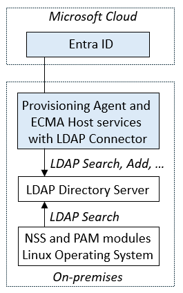

# Configuring Microsoft Entra ID to provision users into an LDAP directory for Linux authentication

The following documentation provides configuration and tutorial information demonstrating how to provision users from Microsoft Entra ID into an on-premises LDAP directory, so that those users can subsequently log into a Linux system that relies upon that LDAP directory for user authentication.  And when a user is removed from Entra ID, they are subsequently no longer able to log into a Linux system.

>[!NOTE]
> The scenario described in this documentation is only applicable for existing Linux systems that already rely upon a NSS or PAM LDAP module for user identification and authentication.  Linux VMs in Azure or that are Azure Arc-enabled should be instead integrated with Microsoft Entra authentication. You can now use Microsoft Entra ID as a core authentication platform and a certificate authority to SSH into a Linux VM by using Microsoft Entra ID and OpenSSH certificate-based authentication, as described in [Log in to a Linux virtual machine in Azure by using Microsoft Entra ID and OpenSSH](/entra/identity/devices/howto-vm-sign-in-azure-ad-linux.md).  

For other scenarios involving provisioning users into LDAP directories, other than for Linux authentication, see [configuring Microsoft Entra ID to provision users into LDAP directories](on-premises-ldap-connector-configure.md).

## Prerequisites for provisioning users into an LDAP directory for Linux authentication

This documentation assumes that the LDAP server is already present in the on-premises environment, used by one or more Linux or other POSIX systems for user authentication.

### On-premises prerequisites

 - A Linux or other POSIX Server that replies upon a directory server using a PAM or NSS module.
 - An LDAP directory server, such as OpenLDAP, that supports the POSIX schema, in which users can be created, updated, and deleted. For more information on supported directory servers, see the [Generic LDAP Connector reference](/microsoft-identity-manager/reference/microsoft-identity-manager-2016-connector-genericldap).
 - A computer with at least 3 GB of RAM, to host a provisioning agent. The computer should have Windows Server 2016 or a later version of Windows Server, with connectivity to the target directory server, and with outbound connectivity to login.microsoftonline.com, [other Microsoft Online Services](/microsoft-365/enterprise/urls-and-ip-address-ranges) and [Azure](/azure/azure-portal/azure-portal-safelist-urls?tabs=public-cloud) domains. An example is a Windows Server 2016 virtual machine hosted in Azure IaaS or behind a proxy. The .NET Framework 4.7.2 needs to be installed on that server.
 - Optional:  Although it is not required, it is recommended to download [Microsoft Edge for Windows Server](https://www.microsoft.com/en-us/edge?r=1) and use it in-place of Internet Explorer.

### Cloud requirements

 - A Microsoft Entra tenant with Microsoft Entra ID P1 or Premium P2 (or EMS E3 or E5).
 
    [!INCLUDE [active-directory-p1-license.md](entra-p1-license.md)]
 - The Hybrid Identity Administrator role for configuring the provisioning agent and the Application Administrator or Cloud Application Administrator roles for configuring provisioning in the Azure portal.
 - The Microsoft Entra users to be provisioned to the LDAP directory must already be populated with the attributes that will be required by the directory server schema and are specific to each user.  For example, if the directory server requires each user to have a unique number between 10000 and 30000 as their User ID number to support a POSIX workload, then you would need to either generate that number from an existing attribute on the user, or extend the Microsoft Entra schema and populate that attribute on the users in scope of the LDAP-based application.  See [Graph extensibility](/graph/extensibility-overview?tabs=http#directory-azure-ad-extensions) for how to create additional directory extensions.

### More recommendations and limitations
The following bullet points are more recommendations and limitations.
- It is not recommended to use the same agent for cloud sync and on-premises app provisioning.  Microsoft recommends using a separate agent for cloud sync and one for on-premises app provisioning.
- For AD LDS currently, users cannot be provisioned with passwords.  So you will need to either disable the password policy for AD LDS or provision the users in a disabled state.
- For other directory servers, an initial random password can be set, but it is not possible to provision a Microsoft Entra user's password to a directory server.
- Provisioning users from Microsoft Entra ID to Active Directory Domains Services is not supported.
- Provisioning users from LDAP to Microsoft Entra ID is not supported.
- Provisioning groups and user memberships to a directory server is not supported.

## Next steps

 
- For more details on what the provisioning service does, how it works, and frequently asked questions, see [Automate user provisioning and deprovisioning to SaaS applications with Microsoft Entra ID](~/identity/app-provisioning/user-provisioning.md) and [on-premises application provisioning architecture](~/identity/app-provisioning/on-premises-application-provisioning-architecture.md).

