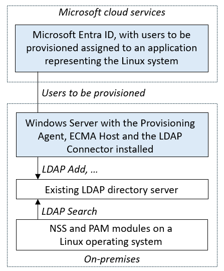

# Configuring Microsoft Entra ID to provision users into an LDAP directory for Linux authentication

The following documentation is a tutorial demonstrating how to govern access to a Linux system. Microsoft Entra provisions users into an on-premises LDAP directory trusted by that Linux system. This allows users to log into a Linux system that relies upon that LDAP directory for user authentication. When a user is removed from Microsoft Entra ID, they're no longer able to log into a Linux system.

>[!NOTE]
> The scenario described in this article is only applicable for existing Linux systems that already rely upon a Name Services Switch (NSS) or Pluggable Authentication Modules (PAM) LDAP module for user identification and authentication. Linux VMs in Azure or that are Azure Arc-enabled should be instead integrated with Microsoft Entra authentication. You can now use Microsoft Entra ID as a core authentication platform and a certificate authority to SSH into a Linux VM by using Microsoft Entra ID and OpenSSH certificate-based authentication, as described in [Log in to a Linux virtual machine in Azure by using Microsoft Entra ID and OpenSSH](/entra/identity/devices/howto-vm-sign-in-azure-ad-linux).  

For other scenarios involving provisioning users into LDAP directories, other than for Linux authentication, see [configuring Microsoft Entra ID to provision users into LDAP directories](on-premises-ldap-connector-configure.md).

## Prerequisites for provisioning users into an LDAP directory for Linux authentication

This article assumes that the LDAP server is already present in the on-premises environment, used by one or more Linux or other POSIX systems for user authentication.



### On-premises prerequisites

 - A Linux or other POSIX Server that replies upon a directory server using a PAM or NSS module.
 - An LDAP directory server that supports the POSIX schema, such as OpenLDAP, in which users can be created, updated, and deleted. For more information on supported directory servers, see the [Generic LDAP Connector reference](/microsoft-identity-manager/reference/microsoft-identity-manager-2016-connector-genericldap).
 - A computer with at least 3 GB of RAM, to host a provisioning agent. The computer should have Windows Server 2016 or a later version of Windows Server. It should also have connectivity to the target directory server and outbound connectivity to login.microsoftonline.com, [other Microsoft Online Services](/microsoft-365/enterprise/urls-and-ip-address-ranges) and [Azure](/azure/azure-portal/azure-portal-safelist-urls?tabs=public-cloud) domains. An example is a Windows Server 2016 virtual machine hosted in Azure IaaS or behind a proxy. The .NET Framework 4.7.2 needs to be installed on that server.
 - Optional:  Although not required, it's recommended to download [Microsoft Edge for Windows Server](https://www.microsoft.com/en-us/edge?r=1) and use it in-place of Internet Explorer.

### Cloud requirements

 - A Microsoft Entra tenant with Microsoft Entra ID P1 or Premium P2 (or EMS E3 or E5).
 
    [!INCLUDE [active-directory-p1-license.md](~/includes/entra-p1-license.md)]
 - The Hybrid Identity Administrator role for configuring the provisioning agent.
 - The Application Administrator or Cloud Application Administrator roles for configuring provisioning in the Azure portal or Microsoft Entra admin center.
 - The directory server schema requires specific attributes for each Microsoft Entra user to be provisioned to the LDAP directory, and these attributes must already be populated. In particular, each user is required to have a unique number as their User ID number. Before deploying the provisioning agent and assigning users to the directory, you need to either generate that number from an existing attribute on the user, or extend the Microsoft Entra schema. Then, you can populate that attribute on the users in scope.  See [Graph extensibility](/graph/extensibility-overview?tabs=http#directory-azure-ad-extensions) for how to create additional directory extensions.

### More recommendations and limitations
The following bullet points are more recommendations and limitations.
- It's not recommended to use the same agent for cloud sync and on-premises app provisioning. Microsoft recommends using a separate agent for cloud sync and one for on-premises app provisioning.
- For AD LDS currently, users can't be provisioned with passwords. So you need to either disable the password policy for AD LDS or provision the users in a disabled state.
- For other directory servers, an initial random password can be set, but it's not possible to provision a Microsoft Entra user's password to a directory server.
- Provisioning users from LDAP to Microsoft Entra ID isn't supported.
- Provisioning groups and user memberships to a directory server isn't supported.


## Determine how the Microsoft Entra LDAP Connector will interact with the directory server

Before deploying the connector to an existing directory server, you need to discuss with the directory server operator in your organization how to integrate with their directory server. The information to gather includes:
- The network information of how to connect to the directory server. 
- How the connector should authenticate itself to the directory server.
- What schema the directory server has selected to model users.
- The naming context's base distinguished name and directory hierarchy rules.
- How to associate users in the directory server with users in Microsoft Entra ID. 
- What should happen when a user goes out of scope in Microsoft Entra ID. 

Deploying this connector may require changes to the configuration of the directory server as well as configuration changes to Microsoft Entra ID. For deployments involving integrating Microsoft Entra ID with a third-party directory server in a production environment, we recommend customers work with their directory server vendor, or a deployment partner for help, guidance, and support for this integration. This article uses the following sample values for OpenLDAP.

 |Configuration setting|Where the value is set| Example value|
 |-----|-----|-----|
 | hostname of the directory server | Configuration wizard **Connectivity** page | `APP3` |
 | port number of the directory server| Configuration wizard **Connectivity** page | 636. For LDAP over SSL or TLS (LDAPS), use port 636.  For `Start TLS`, use port 389. |
 | account for the connector to identify itself to the directory server |Configuration wizard **Connectivity** page | `cn=admin,dc=contoso,dc=lab` |
 | password for the connector to authenticate itself to the directory server |Configuration wizard **Connectivity** page | |
 | structural object class for a user in the directory server | Configuration wizard **Object Types** page | `inetOrgPerson` |
 | auxiliary object classes for a user in the directory server | Azure portal **Provisioning** page attribute mappings | `posixAccount` and`shadowAccount` |
 | attributes to populate on a new user | Configuration wizard  **Select Attributes** page and Azure portal **Provisioning** page attribute mappings |  `cn`, `gidNumber`, `homeDirectory`, `mail`, `objectClass`, `sn`, `uid`, `uidNumber`, `userPassword` |
 | naming hierarchy required by the directory server | Azure portal **Provisioning** page attribute mappings | Set the DN of a newly created user to be immediately below  `DC=Contoso,DC=lab` |
 | attributes for correlating users across Microsoft Entra ID and the directory server | Azure portal **Provisioning** page attribute mappings | `mail` |
 | deprovisioning behavior when a user goes out of scope in Microsoft Entra ID |Configuration wizard **Deprovisioning** page | Delete the user from the directory server |

The network address of a directory server is a hostname and a TCP port number, typically port 389 or 636. Except where the directory server is co-located with the connector on the same Windows Server, or you're using network level security, the network connections from the connector to a directory server need to be protected using SSL or TLS. The connector supports connecting to a directory server on port 389, and using Start TLS to enable TLS within the session. The connector also supports connecting to a directory server on port 636 for LDAPS - LDAP over TLS.

You need to have an identified account for the connector to authenticate to the directory server already configured in the directory server. This account is typically identified with a distinguished name and has an associated password or client certificate. To perform import and export operations on the objects in the connected directory, the connector account must have sufficient permissions within the directory's access control model. The connector needs to have **write** permissions to be able to export, and **read** permissions to be able to import. Permission configuration is performed within the management experiences of the target directory itself.

A directory schema specifies the object classes and attributes that represent a real-world entity in the directory. The connector supports a user being represented with a structural object class, such as `inetOrgPerson`, and optionally additional auxiliary object classes. For the connector to be able to provision users into the directory server, during configuration in the Azure portal you define mappings from the Microsoft Entra schema to all of the mandatory attributes. This includes the mandatory attributes of the structural object class, any superclasses of that structural object class, and the mandatory attributes of any auxiliary object classes. 

You'll likely also configure mappings to some of the optional attributes of these classes. An OpenLDAP directory server with the POSIX schema to support Linux authentication might require an object for a new user to have attributes like the following example.

```
dn: cn=bsimon,dc=Contoso,dc=lab
objectClass: inetOrgPerson
objectClass: posixAccount
objectClass: shadowAccount
cn: bsimon
gidNumber: 10000
homeDirectory: /home/bsimon
sn: simon
uid: bsimon
uidNumber: 10011
mail: bsimon@contoso.com
userPassword: initial-password
```

The directory hierarchy rules implemented by a directory server describe how the objects for each user relate to each other and to existing objects in the directory. In most deployments, the organization chose to have a flat hierarchy in their directory server, in which each object for a user is located immediately below a common base object. For example, if the base distinguished name for the naming context in a directory server is `dc=contoso,dc=com` then a new user would have a distinguished name like `cn=alice,dc=contoso,dc=com`. 

However, some organizations may have a more complex directory hierarchy, in which case you'll need to implement the rules when specifying the distinguished name mapping for the connector. For example, a directory server may expect users to be in organizational units by department, so a new user would have a distinguished name like `cn=alice,ou=London,dc=contoso,dc=com`. Since the connector doesn't create intermediate objects for organizational units, any intermediate objects the directory server rule hierarchy expects must already exist in the directory server.

Next, you'll need to define the rules for how the connector should determine if there's already a user in the directory server corresponding to a Microsoft Entra user. Every LDAP directory has a distinguished name that is unique for each object in the directory server, however that distinguished name is often not present for users in Microsoft Entra ID. Instead, an organization may have a different attribute, such as `mail` or `employeeId`, in their directory server schema that is also present on their users in Microsoft Entra ID. Then, when the connector is provisioning a new user into a directory server, the connector can search whether there's already a user in that directory that has a specific value of that attribute, and only create a new user in the directory server if one isn't present.

If your scenario involves creating new users in the LDAP directory, not just updating or deleting existing users, then you'll need to also determine how the Linux systems using that directory server handles authentication. Some systems can query a user's SSH public key or certificate from the directory, which may be appropriate of the users already hold credentials of those forms. However, if your application that relies upon the directory server doesn't support modern authentication protocols or stronger credentials, then you need to set an application-specific password when creating a new user in the directory, as Microsoft Entra ID doesn't support provisioning a user's Microsoft Entra password.

Finally, you'll need to agree on the deprovisioning behavior.  When the connector is configured, and Microsoft Entra ID has linked between a user in Microsoft Entra ID and a user in the directory, either for a user already in the directory or a new user, then Microsoft Entra ID can provision attribute changes from the Microsoft Entra user into the directory. 

If a user that is assigned to the application is deleted in Microsoft Entra ID, then Microsoft Entra ID sends a delete operation to the directory server. You may also wish to have Microsoft Entra ID update the object in the directory server when a user goes out of scope of being able to use the application. This behavior depends upon the application that'll be using the directory server, as many directories, such as OpenLDAP, may not have a default way of indicating a user's account is inactivated.


## Install and configure the Microsoft Entra Connect Provisioning Agent

 1. Sign in to the Azure portal.
 2. Go to **Enterprise applications** and select **New application**.
 3. Search for the **On-premises ECMA app** application, give the app a name, and select **Create** to add it to your tenant.
 4. From the menu, navigate to the **Provisioning** page of your application.
 5. Select **Get started**.
 6. On the **Provisioning** page, change the mode to **Automatic**.
 
 :::image type="content" source="~/includes/media/app-provisioning-sql/configure-7.png" alt-text="Screenshot of selecting Automatic." lightbox="~/includes/media/app-provisioning-sql/configure-7.png":::

 7. Under **On-premises Connectivity**, select **Download and install**, and select **Accept terms & download**.
 
 :::image type="content" source="~/includes/media/app-provisioning-sql/download-1.png" alt-text="Screenshot of download location for agent." lightbox="~/includes/media/app-provisioning-sql/download-1.png":::
     
 8. Leave the portal and run the provisioning agent installer, agree to the terms of service, and select **Install**.
 9. Wait for the Microsoft Entra provisioning agent configuration wizard and then select **Next**.
 10. In the **Select Extension** step, select **On-premises application provisioning** and then select **Next**.
 11. The provisioning agent uses the operating system's web browser to display a popup window for you to authenticate to Microsoft Entra ID, and potentially also your organization's identity provider. If you're using Internet Explorer as the browser on Windows Server, then you may need to add Microsoft web sites to your browser's trusted site list to allow JavaScript to run correctly.
 12. Provide credentials for a Microsoft Entra administrator when you're prompted to authorize. The user is required to have at least the [Hybrid Identity Administrator](/entra/identity/role-based-access-control/permissions-reference#hybrid-identity-administrator) role.
 13. Select **Confirm** to confirm the setting. Once installation is successful, you can select **Exit**, and also close the Provisioning Agent Package installer.
 
## Configure the On-premises ECMA app

 1. Back in the portal, on the **On-Premises Connectivity** section, select the agent that you deployed and select **Assign Agent(s)**.

      

 2. Keep this browser window open, as you complete the next step of configuration using the configuration wizard.

## Configure the Microsoft Entra ECMA Connector Host certificate
 1. On the Windows Server where the provisioning agent is installed, right select the Microsoft ECMA2Host Configuration Wizard from the start menu, and run as administrator.  Running as a Windows administrator is necessary for the wizard to create the necessary Windows event logs.
 2. After the ECMA Connector Host Configuration starts, if this is the first time you've run the wizard, it asks you to create a certificate. Leave the default port **8585** and select **Generate certificate** to generate a certificate. The autogenerated certificate is self-signed as part of the trusted root. The SAN matches the host name.
     [](~/includes/media/app-provisioning-sql/configure-1.png#lightbox)
 3. Select **Save**.

>[!NOTE]
 >If you've chosen to generate a new certificate, please record the certificate expiration date, to ensure that you schedule to return to the configuration wizard and re-generate the certificate before it expires.


## Configure the generic LDAP connector

Depending on the options you select, some of the wizard screens might not be available and the information might be slightly different. Use the following information to guide you in your configuration.

 1. Generate a secret token that'll be used for authenticating Microsoft Entra ID to the connector. It should be 12 characters minimum and unique for each application. If you don't already have a secret generator, you can use a PowerShell command such as the following to generate an example random string.
    ```powershell
    -join (((48..90) + (96..122)) * 16 | Get-Random -Count 16 | % {[char]$_})
    ```
 1. If you haven't already done so, launch the Microsoft ECMA2Host Configuration Wizard from the start menu.
 2. Select **New Connector**.
     [](~/includes/media/app-provisioning-sql/sql-3.png#lightbox)</br>
 3. On the **Properties** page, fill in the boxes with the values specified in the table that follows the image and select **Next**.
     [](~/includes/media/app-provisioning-ldap/create-1.png#lightbox)

     |Property|Value|
     |-----|-----|
     |Name|The name you chose for the connector, which should be unique across all connectors in your environment. For example, `LDAP`.|
     |Autosync timer (minutes)|120|
     |Secret Token|Enter your secret token here. It should be 12 characters minimum.|
     |Extension DLL|For the generic LDAP connector, select **Microsoft.IAM.Connector.GenericLdap.dll**.|

4. On the **Connectivity** page, you'll configure how the ECMA Connector Host communicates with the directory server, and set some of the configuration options. Fill in the boxes with the values specified in the table that follows the image and select **Next**.  When you select **Next**, the connector queries the directory server for its configuration.
     [](~/includes/media/app-provisioning-ldap/create-2.png#lightbox)</br>

     |Property|Description|
     |-----|-----|
     |Host|The host name where the LDAP server is located. This sample uses `APP3` as the example hostname.|
     |Port|The TCP port number. If the directory server is configured for LDAP over SSL, use port 636.  For `Start TLS`, or if you're using network-level security, use port 389.|
     |Connection Timeout|180|
     |Binding|This property specifies how the connector authenticates to the directory server. With the `Basic` setting, or with the `SSL` or `TLS` setting and no client certificate configured, the connector sends an LDAP simple bind to authenticate with a distinguished name and a password. With the `SSL` or `TLS` setting and a client certificate  specified, the connector sends an LDAP SASL `EXTERNAL` bind to authenticate with a client certificate.   |
     |User Name|How the ECMA Connector authenticates itself to the directory server. In this example, `cn=admin,dc=contoso,dc=lab`|
     |Password|The password of the user that the ECMA Connector authenticates itself to the directory server.|
     |Realm/Domain|This setting is only required if you selected `Kerberos` as the Binding option, to provide the Realm/Domain of the user.|
     |Certificate|The settings in this section are only used if you selected `SSL` or `TLS` as the Binding option.|
     |Attribute Aliases|The attribute aliases text box is used for attributes defined in the schema with RFC4522 syntax. These attributes can't be detected during schema detection and the connector needs help with identifying those attributes. For example, if the directory server doesn't publish `userCertificate;binary` and you wish to provision that attribute, the following string must be entered in the attribute aliases box to correctly identify the userCertificate attribute as a binary attribute: `userCertificate;binary`. If you don't require any special attributes not in the schema, you can leave this blank.|
     |Include operational attributes|Select the `Include operational attributes in schema` checkbox to also include attributes created by the directory server. These include attributes such as when the object was created and last update time.|
     |Include extensible attributes|Select the `Include extensible attributes in schema` checkbox if extensible objects (RFC4512/4.3) are used in the directory server. Enabling this option allows every attribute to be used on all object. Selecting this option makes the schema very large so unless the connected directory is using this feature the recommendation is to keep the option unselected.|
     |Allow manual anchor selection|Leave unchecked.|

     >[!NOTE]
     >If you experience an issue trying to connect, and can't proceed to the **Global** page, ensure that the service account in the directory server is enabled.
     
 5. On the **Global** page, you'll configure the distinguished name of the delta change log, if needed, and additional LDAP features. The page is pre-populated with the information provided by the LDAP server. Review the values shown, and then select **Next**.
 
     |Property|Description|
     |-----|-----|
     |Supported SASL Mechanisms|The top section shows information provided by the server itself, including the list of SASL mechanisms. |
     |Server Certificate Details|If `SSL` or `TLS` was specified, the wizard displays the certificate returned by the directory server. Confirm that the issuer, subject, and thumbprint are for the correct directory server.|
     |Mandatory Features Found|The connector also verifies that the mandatory controls are present in the Root DSE. If these controls aren't listed, a warning is presented. Some LDAP directories don't list all features in the Root DSE and it's possible that the connector works without issues even if a warning is present.|
     |Supported Controls|The **supported controls** checkboxes control the behavior for certain operations|
     |Delta Import|The change log DN is the naming context used by the delta change log, for example **cn=changelog**. This value must be specified to be able to do delta import. If you don't need to implement delta import, then this field can be blank.|
     |Password Attribute|If the directory server supports a different password attribute or password hashing, you can specify the destination for password changes.|
     |Partition Names|In the additional partitions list, it's possible to add additional namespaces not automatically detected. For example, this setting can be used if several servers make up a logical cluster, which should all be imported at the same time. Just as Active Directory can have multiple domains in one forest but all domains share one schema, the same can be simulated by entering the additional namespaces in this box. Each namespace can import from different servers and is further configured on the **Configure Partitions and Hierarchies** page.|

 1. On the **Partitions** page, keep the default and select **Next**.
 1. On the **Run Profiles** page, ensure the **Export** checkbox and the **Full import** checkbox are both selected. Then select **Next**.
     [](~/includes/media/app-provisioning-ldap/create-3.png#lightbox)</br>

     |Property|Description|
     |-----|-----|
     |Export|Run profile that exports data to the LDAP directory server. This run profile is required.|
     |Full import|Run profile that imports all data from LDAP sources specified earlier. This run profile is required.|
     |Delta import|Run profile that imports only changes from LDAP since the last full or delta import. Only enable this run profile if you've confirmed that the directory server meets the necessary requirements.  For more information, see the [Generic LDAP Connector reference](/microsoft-identity-manager/reference/microsoft-identity-manager-2016-connector-genericldap). |

 12. On the **Export** page, leave the defaults unchanged and select **Next**. 
 13. On the **Full Import** page,  leave the defaults unchanged and select **Next**. 
 1. On the **DeltaImport** page, if present, leave the defaults unchanged and select **Next**.
 1. On the **Object Types** page, fill in the boxes and select **Next**. 

     |Property|Description|
     |-----|-----|
     |Target object|This value is the structural object class of a user in the LDAP directory server. Use `inetOrgPerson`, and don't specify an auxiliary object class in this field. If the directory server requires auxiliary object classes, they'll be configured with the attribute mappings in the Azure portal.|
     |Anchor|The values of this attribute should be unique for each object in the target directory. The Microsoft Entra provisioning service queries the ECMA connector host by using this attribute after the initial cycle. Typically use the distinguished named, which may be selected as `-dn-`. Multi-valued attributes, such as the `uid` attribute in the OpenLDAP schema, can't be used as anchors.|
     |Query Attribute|This attribute should be the same as the Anchor.|
     |DN|The distinguishedName of the target object. Keep `-dn-`.|
     |Autogenerated|unchecked|

 15. The ECMA host discovers the attributes supported by the target directory. You can choose which of those attributes you want to expose to Microsoft Entra ID. These attributes can then be configured in the Azure portal for provisioning. On the **Select Attributes** page, add all the attributes in the dropdown list, one at a time, that are required as mandatory attributes or that you wish to provision from Microsoft Entra ID.
     [](~/includes/media/app-provisioning-ldap/create-5.png#lightbox)</br>
      The **Attribute** dropdown list shows any attribute that was discovered in the target directory and *wasn't* chosen on the previous use of the configuration wizard **Select Attributes** page.

     Make sure that `Treat as single value` checkbox is unchecked for the `objectClass` attribute, and if `userPassword` is being set, is either unselectable or checked for the `userPassword` attribute.

     Configure visibility for the following attributes.

     | Attribute | Treat as single value |
     | --- | --- |
     | _distinguishedName | |
     | -dn- | |
     | export_password | |
     | cn| Y |
     | gidNumber| |
     | homeDirectory| |
     | mail| Y |
     | objectClass| |
     | sn | Y |
     | uid |Y |
     | uidNumber | |
     | userPassword | Y |

     Once all the relevant attributes have been added, select **Next**.


 16. On the **Deprovisioning** page, you can specify if you wish to have Microsoft Entra ID remove users from the directory when they go out of scope of the application.  If so, under **Disable flow**, select **Delete**, and under **Delete flow**, select **Delete**. If `Set attribute value` is chosen, the attributes selected on the previous page won't be available to select on the Deprovisioning page.
 >[!NOTE]
 >If you use the **Set attribute value** be aware that only boolean values are allowed.

 15. Select **Finish**.

## Ensure ECMA2Host service is running and can read from the directory server

Follow these steps to confirm that the connector host is started and has identified any existing users from the directory server.

 1. On the server running the Microsoft Entra ECMA Connector Host, select **Start**.
 2. Select **run** if needed, then enter **services.msc** in the box.
 3. In the **Services** list, ensure that **Microsoft ECMA2Host** is present and running. If it's not running, select **Start**.
     [](~/includes/media/app-provisioning-sql/configure-2.png#lightbox)
 1. If you've recently started the service, and have many user objects in the directory server, then wait several minutes for the connector to establish a connection with the directory server.
 1. On the server running the Microsoft Entra ECMA Connector Host, launch PowerShell.
 1. Change to the folder where the ECMA host was installed, such as `C:\Program Files\Microsoft ECMA2Host`.
 1. Change to the subdirectory `Troubleshooting`.
 1. Run the script `TestECMA2HostConnection.ps1` in that directory as shown, and provide as arguments the connector name and the `ObjectTypePath` value `cache`. If your connector host isn't listening on TCP port 8585, then you may also need to provide the `-Port` argument as well. When prompted, type the secret token configured for that connector.
    ```
    PS C:\Program Files\Microsoft ECMA2Host\Troubleshooting> $cout = .\TestECMA2HostConnection.ps1 -ConnectorName LDAP -ObjectTypePath cache; $cout.length -gt 9
    Supply values for the following parameters:
    SecretToken: ************
    ```
 1. If the script displays an error or warning message, then check that the service is running, and the connector name and secret token match those values you configured in the configuration wizard.
 1. If the script displays the output `False`, then the connector hasn't seen any entries in the source directory server for existing users.  If this is a new directory server installation, then this behavior is to be expected, and you can continue at the next section.
 1. However, if the directory server already contains one or more users but the script displayed `False`, then this status indicates the connector could not read from the directory server.  If you attempt to provision, then Microsoft Entra ID may not correctly match users in that source directory with users in Microsoft Entra ID.  Wait several minutes for the connector host to finish reading objects from the existing directory server, and then rerun the script. If the output continues to be `False`, then check the configuration of your connector and the permissions in the directory server are allowing the connector to read existing users.


## Test the connection from Microsoft Entra ID to the connector host
 1. Return to the web browser window where you were configuring the application provisioning in the portal.
    >[!NOTE]
    >If the window had timed out, then you'll need to re-select the agent.
     1. Sign in to the Azure portal.
     1. Go to **Enterprise applications** and the **On-premises ECMA app** application.
     1. Select on **Provisioning**.
     1. If **Get started** appears, then change the mode to **Automatic**,  on the **On-Premises Connectivity** section, select the agent that you just deployed and select **Assign Agent(s)**, and wait 10 minutes. Otherwise go to **Edit Provisioning**.
 2. Under the **Admin credentials** section, enter the following URL. Replace the `connectorName` portion with the name of the connector on the ECMA host, such as `LDAP`. If you provided a certificate from your certificate authority for the ECMA host, then replace `localhost` with the host name of the server where the ECMA host is installed.

    |Property|Value|
    |-----|-----|
    |Tenant URL|https://localhost:8585/ecma2host_connectorName/scim|

 3. Enter the **Secret Token** value that you defined when you created the connector.
     >[!NOTE]
     >If you just assigned the agent to the application, please wait 10 minutes for the registration to complete. The connectivity test won't work until the registration completes. Forcing the agent registration to complete by restarting the provisioning agent on your server can speed up the registration process. Go to your server, search for **services** in the Windows search bar, identify the **Microsoft Entra Connect Provisioning Agent** service, right-select the service, and restart.
 4. Select **Test Connection**, and wait one minute.
 5. After the connection test is successful and indicates that the supplied credentials are authorized to enable provisioning, select **Save**.</br>
     [](~/includes/media/app-provisioning-sql/configure-9.png#lightbox)


## Extend the Microsoft Entra schema

If your directory server requires additional attributes that aren't part of the default Microsoft Entra schema for users, then when provisioning you can configure to supply values of those attributes from a constant, from an expression transformed from other Microsoft Entra attributes, or by extending the Microsoft Entra schema.

If the directory server requires users to have an attribute, such as `uidNumber` for the OpenLDAP POSIX schema, and that attribute isn't already part of your Microsoft Entra schema for a user, and must be unique for each user, then you need to either generate that attribute from other attributes of the user via an [expression](~/identity/app-provisioning/functions-for-customizing-application-data.md), or use the [directory extension feature](~/identity/app-provisioning/user-provisioning-sync-attributes-for-mapping.md) to add that attribute as an extension.

If your users originate in Active Directory Domain Services and have the attribute in that directory, you can use Microsoft Entra Connect or Microsoft Entra Connect cloud sync. This will configure the attribute to be synched from Active Directory Domain Services to Microsoft Entra ID, making it available for provisioning to other systems.

If your users originate in Microsoft Entra ID, you need to [define a directory extension](/graph/extensibility-overview?tabs=http#define-the-directory-extension) for each new attribute to store on a user. Then, [update the Microsoft Entra users](/graph/extensibility-overview?tabs=http#update-or-delete-directory-extensions) that are planned to be provisioned, to give each user a value of those attributes.

## Configure attribute mapping

In this section, you'll configure the mapping between the Microsoft Entra user's attributes and the attributes that you previously selected in the ECMA Host configuration wizard. Later, when the connector creates an object in a directory server, the Microsoft Entra user attributes are sent through the connector to the directory server to be part of that new object.

 1. In the Microsoft Entra admin center, under **Enterprise applications**, select the **On-premises ECMA app** application, and then select the **Provisioning** page.
 2. Select **Edit provisioning**.
 3. Expand **Mappings** and select **Provision Microsoft Entra users**. If this is the first time you've configured the attribute mappings for this application, there's only one mapping present as a placeholder.
 1. To confirm that the schema of the directory server is available in Microsoft Entra ID, select the **Show advanced options** checkbox and select **Edit attribute list for ScimOnPremises**. Ensure that all the attributes selected in the configuration wizard are listed.  If not, then wait several minutes for the schema to refresh, then select **Attribute Mapping** in the navigation line, and then select **Edit attribute list for ScimOnPremises** again to reload the page.  Once you see the attributes listed, then cancel from this page to return to the mappings list.
 1. Every user in a directory must have a unique distinguished name.  You can specify how the connector should construct a distinguished name by using an attribute mapping. Select **Add New Mapping**. Use the following values to create the mapping, changing the distinguished names in the expression to match that of the organizational unit or other container in your target directory.
    - Mapping type: expression
    - Expression: `Join("", "CN=", Word([userPrincipalName], 1, "@"), ",DC=Contoso,DC=lab")`
    - Target attribute: `urn:ietf:params:scim:schemas:extension:ECMA2Host:2.0:User:-dn-`
    - Apply this mapping: only during object creation
 1. If the directory server requires multiple structural object class values, or auxiliary object class values, to be supplied in the `objectClass` attribute, then add a mapping to that attribute.  To add a mapping for `objectClass`, select **Add New Mapping**. Use the following values to create the mapping, changing the object class names in the expression to match that of the target directory schema.
    - Mapping type: expression
    - Expression, if provisioning the POSIX schema: `Split("inetOrgPerson,posixAccount,shadowAccount",",")`
    - Target attribute: `urn:ietf:params:scim:schemas:extension:ECMA2Host:2.0:User:objectClass`
    - Apply this mapping: only during object creation
 1. For each of the mappings in the following table for your directory server, Select **Add New Mapping**, and specify the source and target attributes. If you're provisioning into an existing directory with existing users, you need to edit the mapping for the attribute that is in common  to set the **Match objects using this attribute** for that attribute. Learn more about attribute mapping [here](~/identity/app-provisioning/customize-application-attributes.md#understanding-attribute-mapping-properties).


     For OpenLDAP with the POSIX schema, you'll also need to supply the `gidNumber`, `homeDirectory`, `uid` and `uidNumber` attributes.   Each user requires a unique `uid` and a unique `uidNumber`. Typically the `homeDirectory` is set by an expression derived from the user's userID. For example, if the `uid` of a user is generated by an expression derived from their user principal name, then the value for that user's home directory could be generated by a similar expression also derived from their user principal name.  And depending on your use case you may wish to have all the users be in the same group, so would assign the `gidNumber` from a constant.

     |Mapping type|Source attribute|Target attribute|
     |-----|-----|-----|
     |Direct|`displayName`|`urn:ietf:params:scim:schemas:extension:ECMA2Host:2.0:User:cn`|
     |Direct|`surname`|`urn:ietf:params:scim:schemas:extension:ECMA2Host:2.0:User:sn`|
     |Direct|`userPrincipalName`|`urn:ietf:params:scim:schemas:extension:ECMA2Host:2.0:User:mail`|
     |Expression|`ToLower(Word([userPrincipalName], 1, "@"), )`|`urn:ietf:params:scim:schemas:extension:ECMA2Host:2.0:User:uid`|
     |Direct|(attribute specific to your directory)|`urn:ietf:params:scim:schemas:extension:ECMA2Host:2.0:User:uidNumber`|
     |Expression|`Join("/", "/home", ToLower(Word([userPrincipalName], 1, "@"), ))`|`urn:ietf:params:scim:schemas:extension:ECMA2Host:2.0:User:homeDirectory`|
     |Constant|`10000`|`urn:ietf:params:scim:schemas:extension:ECMA2Host:2.0:User:gidNumber`|

 1. Add a mapping to `urn:ietf:params:scim:schemas:extension:ECMA2Host:2.0:User:userPassword` that sets an initial random password for the user. 

 6. Select **Save**.

## Ensure users to be provisioned to the directory have required attributes

If there are people who have existing user accounts in the LDAP directory, then you need to ensure that the Microsoft Entra user representation has the attributes required for matching.

If you're planning on creating new users in the LDAP directory, then you need to ensure that the Microsoft Entra representations of those users have the source attributes required by the user schema of the target directory.  Each user requires a unique `uid` and a unique `uidNumber`.


If your users originate in Active Directory Domain Services, and has the attribute in that directory, then you can use Microsoft Entra Connect or Microsoft Entra Connect cloud sync to configure that the attribute should be synched from Active Directory Domain Services to Microsoft Entra ID, so that it's available for provisioning to other systems.

If your users originate in Microsoft Entra ID, then for each new attribute you need to store on a user, you'll [define a directory extension](/graph/extensibility-overview?tabs=http#define-the-directory-extension). Then, [update the Microsoft Entra users](/graph/extensibility-overview?tabs=http#update-or-delete-directory-extensions) that are planned to be provisioned, to give each user a value of those attributes.

### Confirming users via PowerShell

Once you've the users updated in Microsoft Entra ID, you can use the [Microsoft Graph PowerShell cmdlets](https://www.powershellgallery.com/packages/Microsoft.Graph) to automate checking users have all the required attributes.

For example, suppose your provisioning required users to have three attributes `DisplayName`,`surname` and `extension_656b1c479a814b1789844e76b2f459c3_MyNewProperty`. This third attribute is used to contain the `uidNumber`. You could use the `Get-MgUser` cmdlet to retrieve each user and check if the required attributes are present. Note that the Graph v1.0 `Get-MgUser` cmdlet, by default, doesn't return any of a user's directory extension attributes, unless the attributes are specified in the request as one of the properties to return.

This section shows how to interact with Microsoft Entra ID by using [Microsoft Graph PowerShell](https://www.powershellgallery.com/packages/Microsoft.Graph) cmdlets.

The first time your organization uses these cmdlets for this scenario, you need to be in a Global Administrator role to allow Microsoft Graph PowerShell to be used in your tenant. Subsequent interactions can use a lower-privileged role, such as:

- User Administrator, if you anticipate creating new users.
- Application Administrator or [Identity Governance Administrator](~/identity/role-based-access-control/permissions-reference.md#identity-governance-administrator), if you're just managing application role assignments.

1. Open PowerShell.
1. If you don't have the [Microsoft Graph PowerShell modules](https://www.powershellgallery.com/packages/Microsoft.Graph) already installed, install the `Microsoft.Graph.Users` module and others by using this command:

   ```powershell
   Install-Module Microsoft.Graph
   ```

   If you already have the modules installed, ensure that you're using a recent version: 

   ```powershell
   Update-Module microsoft.graph.users,microsoft.graph.identity.governance,microsoft.graph.applications
   ```

1. Connect to Microsoft Entra ID:

   ```powershell
   $msg = Connect-MgGraph -ContextScope Process -Scopes "User.Read.All,Application.ReadWrite.All,AppRoleAssignment.ReadWrite.All,EntitlementManagement.ReadWrite.All"
   ```

2. Construct the list of users, and the attributes to check.

   ```powershell
   $userPrincipalNames = (
    "alice@contoso.com",
    "bob@contoso.com",
    "carol@contoso.com" )

   $requiredBaseAttributes = ("DisplayName","surname")
   $requiredExtensionAttributes = ("extension_656b1c479a814b1789844e76b2f459c3_MyNewProperty")
   ```

1. Query the directory for each of the users.

   ```powershell
   $select = "id"
   foreach ($a in $requiredExtensionAttributes) { $select += ","; $select += $a;}
   foreach ($a in $requiredBaseAttributes) { $select += ","; $select += $a;}

   foreach ($un in $userPrincipalNames) {
      $nu = Get-MgUser -UserId $un -Property $select -ErrorAction Stop
      foreach ($a in $requiredBaseAttributes) { if ($nu.$a -eq $null) { write-output "$un missing $a"} }
      foreach ($a in $requiredExtensionAttributes) { if ($nu.AdditionalProperties.ContainsKey($a) -eq $false) { write-output "$un missing $a" } }
   }
   ```


## Collect existing users from the LDAP directory

1. Identify which of the users in that directory are in scope for being users with Linux authentication. This choice will depend on your Linux system's configuration. For some configurations, any user who exists in an LDAP directory is a valid user. Other configurations might require the user to have a particular attribute or be a member of a group in that directory.

1. Run a command that retrieves that subset of users from your LDAP directory into a CSV file. Ensure that the output includes the attributes of users that are used for matching with Microsoft Entra ID. Examples of these attributes are employee ID, account name or `uid`, and email address.

1. If needed, transfer the CSV file that contains the list of users to a system with the [Microsoft Graph PowerShell cmdlets](https://www.powershellgallery.com/packages/Microsoft.Graph) installed.

1. Now that you've a list of all the users obtained from the directory, you'll match those users from the directory with users in Microsoft Entra ID. Before you proceed, review the information about [matching users in the source and target systems](~/identity/app-provisioning/customize-application-attributes.md#matching-users-in-the-source-and-target--systems).

[!INCLUDE [active-directory-identity-governance-applications-retrieve-users.md](~/includes/entra-identity-governance-applications-retrieve-users.md)]

## Assign users to the application in Microsoft Entra ID
Now that you've the Microsoft Entra ECMA Connector Host talking with Microsoft Entra ID, and the attribute mapping configured, you can move on to configuring who's in scope for provisioning. 

>[!IMPORTANT]
>If you were signed in using a Hybrid Identity Administrator role, you need to sign-out and sign-in with an account that has at least the Application Administrator role for this section. The Hybrid Identity Administrator role doesn't have permissions to assign users to applications.

If there are existing users in the LDAP directory, then you should create application role assignments for those existing users. To learn more about how to create application role assignments in bulk using `New-MgServicePrincipalAppRoleAssignedTo`, see [governing an application's existing users in Microsoft Entra ID](~/id-governance/identity-governance-applications-existing-users.md).

If you don't wish to update existing users in the LDAP directory yet, then select a test user from Microsoft Entra ID who has the required attributes and will be provisioned to the directory server.

 1. Ensure that the user will select has all the properties that will be mapped to the required attributes of the directory server schema.
 1. In the Azure portal, select **Enterprise applications**.
 2. Select the **On-premises ECMA app** application.
 3. On the left, under **Manage**, select **Users and groups**.
 4. Select **Add user/group**.
     [](~/includes/media/app-provisioning-sql\app-2.png#lightbox)
5. Under **Users**, select **None Selected**.
     [](~/includes/media/app-provisioning-sql\app-3.png#lightbox)
 6. Select a user from the right and select the **Select** button.</br>
     [](~/includes/media/app-provisioning-sql\app-4.png#lightbox)
 7. Now select **Assign**.
     [](~/includes/media/app-provisioning-sql\app-5.png#lightbox)


## Test provisioning
Now that your attributes are mapped and an initial user is assigned, you can test on-demand provisioning with one of your users.

 1. On the server the running the Microsoft Entra ECMA Connector Host, select **Start**.
 2. Enter **run** and enter **services.msc** in the box.
 3. In the **Services** list, ensure that both the **Microsoft Entra Connect Provisioning Agent** service and the **Microsoft ECMA2Host** services are running. If not, select **Start**.


 1. In the Azure portal, select **Enterprise applications**.
 2. Select the **On-premises ECMA app** application.
 3. On the left, select **Provisioning**.
 4. Select **Provision on demand**.
 5. Search for one of your test users, and select **Provision**.
 [](~/includes/media/app-provisioning-ldap\test-2.png#lightbox)</br>
 6. After several seconds, then the message **Successfully created user in target system** will appear, with a list of the user attributes.  If an error appears instead, see [troubleshooting provisioning errors](#troubleshooting-provisioning-errors).


## Start provisioning users

After the test of on-demand provisioning is successful, add the remaining users.  To learn more about how to create application role assignments in bulk using `New-MgServicePrincipalAppRoleAssignedTo`, see [governing an application's existing users in Microsoft Entra ID](~/id-governance/identity-governance-applications-existing-users.md).

 1. In the Azure portal, select the application.
 1. On the left, under **Manage**, select **Users and groups**.
 1. Ensure that all users are assigned to the application role.
 1. Change back to the provisioning configuration page.
 1. Ensure that the scope is set to only assigned users and groups, turn provisioning status to **On**, and select **Save**.
 2. Wait several minutes for provisioning to start. It might take up to 40 minutes. After the provisioning job has been completed, as described in the next section,

## Troubleshooting provisioning errors

If an error is shown, then select **View provisioning logs**.  Look in the log for a row in which the Status is **Failure**, and select on that row.

If the error message is **Failed to create User**, then check the attributes that are shown against the requirements of the directory schema.

For more information, change to the **Troubleshooting & Recommendations** tab.

If the troubleshooting error message includes that an objectClass value is `invalid per syntax`, then ensure that the provisioning attribute mapping to the `objectClass` attribute includes only names of object classes recognized by the directory server.

For other errors, see [troubleshooting on-premises application provisioning](~/identity/app-provisioning/on-premises-ecma-troubleshoot.md).

If you wish to pause provisioning to this application, on the provisioning configuration page, you can change the provisioning status to **Off**, and select **Save**. This action stops the provisioning service from running in the future.

## Check that users were successfully provisioned
After waiting, check the directory server to ensure users are being provisioned. The query you perform to the directory server will depend on what commands your directory server provides.

The following instructions illustrate how to check OpenLDAP on Linux.

 1. Open a terminal window with a command shell on the system with OpenLDAP.
 1. Type the command `ldapsearch -D "cn=admin,dc=contoso,dc=lab" -W -s sub -b dc=contoso,dc=lab -LLL (objectclass=inetOrgPerson)`
 1. Check that the resulting LDIF includes the users provisioned from Microsoft Entra ID.

## Next steps

- For more information on what the provisioning service does, how it works, and frequently asked questions, see [Automate user provisioning and deprovisioning to SaaS applications with Microsoft Entra ID](~/identity/app-provisioning/user-provisioning.md) and [on-premises application provisioning architecture](~/identity/app-provisioning/on-premises-application-provisioning-architecture.md).
