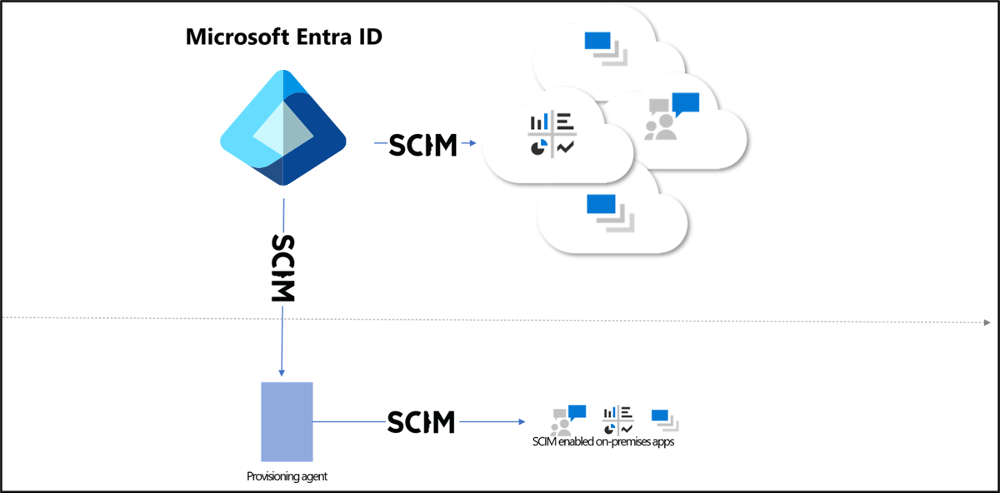

# Microsoft Entra on-premises application provisioning to SCIM-enabled apps

The Microsoft Entra provisioning service supports a [SCIM 2.0](https://techcommunity.microsoft.com/t5/security-compliance-and-identity/provisioning-with-scim-getting-started/ba-p/880010) client that can be used to automatically provision users into cloud or on-premises applications. This article outlines how you can use the Microsoft Entra provisioning service to provision users into an on-premises application that's SCIM enabled. If you want to provision users into non-SCIM on-premises applications that use SQL as a data store, see the [Microsoft Entra ECMA Connector Host Generic SQL Connector tutorial](tutorial-ecma-sql-connector.md). If you want to provision users into cloud apps such as DropBox and Atlassian, review the app-specific [tutorials](~/identity/saas-apps/tutorial-list.md).

## Prerequisites
- A Microsoft Entra tenant with Microsoft Entra ID P1 or Premium P2 (or EMS E3 or E5). [!INCLUDE [active-directory-p1-license.md](~/includes/entra-p1-license.md)]
- Administrator role for installing the agent. This task is a one-time effort and should be an Azure account that's at least a Hybrid Identity Administrator. 
- Administrators must be at least an Application Administrator, Cloud Application Administrator, or a custom role with permissions.
- A computer with at least 3 GB of RAM, to host a provisioning agent. The computer should have Windows Server 2016 or a later version of Windows Server, with connectivity to the target application, and with outbound connectivity to login.microsoftonline.com, other Microsoft Online Services, and Azure domains. An example is a Windows Server 2016 virtual machine hosted in Azure IaaS or behind a proxy.
- Ensure your [SCIM](https://techcommunity.microsoft.com/t5/security-compliance-and-identity/provisioning-with-scim-getting-started/ba-p/880010) implementation meets the [Microsoft Entra SCIM requirements](use-scim-to-provision-users-and-groups.md).  Microsoft Entra ID offers open-source [reference code](https://github.com/AzureAD/SCIMReferenceCode/wiki) that developers can use to bootstrap their SCIM implementation, as described in [Tutorial: Develop a sample SCIM endpoint in Microsoft Entra ID](use-scim-to-build-users-and-groups-endpoints.md).
- Support the /schemas endpoint to reduce configuration required in the Azure portal.

## Install and configure the Microsoft Entra Connect Provisioning Agent

 1. Sign in to the [Microsoft Entra admin center](https://entra.microsoft.com) as at least an [Application Administrator](~/identity/role-based-access-control/permissions-reference.md#application-administrator).
 2. Browse to **Entra ID** > **Enterprise apps**.
 3. Search for the **On-premises SCIM app** application, give the app a name, and select **Create** to add it to your tenant.
 4. From the menu, navigate to the **Provisioning** page of your application.
 5. Select **Get started**.
 6. On the **Provisioning** page, change the mode to **Automatic**.

 :::image type="content" source="~/includes/media/app-provisioning-sql/configure-7.png" alt-text="Screenshot of selecting Automatic." lightbox="~/includes/media/app-provisioning-sql/configure-7.png":::

 7. Under **On-premises Connectivity**, select **Download and install**, and select **Accept terms & download**.

 :::image type="content" source="~/includes/media/app-provisioning-sql/download-1.png" alt-text="Screenshot of download location for agent." lightbox="~/includes/media/app-provisioning-sql/download-1.png":::

 8. Leave the portal and open the provisioning agent installer, agree to the terms of service, and select **Install**.
 9. Wait for the Microsoft Entra provisioning agent configuration wizard and then select **Next**.
 10. In the **Select Extension** step, select **On-premises application provisioning** and then select **Next**.    
 11. The provisioning agent uses the operating system's web browser to display a popup window for you to authenticate to Microsoft Entra ID, and potentially also your organization's identity provider. If you're using Internet Explorer as the browser on Windows Server, then you may need to add Microsoft web sites to your browser's trusted site list to allow JavaScript to run correctly.
 12. Provide credentials for a Microsoft Entra administrator when you're prompted to authorize. The user is required to have at least the [Hybrid Identity Administrator](/entra/identity/role-based-access-control/permissions-reference#hybrid-identity-administrator) role.
 13. Select **Confirm** to confirm the setting. Once installation is successful, you can select **Exit**, and also close the Provisioning Agent Package installer.

## Configure the connection via the provisioning agent

 1. Sign in to the [Microsoft Entra admin center](https://entra.microsoft.com) as at least an [Application Administrator](~/identity/role-based-access-control/permissions-reference.md#application-administrator).
 2. Browse to **Entra ID** > **Enterprise apps**.
 3. Search for the application created earlier.
 4. From the menu, navigate to the **Provisioning** page of your application.

 1. In the portal, on the **On-Premises Connectivity** section, select the agent that you deployed and select **Assign Agent(s)**.

      

 1. Restart the provisioning agent service or wait 10 minutes before testing connection.

 1. In the **Tenant URL** field, enter the URL of the application's SCIM endpoint. Example: `https://api.contoso.com/scim/`

 1. Copy the required OAuth bearer token for the SCIM endpoint into the  **Secret Token** field.

 1. Select **Test Connection** to have Microsoft Entra ID attempt to connect to the SCIM endpoint. If the attempt fails, error information is displayed. 
 
 1. Once the attempt to connect to the application succeeds, then select **Save** to save the admin credentials.

 2. Keep this browser window open, as you complete the next step of configuration using the configuration wizard.

 
## Provisioning to SCIM-enabled application
Once the agent is installed, no further configuration is necessary on-premises, and all provisioning configurations are then managed from the portal. Repeat the below steps for every on-premises application being provisioned via SCIM.

1. Configure any [attribute mappings](customize-application-attributes.md) or [scoping](define-conditional-rules-for-provisioning-user-accounts.md) rules required for your application.
1. Add users to scope by [assigning users and groups](~/identity/enterprise-apps/add-application-portal-assign-users.md) to the application.
1. Test provisioning a few users [on demand](provision-on-demand.md).
1. Add more users into scope by assigning them to your application.
1. Go to the **Provisioning** pane, and select **Start provisioning**.
1. Monitor using the [provisioning logs](~/identity/monitoring-health/concept-provisioning-logs.md).

The following video provides an overview of on-premises provisioning.

> [!VIDEO https://www.youtube.com/embed/QdfdpaFolys]

## Next steps

- [App provisioning](user-provisioning.md)
- [Develop a sample SCIM endpoint](use-scim-to-build-users-and-groups-endpoints.md)
- [Known issues for provisioning](known-issues.md)
