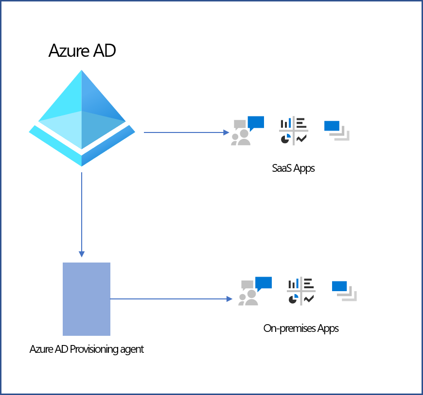
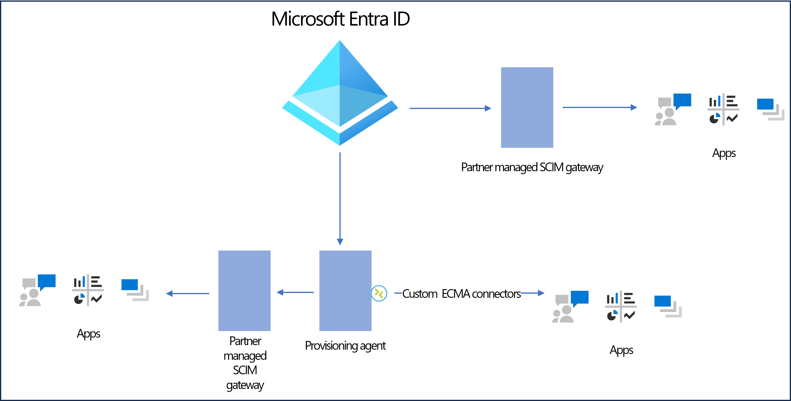

# Partner-driven provisioning integrations

The Microsoft Entra provisioning service allows you to provision users and groups into both [SaaS](user-provisioning.md) and [on-premises](on-premises-scim-provisioning.md) applications. There are four integration paths:

**Option 1 - Microsoft Entra Application Gallery:**
Popular third party applications, such as Dropbox, Snowflake, and Workplace by Facebook, are made available for customers through the Microsoft Entra application gallery. New applications can easily be onboarded to the gallery using the [application network portal](~/identity/enterprise-apps/v2-howto-app-gallery-listing.md). 

**Option 2 - Implement a SCIM compliant API for your application:**
If your line-of-business application supports the [SCIM](https://aka.ms/scimoverview) standard, it can easily be integrated with the [Microsoft Entra SCIM client](use-scim-to-provision-users-and-groups.md).

   

**Option 3 - Use Microsoft Graph:**
Many new applications use Microsoft Graph to retrieve users, groups, and other resources from Microsoft Entra ID. You can learn more about what scenarios to use [SCIM and Graph](scim-graph-scenarios.md) in. 

**Option 4 - Use partner-driven connectors:**
In cases where an application doesn't support SCIM, partners have built [custom ECMA connectors](on-premises-custom-connector.md) and SCIM gateways to integrate Microsoft Entra ID with numerous applications. **This document serves as a place for partners to attest to integrations that are compatible with Microsoft Entra ID, and for customers to discover these partner-driven integrations.** Custom ECMA connectors and SCIM gateways are built, maintained, and owned by the third-party vendor. 

   

[!INCLUDE [Microsoft Entra ID application integration partners](../../includes/application-integration-partners.md)]

## How-to add partner-driven integrations to this document
If you've built a SCIM Gateway and would like to add it to this list, follow these steps: 

1. Review the Microsoft Entra SCIM [documentation](use-scim-to-provision-users-and-groups.md) to understand the Microsoft Entra SCIM implementation.
1. Test compatibility between the Microsoft Entra SCIM client and your SCIM gateway.
1. Navigate to the following [github repository](https://github.com/MicrosoftDocs/entra-docs/blob/main/docs/includes/application-integration-partners.md).
1. Select the pencil at the top of the article to start making changes
1. Make changes in the article using the Markdown language and create a pull request. Make sure to provide a description for the pull request.  
1. An admin of the repository reviews and merges your changes so that others can view them.

## Guidelines
* Add any new partners in alphabetical order.
* Limit your entries to 500 words.
* Ensure that you provide contact information for customers to learn more.
* To avoid duplication, only include applications that don't already have out of the box provisioning connectors in the [Microsoft Entra application gallery](~/identity/saas-apps/tutorial-list.md). 

## Disclaimer
For independent software vendors: The Microsoft Entra Application Gallery Terms & Conditions, excluding Sections 2–4, apply to this Partner-Driven Integrations Catalog (the “Integrations Catalog”). References to the “Gallery” shall be read as the “Integrations Catalog” and references to an “App” shall be read as “Integration”.  

If you don't agree with these terms, you shouldn't submit your Integration for listing in the Integrations Catalog. If you submit an Integration to the Integrations Catalog, you agree that you or the entity you represent (“YOU” or “YOUR”) is bound by these terms. 
 
Microsoft reserves the right to accept or reject your proposed Integration in its sole discretion and reserves the right to determine the manner in which Apps are presented, promoted, or featured in this Integrations Catalog. 
