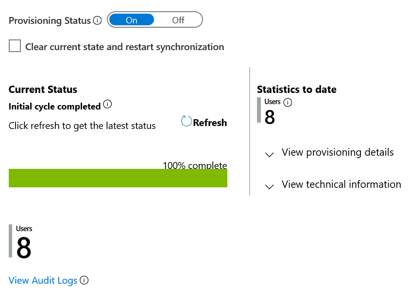
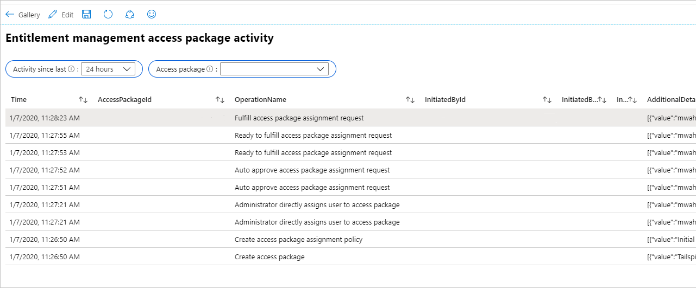
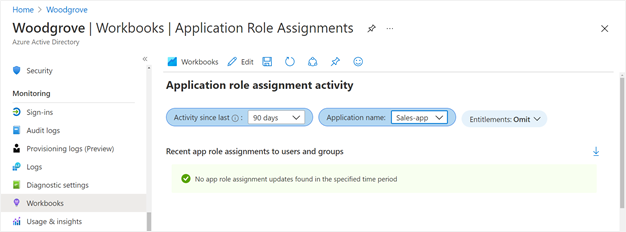

# Plan deploying Microsoft Entra for user provisioning with SAP source and target applications

Your organization relies on Microsoft for various Azure services or Microsoft 365. If SAP software and services provide critical functions, such as HR and ERP, for your organization, then you can use Microsoft Entra to orchestrate the identities for your employees, contractors and others, and their access, across your SAP and non-SAP applications.

This tutorial shows how you can use Microsoft Entra features to manage identities across your SAP applications, based on properties of those identities originating from SAP HR sources. This tutorial assumes:

* your organization has a Microsoft Entra tenant in the commercial cloud with a license for at least Microsoft Entra ID P1 in that tenant (some steps illustrate using Microsoft Entra ID Governance features as well)
* you are an administrator of that tenant
* your organization has a system of record source of workers, SAP SuccessFactors
* your organization has SAP ECC (ERP Central Component), SAP S/4HANA, or other SAP applications, and optionally has other non-SAP applications
* you are using SAP Cloud Identity Services for provisioning and single sign-on to any SAP applications other than SAP ECC

## Overview

This tutorial illustrates how to connect Microsoft Entra with authoritative sources for the list of workers in an organization, such as SAP SuccessFactors, use Microsoft Entra to set up identities for those workers, and then use Microsoft Entra to provide them with access to sign into one or more SAP applications, such as SAP ECC or SAP S/4HANA.

The process is:

 - Plan: define the requirements for identities and access for applications in your organization, and ensure Microsoft Entra ID and related Microsoft Online Services meet the organizational prerequisites for this scenario.
 - Deploy: bring the necessary users into Microsoft Entra ID and have a process to keep those users up-to-date with appropriate credentials, assign users with the necessary access rights in Microsoft Entra, and provision those users and their access rights to applications to enable them to sign in to those applications.
 - Monitor: monitor the identity flows to watch for errors, and to adjust policies and operations as needed.

Once complete, then those individuals who are authorized for one or more applications, will be able to sign into SAP and non-SAP applications that they are authorized to use, with Microsoft Entra user identities.

The following diagram illustrates the example topology used in this tutorial. In this topology, workers are represented in SuccessFactors, and need to have accounts in a Windows Server Active Directory domain, in Microsoft Entra, SAP ECC, and SAP cloud applications. This tutorial illustrates an organization that has a Windows Server AD domain; however, Windows Server AD is not required for this tutorial.

:::image type="content" source="media/plan-sap-user-source-and-target/end-to-end-integrations.png" alt-text="Diagram showing end-to-end breadth of relevant Microsoft and SAP technologies and their integrations." lightbox="media/plan-sap-user-source-and-target/end-to-end-integrations.png":::

This tutorial focuses on the identity lifecycle for users representing employees and other workers. Identity lifecycle for guests, and access lifecycle for role assignments, requests, and reviews, are outside of the scope of this tutorial.

## Plan the integrations with SAP sources and targets

In this section, you'll define the requirements for identities and access for applications in your organization. This section highlights the key decisions needed for integration with SAP applications. For non-SAP applications, you can also [define organizational policies for governing access to those applications](~/id-governance/identity-governance-applications-define.md).

### Determine the sequence of application onboarding and how applications will integrate with Microsoft Entra

Your organization may have already integrated some applications with Microsoft Entra for a subset of the available integration scenarios. For example, you may be integrated SAP Cloud Identity Services with Microsoft Entra for single sign-in to gain the benefit of Conditional Access, but are still relying upon manual provisioning and deprovisioning. Or, you may have applications such as SAP ECC in your organization that have not yet been integrated with Microsoft Entra.

1. **Establish a priority order for applications to be integrated with Microsoft Entra for single sign-on and for provisioning.** Organizations generally start integrating with SaaS applications that support modern protocols. For SAP applications, we recommend that organizations that have SAP cloud applications start their integrations with the single sign-on and provisioning integrations with SAP Cloud Identity Services as middleware. Here, a user provisioning and single sign-on integration to Microsoft Entra can benefit multiple SAP applications.

1. **Confirm how each application will integrate with Microsoft Entra.** If your application is listed as one of the [SAP Cloud Identity Services provisioning target systems](https://help.sap.com/docs/identity-provisioning/identity-provisioning/target-systems), such as SAP S/4HANA, then you'll use SAP Cloud Identity Services as middleware to bridge single sign-on and provisioning from Microsoft Entra to the application. If your application is SAP ECC, then you'll integrating Microsoft Entra directly with SAP NetWeaver for single sign-on and to BAPIs (Business Application Programming Interfaces) of SAP ECC for provisioning. For non-SAP applications, follow the instructions in the article [integrate the application with Microsoft Entra ID](../../id-governance/identity-governance-applications-integrate.md#integrate-the-application-with-microsoft-entra-id-to-ensure-only-authorized-users-can-access-the-application) to determine the supported integration technologies for single sign-on and provisioning for each of your applications.

1. **Collect the roles and permissions that each application provides.** Some applications only have a single role, for example, SAP Cloud Identity Services only has one role, **User**, available for assignment. SAP Cloud Identity Services can however read groups from Microsoft Entra ID for use in application assignment. Other applications may surface multiple roles to be managed through Microsoft Entra ID. These application roles typically make broad constraints on the access a user with that role would have within the app. Other applications may also rely upon group memberships or claims for finer-grained role checks, which can be provided to each application from Microsoft Entra ID in provisioning or claims issued using federation single sign-on (SSO) protocols, or written to AD as a security group membership.

   > [!Note]
   > If you're using an application from the Microsoft Entra application gallery that supports provisioning, then Microsoft Entra ID may import defined roles in the application and automatically update the application manifest with the application's roles automatically, once provisioning is configured.

1. **Select which roles and groups have membership that are to be governed in Microsoft Entra ID.** Based on compliance and risk management requirements, organizations often prioritize those application roles or groups that give privileged access or access to sensitive information. While this tutorial does not include the steps for configuring access assignment, you may need to identify the roles and groups that are relevant to ensure that all their members are provisioned to the applications.

### Define the organization's policy with user prerequisites and other constraints for access to an application

In this section, you'll determine the organizational policies you plan to use to determine access to each application.

1. **Identify if there are prerequisite requirements, standards that a user must meet before to they're given access to an application.** Organizations with compliance requirements or risk management plans have sensitive or business-critical applications. You may already have documented the access policies for who 'should have access' to those applications, prior to them being integrated with Microsoft Entra ID. If not, you may need to consult with various stakeholders, such as compliance and risk management teams, to ensure that the policies being used to automate access decisions are appropriate for your scenario. For example, under normal circumstances, only full time employees, or those employees in a particular department or cost center, should by default have access to a particular department's application. If you're using Microsoft Entra entitlement management in Microsoft Entra ID Governance, you may choose to configure the entitlement management policy for a user from some other department requesting access to have one or more approvers, so that those users can get access via exception. In some organizations, requests for access by an employee could have two stages of approval, first by the requesting user's manager, and second by one of the resource owners responsible for data held in the application.

1. **Decide how long a user who has been approved for access, should have access, and when that access should go away.** For many applications, a user might retain access indefinitely, until they're no longer affiliated with the organization. In some situations, access may be tied to particular projects or milestones, so that when the project ends, access is removed automatically. Or, if only a few users are using an application through a policy, you may configure quarterly or yearly reviews of everyone's access through that policy, so that there's regular oversight. These scenarios require Microsoft Entra ID Governance.

1. **If your organization is governing access already with an organizational role model, plan to bring that organizational role model into Microsoft Entra ID.** You may have an [organizational role model](~/id-governance/identity-governance-organizational-roles.md) defined which assigns access based on a user's property, such as their position or department. These processes can ensure users lose access eventually when access is no longer needed, even if there isn't a pre-determined project end date. If you already have an organization role definition, you can [migrate organizational role definitions](~/id-governance/identity-governance-organizational-roles.md) to Microsoft Entra ID Governance.

1. **Inquire if there are separation of duties constraints.** This tutorial focuses on identity lifecycle to provide a user with basic access to applications. However, when planning application onboarding, you may identify separation of duties constraints to be enforced. For example, suppose there is an application with two app roles, *Western Sales* and *Eastern Sales*, and you want to ensure that a user can only have one sales territory role at a time. Include a list of any pairs of app roles that are incompatible for your application, so that if a user has one role, they aren't allowed to request the second role. Microsoft Entra entitlement management incompatibility settings on access packages can enforce these constraints.

1. **Select the appropriate Conditional Access policy for access to each application.** We recommend that you analyze your applications and organize them into collections of applications that have the same resource requirements for the same users. The first time you integrate a federated SSO application with Microsoft Entra ID, you may need to create a new Conditional Access policy to express constraints, such as requirements for multifactor authentication (MFA) or location-based access for that application and subsequent applications. You can also configure in Conditional Access that users are to be required to agree to [a terms of use](~/identity/conditional-access/require-tou.md). See [plan a Conditional Access deployment](~/identity/conditional-access/plan-conditional-access.md) for more considerations on how to define a Conditional Access policy.

1. **Decide how exceptions to your criteria should be handled.** For example, an application may typically only be available for designated employees, but an auditor or vendor may need temporary access for a specific project. Or, an employee who is traveling may require access from a location that is normally blocked as your organization has no presence in that location. In these situations, if you have Microsoft Entra ID Governance, you may choose to also have an entitlement management policy for approval that has different stages, or a different time limit, or a different approver. A vendor who is signed in as a guest user in your Microsoft Entra tenant may not have a manager, so instead their access requests could be approved by a sponsor for their organization, or by a resource owner, or a security officer.

### Decide on the provisioning and authentication topology

Now that you have determined the applications to integrate with Microsoft Entra for user provisioning and single sign-on, decide on the data flow for how user identities and their attributes are provided to those applications, based on data originating from authoritative system of record sources.

1. **Select the authoritative sources for each identity and their attributes.** This tutorial assumes SuccessFactors is the authoritative system of record source for the users who will need access to SAP applications. Configuring Cloud HR driven user provisioning from SuccessFactors to Microsoft Entra ID requires considerable planning covering different aspects, including determining the matching ID, and defining attribute mappings, attribute transformation, and scoping filters. Refer to the [cloud HR deployment plan](~/identity/app-provisioning/plan-cloud-hr-provision.md) for comprehensive guidelines around these topics, and to the [SAP SuccessFactors integration reference](~/identity/app-provisioning/sap-successfactors-integration-reference.md) to learn about the supported entities, processing details and how to customize the integration for different HR scenarios. You may also have other authoritative sources for other identities, and some identities, such as break glass accounts or other IT administrators, that have Microsoft Entra ID as their authoritative source.
1. **Decide if users exist or need to be provisioned into Windows Server AD in addition to Microsoft Entra ID.** You may already have existing users in Windows Server AD, which correspond to your workers in your authoritative HR source. Or, you may have configured SAP ECC or other applications to rely on Windows Server via LDAP or Kerberos. In these situations, you will provision users into Windows Server AD. These users will then be synchronized into Microsoft Entra ID.
1. **Decide if you will use Microsoft Entra ID to provision to SAP Cloud Identity Services, or using SAP Cloud Identity Services to read from Microsoft Entra ID.** For more information on Microsoft Entra provisioning capabilities, see [Automate user provisioning and deprovisioning to SAP Cloud Identity Services with Microsoft Entra ID](../saas-apps/sap-cloud-platform-identity-authentication-provisioning-tutorial.md). SAP Cloud Identity Services also has its own separate connector to read users and groups from Microsoft Entra ID. For more information, see [SAP Cloud Identity Services - Identity Provisioning - Microsoft Entra ID as a source system](https://help.sap.com/docs/identity-provisioning/identity-provisioning/microsoft-azure-active-directory).
1. **Decide if you need to provision users into SAP ECC.** You can provision users from Microsoft Entra ID into SAP ERP Central Component (SAP ECC, formerly SAP R/3) NetWeaver 7.0 or later. If you are using other versions of SAP R/3, you can still use the guides provided in the [Connectors for Microsoft Identity Manager 2016](https://www.microsoft.com/download/details.aspx?id=51495) download as a reference to build your own template for provisioning.

### Ensure organizational prerequisites are met before configuring Microsoft Entra ID

Before you begin the process of provisioning business-critical application access from Microsoft Entra ID, you should check your Microsoft Entra environment is appropriately configured.

1. **Ensure your Microsoft Entra ID and Microsoft Online Services environment is ready for the [compliance requirements](~/standards/standards-overview.md) for the applications.** Compliance is a shared responsibility among Microsoft, cloud service providers (CSPs), and organizations.

1. **Ensure your Microsoft Entra ID tenant is properly licensed.** To use Microsoft Entra ID to automate provisioning, your tenant must have as many licenses, for [Microsoft Entra ID P1](https://www.microsoft.com/security/business/identity-access-management/azure-ad-pricing) as a minimum, as there are workers that will be sourced from the source HR application or member (non-guest) users that will be provisioned. In addition, use of [Lifecycle Workflows](~/id-governance/what-are-lifecycle-workflows.md) and other Microsoft Entra ID Governance features such as Microsoft Entra entitlement management automatic assignment policies in the provisioning process requires [Microsoft Entra ID Governance licenses](~/id-governance/licensing-fundamentals.md) for your workers: either **Microsoft Entra ID Governance** or **Microsoft Entra ID Governance Step Up for Microsoft Entra ID P2**.

1. **Check that Microsoft Entra ID is already sending its audit log, and optionally other logs, to Azure Monitor.** Azure Monitor is optional, but useful for governing access to apps, as Microsoft Entra only stores audit events for up to 30 days in its audit log. You can keep the audit data for longer than this default retention period, outlined in [How long does Microsoft Entra ID store reporting data?](~/identity/monitoring-health/reference-reports-data-retention.md), and use Azure Monitor workbooks and custom queries and reports on historical audit data. You can check the Microsoft Entra configuration to see if it's using Azure Monitor, in **Microsoft Entra ID** in the Microsoft Entra admin center, by clicking on **Workbooks**. If this integration isn't configured, and you have an Azure subscription and are at least a Security Administrator, you can [configure Microsoft Entra ID to use Azure Monitor](~/id-governance/entitlement-management-logs-and-reporting.md).

1. **Make sure only authorized users are in the highly privileged administrative roles in your Microsoft Entra tenant.** Administrators who are at least a Identity Governance Administrator, User Administrator, Application Administrator, Cloud Application Administrator, or Privileged Role Administrator can make changes to users and their application role assignments. If the memberships of those roles haven't yet been recently reviewed, you need a user who is at least a Privileged Role Administrator to ensure that [access review of these directory roles](~/id-governance/privileged-identity-management/pim-create-roles-and-resource-roles-review.md) are started. You should also ensure that users in Azure roles in subscriptions that hold the Azure Monitor, Logic Apps, and other resources needed for the operation of your Microsoft Entra configuration have been reviewed.

1. **Check your tenant has appropriate isolation.** If your organization is using Active Directory on-premises, and these AD domains are connected to Microsoft Entra ID, then you need to ensure that highly privileged administrative operations for cloud-hosted services are isolated from on-premises accounts. Check that you've [configured to protect your Microsoft 365 cloud environment from on-premises compromise](~/architecture/protect-m365-from-on-premises-attacks.md).

1. **Evaluate your environment against the Security best practices.** Review the [Best practices for all isolation architectures](../../architecture/secure-best-practices.md) to evaluate how to secure your Microsoft Entra ID tenant.

1. **Document the token lifetime and application's session settings.** At the end of this tutorial, you will integrate SAP ECC or SAP Cloud Identity Services applications with Microsoft Entra for single sign-on. How long a user who has been denied continued access can continue to use a federated application depends upon the application's own session lifetime, and on the access token lifetime. The session lifetime for an application depends upon the application itself. To learn more about controlling the lifetime of access tokens, see [configurable token lifetimes](~/identity-platform/configurable-token-lifetimes.md).

### Confirm the SAP Cloud Identity Services have the necessary schema mappings for your applications

Each of your organization's SAP applications may have their own requirements that users of those applications have certain attributes populated when they are being provisioned into the application. If you are using SAP Cloud Identity Services to provision to SAP S/4HANA or other SAP applications, then ensure that SAP Cloud Identity Services has the mappings to send these attributes from Microsoft Entra ID through SAP Cloud Identity Services into those applications. If you are not using SAP Cloud Identity Services, then continue at the next section.

1. **Ensure your SAP cloud directory has the user schema required by your SAP cloud applications.** In SAP Cloud Identity Services, each target system that is configured will add transformations from the data model of the source for identities supplied to SAP Cloud Identity Services to the requirements of the target. You may need to change those transformations in SAP Cloud Identity Services to correspond to how you plan to model identity, especially if you have multiple target systems configured. Then, record the required schema for Microsoft Entra to supply to SAP cloud applications via SAP Cloud Identity Services.

1. **Ensure your HR source has the worker schema able to supply the required schema for those SAP cloud applications.** Each attribute required by your applications will need to originate from some source in your organization. Some attributes may have values that are constants, values that are transformed from other attributes, or values that are assigned by a Microsoft Online Service, such as a user's email address. Other attributes, such as a user's name, department, or other organizational properties, typically originate in an HR system of record that is authoritative. Before proceeding, ensure that each required attribute that will not originate in Microsoft Entra or another Microsoft Online Service can be tracked to a property available from your source, such as SuccessFactors. If your source does not have the required schema, those attributes are not populated on one or more identities who will be given access to the applications, or are not available to Microsoft Entra to read, then you must address these schema requirements before enabling provisioning.

1. **Record the schema that will be used for correlation between Microsoft Entra ID and your systems of record.** If you have existing users in Windows Server AD or Microsoft Entra ID that correspond to workers in SAP SuccessFactors, and those users were not created by Microsoft Entra ID but by some other process, then consult the [SAP SuccessFactors attribute reference](sap-successfactors-attribute-reference.md) and your Windows Server or Microsoft Entra user schema to select which attributes on the user objects contain a unique identifier for the worker in SAP SuccessFactors. This attribute is required to be present with a unique value on each user that corresponds to a worker, so that Microsoft Entra inbound provisioning can determine which users already exist for workers and avoid creating duplicate users.

### Confirm that necessary BAPIs for SAP ECC are ready for use by Microsoft Entra

The Microsoft Entra provisioning agent and generic web services connector provides connectivity to on-premises SOAP endpoints, including SAP BAPIs.

If you are not using SAP ECC, and are only provisioning to SAP cloud services, then continue at the next section.

1. **Confirm the BAPIs needed for provisioning are published.** Expose the necessary APIs in SAP ECC NetWeaver 7.51 to create, update, and delete users. The [Connectors for Microsoft Identity Manager 2016](https://www.microsoft.com/download/details.aspx?id=51495) file named `Deploying SAP NetWeaver AS ABAP 7.pdf` walks through how you can expose the necessary APIs.

1. **Record the schema available for the existing SAP users.** If you have existing users in SAP ECC corresponding to the workers in your authoritative system of record source, and those users were not created by Microsoft Entra ID, then you need to have a field populated on those users that can be used as the unique identifier for the worker. This field is required to be present with a unique value on each user that corresponds to a worker, so that Microsoft Entra provisioning can determine which users already exist for workers and avoid creating duplicate users. For example, you may be using the SAP BAPIs `BAPI_USER_GETLIST` and `BAPI_USER_GETDETAIL`. One of the fields returned by `BAPI_USER_GETDETAIL` should be chosen as the unique identifier to correlate to the source. If you do not have a field corresponding to a unique identifier from the source, then you may need to use a different unique identifier, such as the SAP field `address.e_mail` if its values are unique on each SAP user and also present on the Microsoft Entra ID users.

1. **Record the required schema for Microsoft Entra to supply to SAP BAPIs.** For example, you may be using the SAP BAPI `BAPI_USER_CREATE1`, which requires `ADDRESS`,`COMPANY`,`DEFAULTS`,`LOGONDATA`,`PASSWORD`,`SELF_REGISTER`, and `USERNAME` fields to create a user. When configuring the mapping from Microsoft Entra ID user schema to the SAP ECC requirements, map Microsoft ID user attributes or constants to each of those fields.

### Document the end to end attribute flow and transformations

Now that you identified the schema requirements of your applications and the available worker fields from your system of record sources, document the paths for how those fields will flow through Microsoft Entra, and optionally Windows Server AD and SAP Cloud Identity Services, to the applications.

In some cases, the attributes required by the applications do not correspond directly to the data values available from the source, and it is necessary to transform the values before those values can be supplied to the target application.

There are several processing stages where a transformation can be applied:

| Stage | Considerations | Links for more information |
| ------- | --------------------- | --- |
| In the system of record itself | Microsoft Entra identity lifecycle management might not be the only solution reading from a system of record source, so performing the data normalization before exposing data to Microsoft Entra might also benefit other solutions that need similar data. | See the system of record documentation |
| In the inbound provisioning flow from the system of record to Microsoft Entra or Windows Server AD | You can write a custom value to a Windows Server AD user attribute, or a Microsoft Entra ID user attribute, based on one or more SuccessFactors attributes.| [Expression with functions for customization](~/identity/app-provisioning/functions-for-customizing-application-data.md)|
| When synchronizing from Windows Server AD to Microsoft Entra ID | If you already have users in Windows Server AD, you may be transforming attributes of those users as they are brought into Microsoft Entra ID. | [How to customize a synchronization rule in Microsoft Entra Connect](~/identity/hybrid/connect/how-to-connect-create-custom-sync-rule.md) and [Use the expression builder with Microsoft Entra Cloud Sync](~/identity/hybrid/cloud-sync/how-to-expression-builder.md)|
| In the outbound provisioning flow from Microsoft Entra ID to SAP Cloud Identity Services, SAP ECC or other non-SAP applications | When you configure provisioning to an application, one of the types of attribute mappings that you can specify is an expression mapping one or more of the attributes in Microsoft Entra ID to an attribute in the target.| [Expression with functions for customization](~/identity/app-provisioning/functions-for-customizing-application-data.md)|
| In outbound federated single sign-on | By default, the Microsoft identity platform issues a SAML token to an application that contains a claim with a value of the user's username (also known as the user principal name), which can uniquely identify the user. The SAML token also contains other claims that include the user's email address or display name and you can use claims transformation functions. |[Customize SAML token claims](~/identity-platform/saml-claims-customization.md) and [Customer JWT token claims](~/identity-platform/jwt-claims-customization.md) |
| In SAP Cloud Identity Services | In SAP Cloud Identity Services, each target system that is configured will add transformations from the data model of the source for identities supplied to SAP Cloud Identity Services to the requirements of the target. You may need to change those transformations in SAP Cloud Identity Services to correspond to how you plan to model identity, especially if you have multiple target systems configured. This approach might be appropriate where the attribute requirement is specific to one or more SAP applications connected to SAP Cloud Identity Services. | [SAP Cloud Identity Services - Manage transformation](https://help.sap.com/docs/identity-provisioning/identity-provisioning/manage-transformations) |

### Prepare to issue new authentication credentials

1. **If you are using Windows Server AD, plan to issue Windows Server AD credentials for workers who need application access and did not have Windows Server AD user accounts previously.** Historically, in some organizations, users were provisioned directly into application repositories, and workers only received Windows Server AD user accounts if they required a Microsoft Exchange mailbox or access to Windows Server AD-integrated applications. In this scenario, if you are configuring inbound provisioning to Windows Server AD, then Microsoft Entra will create users in Windows Server AD, both for existing workers who did not previously have Windows Server AD user accounts, and any new workers. If users are signing into the Windows domain, then we recommend users enroll in [Windows Hello for Business](/windows/security/identity-protection/hello-for-business/) for stronger authentication than just a password.

1. **If you are not using Windows Server AD, plan to issue Microsoft Entra ID credentials for workers who need application access and did not have Microsoft Entra ID user accounts previously.** If you are configuring inbound provisioning to Microsoft Entra ID, not going first into Windows Server AD, then Microsoft Entra will create users in Microsoft Entra, both for existing workers who did not previously have Microsoft Entra ID user accounts, and any new workers. Enable the [Temporary Access Pass policy](../authentication/howto-authentication-temporary-access-pass.md) so that you can generate temporary access passes for new users.

1. **Verify users are ready for Microsoft Entra multifactor authentication.** We recommend requiring Microsoft Entra multifactor authentication for business critical applications integrated via federation. For these applications, there should be a policy that requires the user to have met a multifactor authentication requirement prior to Microsoft Entra ID permitting them to sign into an application. Some organizations may also block access by locations, or [require the user to access from a registered device](~/identity/conditional-access/howto-conditional-access-policy-compliant-device.md). If there's no suitable policy already that includes the necessary conditions for authentication, location, device, and TOU, then [add a policy to your Conditional Access deployment](~/identity/conditional-access/plan-conditional-access.md).

1. **Prepare to issue Temporary Access Pass for new workers.** If you have Microsoft Entra ID Governance and are configuring inbound provisioning to Microsoft Entra ID, then plan to configure Lifecycle Workflows to issue a [Temporary Access Pass](~/id-governance/lifecycle-workflow-tasks.md#generate-temporary-access-pass-and-send-via-email-to-users-manager) for new workers.

## Deploy Microsoft Entra integrations

In this section you will:

* Bring the users into Microsoft Entra ID from an authoritative source system.
  :::image type="content" source="media/plan-sap-user-source-and-target/inbound-data-preparation.png" alt-text="Diagram showing Microsoft and SAP technologies relevant to bringing in data about workers to Microsoft Entra ID." lightbox="media/plan-sap-user-source-and-target/inbound-data-preparation.png":::

* Provision those users to SAP Cloud Identity Services or SAP ECC, to enable them to sign in to SAP applications.
  :::image type="content" source="media/plan-sap-user-source-and-target/outbound-provisioning-and-sso.png" alt-text="Diagram showing Microsoft and SAP technologies relevant to provisioning identities from Microsoft Entra ID." lightbox="media/plan-sap-user-source-and-target/outbound-provisioning-and-sso.png":::

### Update the Windows Server AD user schema

If you are provisioning users into Windows Server AD and into Microsoft Entra ID, then ensure that your Windows Server AD environment and associated Microsoft Entra agents are ready to transport users into and out of Windows Server AD with the necessary schema for your SAP applications.

If you do not use Windows Server AD, then continue at the next section.

1. **Extend the Windows Server AD schema, if needed.** For each user attribute required by Microsoft Entra and your applications, that is not already part of the AD user schema, you will need to select either a built-in AD user extension attribute, or extend the AD schema, in order to have a place for Windows Server AD to hold that attribute. This requirement also includes attributes used for automation, such as a worker's join date and leave date. For example, some organizations may use the attributes `extensionAttribute1`, `extensionAttribute2` etc. to hold these properties. If you choose to use the built-in extension attributes, ensure that those attributes are not already in use by any other LDAP-based applications of Windows Server AD, or by applications integrated with Microsoft Entra ID. Other organizations create new Windows Server AD attributes with names specific to their requirements, such as `contosoWorkerId`.
1. **Confirm any existing Windows Server AD users have necessary attributes for correlation with the HR source.** If you have existing users in Windows Server AD, corresponding to workers, those users must have an attribute whose value is unique and corresponding to a property in the authoritative system of record source for those workers. For example, some organizations use an attribute such as `employeeId` in Windows Server AD. If there are users who do not have that attribute, then they may not be considered during the subsequent integration, and automated provisioning will result in duplicate users created in Windows Server AD, and the original users will not be updated or removed when a user leaves. You can use PowerShell pipeline on a domain joined computer with the command `Get-ADUser` to [get all the users in an AD container](/powershell/module/activedirectory/get-aduser?#example-1-get-all-of-the-users-in-a-container), the `where-object` command to filter to users who have a missing attribute with a filter like `{$_.employeeId -eq $null}`, and the `export-csv` command to export the resulting users to a CSV file. Ensure that there are no users that correspond to workers who are missing that attribute. If there are, you must edit those users in Windows Server AD to add the missing attribute before proceeding.
1. **Extend the Microsoft Entra ID schema and configure the mappings from the Windows Server AD schema to the Microsoft Entra ID user schema.** If you are using Microsoft Entra Connect sync, perform the steps in the article [Microsoft Entra Connect Sync: Directory extensions](~/identity/hybrid/connect/how-to-connect-sync-feature-directory-extensions.md) to extend the Microsoft Entra ID user schema with attributes, and configure the Microsoft Entra Connect sync mappings for the attributes of Windows Server AD to those attributes. If you are using Microsoft Entra Connect cloud sync, perform the steps in the article [Microsoft Entra Cloud Sync directory extensions and custom attribute mapping](~/identity/hybrid/cloud-sync/custom-attribute-mapping.md) to extend the Microsoft Entra ID user schema with any more necessary attributes, and configure the Cloud Sync mappings for the attributes of Windows Server AD to those attributes. Ensure that you are synchronizing the [attributes required by lifecycle workflows](~/id-governance/how-to-lifecycle-workflow-sync-attributes.md).
1. **Wait for synchronization from Windows Server AD to Microsoft Entra ID to complete.** If you have made changes to the mappings to provision more attributes from Windows Server AD, then wait until those changes for the users have made their way from Windows Server AD to Microsoft Entra ID, so that the Microsoft Entra ID representation of the users has the complete set of attributes from Windows Server AD. If you are using Microsoft Entra Connect cloud sync, you can monitor the `steadyStateLastAchievedTime` of the synchronization status by retrieving the [synchronization job](/graph/api/synchronization-synchronization-list-jobs?view=graph-rest-1.0&preserve-view=true&tabs=powershell#example) of the service principal representing cloud sync. If you do not have the service principal ID, see [view the synchronization schema](~/identity/hybrid/cloud-sync/concept-attributes.md#view-the-synchronization-schema).

### Update the Microsoft Entra ID user schema

If you are using Windows Server AD, then you have already extended the Microsoft Entra ID user schema as part of configuring mappings from Windows Server AD. If this step is complete, then continue at the next section.

If you do not use Windows Server AD, then follow the steps in this section to extend the Microsoft Entra ID user schema.

1. **Create an application to hold the Microsoft Entra schema extensions.** For tenants that are not synchronized from Windows Server AD, schema extensions must be part of a new application. If you have not already done so, create an application to represent schema extensions. This application will not have any users assigned to it.
1. **Identify the attribute for correlation with the system of record.** If you have existing users in Microsoft Entra ID, corresponding to workers, those users must have an attribute whose value is unique and corresponding to a property in the authoritative system of record source for those workers. For example, some organizations have extended their Microsoft Entra ID user schema to have a new attribute for this purpose. If you have not already created an attribute for that purpose, then include that as an attribute in the next step.
1. **Extend the Microsoft Entra ID user schema for new attributes.** Create directory schema extensions for each attribute required by the SAP applications that are not already part of the Microsoft Entra ID user schema. These attributes provide a way for Microsoft Entra to store more data about users. You can extend the schema by [creating an extension attribute](user-provisioning-sync-attributes-for-mapping.md#create-an-extension-attribute-in-a-tenant-with-cloud-only-users).

### Ensure users in Microsoft Entra ID can be correlated with worker records in the HR source

If you have existing users in Microsoft Entra ID, corresponding to workers, those users must have an attribute whose value is unique and corresponding to a property in the authoritative system of record source for those workers. For example, some organizations may have extended their Microsoft Entra ID user schema to have a new attribute for this purpose. If there are users who do not have that attribute, then they may not be considered during the subsequent integration, and automated provisioning will result in duplicate users created in Windows Server AD, and the original users will not be updated or removed when a user leaves.

1. **Retrieve the users from Microsoft Entra ID and ensure that any user already in Microsoft Entra ID representing a worker has an attribute so it can be correlated.** There will typically be a few users in Microsoft Entra ID that do not correspond to workers in your authoritative system of record source, including the break glass account for emergency administrative access, accounts for IT vendors and business guests. For the rest of the users, the users must already have an attribute with a unique value to be used for correlation. If there are users that are not correlated, then they may be missed for updates and deprovisioning, and Microsoft Entra may create duplicate users. For example, if the requirement is that all member users (apart from the break glass account) have an `employeeid` attribute, then you could identify those users with a PowerShell command pipeline similar to the following script:

   ```powershell
   $u = get-mguser -all -property id,displayname,userprincipalname,usertype,employeeid | Where-Object {$_.UserType -ne 'Guest' -and $_.EmployeeId -eq $null}
   ```

### Set up the prerequisites for identity governance features

If you identified a need for a Microsoft Entra ID governance capability, such as Microsoft Entra entitlement management or Microsoft Entra lifecycle workflows, then deploy those features before bringing in workers as users into Microsoft Entra ID.

1. **Upload the terms of use (TOU) document, if needed.** If you require users to accept a term of use (TOU) before accessing an application, then create and [upload the TOU document](~/identity/conditional-access/terms-of-use.md) so that it can be included in a Conditional Access policy.

1. **Create a catalog, if needed.** By default, when an administrator first interacts with Microsoft Entra entitlement management, then a default catalog is automatically created. However, access packages for governed applications should be in a designated catalog. To create a catalog in the Microsoft Entra admin center, follow the steps in the section [Create a catalog](../../id-governance/entitlement-management-catalog-create.md#create-a-catalog). To create a catalog using PowerShell, follow the steps in the sections [Authenticate to Microsoft Entra ID](../../id-governance/entitlement-management-access-package-create-app.md#authenticate-to-microsoft-entra-id) and [Create a catalog](../../id-governance/entitlement-management-access-package-create-app.md#create-a-catalog-in-microsoft-entra-entitlement-management).

1. **Create a joiner workflow.** If you are configuring inbound provisioning to Microsoft Entra ID, then configure a Lifecycle Workflow joiner workflow with a task to issue a [Temporary Access Pass](~/id-governance/lifecycle-workflow-tasks.md#generate-temporary-access-pass-and-send-via-email-to-users-manager) for new workers.

1. **Create a leaver workflow that blocks sign-ins.** In Microsoft Entra lifecycle workflows, configure a leaver workflow with a task that block users from sign in. This can be a workflow that is run on-demand. If you did not configure inbound provisioning from the sources of record to block workers from signing in after their scheduled leave date, then configure a leaver workflow to run on those workers' scheduled leave dates.

1. **Create a leaver workflow to delete user accounts.** Optionally, configure a leaver workflow with a task to delete a user. Schedule this workflow to run some period of time, such as 30 or 90 days, after the worker's scheduled leave date.

### Connect users in Microsoft Entra ID to worker records from the HR source

This section illustrates how to integrate Microsoft Entra ID with SAP SuccessFactors as the HR source system of record.

1. **Configure the system of record with a service account and grant appropriate permissions for Microsoft Entra ID.** If you are using SAP SuccessFactors, follow the steps in the section [Configuring SuccessFactors for the integration](../saas-apps/sap-successfactors-inbound-provisioning-cloud-only-tutorial.md#configuring-successfactors-for-the-integration).

1. **Configure inbound mappings from your system of record to Windows Server AD or Microsoft Entra ID.** If you are using SAP SuccessFactors and provisioning users into Windows Server AD and Microsoft Entra ID, then follow the steps in the section [Configuring user provisioning from SuccessFactors to Active Directory](../saas-apps/sap-successfactors-inbound-provisioning-tutorial.md#configuring-user-provisioning-from-successfactors-to-active-directory). If you are using SAP SuccessFactors and not provisioning into Windows Server AD, then follow the steps in the section [Configuring user provisioning from SuccessFactors to Microsoft Entra ID](../saas-apps/sap-successfactors-inbound-provisioning-cloud-only-tutorial.md#configuring-user-provisioning-from-successfactors-to-microsoft-entra-id). When configuring the mappings, ensure that you configured a mapping with **Match objects using this attribute** for the Windows Server AD attribute or Microsoft Entra ID user attribute used for correlation. Also configure mappings for the attributes required for the worker join and leave dates, and all the attributes required by the destination applications, that originate from the HR source.

1. **Perform the initial inbound provisioning from the system of record.** If you are using SAP SuccessFactors and provisioning users into Windows Server AD and Microsoft Entra ID, then follow the steps in the section [Enable and launch provisioning](../saas-apps/sap-successfactors-inbound-provisioning-tutorial.md#enable-and-launch-user-provisioning). If you are using SAP SuccessFactors and not provisioning into Windows Server AD, then follow the steps in the section [Enable and launch provisioning](../saas-apps/sap-successfactors-inbound-provisioning-cloud-only-tutorial.md#enable-and-launch-user-provisioning).

1. **Wait for the initial sync from the system of record is complete.** If you are synching from SAP SuccessFactors to Windows Server AD, or to Microsoft Entra ID, then once the initial sync to that directory is completed, Microsoft Entra will update the audit summary report in the **Provisioning** tab of the SAP SuccessFactors application in the Microsoft Entra admin center, as shown below.

   > [!div class="mx-imgBorder"]
   > 

1. **If provisioning into Windows Server AD, wait for the new users created in Windows Server AD, or those updated in Windows Server AD, to be synchronized from Windows Server AD to Microsoft Entra ID.** Wait until changes for the users in Windows Server AD have made their way to Microsoft Entra ID, so that the Microsoft Entra ID representation of the users has the complete set of users and their attributes from Windows Server AD. If you are using Microsoft Entra Connect cloud sync, you can monitor the `steadyStateLastAchievedTime` of the synchronization status by retrieving the [synchronization job](/graph/api/synchronization-synchronization-list-jobs?view=graph-rest-1.0&preserve-view=true&tabs=powershell#example) of the service principal representing cloud sync. If you do not have the service principal ID, see [view the synchronization schema](~/identity/hybrid/cloud-sync/concept-attributes.md#view-the-synchronization-schema).

1. **Ensure that the users have been provisioned into Microsoft Entra ID.** At this point, the users should be present in Microsoft Entra ID with the attributes required by the target applications. For example, you may require users to have the `givenname`,`surname` and `employeeID` attributes. You can use PowerShell commands similar to the following script to display the number of users with particular attributes, or that are missing attributes.

   ```powershell
   $u = get-mguser -all -property id,displayname,userprincipalname,usertype,givenname,surname,employeeid
   $u2 = $u | where-object {$_.usertype -ne 'Guest' -and $_.employeeid -ne $null}
   $u2c = $u2.Count
   write-output "member users with employeeID attribute: $u2c"
   $u3 = $u| Where-Object {$_.UserType -ne 'Guest' -and ($_.EmployeeId -eq $null -or $_.GivenName -eq $null -or $_.Surname -eq $null)}
   $u3c = $u3.Count
   write-output "member users missing employeeID, givenname or surname attributes: $u3c"
   ```

1. **Ensure there are no unexpected uncorrelated accounts in Microsoft Entra ID.** There will typically be a few users in Microsoft Entra ID that do not correspond to workers in your authoritative system of record source, including the break glass account for emergency administrative access, accounts for IT vendors and business guests. However, they may also be orphan accounts in Microsoft Entra that resemble those accounts of current workers, but were not synchronized with a worker record. These orphan accounts can result from former employees who are no longer in the HR system, from matching errors, or data quality issues, such as a person who changed their name or was rehired.

### Provision users and their access rights to applications and enable them to sign in to those applications

Now that the users exist in Microsoft Entra ID, in the next sections you'll provision them to the target applications.

:::image type="content" source="media/plan-sap-user-source-and-target/outbound-provisioning-and-sso.png" alt-text="Diagram showing Microsoft and SAP technologies relevant to provisioning identities from Microsoft Entra ID." lightbox="media/plan-sap-user-source-and-target/outbound-provisioning-and-sso.png":::

### Provision users to SAP Cloud Identity Services

The steps in this section configure provisioning from Microsoft Entra ID to SAP Cloud Identity Services. By default, set up Microsoft Entra ID to automatically provision and deprovision users to SAP Cloud Identity Services, so that those users can authenticate to SAP Cloud Identity Services and have access to other SAP workloads integrated with SAP Cloud Identity Services. SAP Cloud Identity Services supports provisioning from its local identity directory to other SAP applications as [target systems](https://help.sap.com/docs/identity-provisioning/identity-provisioning/target-systems).

Alternatively, you can configure SAP Cloud Identity Services to read from Microsoft Entra ID. If you are using SAP Cloud Identity Services to read users and optionally groups from Microsoft Entra ID, follow the SAP guidance on how to configure SAP Cloud Identity Services, then continue at the next section of this article.

If you are not using SAP Cloud Identity Services, then continue at the next section of this article.

1. **Ensure that you have [a SAP Cloud Identity Services tenant](https://www.sap.com/products/cloud-platform.html) with a user account in SAP Cloud Identity Services with Admin permissions.**

1. **Set up SAP Cloud Identity Services for provisioning.** Sign into your SAP Cloud Identity Services Admin Console and follow the steps in the section [Set up SAP Cloud Identity Services for provisioning](../saas-apps/sap-cloud-platform-identity-authentication-provisioning-tutorial.md#set-up-sap-cloud-identity-services-for-provisioning).

1. **Add SAP Cloud Identity Services from the gallery and configure automatic user provisioning to SAP Cloud Identity Services.** Follow the steps in the sections [Add SAP Cloud Identity Services from the gallery](../saas-apps/sap-cloud-platform-identity-authentication-provisioning-tutorial.md#add-sap-cloud-identity-services-from-the-gallery) and [Configure automatic user provisioning to SAP Cloud Identity Services](../saas-apps/sap-cloud-platform-identity-authentication-provisioning-tutorial.md#configure-automatic-user-provisioning-to-sap-cloud-identity-services).

1. **Provision a test user from Microsoft Entra ID to SAP Cloud Identity Services.** Validate that provisioning integration is ready by following the steps in the section [Provision a new test user from Microsoft Entra ID to SAP Cloud Identity Services](../saas-apps/sap-cloud-platform-identity-authentication-provisioning-tutorial.md#provision-a-new-test-user-from-microsoft-entra-id-to-sap-cloud-identity-services).

1. **Ensure existing users in both Microsoft Entra and SAP Cloud Identity Services can be correlated.** Follow the steps in the sections [Ensure existing SAP Cloud Identity Services users have the necessary matching attributes](../saas-apps/sap-cloud-platform-identity-authentication-provisioning-tutorial.md#ensure-existing-sap-cloud-identity-services-users-have-the-necessary-matching-attributes) and [Ensure existing Microsoft Entra users have the necessary attributes](../saas-apps/sap-cloud-platform-identity-authentication-provisioning-tutorial.md#ensure-existing-microsoft-entra-users-have-the-necessary-attributes) to compare the users in Microsoft Entra ID with those users already in SAP Cloud Identity Services.

1. **Assign existing users of SAP Cloud Identity Services to the application in Microsoft Entra ID.** Follow the steps in the section [Assign users to the SAP Cloud Identity Services application in Microsoft Entra ID](../saas-apps/sap-cloud-platform-identity-authentication-provisioning-tutorial.md#assign-users-to-the-sap-cloud-identity-services-application-in-microsoft-entra-id). In those steps you should address any provisioning issues so that provisioning is not quarantined, check for users who are present in SAP Cloud Identity Services and are not already assigned to the application in Microsoft Entra ID, assign the remaining users, and monitor the initial sync.

1. **Wait for synchronization from Microsoft Entra ID to SAP Cloud Identity Services.** Wait until all the users that were assigned to the application have been provisioned. An initial cycle takes between 20 minutes and several hours, depending on the size of the Microsoft Entra directory and the number of users in scope for provisioning. You can monitor the `steadyStateLastAchievedTime` of the synchronization status by retrieving the [synchronization job](/graph/api/synchronization-synchronization-list-jobs?view=graph-rest-1.0&preserve-view=true&tabs=powershell#example) of the service principal representing SAP Cloud Identity Services.

1. **Check for provisioning errors.** Check the provisioning log through the [Microsoft Entra admin center](~/identity/monitoring-health/concept-provisioning-logs.md) or [Graph APIs](~/identity/app-provisioning/application-provisioning-configuration-api.md#monitor-provisioning-events-using-the-provisioning-logs). Filter the log to the status **Failure**. If there are failures with an ErrorCode of **DuplicateTargetEntries**, this code indicates an ambiguity in your provisioning matching rules, and you'll need to update the Microsoft Entra users or the mappings that are used for matching to ensure each Microsoft Entra user matches one application user. Then filter the log to the action **Create** and status **Skipped**. If users were skipped with the SkipReason code of **NotEffectivelyEntitled**, this log event may indicate that the user accounts in Microsoft Entra ID were not matched because the user account status was **Disabled**.

1. **Compare the users in SAP Cloud Identity Services with those in Microsoft Entra ID.** Repeat the steps in the section [Ensure existing SAP Cloud Identity Services users have the necessary matching attributes](../saas-apps/sap-cloud-platform-identity-authentication-provisioning-tutorial.md#ensure-existing-sap-cloud-identity-services-users-have-the-necessary-matching-attributes) to re-export the users from SAP Cloud Identity Services. Then, check that the exported users have the necessary properties for the SAP applications. You can use the PowerShell `where-object` command to filter the list of users to just those users who have a missing attribute, with a filter like `{$_.employeeId -eq $null}`.

1. **Configure federated single sign-on from Microsoft Entra to SAP Cloud Identity Services.** Enable SAML-based single sign-on for SAP Cloud Identity Services, following the instructions provided in the [SAP Cloud Identity Services Single sign-on tutorial](../saas-apps/sap-hana-cloud-platform-identity-authentication-tutorial.md).

1. **Bring the application web endpoint into scope of the appropriate Conditional Access policy.** If you have an existing Conditional Access policy that was created for another application subject to the same governance requirements, you could update that policy to have it apply to this application as well, to avoid having a large number of policies. Once you have made the updates, check to ensure that the expected policies are being applied. You can see what policies would apply to a user with the [Conditional Access what if tool](~/identity/conditional-access/troubleshoot-conditional-access-what-if.md).

1. **Validate a test user can connect to the SAP applications.** You can use Microsoft My Apps to test the application single sign-on. Ensure a test user has been assigned to the SAP Cloud Identity Services application and provisioned from Microsoft Entra ID to SAP Cloud Identity Services. Then, sign into Microsoft Entra as that user, and visit `myapps.microsoft.com`. When you click the SAP Cloud Identity Services tile in the My Apps, if configured in service provider (SP) mode you would be redirected to the application sign-on page for initiating the login flow. If configured in identity provider (IDP) mode, you should be automatically signed in to the SAP Cloud Identity Services for which you set up the SSO.

### Provision users to SAP ECC

Now that you have the users in Microsoft Entra ID, you can provision them into SAP on-premises.

If you are not using SAP ECC, then continue at the next section.

1. **Configure provisioning.** Follow the instructions in the article [Configure Microsoft Entra ID to provision users into SAP ECC with NetWeaver AS ABAP 7.0 or later](on-premises-sap-connector-configure.md).

1. **Wait for synchronization from Microsoft Entra ID to SAP ECC.** Wait until all the users that were assigned to the SAP ECC application have been provisioned. An initial cycle takes between 20 minutes and several hours, depending on the size of the Microsoft Entra directory and the number of users in scope for provisioning. You can monitor the `steadyStateLastAchievedTime` of the synchronization status by retrieving the [synchronization job](/graph/api/synchronization-synchronization-list-jobs?view=graph-rest-1.0&&preserve-view=true&tabs=powershell#example) of the service principal.

1. **Check for provisioning errors.** Check the provisioning log through the [Microsoft Entra admin center](~/identity/monitoring-health/concept-provisioning-logs.md) or [Graph APIs](~/identity/app-provisioning/application-provisioning-configuration-api.md#monitor-provisioning-events-using-the-provisioning-logs). Filter the log to the status **Failure**. If there are failures with an ErrorCode of **DuplicateTargetEntries**, this log event indicates an ambiguity in your provisioning matching rules, and you'll need to update the Microsoft Entra users or the mappings that are used for matching to ensure each Microsoft Entra user matches one application user. Then filter the log to the action **Create** and status **Skipped**. If users were skipped with the SkipReason code of **NotEffectivelyEntitled**, this code may indicate that the user accounts in Microsoft Entra ID were not matched because the user account status was **Disabled**.

1. **Compare the users in SAP ECC with those in Microsoft Entra ID.** On the Windows Server hosting the provisioning agent for provisioning to SAP ECC, restart the `Microsoft ECMA2Host` Windows service. When the service restarts, it will perform a full import of the users from SAP ECC.

1. **Configure federated single sign-on from Microsoft Entra to SAP.** Enable SAML-based single sign-on for SAP applications. If you are using SAP NetWeaver, follow the instructions provided in the [SAP NetWeaver single sign-on tutorial](../saas-apps/sap-netweaver-tutorial.md).

1. **Bring the application web endpoint into scope of the appropriate Conditional Access policy.** If you have an existing Conditional Access policy that was created for another application subject to the same governance requirements, you could update that policy to have it apply to this application as well, to avoid having a large number of policies. Once you have made the updates, check to ensure that the expected policies are being applied. You can see what policies would apply to a user with the [Conditional Access what if tool](~/identity/conditional-access/troubleshoot-conditional-access-what-if.md).

1. **Validate a test user can be provisioned and sign into to SAP NetWeaver.** Follow the instructions in the section [test SSO](../saas-apps/sap-netweaver-tutorial.md#test-sso) to ensure that users can sign in after Conditional Access has been configured.

### Configure provisioning to SuccessFactors and other applications

You can configure Microsoft Entra to write specific attributes from Microsoft Entra ID to SAP SuccessFactors Employee Central, including work email. For more information, see [Configure SAP SuccessFactors writeback in Microsoft Entra ID](../saas-apps/sap-successfactors-writeback-tutorial.md).

Microsoft Entra can also provision into many other applications, including those using [standards](~/architecture/auth-sync-overview.md) such as OpenID Connect, SAML, SCIM, SQL, LDAP, SOAP, and REST. For more information, see [integrating applications with Microsoft Entra ID](../../id-governance/identity-governance-applications-integrate.md).

### Assign users the necessary application access rights in Microsoft Entra

Unless the tenant you are configuring is a fully isolated tenant configured specifically for SAP application access, it is unlikely that everyone in the tenant will need access to SAP applications. So the SAP applications in the tenant will be configured that only users with an application role assignment to an application will be provisioned to the application and be able to sign in from Microsoft Entra ID to that application.

As users that are in assigned to an application are updated in Microsoft Entra ID, those changes will be automatically provisioned to that application.

If you have Microsoft Entra ID Governance, you can automate changes to the application role assignments for SAP Cloud Identity Services or SAP ECC in Microsoft Entra ID, to add or remove assignments as people join the organization, or leave or change roles.

1. **Review existing assignments.** Optionally, [perform a one-time access review of the application role assignments](~/id-governance/access-reviews-application-preparation.md). When this review completes, then the access review will remove assignments that are no longer necessary.
1. **Configure the process to keep application role assignments up to date.** If you are using Microsoft Entra entitlement management, then follow the steps in the article [Create an access package in entitlement management for an application with a single role using PowerShell](../../id-governance/entitlement-management-access-package-create-app.md) to configure assignments to the application representing SAP cloud identity services or SAP ECC. In that access package, you can have policies for users to be assigned access, either when they request, [by an administrator](~/id-governance/entitlement-management-access-package-assignments.md#directly-assign-a-user), [automatically based on rules](~/id-governance/entitlement-management-access-package-auto-assignment-policy.md), or through [lifecycle workflows](~/id-governance/entitlement-management-scenarios.md#administrator-assign-employees-access-from-lifecycle-workflows).

If you do not have Microsoft Entra ID Governance, then you can [assign each individual user to the application](~/identity/enterprise-apps/assign-user-or-group-access-portal.md) in the Microsoft Entra admin center, and you can assign individual users to the application via PowerShell cmdlet `New-MgServicePrincipalAppRoleAssignedTo`.

### Distribute credentials to newly created Microsoft Entra users or Windows Server AD users

At this point, all users will be present in Microsoft Entra ID and provisioned to the relevant SAP applications. Any users that were created during this process, for workers that were not previously present in Windows Server AD or Microsoft Entra ID, require new credentials.

1. **If Microsoft Entra inbound provisioning is creating users in Windows Server AD, then distribute the Windows Server AD initial credentials for newly created users.** You can retrieve a list of events for Microsoft Entra interactions with Windows Server AD, using the [Get-MgAuditLogProvisioning](/powershell/module/microsoft.graph.reports/get-mgauditlogprovisioning?) command. You can use the [`Set-ADAccountPassword` command with the `-Reset` parameter](/powershell/module/activedirectory/set-adaccountpassword?#example-1-set-a-password-for-a-user-account-using-a-distinguished-name) on a domain-joined computer to set a new Windows Server AD password for a user, and the [`Set-ADUser` command with the `-ChangePasswordAtLogon` parameter](/powershell/module/activedirectory/set-aduser) to require the user to select a new password at next logon.

1. **If Microsoft Entra inbound provisioning is creating users in Microsoft Entra ID, then distribute the Microsoft Entra ID initial credentials for newly created users.** You can retrieve a list of newly created users with the [Get-MgAuditLogDirectoryAudit](/powershell/module/microsoft.graph.reports/get-mgauditlogdirectoryaudit) command, with parameters such as `Get-MgAuditLogDirectoryAudit -Filter "category eq 'UserManagement' and activityDisplayName eq 'Add user' and result eq 'success' and activityDateTime+ge+2024-05-01" -all`. To generate a temporary access pass for a user, you can use the [New-MgUserAuthenticationTemporaryAccessPassMethod](/powershell/module/microsoft.graph.identity.signins/new-mguserauthenticationtemporaryaccesspassmethod) and [Get-MgUserAuthenticationTemporaryAccessPassMethod](/powershell/module/microsoft.graph.identity.signins/get-mguserauthenticationtemporaryaccesspassmethod?view=graph-powershell-1.0&preserve-view=true&viewFallbackFrom=graph-powershell-beta) commands, as illustrated in [create a temporary access pass](../authentication/howto-authentication-temporary-access-pass.md#create-a-temporary-access-pass).

1. **Confirm that users are registered for multifactor authentication.** You can identify users who aren't registered for MFA, by running the PowerShell commands in the section [PowerShell reporting on users registered for MFA](../authentication/howto-mfa-reporting.md#powershell-reporting-on-users-registered-for-mfa).

1. **Create a recurring access review if any users will need temporary policy exclusions.** In some cases, it may not be possible to immediately enforce Conditional Access policies for every authorized user. For example, some users may not have an appropriate registered device. If it's necessary to exclude one or more users from the Conditional Access policy and allow them access, then configure an access review for the group of [users who are excluded from Conditional Access policies](~/id-governance/conditional-access-exclusion.md).

## Monitor identity flows

Now that you have inbound and outbound provisioning configured with your applications, you can use automation in Microsoft Entra to monitor ongoing provisioning from the authoritative systems of records to the target applications.

### Monitoring inbound provisioning

Activities performed by the provisioning service are recorded in the Microsoft Entra [provisioning logs](~/identity/monitoring-health/concept-provisioning-logs.md). You can access the provisioning logs in the Microsoft Entra admin center. You can search the provisioning data based on the name of the user or the identifier in either the source system or the target system. For details, see [Provisioning logs](~/identity/monitoring-health/concept-provisioning-logs.md).

### Monitoring changes in Windows Server AD

As described in [Windows Server audit policy recommendations](/windows-server/identity/ad-ds/plan/security-best-practices/audit-policy-recommendations), ensure that *User Account Management* success audit events are enabled on all domain controllers, and collected for analysis.

### Monitoring application role assignments

If you configured Microsoft Entra ID to [send audit events to Azure Monitor](../../id-governance/entitlement-management-logs-and-reporting.md), then you can use Azure Monitor workbooks to get insights on how users have been receiving their access.

* If you are using Microsoft Entra entitlement management, the workbook named *Access Package Activity* displays each event related to a particular access package.

    

* To see if there have been changes to application role assignments for an application that weren't created due to access package assignments, then you can select the workbook named *Application role assignment activity*. If you select to omit entitlement activity, then only changes to application roles that weren't made by entitlement management are shown. For example, you would see a row if another administrator directly assigned a user to an application role.

    

### Monitoring outbound provisioning

For each application integrated with Microsoft Entra, you can use the **Synchronization Details** section to monitor progress and follow links to provisioning activity report, which describes all actions performed by the Microsoft Entra provisioning service on the application. You can also monitor the provisioning project via the Microsoft [Graph APIs](~/identity/app-provisioning/application-provisioning-configuration-api.md#monitor-the-provisioning-job-status).

For more information on how to read the Microsoft Entra provisioning logs, see [Reporting on automatic user account provisioning](~/identity/app-provisioning/check-status-user-account-provisioning.md).

### Monitoring single sign-on

You can view the last 30 days of sign-ins to an application in the [sign-ins report](~/identity/monitoring-health/concept-sign-in-log-activity-details.md) in the Microsoft Entra admin center, or via [Graph](/graph/api/signin-list?view=graph-rest-1.0&tabs=http&preserve-view=true). You can also send the [sign in logs to Azure Monitor](~/identity/monitoring-health/concept-log-monitoring-integration-options-considerations.md) to archive sign in activity for up to two years.

### Monitoring assignments in Microsoft Entra ID Governance

If you are using Microsoft Entra ID Governance, then you can report on how users are getting access using Microsoft Entra ID Governance features.

* An administrator, or a catalog owner, can [retrieve the list of users who have access package assignments](~/id-governance/entitlement-management-access-package-assignments.md), via the Microsoft Entra admin center, Microsoft Graph, or PowerShell.
* You can also send the audit logs to Azure Monitor and view a history of [changes to the access package](~/id-governance/entitlement-management-logs-and-reporting.md#view-events-for-an-access-package), in the Microsoft Entra admin center, or via PowerShell.
* For more information on these and other identity governance scenarios, see how to [monitor to adjust entitlement management policies and access as needed](~/id-governance/identity-governance-applications-deploy.md#monitor-to-adjust-entitlement-management-policies-and-access-as-needed).

## Next steps

- [Govern access for applications in your environment](~/id-governance/identity-governance-applications-prepare.md)
- [Govern access by migrating an organizational role model to Microsoft Entra ID Governance](~/id-governance/identity-governance-organizational-roles.md)
- [Define organizational policies for governing access to other applications in your environment](~/id-governance/identity-governance-applications-define.md)
- [Using Microsoft Entra ID to secure access to SAP platforms and applications](~/fundamentals/scenario-azure-first-sap-identity-integration.md)
- [Explore the foundations of identity and governance for SAP on Azure](/training/paths/explore-foundations-of-identity-governance/)
