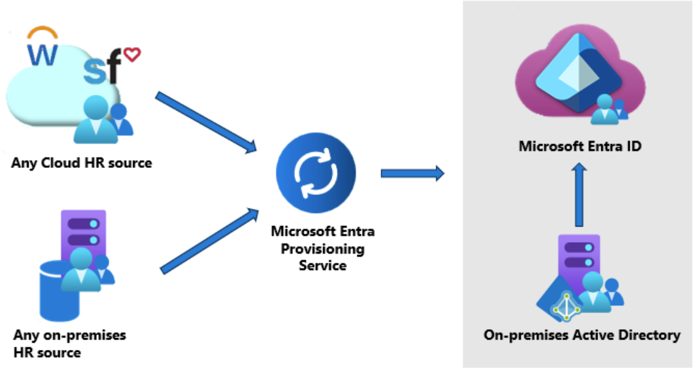

# What is HR-driven provisioning?

HR-driven provisioning is the process of creating digital identities based on a human resources system. The HR systems become the source of authority for these newly created digital identities and are often the starting point for numerous provisioning processes. For example, if a new employee joins your company, they're created in the human resource system. The creation triggers the provisioning of a user account into Active Directory, and then Microsoft Entra Connect provisions this account to Microsoft Entra ID.

Organizations may have either on-premises HR systems such as SAP HCM, cloud-based HR systems such as SAP SuccessFactors or Workday, or a mix of both. Historically, integration with on-premises HR systems for HR driven provisioning leveraged on-premises HR tools such as SAP Identity Management (SAP IDM) or Microsoft Identity Manager (MIM) to create users in Active Directory. Microsoft Entra can also be used with on-premises HR systems, to either create and update users in Active Directory, or for those environments that don't have Active Directory, create and update users in Microsoft Entra ID.

## On-premises-based HR provisioning
On-premises-based HR provisioning is accomplished by using a local HR system and a means of provisioning new digital identities.

HR systems come in various packages, software bundles and may use SQL servers or files to exchange data with other systems.

Customers who use SAP Human Capital Management (HCM) and have SAP SuccessFactors can bring identities into Microsoft Entra ID by using SAP Integration Suite to synchronize lists of workers between SAP HCM and SAP SuccessFactors. From there, you can bring identities directly into Microsoft Entra ID or provision them into Active Directory Domain Services.

Microsoft Entra [API-driven inbound provisioning](inbound-provisioning-api-concepts.md) also allows you to integrate with on-premises HR systems. Flat files, CSV files, and SQL staging tables are commonly used in enterprise integration scenarios. Employee, contractor, and vendor information are periodically exported into one of these formats and an automation tool is used to sync this data with enterprise identity directories. Partners can build custom HR connectors to meet different integration requirements around data flow from systems of record to Microsoft Entra ID. With API-driven inbound provisioning, integration is simplified as the Microsoft Entra provisioning service takes over the responsibility of performing identity profile comparison, restricting the data sync to scoping logic configured by the IT admin, and executing rule-based attribute flow and transformation managed in the Microsoft Entra admin center.

:::image type="content" source="media/inbound-provisioning-api-concepts/api-workflow-scenarios.png" alt-text="Diagram showing API workflow scenarios." lightbox="media/inbound-provisioning-api-concepts/api-workflow-scenarios.png":::

You can also use Microsoft Identity Manager to trigger provisioning when a new identity is created in an on-premises HR system. Using MIM, you can provision users from your on-premises HR systems to Active Directory or Microsoft Entra ID. For information on Microsoft Identity Manager and the systems it supports, see the [Microsoft Identity Manager](/microsoft-identity-manager/microsoft-identity-manager-2016) documentation.

[!INCLUDE [active-directory-hr-provisioning.md](~/includes/entra-hr-provisioning.md)]

## Manage Joiner-Mover-Leaver lifecycle workflows
You can extend your HR-driven provisioning process to further automate business processes and security controls associated with new hires, employment changes, and termination. With [Microsoft Entra ID Governance Lifecycle Workflows](~/id-governance/what-are-lifecycle-workflows.md), you can configure Joiner-Mover-Leaver workflows such as:  

- “X” days before the new hire joins, send email to manager, add user to groups, and generate a temporary access pass for first time login. 
- When there's a change in user’s department or job title or group membership, launch a custom task.  
- On the last day of work, send email to manager, and remove user from groups and license assignments.  
- “X” days after termination, delete user from Microsoft Entra ID.

## Next steps 
- [What is provisioning?](~/id-governance/what-is-provisioning.md)
- [What is app provisioning?](~/identity/app-provisioning/user-provisioning.md)
- [What is inter-directory provisioning?](~/identity/hybrid/what-is-inter-directory-provisioning.md)
